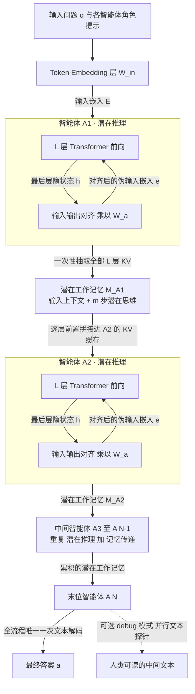

# Latent Collaboration in Multi-Agent Systems（LatentMAS）论文总结

- **标题**：Latent Collaboration in Multi-Agent Systems
- **作者**：Jiaru Zou（项目负责）、Ruizhong Qiu、Gaotang Li、Xiyuan Yang、Katherine Tieu、Pan Lu、Ke Shen、Hanghang Tong、Yejin Choi、Jingrui He、James Zou、Mengdi Wang、Ling Yang
- **单位**：Princeton / Stanford / UIUC
- **发表**：ICML 2026（PMLR 306）
- **代码**：https://github.com/Gen-Verse/LatentMAS

---

## 0. 摘要翻译

多智能体系统（MAS）把大语言模型（LLM）从独立的单模型推理扩展为具有协同能力的系统级智能。现有的 LLM 智能体都依赖**基于文本的中介**来完成推理与通信，而我们更进一步，让模型直接在**连续隐空间**中协作。我们提出 LatentMAS——一个端到端、**无需训练**的框架，使 LLM 智能体之间实现纯粹的隐空间协作。在 LatentMAS 中，每个智能体首先通过**最后一层隐藏嵌入**（而非文本）自回归地生成"潜在思维"；随后，一个**共享的潜在工作记忆**保存并传递各智能体的内部表示与潜在思维，从而在不重新编码的前提下保证信息的无损交换。我们给出了详细的理论分析，表明相比标准的文本 MAS，LatentMAS 具有更高的表达能力、无损的信息保持性，以及更低的整体复杂度。此外，在覆盖数学与科学推理、常识理解、代码生成的 **9 个基准**上的实证评测表明，LatentMAS 超过了先进的单智能体与文本 MAS 基线：准确率最高提升 **14.6%**，输出 token 用量减少 **70.8%–83.7%**，端到端推理速度提升 **4×–4.3×**。

---

## 1. 方法动机

### a) 作者为什么提出这个方法

现有 LLM 多智能体系统把**自然语言当作"通用语"（lingua franca）**：每个智能体的内部思考必须先被解码成文本，再作为文本喂给下一个智能体。作者认为这个"文本瓶颈"同时损害了两件事——**表达力**和**效率**——并且这两件事本可以在同一个框架里一起解决。

已有工作只解决了其中一半：

- **单模型隐式推理**（Coconut / Hao et al. 2024，Zhang et al. 2025 等）：让**一个**模型在连续隐空间里做 latent CoT，但完全不涉及模型间的交互；
- **跨模型隐式通信**（Cache-to-Cache / Fu et al. 2025，Liu et al. 2024 等）：用 KV cache 或层嵌入在**两个**模型之间传信息，但主要传的是 **prefill 阶段的输入上下文**，且通常需要额外训练一个对齐模块。

**把"隐式推理"和"隐式通信"统一到一个完整的多智能体协作框架里，此前尚无人做。**

### b) 现有方法的具体痛点

| 痛点 | 具体表现 |
|---|---|
| **表达力被 token 词表压缩** | 一个 $d_h$ 维的连续隐向量携带的信息，被强行投影到 $|V|$ 个离散 token 上，$\log_2\|V\|$ 比特远小于隐状态本身的容量 |
| **解码开销巨大** | 每一个中间 token 都要过一次 LM head（$O(d_h\|V\|)$ 的矩阵乘 + softmax）；TextMAS 在 AIME 上常常要生成 20K+ token 的完整 CoT 轨迹 |
| **通信有损且需重新编码** | 智能体 A 的思考 → 文本 → 智能体 B 重新 tokenize + prefill，中间经历一次"压缩 + 再编码"，信息不可能无损 |
| **token 用量随智能体数线性膨胀** | 每多一个智能体，就要多写一整段中间文本，且下游智能体的输入长度也随之增长 |
| **现有 latent 通信方法需要训练** | 大多依赖可训练的 adapter / projector 做跨模型对齐 |

### c) 研究假设 / 直觉

> **既然隐状态本身就是模型的"连续思维"，那么让智能体在隐空间里"想"（自回归生成最后一层隐状态）、并在隐空间里"说"（直接搬运逐层 KV cache），就能在一个训练无关的框架下同时拿到"更高表达力"和"更低开销"——因为整条链路里唯一需要解码成文本的，只有最后一个智能体的最终答案。**

论文把这个直觉拆成三条可被理论/实验检验的原则：**推理表达力**（Reasoning Expressiveness）、**通信保真度**（Communication Fidelity）、**协作复杂度**（Collaboration Complexity）。

---

## 2. 方法设计 ★核心★

### 2.0 端到端 Pipeline 总览

**一句话读图**：问题 $q$ 只在最开始被 tokenize 一次，答案只在最后被解码一次；中间所有智能体的"思考"是隐状态自回归，"说话"是 KV cache 搬运，**全程不产生一个中间 token**。

---

### 2.1 符号表

| 符号 | 含义 | 维度 / 取值 |
|---|---|---|
| $f_{\theta_i}$ | 第 $i$ 个智能体对应的 Transformer 函数 | — |
| $q$ | 输入问题 | — |
| $\mathcal{A}=\{A_1,\dots,A_N\}$ | 智能体集合 | $N$ 个 |
| $L$ | Transformer 层数 | 正整数 |
| $d_h$ | 隐藏维度（如 Qwen3-0.6B 为 1024） | 正整数 |
| $\lvert V\rvert$ | 词表大小（Qwen3 约 $1.5\times10^5$） | $>1$ |
| $t$ | 当前智能体的输入序列长度 | 正整数 |
| $m$ | 潜在推理步数（latent steps） | 论文取 $m\in\{0,10,20,40,80\}$ |
| $m'$ | 达到同等表达力所需的等价**文本** token 数 | 正整数 |
| $E=[e_1,\dots,e_t]$ | 输入嵌入序列 | $\mathbb{R}^{t\times d_h}$ |
| $h_t$ | 第 $t$ 步的**最后一层**隐状态 | $\mathbb{R}^{d_h}$ |
| $H=[h_{t+1},\dots,h_{t+m}]$ | 新生成的潜在思维序列 | $\mathbb{R}^{m\times d_h}$ |
| $W_{in}$ | 输入 token embedding 矩阵，第 $x$ 行 $W_{in,x}\in\mathbb{R}^{d_h}$ | $\mathbb{R}^{\lvert V\rvert\times d_h}$ |
| $W_{out}$ | 输出（unembedding / LM head）矩阵，第 $x$ 行 $W_{out,x}\in\mathbb{R}^{d_h}$ | $\mathbb{R}^{\lvert V\rvert\times d_h}$ |
| $W_a$ | 输入-输出对齐矩阵 | $\mathbb{R}^{d_h\times d_h}$ |
| $\beta$ | 隐状态相对输入嵌入的尺度因子 | $>0$ |
| $\lambda$ | ridge 正则超参（数值稳定） | 小正数 |
| $K^{(l)},V^{(l)}$ | 第 $l$ 层的 key / value 缓存 | $\mathbb{R}^{(t+m)\times d_h}$（形状按注意力实现） |
| $M_{A_i}$ | 智能体 $A_i$ 的潜在工作记忆 | $L$ 组 $(K,V)$ |
| $\{s_1,\dots,s_{d_h}\}$ | 线性表示假设中的语义基 | $\subset\mathbb{R}^{d_h}$，线性无关 |
| $c_i$ | 语义基的三值系数 | $\in\{0,\pm1\}$ |

> **记号提醒（论文自身的小不一致）**：正文式 (1) 写作 $f_\theta(x_{t+1}\mid x_{\le t})=\mathrm{softmax}(h W_{out})$，隐含 $W_{out}\in\mathbb{R}^{d_h\times |V|}$；但附录 A 中 $W_{out}$ 的行 $W_{out,x}\in\mathbb{R}^{d_h}$，即 $W_{out}\in\mathbb{R}^{|V|\times d_h}$，只有这样 $W_a=(W_{out}^\top W_{out})^{-1}W_{out}^\top W_{in}$ 才是 $d_h\times d_h$。**以附录的定义为准**，正文式 (1) 应理解为 $\mathrm{softmax}(hW_{out}^\top)$。

---

### 2.2 步骤一：智能体内部的自回归潜在思维生成（§3.1）

**输入**：问题 $q$ + 该智能体的角色 prompt，经 token embedding 层得到 $E=[e_1,\dots,e_t]\in\mathbb{R}^{t\times d_h}$。

**处理（每一步）**：

1. 把当前序列送过 $L$ 层 Transformer，取**最后一层**隐状态 $h_t\in\mathbb{R}^{d_h}$；
2. **不做 LM head 投影、不做 softmax、不采样 token**；
3. 把 $h_t$（对齐后）直接作为第 $t+1$ 步的**输入嵌入**塞回序列；
4. 重复 $m$ 步。

**输出**：潜在思维 $H=[h_{t+1},\dots,h_{t+m}]\in\mathbb{R}^{m\times d_h}$。

> 通俗讲：标准生成是"隐状态 → 词表分布 → 采一个词 → 查这个词的输入嵌入 → 喂回去"；LatentMAS 直接短路成"隐状态 → 喂回去"。省掉的正是那个把连续向量**压成一个离散 token** 的有损环节。

#### 关键子模块：输入-输出对齐算子 $W_a$

**为什么需要**：最后一层的 $h$ 和第一层期望的输入嵌入 $e$ 属于**两个不同的分布**（$h$ 经过了 $L$ 层残差累积、量级和几何结构都不同）。直接把 $h$ 塞进浅层会造成**分布外激活（OOD activation）**，且误差会随 $m$ 步自回归**逐步漂移**。

**怎么做**（训练无关）：学一个线性映射
$$e = h W_a,\qquad W_a \approx W_{out}^{\dagger} W_{in}$$

其中 $W_{out}^\dagger$ 是 $W_{out}$ 的伪逆。

**理论依据（Theorem A.1）**：设 token 嵌入分布为 $P_e$、对齐后嵌入分布为 $P_{\hat e,W_a}$，二者的 Wasserstein 距离被上界控制：
$$d_{\text{Wasserstein}}(P_{\hat e,W_a},P_e)\ \le\ \big\|\beta W_{out}W_a - W_{in}\big\|_F$$

> 通俗解释：**只要能让"把每个 token 的输出向量经 $W_a$ 映射回去"尽量等于"这个 token 的输入向量"，那么对齐后的隐向量分布就一定接近真实输入嵌入分布。** 这是一个上界，所以最小化上界就是一个合理的 surrogate 目标。

**求解**：最小化上界 $\min_{W_a}\|\beta W_{out}W_a - W_{in}\|_F^2$，这是关于 $W_a$ 的二次型，令导数为零得正规方程 $\beta W_{out}^\top W_{out}W_a - W_{out}^\top W_{in}=0$，解得闭式解，并加 ridge 项保证数值稳定：

$$W_a=\frac{1}{\beta}\big(W_{out}^\top W_{out}+\lambda I\big)^{-1}W_{out}^\top W_{in}$$

尺度因子按经验取
$$\beta=\frac{|V|\cdot\|h\|}{\sum_{x\in V}\|W_{in,x}\|}\;=\;\frac{\|h\|}{\frac{1}{|V|}\sum_{x\in V}\|W_{in,x}\|}$$
即"隐状态范数 ÷ 输入嵌入的平均范数"。

**代价**：$W_a$ 只有 $d_h\times d_h$（Qwen3-0.6B 是 $1024\times1024$），**每次运行只算一次**，之后所有 latent step 复用 → 计算开销可忽略。

#### 理论：潜在思维的表达力（Theorem 3.1）

**假设 B.1（线性表示假设，Park et al. 2023）**：隐嵌入 $h=\sum_{i=1}^{d_h}c_i s_i$，其中 $\{s_i\}$ 是线性无关的语义基，系数 $c_i\in\{0,\pm1\}$（0 = 不含该语义，$\pm1$ = 正/负向含有该语义）。

**推导**（三行）：
$$|\mathcal{H}|=3^{d_h}\ \Longrightarrow\ |\mathcal{H}^m|=3^{d_h m}$$
要用长度 $m'$ 的文本序列无损表示 $\mathcal{H}^m$，需存在 $V^{m'}\to\mathcal{H}^m$ 的满射，故 $|V|^{m'}\ge 3^{d_h m}$：
$$m'\ \ge\ \frac{d_h\, m \log 3}{\log|V|}\ =\ \Omega\!\left(\frac{d_h m}{\log|V|}\right)$$

> **通俗解释**：一个 latent step 相当于在 $d_h$ 个"语义开关"上各选 {不含 / 正 / 负}，信息量是 $d_h\log 3$ 比特；而一个 token 最多 $\log|V|$ 比特。所以 **1 个 latent step ≈ $d_h\ln 3/\ln|V|$ 个 token**。

**Remark 3.2 的具体数字**（$\ln 3/\ln|V|$，Qwen3 词表约 15.2 万）：

| 模型 | $d_h$ | 潜在思维相对文本的效率倍数 |
|---|---|---|
| Qwen3-4B | 2560 | **235.7×** |
| Qwen3-8B | 4096 | **377.1×** |
| Qwen3-14B | 5120 | **471.4×** |

**⚠️ 阅读警示（这是我的判断，不是论文结论）**：Theorem 3.1 是一个**编码容量的计数论证**——它说的是"隐状态集合的**基数**大到需要这么多 token 才能一一对应"，**不等于**模型实际会用满这 $3^{d_h}$ 种状态，也**不等于** $m$ 步 latent 在下游任务上真的顶得上 $235\times m$ 个 token。实验里 $m$ 的最优值只有 40–80，这一点值得注意（见 §4）。

---

### 2.3 步骤二：跨智能体的潜在工作记忆传递（§3.2）

**为什么不能直接传 $H$**：$H$ 只是最后一层的输出；如果直接把 $H$ 当输入喂给下一个智能体，下一个智能体还得把它重新过一遍 $L$ 层前向来构建自己的 KV cache——**多了一次冗余的重计算**。

**做法（三步）**：

1. **抽取**：$A_1$ 完成 $m$ 步潜在生成后，**一次性**取出它全部 $L$ 层的 KV cache：

$$M_{A_1}=\Big\{\big(K^{(l)}_{A_1,\text{cache}},\,V^{(l)}_{A_1,\text{cache}}\big)\ \Big|\ l=1,2,\dots,L\Big\}$$
$$K^{(l)}_{A_1,\text{cache}}=[K^{(l)}_{A_1,1},\dots,K^{(l)}_{A_1,t+m}],\quad V^{(l)}_{A_1,\text{cache}}=[V^{(l)}_{A_1,1},\dots,V^{(l)}_{A_1,t+m}]$$

   注意下标是 $1$ 到 $t+m$：**既包含原始输入上下文的 $t$ 个位置，也包含 $m$ 步新生成的潜在思维**。这正是与 Cache-to-Cache 那类"只传 prefill 输入 cache"的方法的关键区别。

2. **拼接**：$A_2$ 在开始自己的潜在生成**之前**，把 $A_1$ 的 $K^{(l)},V^{(l)}$ **逐层前置（prepend）**到自己对应第 $l$ 层的 KV cache 上：
$$K^{(l)}_{A_2,\text{cache}}\leftarrow\big[K^{(l)}_{A_1,\text{cache}};\,K^{(l)}_{A_2,\text{cache}}\big],\qquad V^{(l)}_{A_2,\text{cache}}\leftarrow\big[V^{(l)}_{A_1,\text{cache}};\,V^{(l)}_{A_2,\text{cache}}\big]$$

3. **续算**：$A_2$ 的新潜在思维因此**同时条件于** $A_1$ 的工作记忆和自己的内部表示。之后 $A_3$ 继承 $M_{A_2}$，依此类推，直到**最后一个智能体才把结果解码成文本**。

**工程实现**：直接用 HuggingFace Transformers 的 `past_key_values` 接口做逐层拼接；同时也接了 vLLM 后端（prefix caching + tensor parallel）。

#### 理论：无损信息传递（Theorem 3.3）

> **智能体在"接收前驱的潜在工作记忆"时的输出，等价于"把前驱的输出直接作为输入喂进来"时的输出。**

**证明思路**（对层数 $l$ 归纳）：注意力的输出是 query 与 (keys, values) 的确定性函数。"重新喂一遍前面的序列让模型重算 $K,V$" 与 "直接从 cache 读 $K,V$" 这两条路径，呈现给注意力的 $K,V$ **逐位完全相同**（因为 cache 本来就是同一个模型在同一批输入上算出来的）。给定相同的 $K,V$ 和相同的当前输入，注意力输出相同；Transformer 后续计算是确定性的，故 $h^{(l)}=h'^{(l)}$，逐层归纳到 $h^{(L)}$。

> **通俗解释**：这本质上是"**KV cache 复用 = 重新计算**"这一标准事实的形式化。它保证的是"用 cache 抄近道不掉精度"。

**⚠️ 阅读警示（我的判断）**：Theorem 3.3 证明的"无损"是相对于"**把同样的隐状态序列重新喂一遍**"而言的，**不是**相对于"文本通信"的信息论意义上的无损。也就是说，它证明的是**工程上的等价性（省掉重计算）**，而"比文本通信保真度更高"这个更强的主张，其实是靠 Theorem 3.1（token 压缩有损）+ 实验佐证的，不是 Theorem 3.3 本身给出的。这一点在阅读时要区分清楚。

---

### 2.4 步骤三：复杂度分析（§3.3, Theorem 3.4）

**LatentMAS 每个智能体**：
$$O\Big(\big(d_h^2 m + d_h m^2 + d_h t m\big)L\Big)$$
（$d_h^2m$ = FFN 的矩阵-向量乘；$d_h(m^2+tm)$ = 长度 $t+m$ 序列上 $m$ 步的注意力；无解码项）

**文本 MAS 若要达到同等表达力**（代入 $m'=O(d_h m/\log|V|)$）：
$$O\left(\left(\frac{d_h^3 m}{\log|V|}+\frac{d_h^3 m^2}{\log^2|V|}+\frac{d_h^2 t m}{\log|V|}\right)L\ +\ \frac{d_h^2 |V| m}{\log|V|}\right)$$

**逐项对比**：

| 项 | LatentMAS | TextMAS（等表达力） | 差距 |
|---|---|---|---|
| FFN | $d_h^2 m L$ | $\dfrac{d_h^3 m}{\log \lvert V\rvert}L$ | $\times\dfrac{d_h}{\log \lvert V\rvert}$ |
| 注意力（平方项） | $d_h m^2 L$ | $\dfrac{d_h^3 m^2}{\log^2 \lvert V\rvert}L$ | $\times\dfrac{d_h^2}{\log^2 \lvert V\rvert}$ |
| 注意力（交叉项） | $d_h t m L$ | $\dfrac{d_h^2 t m}{\log \lvert V\rvert}L$ | $\times\dfrac{d_h}{\log \lvert V\rvert}$ |
| **解码（LM head + softmax）** | **0** | $\dfrac{d_h^2 \lvert V\rvert m}{\log \lvert V\rvert}$ | **完全消除** |

> **通俗解释**：LatentMAS 省的钱来自三处——(i) 步数少了 $d_h/\log|V|$ 倍；(ii) 序列短了，注意力的平方项收益更大；(iii) **中间智能体一次 LM head 都不做**（那是 $d_h\times|V|$ 的大矩阵乘，$|V|\approx1.5\times10^5$）。

论文强调：LatentMAS 对具体的 MAS 拓扑**不可知**（agnostic），sequential / hierarchical / 其他设计都能直接套。

---

### 2.5 两种 MAS 拓扑（实验用）

- **Sequential（chain-of-agents）**：`planner → critic → refiner → solver`，四个智能体串行，每个的输出（LatentMAS 中是 KV 记忆）+ 问题 $q$ 作为下一个的输入。
- **Hierarchical（domain-specialized）**：`{code, math, science} 三个领域专家并行 → summarizer 聚合`。

Prompt 里会明确告诉智能体"计划信息以 latent KV 表示格式提供"，并提示"latent 信息可能含无关内容，无用则忽略"。

### 2.6 可选：Debug 模式（附录 F）

打开开关后，每个智能体在**同一上下文**下**并行**产出：(i) 传给下游的潜在思维；(ii) 一段**仅作探针用**的人类可读文本。文本不参与主链路，纯粹用于审计"这个智能体在想什么"。

---

## 3. 与其他方法对比

### a) 本质不同

| 维度 | 文本 MAS | 单模型 latent CoT（Coconut 等） | 跨模型 KV 通信（Cache-to-Cache 等） | **LatentMAS** |
|---|---|---|---|---|
| 智能体**内部**推理媒介 | 离散 token | **连续隐状态** | 离散 token | **连续隐状态** |
| 智能体**之间**通信媒介 | 自然语言文本 | 无（单模型） | KV / 层嵌入（主要是 prefill 输入上下文） | **逐层 KV，含输入上下文 + 新生成的潜在思维** |
| 是否需要训练 | 否 | **是**（需训练 latent CoT） | 通常**是**（需训练对齐 projector） | **否（training-free）** |
| 中间文本 token | 大量 | — | 少 | **零** |
| 覆盖范围 | 多智能体 | 单模型 | 两模型 | **任意 N 智能体、任意拓扑** |

**一句话**：LatentMAS 是**第一个把"隐式推理"与"隐式通信"统一在同一个 training-free 多智能体框架里**的工作。前人要么只做前者（且要训练），要么只做后者（且只传输入上下文、也要训练）。

### b) 创新点与贡献度

1. **框架层（主贡献）**：latent 推理 + latent 通信的端到端闭环；中间智能体完全不解码。
2. **机制层**：**逐层 KV 工作记忆**同时封装了「输入上下文」与「新生成的潜在思维」——这是相对 Cache-to-Cache 一类方法的关键增量。
3. **技术层**：训练无关的**闭式**输入-输出对齐矩阵 $W_a=\frac{1}{\beta}(W_{out}^\top W_{out}+\lambda I)^{-1}W_{out}^\top W_{in}$，并给出 Wasserstein 上界的理论依据（Theorem A.1）。算一次、全程复用，代价可忽略。
4. **理论层**：三个定理分别刻画表达力（3.1）、无损性（3.3）、复杂度（3.4）。
5. **工程层**：debug 模式提供可解释性抓手，并用 100 例做了探针可靠性验证。

### c) 适用场景

**明显适用**：

- 智能体**同构**（同一模型家族、同 $d_h$、同层数）——这是当前实现的硬约束；
- 中间智能体的产物是**给机器看的**（计划、批评、精炼），不需要人读；
- 推理密集、中间 CoT 极长的任务（AIME 类：TextMAS 要 20K+ token，LatentMAS 不到 50 步 latent）；
- 需要在**固定预算**内跑多智能体的部署场景。

**不太适用**（含推断）：

- 需要人在环、需要审计每一步中间输出的高风险场景（虽有 debug 模式，但那是旁路探针，不是主链路）；
- 异构智能体协作（不同模型家族、不同 $d_h$）——论文明确说需要额外训练 adapter；
- 简单任务（ARC-E / ARC-C / GSM8K 上收益很小，甚至有掉点）。

### d) 方法对比表（优 / 劣 / 改进方向）

| 方法 | 优点 | 缺点 | 可改进点 |
|---|---|---|---|
| **单模型（Single）** | 最快、最简单、完全可读 | 无协作，准确率最低（LatentMAS 平均高出 13.3%–14.6%） | 加 self-consistency / 更长 CoT |
| **文本 MAS（TextMAS）** | 完全可读可审计；拓扑灵活；无任何实现门槛 | token 爆炸；速度最慢；文本瓶颈导致通信有损 | 压缩中间文本；蒸馏 |
| **单模型 latent CoT（Coconut）** | 单模型内表达力高 | 需训练；不涉及多智能体 | 扩到多智能体（→ 即本文） |
| **跨模型 KV 通信（C2C）** | 通信高效 | 需训练 projector；只传 prefill 上下文；仅两模型 | 传 latent thoughts（→ 即本文） |
| **LatentMAS** | 训练无关；零中间 token；4×–4.3× 加速；准确率同时提升；拓扑无关 | ①仅支持同构智能体；②中间过程黑箱；③KV 显存随智能体数累积（论文未分析，**我的推断**）；④简单任务无收益甚至掉点；⑤$m$ 需调参且 >80 后退化 | 训练 adapter 支持异构；对 latent 协作协议做后训练优化（论文自己给的方向）；对 KV 做压缩/淘汰 |

---

## 4. 实验表现与优势

### a) 实验设计

| 项 | 设置 |
|---|---|
| **基准（9 个）** | 数学&科学：GSM8K、AIME24、AIME25、GPQA-Diamond、MedQA；常识：ARC-Easy、ARC-Challenge；代码：MBPP-Plus、HumanEval-Plus |
| **骨干模型（5 个）** | Qwen3-4B / 8B / 14B；Llama-3.2-3B-Instruct、Llama-3.1-8B-Instruct |
| **基线（3 类）** | Single、Sequential TextMAS（chain-of-agents）、Hierarchical TextMAS（专家 + summarizer） |
| **指标（3 个）** | 任务准确率（%）、系统总输出 token 数、端到端推理速度（time(s)/run） |
| **超参** | $m\in\{0,10,20,40,80\}$；temperature 0.6；top-p 0.95；最大输出长度按任务难度设为 2048 / 4096 / 8192 / 20000 |
| **硬件 / 统计** | 8×A100-80G；报告 **3 次独立运行的均值** |
| **公平性处理** | 基线也接入 **vLLM**（prefix caching + tensor parallel）后再比速度 |

**评测协议**：多选题走 exact match（A/B/C/D）；数值题做数值相等判定（解析失败即判错）；代码题在沙箱中跑官方单测（10s 超时），**全部通过才算对**。

### b) 关键数据

**总体（论文 §4.1）**：

- 相对 **Single**：Sequential **+14.6%**、Hierarchical **+13.3%**（平均）
- 相对 **TextMAS**：Sequential **+2.8%**、Hierarchical **+4.6%**
- **速度**：比同架构 TextMAS 快 **4×（seq）/ 4.3×（hier）**；即便 TextMAS 已经用 vLLM 加速，仍有 **2.6×–7×** 领先
- **Token**：比 TextMAS 少 **70.8%（seq）/ 83.7%（hier）**；单项区间 **59.4%–87.9%**；比 **Single** 还少 **15.0%–60.3%**

**最亮眼的几个单点**（Qwen3，Acc / Token / Speed 相对 TextMAS）：

| 任务 & 设置 | Single | TextMAS | LatentMAS | 增益 |
|---|---|---|---|---|
| HumanEval+ · 14B · seq | 76.8 | 81.1 | **86.5** | **+5.4**，token ↓65.6%，×3.2 |
| MBPP+ · 8B · seq | 64.8 | 69.5 | **74.6** | **+5.1**，token ↓68.5%，×2.8 |
| GPQA-D · 8B · hier | 39.9 | 43.0 | **46.9** | **+3.9**，token ↓84.9%，**×7.7** |
| AIME24 · 14B · hier | 63.3 | 70.0 | **73.3** | **+3.3**，token ↓64.8%，×5.3 |
| AIME24/25 · 8B/14B · seq | 50.0/46.7 | 53.3/53.3 | **56.7/53.3** | +3.4/+0.0，token ↓76.8%/80.7% |
| MedQA · 4B · seq | 47.7 | 65.3 | **66.3** | +1.0（相对 Single **+18.6**） |

**关键分析实验**：

| 分析 | 结论 |
|---|---|
| **潜在思维有语义吗**（Fig 5，300 道 MedQA，40 latent steps vs 4096 token 预算） | LatentMAS 的最后层嵌入与 TextMAS 的 token 嵌入**落在同一区域**（语义一致），且**覆盖范围更大**（表达力更强） |
| **多样性量化**（Table 6，平均成对余弦相似度，越低越分散） | TextMAS 0.126/0.142/0.155 vs LatentMAS **0.104/0.093/0.108**（4B/8B/14B）→ latent 表示更不坍缩 |
| **$W_a$ 的作用**（Fig 6/7/11） | 未对齐的 $h_t$ 明显偏离输入嵌入分布，加 $W_a$ 后 $e_{t+1}$ 重新贴合 $e_t$；下游准确率提升 **2.3%–5.3%** |
| **latent 步数深度**（Fig 8，Qwen3-14B） | 准确率随步数上升，在 **40–80 步**达峰；超过后**平台或下降**（冗余/低质量潜在思维） |
| **组件消融**（Table 7，Qwen3-8B，GSM8K/MBPP+/MedQA） | Latent 推理 + 文本通信：85.5 / 66.4 / 65.9 文本推理 + Latent 通信：90.1 / 68.0 / 71.2 **完整 LatentMAS：93.8 / 74.6 / 75.3** → **两个组件缺一不可**；且"文本推理 + latent 通信"明显强于"latent 推理 + 文本通信"，说明**通信端的收益更大** |
| **末位智能体的 token**（Table 5） | 末位智能体自己的解码长度也平均少 **29.1%** → 省 token 不只来自"砍掉中间文本"，也来自"最后一步不用重复复述前文的推理" |
| **Debug 探针可靠性**（Table 8，100 例 GSM8K / Qwen3-14B） | 最终答案对时，中间 debug 文本 **96.2%** 正确；最终答案错时，中间文本 **90.0%** 含错 → 探针可信 |

### c) 优势最明显的场景

1. **长 CoT 的推理密集任务**：AIME24/25、GPQA-Diamond。TextMAS 动辄 20K–53K token，LatentMAS 用 <50 个 latent step 就能追平甚至反超 → 这里的加速和省 token 是**数量级**的（GPQA hier：token ↓84.9%，速度 ×7.7）。
2. **代码生成**：HumanEval+ 14B **+5.4**、MBPP+ 8B **+5.1**，是准确率增益最大的一类。
3. **Hierarchical 拓扑**：token 节省（83.7% vs 70.8%）和相对 TextMAS 的准确率增益（+4.6% vs +2.8%）都比 sequential 更大——因为并行专家的中间文本冗余最严重。
4. **跨模型家族泛化**：Llama-3.2-3B / Llama-3.1-8B 上趋势一致（Table 4），说明不是 Qwen 特供。

### d) 局限性

**论文明确承认的**：

1. **只支持同构智能体**（附录 G）：所有智能体必须"transformer 层形状相同"。要支持异构，需引入**可训练 adapter** 做层映射/表示对齐——这就破坏了 training-free 的卖点。
2. **latent 步数需调参**：>80 步后性能**下降**，说明潜在思维会引入"冗余或低质量信息"，$m$ 不是越大越好。
3. **中间过程不可读**：所以才要单独设计 debug 模式作为旁路探针。

**论文没明说、但从数据可读出的（以下为我的分析）**：

4. **简单任务上会掉点**：ARC-E（8B seq −0.3）、ARC-C（8B −0.2 / 14B −0.3）、GSM8K（4B seq −1.6、4B hier −1.0、8B hier −0.9）、MedQA（Llama-3B hier −0.3）。方法在**低难度、短 CoT** 任务上没有稳定优势。
5. **"4× 加速"的对照系是 TextMAS，不是 Single**：LatentMAS 跑 N 个智能体，端到端时间在多数格子里**慢于单模型**（例：ARC-E 4B seq，Single 369s vs LatentMAS 512s；GSM8K 14B seq，536 vs 1952）。所以真正的卖点是"**在多智能体这个赛道里，用 latent 换掉文本能省 4×**"，而不是"比单模型更快"。
6. **KV 显存开销未被讨论**：逐层拼接前驱的全部 $L$ 层 KV，显存随智能体数量**累积增长**（$O(N\cdot L\cdot(t+m)\cdot d_h)$ 量级）。论文的复杂度分析只算了**时间**，没算**空间**，也没有报告峰值显存。这是 8×A100-80G 之外的部署者需要自己算的账。
7. **Theorem 3.1 是计数上界，不是可达性保证**：$3^{d_h}$ 是**假设 B.1 下隐状态集合的基数**，"235×–471× 更高效"是这个基数比值的直接推论，**并非**"$m$ 步 latent 在下游任务上真等价于 $235m$ 个 token"的实证结论。实际最优 $m$ 只有 40–80，与理论倍数之间存在**巨大 gap**。论文自己也谨慎地用了"can be ... times more efficient"（可以是）的措辞。
8. **摘要中的 "up to 14.6%"**：§4.1 说得更准确——这是**相对 Single 的平均增益**；相对 TextMAS（真正的强基线）平均只有 **+2.8% / +4.6%**。读的时候不要把 14.6% 当成"打败 SOTA MAS 的幅度"。
9. **假设 B.1（三值系数的线性表示假设）本身很强**：真实隐状态的系数是连续实数，不是 $\{0,\pm1\}$。这是整个表达力论证的地基，值得留意。

---

## 5. 可借鉴的点（给做研究的你）

1. **"闭式训练无关对齐"这个套路很值钱**：需要跨表示空间搬运向量时，不要一上来就训 projector——先看能不能用 $W_{out}^\dagger W_{in}$ 这类**伪逆闭式解**，并配一个（Wasserstein / 谱范数）上界来论证其合理性。成本近乎为零，还能白拿 2.3%–5.3%。
2. **KV cache 是被低估的通信信道**：它天然是**逐层、无损、免重计算**的。别人传 hidden state（要重新 prefill），你传 KV（直接续算）。
3. **"表达力"论证可以走计数路线**：假设 + 集合基数 + 满射存在性 → $\Omega(\cdot)$ 下界。三行推导，但要诚实地区分"容量上界"和"实际可达"。
4. **消融要拆到"推理端 / 通信端"两侧**（Table 7 的做法）：这个 2×2 交叉消融把"到底是哪个组件在起作用"讲得很清楚，也暴露了"通信端收益 > 推理端收益"这个非平凡结论。
5. **黑箱方法要自带审计工具**：debug 模式 + 100 例的探针一致性验证（96.2% / 90.0%），是让 reviewer 放心的低成本做法。
