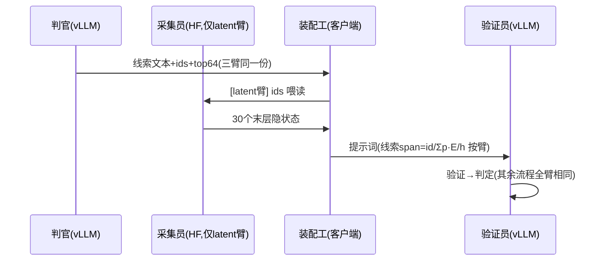

# 09 · P2 实验卡为什么这么设计——零基础讲解

> 缘起：P2 战役（信息类型 × 载体）的 7 张实验卡已写入 `/home/yilin/modify-code-runs/p2-info-media/blueprint.md` 待批。本文回答"每张卡为什么长这样"。
> 读法：按顺序读；"进阶追问区"可跳过不影响理解主线。

**TL;DR**：P2 要回答一个问题——**推理类信息（因果、逻辑）换载体传输会不会更好**。为了让答案可信，必须保证三条臂**传的是同一句话**、**骨架上没有分词差异**、**跑在同一组卡上**；7 张卡就是这三条保证 + 三种载体的制作工序，每张卡守一个具体的翻车方式。

---

## 约定 context（本文所有抽象词先在这里落地）

| 词 | 指什么（含第一个具体例子） |
|---|---|
| **臂（arm）** | 一次完整的 500 题实验运行，系统里只改一处设定。例：把线索用文字传=一条臂，用概率传=另一条臂 |
| **载荷（payload）** | 被换载体传输的那段具体内容。本战役的载荷有两个：**线索**（判官给验证员的一句检验条件，见下方真实例子）和**摘要**（4 段剧情梗概） |
| **手术位** | 系统里被动刀的那个传输点。例：手术位=线索通道，意思是只有"判官→验证员的那句话"换载体，其余一切不动 |
| **三种载体** | 同一句话的三种物理形态：①**文字**=token id 序列；②**top-64 概率**=每个 token 位置附带 64 个候选词及其归一化概率，注入时按概率加权词嵌入（Σp·E）；③**latent**=生成这句话的模型在末层产生的隐状态向量序列 |
| **同文共祖** | 三条臂的载荷**逐字节是同一句话**（同一次生成的产物），只是形态不同。反例：让模型给概率臂重新生成一句"差不多的"线索——那就不是同文，比较作废 |
| **分词分歧** | 同一段文字"分段切再拼"与"整段一次切"产出的 token id 不同之处。真实例：`"pot.\nframe"` 整切=`[19099,624,6763]`（`".\n"`一块），分段拼=`[19099,13,198,6763]`（拆两块）。上一战役实测：这种差异累计要付 4.2 分 |
| **零分歧** | 注入的 token 骨架与"整段自然切"完全一致，一处分歧都没有。做法：先整段切出标准骨架，再把概率/latent 对到骨架位置上 |
| **teacher-forcing（喂读前向）** | 不让模型自由生成，而是把**已经定稿的一串 token** 喂给它"读一遍"，途中收集它每个位置的内部状态。像让作者照着自己已发表的文章朗读一遍，录下他读每个词时的脑电——文章一个字不变 |
| **裸 latent** | 不经任何训练/转换，把发送方的末层隐状态直接当接收方的输入嵌入用。"裸"=没有 adapter 翻译器 |
| **崩坏率** | 接收方读了某种载体后连格式合规的答案都给不出的比例（JSON 解析失败）。裸 latent 臂专设此指标：崩坏本身也是有效实验结果 |
| **span** | 提示词 token 序列里一段连续的位置区间。例：验证员提示词第 1201-1230 位被线索的 30 个 token 占据="线索 span"；注入=span 外照常放 E[id]、span 内放替换物 |
| **口径** | 一个数字的精确定义方式。例：概率的口径=softmax 后的归一化概率（非 logits）；引导解码语境下=语法约束重归一后的概率 |

---

## 概念梯子

### 第 1 级：我们已经知道什么（感知行的完卷）

上一战役测完了**感知信息**（帧里"是什么"）的载体排名：像素 65.6 > 文字 59.6 ≈ top-64 概率 56.4——概率转述感知内容没有红利。
桥句（后文反复回指）：**概率在"转述所见"上无红利，但 CIPHER 证明它在"传递所想"上有红利——所见与所想，可能根本不该用同一种载体。**

### 第 2 级：要问什么

VideoHV 里"所想"类的内容走两条通道：**线索**（纯逻辑判据）和**摘要**（叙事含因果，但感知成分占大头）。P2 第一批只测**线索**——摘要属"混合格"，无论结果都难归因（出效应分不清哪种成分起效，不出效应大概率重复感知行已知阴性），且工程成本全场最高（重生成+字节校验+选答人换通路+ST′ 对照），**裁定暂缓为条件卡**：线索格出正信号后作剂量-反应中间点复活。

### 第 3 级：公平比较需要三个保证

1. **同文共祖**——三臂传同一句话（不然比的是"话不同"而非"载体不同"）；
2. **零分歧**——骨架无分词差异（上一战役刚证明分歧值 4.2 分，绝不能再混入）；
3. **同对同题**——同一组 GPU（跨卡有 28% 翻题的非决定性，也是上一战役实测）。

### 第 4 级：三种载体怎么从同一句话造出来（手把手实例）

拿刺绣题的**真实线索**（判官真实产出，30 个 token）当贯穿例子：

> "Check whether the fabric was sewn together, cut out, purchased, designed on a computer, or drawn on with a pen during the preparation phase."

**① 文字臂**：整段自然切 → 30 个 id `['Check',' whether',' the',' fabric',' was',' sew','n',...]` → 原样进验证员的提示词。（这条臂已经跑完了——就是 P-b 的 500 行，直接复用。）

**② 概率臂**：判官生成这句话时，每吐一个 token 顺手记下当时的 top-64 候选及概率。下表是**真实实测**（简化语境示意¹）的前几个位置：

| 写到的位置 | 实际 token | 当时的 top-3 候选（真实概率） |
|---|---|---|
| 0 | `Check` | ` if` 0.719 · ` for` 0.161 · ` the` 0.086 |
| 2 | ` the` | ` fabric` 0.376 · ` person` 0.332 · ` hoop` 0.095 |
| 4 | ` was` | ` cut` 0.223 · ` placed` 0.105 · ` folded` 0.082 |
| 5 | ` sew` | `n` 1.000 · `ed` ≈0 |

注入时每个位置发 **Σp·E**（64 个候选词嵌入的概率加权和）——位置 2 那一格就同时携带着"fabric/person/hoop 三种检验对象都值得看"的信息，这正是概率载体可能多带的东西。
¹ 概率为真实模型输出；演示用简化语境，正式实验取判官真实生成语境的概率（口径差异见追问区）。

**③ latent 臂**：把这 30 个已定稿的 id 用 **teacher-forcing** 喂回 8B（HF 前向读一遍，一个字不改），收集 30 个位置的末层隐状态向量，替换验证员提示词里线索 span 的嵌入。发送方"想这句话时的完整脑内状态"，不经词表压缩。

三臂对照：**同一句话 → 30 个位置 → 每位置发的东西不同**（E[id] / Σp·E / 隐状态 h）——这就是"只差载体一个变量"。

### 第 5 级：调用链（先认人再看图）

出场者：**判官**（8B@vLLM，产线索文本——三臂共用同一份产出）；**采集员**（HF 8B，只在 latent 臂出场，teacher-forcing 收隐状态，不生成任何新内容）；**装配工**（客户端代码，按臂别把线索 span 装成 id/Σp·E/h）；**验证员**（8B@vLLM，经 prompt_embeds 收货）。

---

## 逐卡讲"为什么"+ 相比 A 臂改了哪里

**先钉住基线**：本战役的"A 臂" = P-b 形态——我们的地图（整段自然切）、线索/摘要/工具全文字、验证员经 one-hot embeds 通路、判官/选答人经引导解码的 chat `.parse`、四角色 Qwen3-8B（工具摄影师 VL）。下面每张卡只列**与它的差异**，没提到的部分=逐字节相同。

### P2-E0 对齐器校准（不是臂，是工具体检）
**改了哪里**：什么都不改——离线跑对齐器本身。
**防的翻车**：概率账本按判官生成流切法记账、骨架按整段自然切——对不上的位置处理错，分词分歧混回实验（4.2 分覆辙）。先量"对得上 ≥90%、对不上都是标点融合类"，并验证 one-hot 过对齐器 ≡ P-a 逐题一致（对齐器不改变行为）。

### P2-1 感知终审格
**改了哪里（仅一处）**：验证员提示词里**地图段的向量**——对齐成功的 ~90% 内容位置由 E[id] 换成 Σp·E（软），~10% 融合标点位保持硬。地图文本、线索、摘要、工具、判官、选答人全部不动。
**防的翻车**：感知行"概率无红利"的旧结论是在带分歧骨架上测的，零分歧重测才能盖棺；同时让对齐器先在熟地实战。

### P2-2 线索概率臂（CP）
**改了哪里（仅一处）**：验证员提示词里**线索 span 的向量**（约 30 个位置）由 E[id] 换成 Σp·E——概率来自判官同一次引导生成的顺手记账，对齐到自然骨架。地图保持全文字（注意：与 P2-1 相反——每张卡只软化一个通道）。判官调用本身不变（只是多要 logprobs）。
**防的翻车**：同文共祖校验（线索与 P-b 逐题相同 100%）防"概率臂的线索是另一句话"；概率和预检防引导解码口径坑。

### P2-3 线索 latent 臂（CL）
**改了哪里（两处）**：①同 CP 的位置，但注入物换成**判官的末层隐状态**（HF sidecar 对 [判官 prompt+线索 ids] 喂读采集）；②机件上多一个 HF 前向工序（只读不写，进栈白名单）。
**防的翻车**：崩坏率单列 + "崩坏也判 pass"，防裸 latent 读不懂时的重试空转。

### ⏸ P2-4 摘要概率臂（SP）——已裁定暂缓（条件卡）
**改了哪里（两处，第二处是被迫的）**：①**选答人**提示词里摘要 span 由 E[id] 换 Σp·E（概率来自带 logprobs 重生成的摘要资产，字节一致校验）；②**选答人的调用通路被迫从"引导解码 chat"换成"embeds+客户端解析 JSON"**——因为软向量只能走 embeds 通路，而 embeds 通路没有语法引导。出题人/判官仍读文字摘要、仍走引导 chat；验证员不动。
**防的翻车**：字节一致校验防载荷漂移；只换选答人防多消费者串臂。

### ⏸ 由上暴露的设计洞 → ST′ 对照卡（随 SP/SL 一并暂缓）
写"SP 改了哪里"时发现：SP 与拟用的对照 ST（=P-b，选答人走引导 chat）**差了两个变量**（摘要载体 + 选答人通路/有无语法引导）——P-a≡P-b 的等价证明只覆盖过验证员（无引导生成），没覆盖过带引导的选答人。**修复：增 ST′ 卡**——选答人同样走 embeds 通路、摘要为 one-hot 文字，其余同 P-b。SP−ST′ 才是纯载体对比；ST′−ST 顺带量出"选答人失去语法引导"值几分。（线索侧无此问题：验证员在 P-b 里本就走 embeds 无引导，CT=P-b 合法。）

### ⏸ P2-5 摘要 latent 臂（SL）——已裁定暂缓（条件卡）
**改了哪里**：同 SP 的两处，注入物换成摘要 ids 喂读的末层隐状态。配对对象同样是 ST′。

### P2-6 线索非引导对照（CT′）
**改了哪里（一处，且是内容级的）**：验证员收到的**线索换成另一句话**——同判官 prompt 下非引导续写 "Clue: " 的 greedy 产物（一次性落子生成），one-hot 递送。流程记账仍用原引导 JSON。
**防的翻车**：它存在的意义=给 CIPHER 臂配一个"同 prompt、落子生成"的对照——CIPHER 的软轨迹没法过 JSON 语法约束，必须在非引导世界里对决，CT′ 就是那个世界的文字选手。

### P2-7 CIPHER 臂
**改了哪里（一处）**：同 CT′ 的非引导 prompt，但线索的**生成过程**换成软自回归（每步 Σp·E 喂回、从不落子），验证员收到软向量序列。与 CT′ 从第 2 步分道（首步分布同祖校验）。
**防的翻车**：停止条件忠实原论文——**e_t=Σp·E 的嵌入空间最近邻为 EOS 嵌入即停**（或 48 步上限；单行线索适配增"最近邻为换行亦停"，单独注明）——用户勘正：这与"argmax(p) 是否为 EOS"不同，分布铺开时混合向量的最近邻未必是 argmax 词。最近邻计算仅作停止判定不参与条件化；每步落盘 top-64/argmax 影子/最近邻三者供审计。

### P2-S 判分
**改了哪里**：无——纯汇总。主对比（7 卡版）：CP−CT、CL−CT、CIPHER−CT′，桥接项 CT′−CT。（SP/SL/ST′ 相关对比随条件卡暂缓。）

## 六条关键设计决定，逐条讲 why

**决定 1：零分歧铁律。**
是什么：所有软/latent 注入必须贴"整段自然切"的骨架，对不上的位置退回硬 token。
为什么：上一战役刚实测分词分歧值 4.2 分——比我们想找的效应（3-5 分）还大。不立铁律，任何新臂的正/负结果都可能只是分歧的回声。
不这么做会怎样：重蹈"头条 +4.8 被探针解构"的覆辙，白跑两晚。

**决定 2：三臂同文共祖（文字臂复用 P-b）。**
是什么：三臂传逐字节相同的载荷；文字臂不重跑，直接用 P-b 的 500 行。
为什么：同文是"只差载体"成立的地基（Q1）；复用合法因为决定性已三重实证（Q3），且省 1.5 小时机时。
不这么做会怎样：重新生成的载荷哪怕漂一个词，效应就混入"内容差"，McNemar 白算。

**决定 3：同模型 latent 免训练 + 崩坏也是结果。**
是什么：latent 臂 = 8B 的末层隐状态直接给 8B 自己读（LatentMAS 机制），不训练翻译器；接收方若读不懂（解析崩坏 >10%）,记为"裸 latent 不可读"的负结果，卡照判 pass。
为什么：①推理通道两端都是 8B——跨模型才需要 adapter，同模型是唯一能**免训练**测 latent 的机会，先摘最低的果子；②注入形态选"输入嵌入层替换"，这是 Latent Bridge 试出来的能活的形态（它的中层 cross-attention 版离线指标完美、一上线就崩）；③预先把"读不懂"定义为合法答案，防止跑出难看结果后陷入"再试一次"的空转——上一战役的教训是判据必须先于结果写死。
不这么做会怎样：要么等 B 臂 adapter 训完才能碰 latent（晚几周），要么崩坏时没有预注册判据、现场扯皮。

**决定 4：感知终审格随军。**
是什么：顺路跑一条"零分歧软嵌入地图"臂（P2-1），对决 P-a。
为什么：①感知行的概率结论目前是在带分歧骨架上测的，差一格没盖棺；②对齐器是全新部件，先在跑过 500 题的熟地（地图）上实战校验，再上没跑过的线索/摘要通道——新部件不在新战场首秀。
不这么做会怎样：若对齐器有 bug，会在线索臂上首次暴露，且分不清是"通道效应"还是"部件 bug"。

**决定 5：分片/配对/采样纪律全部沿用。**
是什么：同对同题分片、greedy seed42、逐题落盘断点续跑、排除题清单一致。
为什么：这些不是仪式——每一条都对应一次真实翻车（跨卡 28% 翻题、进程崩数据全丢、退化题卡死管线）。纪律的成本已付过学费，复用是白赚。
不这么做会怎样：把上一战役踩过的坑原样再踩一遍。

**决定 6：HF 采集员进栈对齐白名单。**
是什么：latent 臂比别的臂多一个 HF 前向工序（采隐状态），这个差异公开登记在栈对齐表里。
为什么：同栈原则要求"被比较的臂只差被测变量"——采集员只**读**已定稿的 token、不产任何新内容，载荷零污染；但它毕竟是个额外部件，藏着不报=审计漏洞，登记了=设计内差异。
不这么做会怎样：审稿人问"latent 臂是不是多跑了一遍模型"时无档可查。

## 进阶追问区（可跳过）

**Q1：为什么概率臂不让判官直接"重新生成一份概率版线索"？**
因为那样两臂的线索**内容**就可能不同（哪怕 greedy 也会因语境差异漂移），比较变成"话不同"而非"载体不同"。同文共祖是比较成立的地基，所以概率必须取自**同一次生成**的顺手记账。

**Q2：latent 为什么用 teacher-forcing 而不是让 HF 直接生成线索？**
HF 和 vLLM 数值上有微小差异，HF 自由生成的线索可能与 vLLM 版差几个词 → 同文共祖破裂。喂读（teacher-forcing）不生成任何新 token，只是"照稿朗读收脑电"——载荷逐字节不变，三臂配对完美。

**Q3：文字臂直接复用 P-b 的旧数据，合法吗？**
合法，因为决定性已三重实证（同对重放 500 题零不一致）：今天重跑 P-b 会得到逐字节相同的结果，复用=重跑。前提是新臂必须与 P-b 同对同题同代码基（卡上有栈核验）。

**Q4：为什么摘要手术位只换选答人的入口？**
摘要有三个消费者（出题人/判官/选答人）。一次换三个，效应混在一起无法归因；选答人是终判者、且最直接消费因果叙事，作为第一刀信息量最大。其余消费者留待后续臂。

**Q5：崩坏了也算 pass，这不是放水吗？**
不是。卡的判据是"实验有效跑完并如实记录"，不是"latent 必须能读"。"8B 读不懂自己的裸末层状态"若为真，它回答了本战役的问题之一（裸 latent 在推理通道不可用→需要投影/训练），与"latent 可读且更好"同样是知识。放水的定义是改判据，不是接受不利答案。

**Q7：从头讲，分词分歧到底为什么会存在？**
①分词器是贪吃蛇——每次吞最长匹配片段，切法取决于邻居（切 "pot."→`['.'=13]`，切 "pot.\n"→`['.\n'=624]`）。②摄影师生成 caption 时一块块吐，写到句号停笔——它的块序列里最后是 `'.'=13`，换行从未在它的世界里出现。③把 caption 装进 "frame 5: …\n" 模板后，同一段文字有两条路变 token：路 A 整段重切（`.` 和 `\n` 融成 624）；路 B 沿用摄影师旧块+拼接（13 和 198 两块）。两路在接合处 id 不同=分词分歧——**它的成因是"沿用旧块再拼"，与概率无关**（map-A 不带概率也交了 4.2 分税）。④当初走路 B 是因为概率账本按摄影师的块记账（账本里有 13 那页、没有 624 那页）。⑤对齐器的解法=两头都要：整切骨架（零分歧）+ 账本能对上的 ~90% 位置照贴概率，对不上的融合标点位放弃贴、用硬 token。

**Q6：引导解码的概率口径问题到底是什么？**
判官的线索长在结构化 JSON 里，vLLM 的语法约束会把不合语法的候选概率清零并重归一——所以线索 span 的 top-64 是"**发送方在其输出格式约束下的不确定性**"。这不是缺陷（约束下的分布本来就是判官真实的犹疑），但必须如实标注口径，且预检概率和是否仍 ≈1。

---

**Q8：我们的概率臂和 CIPHER 到底差在哪？（2026-08-07 用户点破后增卡）**
差在**生成过程**。我们的 CP 臂是"离散 token 自回归 + 概率标注"：判官每步照常**落子**（位置 2 选定 fabric、扔掉 person/hoop，后文全部条件在 fabric 上），只是把当时的候选概率记下来随文附上。CIPHER 的原始做法是**软自回归**：每步**不落子**，把 Σp·E（候选的加权混合）直接喂回去当下一步输入——消息是一条从未坍缩的叠加轨迹，内容本身与任何文字版不同。因此增补 CIPHER 臂（软自回归生成，机制复刻自 CIPHER，故直接用其本名）+ CT′ 对照（同 prompt 非引导落子生成）：CIPHER−CT′ 隔离"不落子"的价值。四级阶梯就位：文字 → 概率标注（纯递送）→ 软自回归（递送+生成）→ latent。

**Q10a：SP/SL 的"摘要 span"是选答人的整个 prompt 吗？**
不是。选答人 prompt =［指令模板｜题目｜选项｜假设块｜验证轨迹｜**4 段摘要**｜输出格式］（源码 [openai_stages.py:157-183](/home/yilin/VideoAgent-LatentMAS/video_hv/pipelines/egoschema_openai/openai_stages.py#L157-L183)），摘要 span=其中摘要文字占据的 ~300-500 个位置。SP/SL 只换这一段的载体，其余全保持普通文字。另：该阶段的 object 摘要是死参数（形参带下划线，未进 prompt），无需处理。

**Q10：CL 臂是"把末层 hidden state 当输入 embedding"吗？（用户勘正后修正）**
不是裸放——**照 LatentMAS 源码精确复刻**（[models.py:160-213](/home/yilin/LatentMAS/models.py#L160-L213)）：h 先过闭式对齐矩阵 M=(WₒᵀWₒ+λI)⁻¹WₒᵀW_in（岭回归解析解，**零训练**；直觉=lm_head 伪逆∘输入嵌入，把 h 的"词系数"搬进输入空间重拼），再范数匹配到输入嵌入平均范数，然后顶替线索 span 的位置。信息关系不变：CP 传的 p=softmax(lm_head·h) 截断，h（经 M 保留线性结构）仍是 p 的上游原料。崩坏率仍为一等指标——若对齐后仍读不懂，结论"LatentMAS 机制在本任务不可读"比裸传崩坏更有分量。

**Q9：CIPHER 臂的最终输出到底是什么？**
= 整条轨迹**每一步的 top-64 分布序列 [p₁…p_T]**（物理形态=每步 Σp·E 的混合向量序列，两者因 e_t=p_t·E 互为等价记法）。与 CP 的区别不在数据类型（都是分布序列）而在**分布怎么来的**：CP 的 p_t 条件在已落子前缀上，CS 的 p_t 条件在混合向量上——从第 2 步起分道扬镳。CS 无底层真文本（argmax 影子仅为可读投影）；T=0 下整条软轨迹完全确定。

## 术语表（忘了回来查）

臂=只改一处的 500 题运行 · 载荷=被换载体的那句话 · 手术位=动刀的传输点 · 同文共祖=三臂载荷逐字节同源 · 分词分歧=分段切与整段切的 id 差异 · 零分歧=骨架与整段自然切一致 · teacher-forcing=喂定稿 token 收内部状态、不生成 · 裸 latent=无翻译器直传隐状态 · 崩坏率=格式解析失败率 · 口径=数字的精确定义 · Σp·E=概率加权词嵌入和 · 落子=自回归每步提交一个离散 token · 软自回归=每步以 Σp·E 混合向量为下一步输入、从不提交离散 token（CIPHER 原始机制）

## 相关链接

- P2 蓝图与 7 张卡原文：`/home/yilin/modify-code-runs/p2-info-media/blueprint.md`
- Motivation 演化与矩阵框架：[08-motivation-evolution-info-type.md](08-motivation-evolution-info-type.md)
- 分词分歧 4.2 分的实测：`/home/yilin/modify-code-runs/map-deficit-probe/probe-results-interim.md`
- 注入机制代码：`/home/yilin/VideoAgent-LatentMAS/shared/embeds.py`（`onehot_rows`/`soft_rows`）
