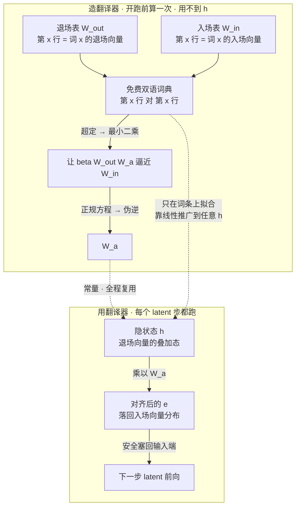

# 从零看懂 LatentMAS 的输入-输出对齐算子 $W_a$

> **起点**：只需要会**矩阵乘法、转置、求逆**。**最小二乘忘了没关系**——§3.6 会从"三条打架的方程"重建，不预设你记得。读完你能自己手算一个 $W_a$，并说清它为什么长这样。
>
> **读法**：§1–§6 是主线，按顺序读。§7 追问区可跳着看。§8 术语表忘词回查。§9「进阶」讲那个 Wasserstein 上界，**跳过不影响理解**。
>
> **全文所有数字都用 numpy / sympy 独立核算过**，你可以随手验。

---

## 1. 缘起：为什么需要 $W_a$

LatentMAS 让模型"在隐空间里思考"：把某一步算出的**最后一层隐状态 $h$**，直接当成**下一步的输入嵌入**塞回模型，而不是先解码成一个词。

问题来了：$h$ 和"输入嵌入"**不是同一种东西**。模型的输入层只见过"词的输入嵌入"这种向量；你突然塞一个最后一层的 $h$ 进去，就像把柴油加进汽油发动机——形状对，但成分不对，模型会产生**分布外（out-of-distribution）**的怪异反应，而且这个偏差会随着一步步自回归**越滚越大**。

$W_a$ 就是那个"转接头"：一个矩阵，把 $h$ 线性地**掰回**到"看起来像合法输入嵌入"的样子。

$$e = h\,W_a$$

$e$ 就是掰正后、可以安全塞回输入端的向量。

**本文只回答一件事：这个 $W_a$ 该怎么算出来，为什么是那个公式。**

论文给的最终公式长这样（先别怕，读完 §6 你会觉得它很自然）：

$$W_a=\frac{1}{\beta}\big(W_{out}^\top W_{out}+\lambda I\big)^{-1}W_{out}^\top W_{in}\tag{论文式 35}$$

---

## 2. TL;DR（一句话版）

> **每个词在模型里有两个身份：一个"入场向量"（输入嵌入 $W_{in,x}$）和一个"退场向量"（输出嵌入 $W_{out,x}$）。当隐状态 $h$ 在"说"某个词时，它长得像那个词的退场向量；但输入端只认入场向量。$W_a$ 就是"退场语 → 入场语"的翻译器。**
>
> **怎么造这个翻译器？没有 $(h,e)$ 的训练数据——但模型的两张权重表本身就是一本逐行对齐的免费双语词典。在这本词典上拟合翻译器，恰好是一个最小二乘问题，解就是那个带伪逆的公式。而拟合完的翻译器之所以能处理从没见过的 $h$，靠的是线性推广。**

记住这两段，后面全是把它讲细。

---

## 3. 概念梯子（每节只加一个新想法）

### 3.1 起点：一个词有"两个向量身份"

Transformer 首尾各有一张大表，**两张都是 $|V|\times d_h$ 的矩阵**（$|V|$ 是词表大小，$d_h$ 是隐藏维度），**每一行对应一个词**：

- **输入嵌入表 $W_{in}$**：模型**开头**用。词 $x$ 进来时，查出第 $x$ 行当它的向量。
- **输出嵌入表 $W_{out}$**：模型**结尾**用（就是 LM head / unembedding）。它给每个词打分，决定输出哪个词。

#### 先约定两个绰号（本文自造，不是论文术语）

"输入嵌入 / 输出嵌入"这两个词长得太像、读着容易串，所以本文一律用绰号，全文统一：

| 本文绰号 | 标准术语 | 精确定义 | 用途 |
|---|---|---|---|
| **入场向量** | 输入嵌入 input embedding | $W_{in,x}$ = $W_{in}$ 的**第 $x$ 行**，$\in\mathbb{R}^{d_h}$ | 词 $x$ **进**模型时查表拿到的向量 |
| **退场向量** | 输出嵌入 output embedding | $W_{out,x}$ = $W_{out}$ 的**第 $x$ 行**，$\in\mathbb{R}^{d_h}$ | 模型**出口**给词 $x$ 打分：$\text{logit}_x=h\cdot W_{out,x}$ |

> 绰号只为好记，**结论一律落回精确表述**：入场向量 $=W_{in,x}$，退场向量 $=W_{out,x}$。
> 代码对照：入场向量 = `embed_tokens.weight[x]`，退场向量 = `lm_head.weight[x]`。两者在 PyTorch 里都存成 $[|V|,\ d_h]$，取的都是**行**。

> **桥句①：同一个词 $x$，在 $W_{in}$ 里有一行、在 $W_{out}$ 里也有一行——这是它在"入口"和"出口"的两个不同向量身份，两者一般不相等。**

（记号约定：本文所有向量是**行向量**，$h,e,W_{in,x},W_{out,x}$ 都是 $1\times d_h$。这样 $h\,W_a$ 里 $W_a$ 是 $d_h\times d_h$，形状才对得上。）

### 3.2 隐状态"在说某个词"时，长得像它的**退场向量**

模型结尾怎么决定输出哪个词？算分数（logit）：

$$\text{词 }x\text{ 的分数} = h\cdot W_{out,x}\quad(\text{两个向量做点积})$$

哪个词的退场向量和 $h$ **方向最贴**、点积最大，就输出哪个词。

> **桥句②：所以当模型"想说词 $x$"时，它的隐状态 $h$ 必然指向和 $W_{out,x}$ 差不多的方向——$h\approx(\text{某个缩放})\times W_{out,x}$。**

这一步是全篇的关键直觉。把它记牢：**$h$ 属于"退场向量"那一族，不属于"入场向量"那一族。**

### 3.3 但我们要把它当**入场向量**用

LatentMAS 要把 $h$ 塞回**输入端**。输入端只认 $W_{in}$ 那一族的向量。而 §3.2 说了 $h$ 是 $W_{out}$ 那一族的。**族不对，这就是所有麻烦的根源。**

> 需求于是变得极其具体：**把一个"退场向量"翻译成"同一个词的入场向量"。**

### 3.4 死路与转机：没有训练数据，但模型**自带一本词典**

需求清楚了，可**这个翻译器要怎么造出来？**

**先看死路。** 最自然的想法是"收集一堆 $(h,\ \text{正确的}\,e)$ 配对，然后拟合一个映射"。**这条路根本走不通**——给定一个 $h$，**不存在"标准答案 $e$"**。$h$ 是模型的连续思维，常常是好几个词的**叠加态**，压根不对应任何一个具体的词；你上哪儿去找它"应该"对应哪个入场向量？**没有标注，没有监督信号。**

**转机在这里。** 虽然拿不到 $(h,e)$ 的配对，但 §3.1 已经告诉我们：每个词在两张表里各有一行。换句话说——

> **桥句③：模型的两张权重表，本身就是一本逐条对齐的免费双语词典。**

| 词条 | "退场语"怎么说 | "入场语"怎么说 |
|---|---|---|
| 词 $1$ | $W_{out,1}$ | $W_{in,1}$ |
| 词 $2$ | $W_{out,2}$ | $W_{in,2}$ |
| $\vdots$ | $\vdots$ | $\vdots$ |
| 词 $\lvert V\rvert$ | $W_{out,\lvert V\rvert}$ | $W_{in,\lvert V\rvert}$ |

**第 $x$ 行对第 $x$ 行，索引天生对齐，一分钱不用花。** 这是模型免费送给我们的、**唯一**的平行语料。

于是造翻译器的办法有了：**不在 $h$ 上拟合（没数据），改在这本词典上拟合。**

#### ⚠️ 三个必须澄清的点（否则"词典"这个说法会站不住）

**(1) 配对的是"行"，不是"函数的输出"。**
常见反驳："$W_{out}$ 的输出是 logits（连续），$W_{in}$ 的输入是 token（离散），两者怎么可能等价？"——这是把 $W_{out}$ 当**函数**看了。但 logits 是**用**这张表之后得到的结果，**不是这张表本身**。摊开看，两张表形状完全一样：

| | 表的形状 | 第 $x$ 行是什么 | 怎么被使用 |
|---|---|---|---|
| $W_{in}$ | $\lvert V\rvert\times d_h$ | $W_{in,x}\in\mathbb{R}^{d_h}$ | **写入**：$e=\mathbf{1}_x W_{in}$（one-hot 选出第 $x$ 行） |
| $W_{out}$ | $\lvert V\rvert\times d_h$ | $W_{out,x}\in\mathbb{R}^{d_h}$ | **读出**：$\text{logit}_x=h\cdot W_{out,x}$（$h$ 与第 $x$ 行点积） |

$W_{out,x}$ 是模型用来问"$h$ 有多像词 $x$"的**探针向量**，它和 $W_{in,x}$ **住在同一个 $\mathbb{R}^{d_h}$ 空间里**、被同一个索引 $x$ 指到。配对配的是这个，合法。

**(2) 两张表作为"函数"确实不等价——而这正是我们要的。**
离散路径是：

$$h\ \xrightarrow{\ W_{out}^\top\ }\ \text{logits}\ \xrightarrow{\ \textbf{argmax}\ }\ \text{token }x\ \xrightarrow{\ W_{in}\ \text{查表}\ }\ e$$

中间那个 **argmax 非线性、有损**，正是它把连续的 $h$ 压成一个离散词。**$W_a$ 不是在求 $W_{out}$ 的逆、也不是在复刻这条路径**（线性映射复刻不了 argmax）——它是在**绕过 argmax**，不逼 $h$ 坍缩、直接换坐标系。所以"两者不等价"不是 bug，等价了反而等于把离散瓶颈装回去。

**(3) 逐行配对是个假设，不是定理。** ← 本节最该记住的一条

凭什么要求 $W_{out,x}W_a\approx W_{in,x}$？论文附录 A 写明了这张许可证——本文称之为**生成式假设（Generative Assumption，简称 GA）**：

$$\underbrace{\sigma\sim P_\sigma}_{\text{隐变量：语义权重},\ \|\sigma\|_2\le1}\ \longrightarrow\ \begin{cases}e=\sum_{x}\sigma_x W_{in,x}=\sigma W_{in} & \text{观测 1：入场向量}\\[4pt] h=\beta\sum_{x}\sigma_x W_{out,x}=\beta\,\sigma W_{out} & \text{观测 2：隐状态}\end{cases}$$

> **📛 命名说明**：**"GA"是本文起的简称，论文没给它起过名字**（附录 A 只是裸陈述了它，这也是它容易被读者滑过去的原因）。叫"生成式"有原文依据——附录 A.1 原话是 "We assume that $P_e$ and $P_h$ can be **generated** by..."，`generated` 是论文自己的用词。统计里 generative model 的含义就是"数据是怎么被产生出来的"：**先有语义 $\sigma$，它再通过两张表分别"生成" $e$ 和 $h$。$\sigma$ 是那个看不见的共同源头。**
>
> **⚠️ 别和另一个假设搞混**：论文有**两个**假设，只有一个有名字——
> | 简称 | 全称 | 论文起名了吗 | 撑着什么 |
> |---|---|---|---|
> | **GA** | Generative Assumption 生成式假设 | ❌ 没有（附录 A 裸陈述） | Thm A.1 → $W_a$ 的**解释** |
> | **B.1** | Linear Representation Hypothesis 线性表示假设 | ✅ 有（引 Park et al. 2023） | Thm 3.1 → 表达力 235×–471× |
>
> **两者独立**：B.1 说 $h=\sum_i c_i s_i$（语义基 + **三值**系数 $c_i\in\{0,\pm1\}$）；GA 说**同一个 $\sigma$ 同时生成 $e$ 和 $h$**。**GA 塌了不影响 Thm 3.1，反之亦然。**

**GA 的核心是"同一个 $\sigma$"**——只是一个用 $W_{in}$ 展开、一个用 $W_{out}$ 展开。取 $\sigma=\mathbf{1}_x$（纯一个词）立刻得到逐行方程。**没有这个假设，"词典"只是启发式。** 严谨说法是：*在"两张表被同一个 $\sigma$ 索引"的假设下*，第 $x$ 行互为对应。

#### 自检：权重绑定时会发生什么

很多模型**绑定权重**（$W_{in}=W_{out}=W$）。代入公式立刻退化：

$$W_a=\tfrac1\beta\big(W^\top W\big)^{-1}W^\top W=\tfrac1\beta I$$

**词典退化成恒等 → 翻译退化成纯缩放**（两张表就是同一张，还翻译什么？只剩量级要修）。这完全符合直觉，反过来印证框架自洽。

> **顺带一个论文没讨论的空白**（本文作者观察，非原文结论）：若被测模型恰好绑定权重，那 $W_a$ 带来的 +2.3%~5.3% 增益就**纯粹来自 $\beta$ 这个标量缩放**，与"对齐"无关。论文未说明 Qwen3 各尺寸是否绑定，这块存疑。

### 3.5 把"在词典上拟合"写成一条矩阵方程

我们想要一个矩阵 $W_a$，把词典的**每一条**都翻译对，即对每一个词 $x$：

$$\underbrace{W_{out,x}}_{\text{词 }x\text{ 的退场向量}}\; W_a \;\approx\; \underbrace{W_{in,x}}_{\text{词 }x\text{ 的入场向量}}$$

> ⚠️ **这里最容易卡住**：注意 $h$ **没有出现在方程里**。这不是笔误——**造翻译器的阶段用不到 $h$，用词典就够了**；$h$ 是**之后**才拿来翻译的对象。方程说的是"把词典翻对"，不是"把 $h$ 翻对"。

#### 🚨 立刻会冒出的反驳："那我直接用 $W_{in}$ 不就完了？"

> **"你大费周章算 $W_a$，不就是为了让 $W_{out}W_a\approx W_{in}$？既然结果就是 $W_{in}$，我直接用 $W_{in}$ 不就好了？"**

**这是本文最关键的一个坎。** 症结在于——

$$\underbrace{W_{out}W_a\approx W_{in}}_{\textbf{只在拟合阶段出现}}\qquad\text{vs}\qquad\underbrace{e=h\,W_a}_{\textbf{推理时真正算的}}$$

**推理时我们从来不算 $W_{out}W_a$。** 那条式子只是**造翻译器时的拟合目标**，造完就没它的事了。推理时喂进去的是 $h$，而 **$h$ 不是 $W_{out}$ 的任何一行**——它是叠加态。

**所以 $hW_a$ 的结果，在 $W_{in}$ 里查不到。** 具体见 §4.4：玩具的 $W_{in}$ 只有三行 $(2,1),(1,2),(3,3)$，而叠加态 $h=(0.5,0.5)$ 经 $W_a$ 得到 $(1.5,1.5)$——**它不是任何一行**，语义是"半个 A、半个 B 同时成立"，**不对应任何一个词**，词表里压根没有它的位置。**"直接用 $W_{in}$"——你用哪一行？都不对。**

**更要命的是**："直接查 $W_{in}$ 表"这个动作，**逻辑上要求你先决定查哪一行**。而"决定哪一行"就是：

$$h\ \xrightarrow{\ W_{out}^\top\ }\ \text{logits}\ \xrightarrow{\ \textbf{argmax}\ }\ \text{选定词 }x\ \xrightarrow{\ \text{查 }W_{in}\ }\ e$$

| | 直接查 $W_{in}$ 表 | 用 $hW_a$ |
|---|---|---|
| 前置动作 | **必须先选定一行** → argmax → **坍缩** | 无，直接线性变换 |
| 输出范围 | 只能是 $\lvert V\rvert$ 个向量之一 | $\mathbb{R}^{d_h}$ 中任意向量 |
| 叠加态 | ❌ **被摧毁** | ✅ 保留 |
| 单步信息量 | $\log_2\lvert V\rvert\approx17$ bit | 连续 |
| **这其实就是** | **文本模式** | **latent 模式** |

> **桥句③′：「直接查 $W_{in}$ 表」= 先做 argmax = 坍缩成离散 token = 就是文本模式本身。** 而 LatentMAS 的全部动机就是逃离它。所以**恰恰不能直接用 $W_{in}$**。

**结论：词典是脚手架，用完即弃。** 我们要的从来不是"在词条上翻对"（那是免费的），而是**推广到词条之外**的能力。拟合完 $W_a$ 后，**推理时 $W_{in}$、$W_{out}$ 两张表根本不参与，只有 $W_a$ 在跑。**

把所有 $|V|$ 个词的这条式子**摞起来**（每个词占一行），就得到一条干净的矩阵方程：

$$W_{out}\,W_a \;\approx\; W_{in}\qquad(\,|V|\times d_h\ \text{的两张表，中间夹一个 }d_h\times d_h\text{ 的 }W_a\,)\tag{★}$$

> **桥句④：求 $W_a$ = 找一个线性映射，让它同时把每个词的退场向量尽量映到该词的入场向量。** 这不再是什么玄学，就是解方程 (★)。

#### 为什么"翻对词典"就能翻对从没见过的 $h$？

$h$ 不是词典里的任何一条（它是叠加态）。凭什么在词典上拟合出来的 $W_a$ 能处理它？**靠线性。**

§3.2 说 $h$ 是词条的**线性组合**：$h\approx\beta\sum_x \sigma_x W_{out,x}$（$\sigma_x$ 是词 $x$ 的语义权重）。而 $W_a$ 是**线性映射**，所以：

$$h\,W_a\ \approx\ \beta\sum_x \sigma_x\,\underbrace{\big(W_{out,x}W_a\big)}_{\text{每条都已翻对}\ \approx\ W_{in,x}}\ \approx\ \beta\sum_x \sigma_x W_{in,x}$$

> **桥句⑤：线性映射由它在样本上的行为完全决定——把每个词条翻对了，词条的任意组合就自动翻对了。** 这就是为什么只需在 $\lvert V\rvert$ 条词典上拟合，却能应付无穷多个从没见过的 $h$。（§4.4 有具体验证。）

**顺带回答"为什么必须是每一个词、不能只挑几个"**：$W_a$ 是**开跑前算一次、之后永久复用**的常量。算它的时候你**不知道**将来模型会想哪个词、会产生什么 $h$，所以它必须对词表里**任何**词都成立——漏掉的词一旦出现在某个叠加态里，那部分就翻错了。

### 3.6 (★) 是个"超定"方程 → 只能最小二乘

#### 先补一条规则：矩阵方程 = **每个格子一条**标量方程

(★) 的两边**都是 $|V|\times d_h$ 的矩阵**。矩阵相等的定义是**每个对应格子都相等**——所以它不是"一条方程"，而是**有多少格子就有多少条**。

拿 §4 的玩具（$|V|=3,\ d_h=2$）当场数一遍。设未知的 $W_a=\begin{bmatrix}a&b\\c&d\end{bmatrix}$（**4 个未知数**，即 $d_h^2$），把左边乘开：

$$\begin{bmatrix}1&0\\0&1\\1&1\end{bmatrix}\begin{bmatrix}a&b\\c&d\end{bmatrix}=\begin{bmatrix}a&b\\c&d\\a+c&b+d\end{bmatrix}\ \stackrel{!}{=}\ \begin{bmatrix}2&1\\1&2\\3&3\end{bmatrix}$$

右边 $3\times2=6$ 个格子 → **逐格对应，得 6 条标量方程**：

| # | 位置 | 方程 |
|---|---|---|
| 1 | (行1, 列1) | $a=2$ |
| 2 | (行1, 列2) | $b=1$ |
| 3 | (行2, 列1) | $c=1$ |
| 4 | (行2, 列2) | $d=2$ |
| 5 | (行3, 列1) | $a+c=3$ |
| 6 | (行3, 列2) | $b+d=3$ |

**6 条方程、4 个未知数。**

#### 推广到一般情形

- **未知数**：$W_a$ 是 $d_h\times d_h$ → $\ d_h^2$ 个。
- **约束**：每个词 $x$ 贡献一条**向量**方程 $W_{out,x}W_a=W_{in,x}$；但那是 $d_h$ 维向量的等式，**拆成分量就是 $d_h$ 条标量方程**。$|V|$ 个词 × $d_h$ 条 = $\ |V|\,d_h$ 条。

$$\text{超定倍数}=\frac{|V|\,d_h}{d_h^2}=\frac{|V|}{d_h}$$

而 $|V|\gg d_h$。Qwen3-8B（$|V|=151936,\ d_h=4096$）实算：约束 $\approx6.2\times10^8$ 条，未知 $\approx1.68\times10^7$ 个——**超定 37 倍**。

#### 线性代数速查：三种情况

| 方程数 vs 未知数 | 名称 | 结果 |
|---|---|---|
| 少于 | 欠定 underdetermined | 无穷多解 |
| 等于 | 恰定 | 一般唯一解 |
| **多于** | **超定 overdetermined** | **一般无解** → 只能最小二乘找"最接近"的 |

> 直觉：**只有 4 个旋钮，却要同时满足 6 个要求。旋钮不够就顾此失彼**，只能让每条都差一点、总误差最小。

#### ⚠️ 但"超定"≠"一定无解"

上面那个玩具恰恰是反例：方程 1–4 给出 $a=2,b=1,c=1,d=2$，代进多出来的两条——方程 5：$2+1=3$ ✓，方程 6：$1+2=3$ ✓——**恰好相容**，精确解存在。这就是 §4.3 三个词全部命中的原因。

但只要把 C 的入场向量从 $(3,3)$ 改成 $(9,9)$，方程 5 变成 $a+c=9$，与 $a=2,c=1$ **直接矛盾**，精确解立刻消失（§4.5 就是这类冲突）。**真实词表必属后者**——十几万个词塞进几千维，相容是几乎不可能事件。

所以超定的准确含义是：**一般无法精确满足所有约束**，只能退而求其次，让"没对齐的误差"整体最小。

#### 最小二乘是什么（忘了也没关系，三分钟重建）

> **一句话：最小二乘就是"求平均数"的推广。**

**最小的例子**：三条互相打架的方程，一个未知数——

$$x=1,\qquad x=2,\qquad x=3$$

没有任何 $x$ 能同时满足（超定无解）。但直觉说答案是 **2**。凭什么？因为我们换了个问法：**既然没法全满足，就找一个 $x$ 让它"总体上差得最少"。**

每条方程差多少叫**残差**：$(x-1),(x-2),(x-3)$。把残差**平方后相加**当总误差：

$$f(x)=(x-1)^2+(x-2)^2+(x-3)^2\ \Longrightarrow\ f'(x)=6x-12=0\ \Longrightarrow\ \boxed{x=2}$$

**正是三个数的平均数。** 一维情况下，最小二乘给出的"折中值"就是平均数——这就是它的全部直觉。

**为什么非得平方？**

| 备选 | 问题 |
|---|---|
| 直接加残差 $\sum(x-b_i)$ | **正负抵消**：差 $+3$ 和差 $-3$ 加起来是 0，看着"完美"实则错得离谱 |
| 加绝对值 $\sum\lvert x-b_i\rvert$ | 不抵消了，但**绝对值在 0 点不可导** → 没有闭式解，只能迭代 |
| **加平方** $\sum(x-b_i)^2$ | ✅不抵消；✅**处处可导** → 求导置零即得**闭式解**；✅大误差罚得更重 |

"最小二乘"（least **squares**）的名字就来自这个平方。**能有闭式解全靠平方可导**——这正是 $W_a$ 能"算一次、无需训练"的根本原因。

**一般形式**：$m$ 条方程、$n$ 个未知数、$m>n$ —— $\min_x\|Ax-b\|^2$。上面例子即 $A=[1;1;1],\ b=[1;2;3]$。

于是把 (★) 改写成一个**最小二乘**目标（$\|\cdot\|_F$ 是 Frobenius 范数，就是把矩阵所有元素平方求和再开根，衡量"总误差多大"）：

$$\min_{W_a}\ \big\|\,W_{out}\,W_a - W_{in}\,\big\|_F^2\tag{★★}$$

> **桥句⑥：因为词太多、维度太少，$W_a$ 不可能让每个词都完美翻译，所以我们要的是"让所有词的翻译误差平方和最小"的那个最佳折中。**

### 3.7 最小二乘的标准解 = 正规方程 = 伪逆

先在最简单的 $Ax=b$（$A$ 高瘦）上把解法建立起来，再套到 (★★)。**两条路殊途同归。**

#### 路 A：微积分（硬算）

展开 $\|Ax-b\|^2=x^\top A^\top Ax-2b^\top Ax+b^\top b$，对 $x$ 求梯度置零：

$$2A^\top Ax-2A^\top b=0\ \Longrightarrow\ \boxed{A^\top A\,x=A^\top b}\ \Longrightarrow\ x=(A^\top A)^{-1}A^\top b$$

用 §3.6 的例子验：$A^\top A=3,\ A^\top b=6,\ x=6/3=2$ ✅ 和手算的平均数一致。

#### 路 B：几何（更好懂，还解释了"正规"这个名字）

这条路是理解最小二乘的**关键图像**：

1. $x$ 变化时，$Ax$ **只能在 $A$ 的列空间里跑**——那是嵌在 $m$ 维空间里的一个 $n$ 维子空间（$n<m$，所以是个"薄片"）。
2. **$b$ 一般不在这个薄片上**——这就是"无解"的几何含义：**目标点根本不在你能到达的范围内**。
3. 退而求其次：在薄片上找**离 $b$ 最近的点**，也就是 $b$ 往薄片上的**垂直投影**。
4. 投影的判据：**残差 $b-Ax$ 必须垂直于整个薄片**，即垂直于 $A$ 的每一列。
5. "垂直"= 点积为零：$A^\top(b-Ax)=0\ \Longrightarrow\ A^\top Ax=A^\top b$ —— **和路 A 一模一样**。

> **"正规方程"（normal equation）的 "normal" 不是"正常"，是"垂直"**（法向量 normal vector 那个 normal）。它就是"残差垂直于列空间"这个几何条件的代数写法。
>
> 例子验证：$x=2$ 时残差 $r=Ax-b=(1,0,-1)$，而 $A^\top r=1+0-1=0$ ✅ 确实垂直。

#### 套回 (★★)

同样对 $W_a$ 求导置零，得到正规方程：

$$W_{out}^\top W_{out}\,W_a = W_{out}^\top W_{in}$$

左边 $W_{out}^\top W_{out}$ 是 $d_h\times d_h$ 方阵，可逆（$|V|\gg d_h$ 时通常满秩），两边左乘它的逆：

$$\boxed{\,W_a = \big(W_{out}^\top W_{out}\big)^{-1}W_{out}^\top\;W_{in}\,}$$

前半截 $\big(W_{out}^\top W_{out}\big)^{-1}W_{out}^\top$ 有个名字，叫 $W_{out}$ 的 **Moore–Penrose 伪逆**，记作 $W_{out}^\dagger$。所以论文才写成

$$W_a \approx W_{out}^\dagger\,W_{in}\tag{论文式 3}$$

#### 为什么"矩阵版"和"向量版 $Ax=b$"长得一模一样

你可能奇怪：上面 $Ax=b$ 里 $x$ 是个**向量**，这里 $W_a$ 是个**矩阵**，凭什么套用同一个公式？

因为 $W_a$ 的**每一列彼此独立**——第 $j$ 列 $w_j$ 只影响乘积的第 $j$ 列，各列互不干扰：

$$\underbrace{W_{out}}_{\lvert V\rvert\times d_h\ \text{高瘦}}\ \underbrace{w_j}_{d_h\times1}\;=\;\underbrace{(W_{in})_{:,j}}_{\lvert V\rvert\times1}$$

**每一列就是一个标准的 $Ax=b$**（$A=W_{out}$ 高瘦、$m=\lvert V\rvert$ 条方程、$n=d_h$ 个未知数），解就是 $(A^\top A)^{-1}A^\top b$。

> **所以 (★) 只是把 $d_h$ 个独立小问题并排放在一起解**，再把 $d_h$ 个 $(A^\top A)^{-1}A^\top b$ 拼成矩阵——就得到 $W_a=(W_{out}^\top W_{out})^{-1}W_{out}^\top W_{in}$。
> **矩阵形式不是新东西，是 $d_h$ 份"求平均数"打包并排。公式的来历就这么朴素。**

> **一句话理解伪逆**：$W_{out}$ 是个"高瘦"矩阵（$|V|$ 行、$d_h$ 列），没有普通逆；伪逆 $W_{out}^\dagger$ 是"最小二乘意义下的逆"——它给出让 $W_{out}(\cdot)$ 最接近目标的那个解。

到这里，$W_a$ 的**骨架**已经完整了。剩下 §3.8 两个小修补。

### 3.8 两个工程修补：$\beta$ 和 $\lambda$

**修补一：尺度 $\beta$。** §3.2 说 $h\approx(\text{缩放})\times W_{out,x}$，那个缩放不是 1——最后一层隐状态经过了 $L$ 层残差累加，量级通常比原始退场向量大。$\beta>0$ 就是这个尺度因子。把它放进目标：$\min_{W_a}\|\beta W_{out}W_a - W_{in}\|_F^2$，解里就多一个 $\tfrac{1}{\beta}$。论文用经验公式估计它：

$$\beta=\frac{\|h\|}{\frac{1}{|V|}\sum_{x}\|W_{in,x}\|}\quad(\text{"隐状态范数"} \div \text{"入场向量的平均范数"})$$

**修补二：数值稳定 $\lambda$。** $W_{out}^\top W_{out}$ 有时接近奇异（病态），直接求逆会数值爆炸。加一个很小的 $\lambda I$（$I$ 是单位阵）到对角线上，让它稳稳可逆——这就是**岭回归（ridge regression）**的经典技巧，也正好是伪逆的一种极限逼近（$\lambda\to0$ 时回到伪逆）。

#### ⚠️ 一个必须澄清的误解：$\beta$ 和 $\lambda$ **不是**用来补"$h$ 不像退场向量"这个缺口的

很自然会这么猜：*"$h$ 只是个 hidden state，未必真是退场向量的组合，所以要靠 $\beta$、$\lambda$ 来补这个差距。"* —— **两个都不是。**

**先纠正一个数学事实**：$W_{out}$ 的行**张成整个 $\mathbb{R}^{d_h}$**（秩 $=d_h$，且 $\lvert V\rvert\gg d_h$）。所以**任意** $h$ **必然**能写成退场向量的组合——"$h$ 不在退场向量族里"数学上不成立。**缺口不在这儿。**

> **为什么"必然"？**（这一步别跳过）
> **2 维直觉**：$\mathbb{R}^2$ 里只要有**两个不平行**的向量，就能组合出平面上任何一点。给你 500 个随机 2 维向量——里面必然挑得出两个不平行的，**整个平面就被覆盖了，剩下 498 个纯属多余**。
> **真实情况**：Qwen3-8B 有 151936 个 4096 维退场向量，张满 4096 维只需 4096 个——**37 倍富余**。
> **所以"平凡"的含义是**：不是 $h$ 有何特殊性质，而是**退场向量多到把整个空间填满了，$h$ 想躲都躲不掉**。

**真正的缺口是：能解出 $\sigma$ ≠ 那个 $\sigma$ 合法。** 实测（随便造一个 $h$）：

```
能否解出 sigma 使 sigma @ W_out = h ?   True        <- 平凡成立
但 ||sigma|| = 14.98                                <- GA 明确要求 ||sigma|| <= 1 !
```

> **准确表述：$h$ 必然是退场向量的某个组合，但未必是一个"有语义的"组合。** GA 要的不只是"存在 $\sigma$"，而是 $\sigma$ 得**有界**（$\|\sigma\|_2\le1$）、**稀疏**、**服从真实语义分布** $P_\sigma$。**这才是被假设掉的东西。**

#### 🔬 把 GA 逼到墙角：它的**精确刻画**

平凡性还有第二层——**$\sigma$ 不唯一**。用玩具（$W_{out}$ 三行 $(1,0),(0,1),(1,1)$）：同一个 $h=(0.5,0.5)$，**三个完全不同的 $\sigma$ 都能生成它**：

| $\sigma$ | $\sigma W_{out}$ | $e=\sigma W_{in}$ |
|---|---|---|
| $(0.5,\ 0.5,\ 0)$ | $(0.5,\ 0.5)$ | $(1.5,\ 1.5)$ |
| $(0,\ 0,\ 0.5)$ | $(0.5,\ 0.5)$ | $(1.5,\ 1.5)$ |
| $(-0.5,\ -0.5,\ 1)$ | $(0.5,\ 0.5)$ | $(1.5,\ 1.5)$ |

**$\sigma$ 各不相同，$e$ 却完全一致**——因为这个玩具里 GA 严格成立。

**反例**（§4.5 的冲突词 D：退场 $=(1,0)$ 同 A，入场 $=(0,5)$ 异于 A）：

```
h=(1,0) 由 sigma=(1,0,0,0) 生成 -> e 应为 (2,1)
h=(1,0) 也由 sigma=(0,0,0,1) 生成 -> e 应为 (0,5)
   -> 同一个 h, 两个互相矛盾的 e !  生成式故事自相矛盾
```

于是得到 **GA 的精确刻画**：

$$\boxed{\ \text{GA 的可测内容}\iff\textbf{所有能生成同一个 }h\textbf{ 的 }\sigma\textbf{，必须给出同一个 }e\ }$$

这**恰好等价于**"存在线性映射 $M$ 使 $W_{out}M=W_{in}$"，也等价于一个纯线性代数条件：

$$\ker(W_{out})\subseteq\ker(W_{in}),\qquad \ker(W):=\{\sigma:\sigma W=0\}$$

> **人话**：**任何在退场表上"看不见"的 $\sigma$（加进去不改变 $h$），在入场表上也必须"看不见"（不改变 $e$）**——否则就能造出"同一个 $h$、两个不同 $e$"的矛盾。

**杀手级推论**（数值验证）：

```
Qwen3-8B: dim ker(W_out) = |V| - d_h = 147840
GA 要求这 147840 维空间 完全落在 同样 147840 维的 ker(W_in) 里
两个同维子空间 一个含于另一个 <=> 二者相等
-> 两个独立训练出来的 147840 维子空间 恰好相等? 概率为 0
```

> **所以严格意义下 GA 必假**——真问题从来不是"真还是假"，而是**"假到什么程度"**。
> 这也**解释了 $\rho_{\text{null}}=0.986$**：两核彼此随机时，线性映射几乎什么都拟合不到。**$\rho$ 的几何含义就是这两个 147840 维核有多"对齐"**——$\rho\to0$ 两核近乎重合，$\rho\to0.986$ 两核彼此随机。**这正是 `LatentMAS_assumption_probe.md` E1 要测的数。**

**那 $\beta$、$\lambda$ 各管什么？**（均已数值验证）

```
lam=0 / 1e-6 / 1e-3  ->  W_a[0,:3] 完全相同, 且 h 从未出现在这个计算里
除 beta 前后:  方向余弦 = 1.0000000000  (方向没变)   长度之比 = 1/beta  (只改了长度)
```

| $h$ 与"理想的有语义退场组合"的差异 | 谁来管 | 管得住吗 |
|---|---|---|
| **长度**不对（$h$ 比原始退场向量长 $\beta$ 倍） | $\beta$（单个标量） | ⚠️ 部分——只能修**全局平均**，修不了**逐维**错配 |
| **方向**不像任何有语义的 $\sigma$ 组合 | **没有任何东西** | ❌ **这就是 GA 直接假设掉的** |
| 求逆数值不稳 | $\lambda$ | ✅ 但这**跟 $h$ 无关** |

- **$\lambda$ 全程不碰 $h$**：它活在**拟合阶段**，而拟合阶段根本没有 $h$（§3.4）。纯数值拐杖。
- **$\beta$ 碰 $h$，但只改长度**：标量乘法在几何上就是"沿原方向伸缩"，**数学上不可能修正方向**。它的真实职责是**"拟合域 → 推理域"的尺度桥**——拟合用的是原始 $W_{out}$ 行，推理喂的 $h$ 长 $\beta$ 倍，$\frac1\beta$ 补的是**刻度**，不是**方向**。
- **方向的缺口：没人补，那就是假设本身。** LatentMAS **没有任何机制**保证或纠正"$h$ 落在有语义的 $\sigma$ 区域内"。$h$ 一旦飘出去，$W_a$ 会心安理得地把它映射成垃圾，**且没有任何东西会发现**。

> **📌 这可能才是 Fig 8 "超过 80 步就退化"的真正原因**（**本文作者推断，非论文结论**）：每步 latent 喂回去的 $e$ 都是**合成的、非真实 token 嵌入**，偏差**复利累积**；跑到 40–80 步后 $h$ 已漂出"有语义 $\sigma$"区域，$W_a$ 修不了也发现不了。论文归因于"冗余信息"，但"$\beta$/方向失配导致漂移累积"更简洁**且可检验**——见 `LatentMAS_assumption_probe.md` **E6**：改用逐步自适应 $\beta_t=\lVert h_t\rVert/\overline{\lVert W_{in}\rVert}$，**若退化点右移，论文的归因就是错的**。
>
> **另一个具体怀疑点**（作者观察）：真实 LLM 隐状态存在 **massive activations / 注意力汇聚**——少数维度的数值比其余大几个数量级，那是**架构产物而非语义**。**单个全局标量 $\beta$ 在原理上就修不了这种逐维病态**；而 $W_a$ 虽是满矩阵能吸收一部分，却是在**干净的 $W_{out}$ 行**上拟合的，**从没见过这种畸形**。

### 3.9 合体：最终公式

把两个修补装回骨架：

$$W_a=\frac{1}{\beta}\big(W_{out}^\top W_{out}+\lambda I\big)^{-1}W_{out}^\top W_{in}$$

**读它**：从右往左——先用 $W_{out}^\top W_{in}$ 收集"退场↔入场"的关联，再用 $(W_{out}^\top W_{out}+\lambda I)^{-1}$ 做最小二乘归一化，最后 $\tfrac1\beta$ 修尺度。**它只用到模型自带的两张冻结权重表 $W_{in},W_{out}$，不需要任何训练数据、不需要梯度**——这就是"训练无关"的由来。算一次，存下来，之后每一步 latent、每个（同构）智能体都复用。

---

## 4. 手把手实例：一个能用手算的 $W_a$

我们把词表缩到 **3 个词 $\{A,B,C\}$**、隐藏维度缩到 **$d_h=2$**，并令 $\beta=1,\lambda=0$（先看骨架）。
> 教学缩参：真实里 $|V|$ 是十万级、$d_h$ 是千级；这里用 3 和 2 只为能在纸上算。

### 4.1 两张表

| 词 | 退场向量（$W_{out}$ 的行） | 入场向量（$W_{in}$ 的行） |
|---|---|---|
| A | $(1,\,0)$ | $(2,\,1)$ |
| B | $(0,\,1)$ | $(1,\,2)$ |
| C | $(1,\,1)$ | $(3,\,3)$ |

即
$$W_{out}=\begin{bmatrix}1&0\\0&1\\1&1\end{bmatrix},\qquad
W_{in}=\begin{bmatrix}2&1\\1&2\\3&3\end{bmatrix}.$$

（注意我故意让 $C=A+B$ 在两张表里都成立——真实词表没有这种好事，这里只为数字干净。）

### 4.2 逐步算（每行一步，都可手验）

**第 1 步：$W_{out}^\top W_{out}$**（$2\times2$）

$$W_{out}^\top W_{out}=\begin{bmatrix}1&0&1\\0&1&1\end{bmatrix}\begin{bmatrix}1&0\\0&1\\1&1\end{bmatrix}=\begin{bmatrix}2&1\\1&2\end{bmatrix}$$

> 手验对角线：第一列平方和 $1^2+0^2+1^2=2$；第二列 $0^2+1^2+1^2=2$；交叉项 $1\cdot0+0\cdot1+1\cdot1=1$。✓

**第 2 步：求逆。** 行列式 $=2\cdot2-1\cdot1=3$，所以

$$\big(W_{out}^\top W_{out}\big)^{-1}=\frac13\begin{bmatrix}2&-1\\-1&2\end{bmatrix}$$

**第 3 步：$W_{out}^\top W_{in}$**（$2\times2$）

$$W_{out}^\top W_{in}=\begin{bmatrix}1&0&1\\0&1&1\end{bmatrix}\begin{bmatrix}2&1\\1&2\\3&3\end{bmatrix}=\begin{bmatrix}5&4\\4&5\end{bmatrix}$$

> 手验左上角：$1\cdot2+0\cdot1+1\cdot3=5$。✓

**第 4 步：相乘得 $W_a$**

$$W_a=\frac13\begin{bmatrix}2&-1\\-1&2\end{bmatrix}\begin{bmatrix}5&4\\4&5\end{bmatrix}=\frac13\begin{bmatrix}6&3\\3&6\end{bmatrix}=\begin{bmatrix}2&1\\1&2\end{bmatrix}$$

得到
$$\boxed{W_a=\begin{bmatrix}2&1\\1&2\end{bmatrix}}$$

### 4.3 验收：它真能把"退场"翻译成"入场"吗？

逐词代进 $W_{out,x}\,W_a$，看是否等于 $W_{in,x}$：

| 词 | $W_{out,x}$ | $W_{out,x}\,W_a$ | 目标 $W_{in,x}$ | 命中？ |
|---|---|---|---|---|
| A | $(1,0)$ | $(1{\cdot}2{+}0{\cdot}1,\ 1{\cdot}1{+}0{\cdot}2)=(2,1)$ | $(2,1)$ | ✅ |
| B | $(0,1)$ | $(1,2)$ | $(1,2)$ | ✅ |
| C | $(1,1)$ | $(3,3)$ | $(3,3)$ | ✅ |

三个词全部**精确命中**。这个玩具里存在一个完美线性映射，所以最小二乘解误差为零。

> **自检不变量**：既然 $W_a$ 是"退场→入场"的映射，那么对任意退场向量 $v$，$vW_a$ 应落在入场向量张成的空间里。你可以随便取 $v=(2,3)=2\cdot(1,0)+3\cdot(0,1)$，则 $vW_a$ 应当 $=2\cdot(2,1)+3\cdot(1,2)=(7,8)$；直接算 $(2,3)W_a=(2{\cdot}2{+}3{\cdot}1,\,2{\cdot}1{+}3{\cdot}2)=(7,8)$。✓ 线性映射对线性组合保持一致。

### 4.4 验收二：词典里**没有**的"叠加态"也能翻译

§4.3 翻对的三个词都是词典里的**原词条**，翻对了不稀奇——毕竟 $W_a$ 就是照着它们拟合的。真正的考验是 §3.5 那条线性推广：**丢一个词典里查不到的 $h$ 进来，它还翻得对吗？**

取 $h=(0.5,\ 0.5)$。它既不是 A 的 $(1,0)$、也不是 B 的 $(0,1)$，而是"半个 A + 半个 B"的**叠加态**——词典里根本没这一条。

| 算法 | 结果 |
|---|---|
| 直接用翻译器：$h\,W_a$ | $(0.5{\cdot}2+0.5{\cdot}1,\ \ 0.5{\cdot}1+0.5{\cdot}2)=(1.5,\ 1.5)$ |
| 按语义应该是：半个 A 的入场 + 半个 B 的入场 | $0.5\,(2,1)+0.5\,(1,2)=(1.5,\ 1.5)$ |

**完全一致。** $W_a$ 从没"见过" $(0.5,0.5)$，却翻对了——因为它在 A、B 两条词条上都翻对了，而线性映射对线性组合自动保持一致（桥句⑤）。

> 脚本随机抽了多组系数 $c$，令 $h=c\,W_{out}$，逐一验证 $h\,W_a = c\,W_{in}$ —— **全部命中**。
> **这就是"在 $\lvert V\rvert$ 条词典上拟合、却能处理无穷多个 $h$"的全部秘密。**

#### 🎯 顺便，这里也彻底回答了"为什么不直接用 $W_{in}$"

看清楚这个结果 $(1.5,\ 1.5)$：

$$W_{in}\text{ 的全部内容}=\Big\{(2,1),\ (1,2),\ (3,3)\Big\}\quad\not\ni\quad(1.5,\ 1.5)$$

**它不是词典里的任何一行。** 你想"直接用 $W_{in}$"——**用哪一行？$(2,1)$ 还是 $(1,2)$？都不对。**

$(1.5,1.5)$ 的语义是"**半个 A、半个 B 同时成立**"，而这**不对应任何一个词**——词表里没有它的位置。

> **$W_a$ 的价值恰恰在于：它能造出词典里不存在的向量。** 而"查表"永远只能返回那 $\lvert V\rvert$ 行之一。这就是 §3.5 那条反驳的实证答案。

### 4.5 现实为什么是"≈"而不是"="

真实词表里，不同词可能**退场向量几乎相同、入场向量却不同**，一个线性映射不可能同时满足两边——这时最小二乘只能**各让一步**。举个制造冲突的例子：再加一个词 $D$，它的退场向量和 $A$ 一样是 $(1,0)$，但入场向量却是 $(0,5)$。现在没有任何 $W_a$ 能把同一个 $(1,0)$ 既映到 $(2,1)$ 又映到 $(0,5)$。最小二乘给出的近似解会让每个词都带一点残差（用脚本核过）：

| 词 | 映射结果 $W_{out,x}W_a$ | 目标 $W_{in,x}$ | 残差 |
|---|---|---|---|
| A | $(1.2,\,2.6)$ | $(2,1)$ | $(-0.8,\,+1.6)$ |
| D | $(1.2,\,2.6)$ | $(0,5)$ | $(+1.2,\,-2.4)$ |

$A$ 和 $D$ 退场向量相同，线性映射就**被迫**把它俩送到**同一个点** $p=(1.2,\ 2.6)$，而两个目标在打架。这正是 §3.6 里"$x=1$ 和 $x=3$ 同时要求"的高维版——**最小二乘只好取折中**。

> **一个值得较真的细节**：$p$ 确实落在 $(2,1)$ 与 $(0,5)$ 的**连线段上**（参数 $t=0.4$，已验证），**但不是正中点** $(1,3)$。因为词 $B$、$C$ 也在拉扯同一个 $W_a$——最终是**全局折中**，不是 A/D 两家的私事。

**这就是"≈"的真身：$W_a$ 是所有词的最优妥协，不是逐词精确解。** 也正因如此，$W_a$ 只能"大幅缓解"分布漂移、不能完全消除——这与实验里"加了 $W_a$ 准确率 +2.3%~5.3%"（缓解但非归零）是一致的。

---

## 5. 一张图串起来



> **看图要点（两条，都是最容易栽的地方）**
> 1. **上半区（造）完全没有 $h$**——翻译器是拿词典拟合出来的；下半区（用）才轮到 $h$。**两个阶段必须分开看**（§3.4）。
> 2. **下半区（用）完全没有 $W_{in}$、$W_{out}$**——推理时两张表**根本不参与**，只有 $W_a$ 在跑。所以"直接用 $W_{in}$"这条路不存在：$hW_a$ 产出的是**词典里查不到的向量**，而查表本身要先 argmax，那就退回文本模式了（§3.5、§4.4）。

---

## 6. 回到你的问题：$W_a$ 是"核心难点"吗

你的直觉一半对。**它是核心巧思，但不是核心工程难点。**

- **巧思在于"换族"这个洞察**：意识到 $h$ 属于 $W_{out}$ 族、输入端要 $W_{in}$ 族，于是问题被化简成"给每个词做退场→入场的翻译"。这一步想到了，剩下的全是标准线性代数。
- **计算本身毫不难**：一个最小二乘 / 伪逆闭式解，`numpy.linalg.pinv(W_out) @ W_in` 一行就出来，算一次、几百毫秒、无需训练数据。
- **真正费工的是别处**（前几轮聊过）：自定义 latent 解码循环、跨 agent KV 的 RoPE/position 对齐、以及 vLLM 里注入 KV。$W_a$ 恰恰是这套方法里**最省事**的一环——这也是论文"training-free"卖点能成立的原因。

换句话说：$W_a$ 是让人"啊哈"的那一下，但它的美正在于**把一个看似要训练的对齐问题，变成了一道本科线性代数题**。

---

## 7. 追问区（预判的坑）

**Q00（最要命的一条）：既然 $W_{out}W_a\approx W_{in}$，那我直接用 $W_{in}$ 不就完了，何必算 $W_a$？**
因为**推理时我们从来不算 $W_{out}W_a$**——那条式子只活在**拟合阶段**。推理时算的是 $e=hW_a$，而 **$h$ 不是 $W_{out}$ 的任何一行**（它是叠加态），所以 **$hW_a$ 的结果在 $W_{in}$ 里查不到**（§4.4 实证：$(1.5,1.5)$ 不是那三行中的任何一行）。
更关键：**"直接查 $W_{in}$ 表"逻辑上要求你先决定查哪一行——那就是 argmax——那就是文本模式本身。** 一查表，叠加态就坍缩了，LatentMAS 的全部意义随之消失。**词典是脚手架，用完即弃；推理时两张表都不参与，只有 $W_a$ 在跑。** 详见 §3.5 的专门讨论。

**Q0（最容易卡住的一条）：我们要翻译的明明是 $h$，为什么方程 $W_{out,x}W_a\approx W_{in,x}$ 里 $h$ 根本没出现？**
因为**造翻译器**和**用翻译器**是两个阶段，$h$ 只属于后者。
- 造的时候没有 $h$ 可用——更准确说，**没有 $(h,e)$ 的监督数据**：给定一个 $h$，不存在"标准答案 $e$"（$h$ 是叠加态，不对应任何单一词）。
- 但模型自带一本**逐行对齐的双语词典**（$W_{out}$ 第 $x$ 行 ↔ $W_{in}$ 第 $x$ 行，同一个词的两个身份）。这是唯一免费的平行语料，于是拿它拟合。
- 拟合完了，再把任意 $h$ 丢进去翻译。**能推广到没见过的 $h$，靠的是线性**（§3.5、§4.4）。

**Q0.5：那为什么必须"每一个"词都要对齐？只挑几个高频词不行吗？**
因为 $W_a$ 是**开跑前算一次、之后永久复用**的常量。算它的时候你不知道将来模型会想哪个词、产生什么 $h$，所以它必须是**通用适配器**。漏掉的词一旦出现在某个叠加态里，那一部分就翻错了。（好在拟合成本极低——闭式解，不是迭代训练，"全都要"并不贵。）

**Q0.6：$W_{out}$ 的输出是 logits（连续），$W_{in}$ 的输入是 token（离散），两者根本不等价，凭什么叫"词典"？**
三层回应，详见 §3.4：
1. **配对的是行，不是函数的输出**。logits 是"拿 $h$ 去点每一行"的**结果**，不是 $W_{out}$ 这张表**本身**。两张表形状都是 $\lvert V\rvert\times d_h$，第 $x$ 行都是住在同一个 $\mathbb{R}^{d_h}$ 里、被同一个索引 $x$ 指到的向量。
2. **作为函数确实不等价，而这正是我们要的**。离散路径 $h\to\text{logits}\to\textbf{argmax}\to x\to e$ 中间有个非线性有损的 argmax；$W_a$ 不是复刻它，是**绕过**它（不逼 $h$ 坍缩）。等价了反而把离散瓶颈装回去了。
3. **但你的怀疑有道理**：逐行配对是**假设**不是定理，许可证是论文附录 A 的生成式假设 $e=\sigma W_{in},\ h=\beta\sigma W_{out}$（同一个 $\sigma$）。没有它，"词典"只是启发式。

**Q1：为什么说 $h$ 像"退场向量 $W_{out,x}$"，不是像"入场向量 $W_{in,x}$"？**
因为决定输出哪个词的是点积 $h\cdot W_{out,x}$。要让词 $x$ 得分最高，$h$ 必须和 $W_{out,x}$ 方向贴近。$h$ 是模型"临输出前"的状态，天然活在退场表的坐标系里，跟入场表没有直接关系。这正是要 $W_a$ 的全部理由。

**Q2：$W_{in},W_{out}$ 是 $|V|\times d_h$，$W_a$ 却是 $d_h\times d_h$，维度怎么对上的？**
方程是 $W_{out}\,W_a\approx W_{in}$：$(|V|\times d_h)\times(d_h\times d_h)=(|V|\times d_h)$，右边正好也是 $|V|\times d_h$。$W_a$ 夹在中间做"列空间内的线性变换"，把每个 $d_h$ 维退场向量变成 $d_h$ 维入场向量，所以它必须是 $d_h\times d_h$ 的方阵。词的数量 $|V|$ 只是"样本数"，不进入 $W_a$ 的形状。

**Q3：伪逆 $(W_{out}^\top W_{out})^{-1}W_{out}^\top$ 到底在干嘛？**
它是"高瘦矩阵的最小二乘逆"。$W_{out}$ 把 $d_h$ 维向量升到 $|V|$ 维分数空间，没法原路精确逆回来；伪逆给出的是"让 $W_{out}(\cdot)$ 最接近目标"的那个 $d_h$ 维原像。你可以验证 $W_{out}^\dagger W_{out}=I_{d_h}$（左逆），这就是它"抵消 $W_{out}$"的意思。

**Q4：$\beta$ 到底乘在哪、为什么必须有？**
目标写成 $\|\beta W_{out}W_a-W_{in}\|_F^2$，即把退场表先放大 $\beta$ 倍再去逼近入场表。因为真实 $h$ 的**长度**比原始退场向量大（残差流累加所致），不修尺度的话翻译出来的 $e$ 会整体偏大，照样 OOD。$\beta$ 就是那道**"拟合域 → 推理域"的尺度桥**。解里体现为一个 $\tfrac1\beta$。
**但注意两点**：(a) 它**只改长度不改方向**（标量乘法的几何意义，实测方向余弦 $=1.0000000000$）；(b) 在"线性关系**存不存在**"这个问题上 **$\beta$ 会被完全吸收**——令 $M:=\beta W_a$ 即可消掉它（详见 `LatentMAS_assumption_probe.md` §1.2）。所以它**不是**调 $W_a$ 的旋钮，而是一个**估计量**。

**Q4.5：$h$ 只是个 hidden state，未必真是退场向量的组合吧？$\beta$、$\lambda$ 是不是就为了补这个？**
**都不是**（这是最常见的误猜）。
- **数学上 $h$ 必然是退场向量的组合**——$W_{out}$ 的行张成整个 $\mathbb{R}^{d_h}$，任意 $h$ 都解得出 $\sigma$。**这一步是平凡的。**
- **真缺口是"那个 $\sigma$ 合不合法"**：实测随便一个 $h$ 解出的 $\|\sigma\|=14.98$，而 GA 要求 $\|\sigma\|\le1$。**$h$ 必然是某个组合，但未必是有语义的组合。**
- **$\lambda$ 全程不碰 $h$**（它在拟合阶段，那里没有 $h$）；**$\beta$ 只管长度、管不了方向**；**方向的缺口没有任何东西管——那就是 GA 假设本身**。
详见 §3.8 的专门讨论。

**Q5：$\lambda$ 只是数值技巧，还是会影响结果？**
纯数值稳定（防止 $W_{out}^\top W_{out}$ 病态时求逆爆炸），取很小的正数。副作用是轻微"收缩"（岭回归把解往零拉一点点），$\lambda\to0$ 还原成纯伪逆。实践里小到几乎不改变对齐质量，只买一个"不崩"。**它和 $h$、和"对齐质量"都无关**——别把它和 $\beta$ 并列当成"两个调 $W_a$ 的超参数"。

**Q6：为什么"算一次就够"、还能所有智能体复用？**
因为 $W_{in},W_{out}$ 是模型**冻结的权重**，不随输入变；$\beta,\lambda$ 也固定。所以 $W_a$ 是模型的一个**常量**，开跑时算一遍存着即可。前提是所有智能体**同构**（同一模型、同 $W_{in}/W_{out}$）——这也是论文只支持同构智能体的根因：换个模型，$W_{in},W_{out}$ 变了，$W_a$ 就得重算，异构还得训练额外 adapter。

**Q7：既然要对齐，为什么不干脆训练一个 $W_a$（梯度下降）？**
可以，但那就丢了"training-free"。作者的核心主张是：**用闭式最小二乘就够好**（实验 +2.3%~5.3%），不值得为它引入训练流程、数据和调参。这是"够用即最优"的工程取舍。

**Q8：$e=hW_a$ 里 $h$ 是行还是列向量？形状要紧吗？**
本文按论文约定用**行向量**：$h$ 是 $1\times d_h$，$W_a$ 是 $d_h\times d_h$，$e=hW_a$ 还是 $1\times d_h$。若你习惯列向量，就写成 $e^\top=W_a^\top h^\top$，本质一样，别把 $W_a$ 和 $W_a^\top$ 搞反即可。

---

## 8. 术语表（忘词回查）

| 名词 | 一句话 |
|---|---|
| $d_h$ | 隐藏维度；每个隐状态/嵌入向量的长度 |
| $\lvert V\rvert$ | 词表大小；表 $W_{in},W_{out}$ 的行数 |
| 输入嵌入 $W_{in}$ | 模型开头的查表，词 $x$ 的"入场向量" $=W_{in,x}$（第 $x$ 行）；代码 `embed_tokens.weight[x]` |
| 输出嵌入 $W_{out}$ | 模型结尾的 LM head，词 $x$ 的"退场向量" $=W_{out,x}$（第 $x$ 行）；logit$=h\cdot W_{out,x}$；代码 `lm_head.weight[x]` |
| 入场/退场向量 | **本文自造绰号**（论文只叫 input/output embedding），避免两个术语读串 |
| 双语词典 | 比喻：两张表共享索引 $x$，第 $x$ 行给出同一个词的两种 $d_h$ 维表示。**合法性来自生成式假设，非定理** |
| **GA / 生成式假设** | **G**enerative **A**ssumption。论文附录 A：$e=\sigma W_{in}$、$h=\beta\sigma W_{out}$，**同一个 $\sigma$ 生成两者**。逐行配对的许可证。**⚠️「GA」是本文起的简称，论文未命名**；"生成式"源自原文用词 `generated` |
| 生成式模型 | 统计术语：描述"数据如何被产生"的模型。此处 $\sigma$ 是隐变量，$e$ 和 $h$ 是它生成的两个观测 |
| **B.1 / 线性表示假设** | Linear Representation Hypothesis（论文**有**命名，引 Park et al. 2023）：$h=\sum_i c_i s_i$，$c_i\in\{0,\pm1\}$。撑的是 Thm 3.1，**与 GA 相互独立** |
| $\sigma$ | 语义权重向量，$1\times\lvert V\rvert$；$\sigma=\mathbf{1}_x$ 表示"纯粹的词 $x$"，一般 $\sigma$ 是叠加态 |
| $\ker(W)$ | 核（零空间）$\{\sigma:\sigma W=0\}$，维度 $\lvert V\rvert-d_h$。**GA ⟺ $\ker(W_{out})=\ker(W_{in})$** |
| 线性推广 | 在词典每条上翻对 ⟹ 词条的任意线性组合自动翻对（§3.5、§4.4） |
| 权重绑定 | $W_{in}=W_{out}$；此时 $W_a=\tfrac1\beta I$，翻译退化为纯缩放 |
| 隐状态 $h$ | 最后一层输出向量；"想说词 $x$"时 $h\approx\beta W_{out,x}$ |
| 对齐后向量 $e$ | $e=hW_a$，掰回入场向量族、可安全塞回输入端 |
| 对齐算子 $W_a$ | $d_h\times d_h$ 矩阵，把退场向量翻译成入场向量 |
| 超定方程 | 约束（$\lvert V\rvert d_h$）远多于未知（$d_h^2$），一般无精确解。**注意：超定 ≠ 必无解**，相容时仍可能精确 |
| 矩阵方程展开 | 矩阵等式 = **每个格子一条**标量方程；$m\times n$ 的等式 = $mn$ 条 |
| 残差 | 每条方程"差多少"：$Ax-b$ |
| 最小二乘 | 无法全满足时，让**残差平方和**最小的折中解。**一维时就是求平均数** |
| 为什么平方 | 不抵消正负 + 处处可导（→ 闭式解）+ 重罚大误差 |
| 列空间 | $Ax$ 能到达的所有点构成的子空间（"薄片"）；$b$ 不在其中 = 无解 |
| 正规方程 | $A^\top Ax=A^\top b$；**normal = 垂直**，即"残差 $\perp$ 列空间"的代数写法 |
| 伪逆 $W_{out}^\dagger$ | $(W_{out}^\top W_{out})^{-1}W_{out}^\top$；高瘦矩阵的最小二乘逆，满足 $W_{out}^\dagger W_{out}=I$ |
| $\beta$ | 尺度因子，修正 $h$ 比原始退场向量更"长"的问题 |
| $\lambda$ | 岭回归正则，保证求逆数值稳定；$\lambda\to0$ 还原伪逆 |
| Frobenius 范数 $\|\cdot\|_F$ | 矩阵所有元素平方和开根，衡量总误差 |

---

## 9. 进阶：为什么"最小化 $\|\beta W_{out}W_a-W_{in}\|_F$"是**有道理**的（可跳过）

前面把目标 (★★) 当作"显然合理"直接用了。论文其实补了一个理论保证（Theorem A.1），说明这个目标不是拍脑袋，而是**某个分布距离的上界**——把它压小，就是在压小真正关心的分布错位。**跳过本节不影响使用 $W_a$。**

设 $P_e$ 是真实入场向量的分布，$P_{\hat e,W_a}$ 是"对齐后向量 $e=hW_a$"的分布。我们真正想要的，是这两个分布尽量重合（这样塞回去的 $e$ 才和模型平时见的输入同分布）。分布之间的差距用 **Wasserstein 距离** $d_{\text{W}}$ 衡量（可粗略理解为"把一堆点搬成另一堆点的最小搬运代价"）。论文证明：

$$d_{\text{W}}\big(P_{\hat e,W_a},\,P_e\big)\ \le\ \big\|\beta W_{out}W_a - W_{in}\big\|_F$$

> **通俗解读**：右边正是我们最小化的那个 Frobenius 量。它是左边"真正想压小的分布错位"的**上界**。上界压下去了，被它罩住的分布距离也一定跟着变小。所以"逐词对齐退场→入场"这件看起来朴素的事，其实等价于"在分布层面把 $e$ 拉回输入空间"，只不过它是一个可闭式求解的**代理目标（surrogate）**。

证明思路（了解即可）：构造一个把 $\sigma$（词的语义权重）同时送到 $\hat e$ 和 $e$ 的联合分布做耦合，再用 $\|\sigma\|_2\le1$ 把逐点误差 $\|\sigma(\beta W_{out}W_a-W_{in})\|$ 放缩到算子范数 $\|\beta W_{out}W_a-W_{in}\|_F$，对 $\sigma$ 求期望即得上界。细节见论文附录 A.1 式 (7)–(31)。

**一句话收尾**：$W_a$ 的公式 = "把每个词的退场向量最小二乘地映到入场向量"；而这个最小二乘目标，又恰好是"让对齐后向量的分布贴回真实输入分布"的一个上界。**朴素的逐词对齐，背后站着一个分布层面的保证。**

---

*数字均由 numpy 独立核算（3 词精确命中；冲突例子退化为最小二乘近似）。公式编号对应论文 Latent Collaboration in Multi-Agent Systems 正文式 (3) 与附录 A（式 32–35）、Theorem A.1（式 7）。*
