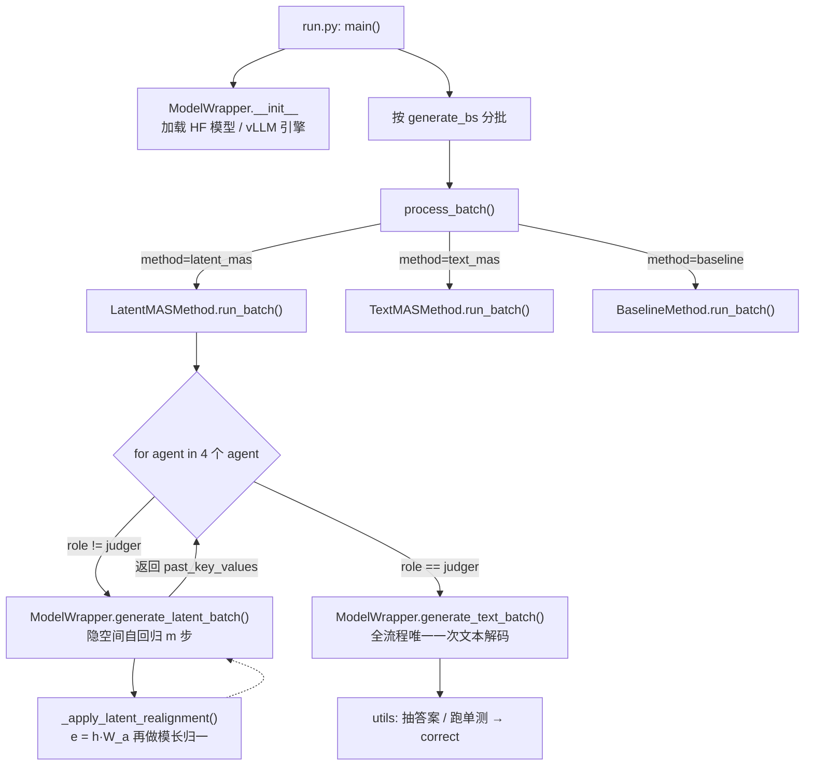

# LatentMAS 代码解析：实现与论文算法的逐条对应

> **这份文档回答什么**：`Gen-Verse/LatentMAS` 这个 repo 到底跑了什么，论文 §3 的每一个公式落在哪一行代码上，以及**代码在哪些地方和论文（或 README）对不上**。
>
> **配套**：论文精读见 `LatentMAS_论文总结.md`；$W_a$ 的从零推导见 `WA_ALI~1.MD`（《从零看懂输入-输出对齐算子 $W_a$》）；可证伪性实验协议见 `LATENT~2.MD`（《生成式假设可证伪性检验手册》）。后两个文件名疑似从 Windows 短文件名拷贝时被截断，建议改回全名。本文只管**代码**。
>
> **证据口径**：文中每条结论按「实测 / 静态读码 / 推断」三级标注，汇总见 §6。所有行号基于 commit `9a9e4d3`。

---

## 1. 这个 repo 是什么

一句话：**LatentMAS 论文的官方评测脚本**，不是可复用的库。它的全部功能是「在 9 个 benchmark 上跑 3 种方法，打印准确率 / 时间」。

```
LatentMAS/
├── run.py              # 唯一入口：argparse → 建模型 → 分批跑 → 打印 JSON
├── models.py           # 【算法主体】W_a 对齐矩阵 + 隐空间自回归
├── methods/
│   ├── latent_mas.py   # 【协作主体】KV 工作记忆在 agent 间的传递
│   ├── text_mas.py     #  对照组：同样 4 个 agent，用文本字符串拼 context
│   └── baseline.py     #  对照组：单 agent 直接答
├── prompts.py          # 766 行硬编码 prompt（角色 × 任务 × 拓扑），写死 Qwen
├── data.py             # 9 个数据集的 loader，统一成 {question, gold, solution}
└── utils.py            # \boxed{} 抽取、markdown code block 抽取、沙箱执行
```

Agent 是**写死的四个**，见 [methods/\_\_init\_\_.py:11-17](../methods/__init__.py#L11-L17)：

```python
Agent("Planner", "planner") → Agent("Critic", "critic")
→ Agent("Refiner", "refiner") → Agent("Judger", "judger")
```

`hierarchical` 拓扑并没有换类、换循环，**只换了 prompt 里的自称**：Planner→"math agent"、Critic→"science agent"、Refiner→"code agent"、Judger→"task summarizer"（[prompts.py:126-159](../prompts.py#L126-L159)）。

### 一次运行的调用链



**读图要点**：`past_key_values` 这个变量在 agent 循环里**从不清空**，一路往下传——论文 §3.2 说的「逐层 KV 前置拼接」，在代码里就是这一件事。

---

## 2. 手把手走一遍：一条 KV 链的生命周期

以 `--method latent_mas --prompt sequential --latent_steps 10`、batch 里一道 GSM8K 题为例。

| 阶段 | 发生了什么 | KV 链长度 |
|---|---|---|
| 起点 | `past_kv = None` | 0 |
| **Planner** | 把 `system + "你是 Planner…Question: {q}…"` 整段 tokenize（设 $t_1$ 个 token）→ 前向 → 拿最后一层最后位置的 $h$ → 对齐成 $e$ → 塞回去再前向 → 重复 10 次 | $t_1+10$ |
| **Critic** | **再次**把 `system + "你是 Critic…Question: {q}…计划以 latent KV 格式提供"` 整段 tokenize（$t_2$ 个 token），带着上面的 `past_kv` 前向 → 再走 10 步隐空间 | $t_1+10+t_2+10$ |
| **Refiner** | 同上 | $\sum_{i\le3}(t_i+10)$ |
| **Judger** | 把 judger prompt 接在链尾，调 `model.generate()` **解码文本** | + 生成长度 |

三件事值得先记住：

1. **题面 $q$ 被重复编码了 4 次**——每个 agent 的 prompt 都完整含题面（[methods/latent_mas.py:93-107](../methods/latent_mas.py#L93-L107)，`context` 参数恒为 `""`）。这与论文 §3.2 的描述一致（$A_2$ 有自己的输入 $t$ 个位置），但和「$q$ 只 tokenize 一次」的直觉印象不同。KV 链长度是 $\sum_i(t_i+m)$，**显存随 agent 数线性累积**。
2. **中间三个 agent 一个 token 都没生成**——`agent_traces` 里它们的 `"output"` 字段写死为 `""`（[methods/latent_mas.py:153](../methods/latent_mas.py#L153)）。论文报告的 token 节省就来自这里。
3. **Critic 从没「看见」Planner 的文字**。它对 Planner 的全部认知，就是链尾那 $t_1+10$ 个位置的 KV。prompt 里那句 "The plan information is provided in latent KV representation format"（[prompts.py:23](../prompts.py#L23)）是在**用自然语言告诉模型「你的上文是隐式的」**——这是个纯 prompt 层的约定，没有任何机制保证模型照做。

---

## 3. 论文 ↔ 代码 逐条对应

### 3.1 §3.1 潜在思维自回归

**论文**：取最后一层隐状态 $h_t$，不过 LM head、不 softmax、不采样，（对齐后）直接当 $t+1$ 步的输入嵌入，重复 $m$ 步。

**代码**：[models.py:321-349](../models.py#L321-L349)

```python
for step in range(latent_steps):
    latent_vec  = self._apply_latent_realignment(last_hidden, source_model)  # e = h·W_a
    latent_embed = latent_vec.unsqueeze(1)                                   # [B,1,D]
    outputs = self.model(inputs_embeds=latent_embed,      # ← 走 inputs_embeds 而非 input_ids
                         attention_mask=latent_mask,
                         past_key_values=past, use_cache=True,
                         output_hidden_states=True)
    past        = outputs.past_key_values
    last_hidden = outputs.hidden_states[-1][:, -1, :]     # 下一轮的 h
```

对应关系是字面级的：`inputs_embeds` 绕开 embedding 查表，全程没有 `lm_head`/`softmax`/`sample`——论文复杂度分析里省掉的 $O(d_h|V|)$ 解码项，省的就是这里。

> **注意**：函数里的 `e_t`、`h_t`、`latent_vecs_all`、`e_t_plus_1`（[models.py:313-329](../models.py#L313-L329)）计算了但**从未返回**，是画论文 Fig 6/7 分布图时留下的死代码。别以为它们参与了推理。

### 3.2 $W_a$ 闭式解

**论文**：$W_a=\frac{1}{\beta}\big(W_{out}^\top W_{out}+\lambda I\big)^{-1}W_{out}^\top W_{in}$

**代码**：[models.py:170-176](../models.py#L170-L176)

```python
input_weight  = input_embeds.weight   # W_in  : [|V|, d_h]
output_weight = output_embeds.weight  # W_out : [|V|, d_h]
gram = output_weight.T @ output_weight            # W_out^T W_out : [d_h, d_h]
gram = gram + 1e-5 * torch.eye(gram.shape[0])     # + λI，λ = 1e-5
rhs  = output_weight.T @ input_weight             # W_out^T W_in
realign_matrix = torch.linalg.solve(gram, rhs)    # 解正规方程，不显式求逆
```

逐项对得上，且用 `solve` 而非 `inverse`（数值上更稳）。整个矩阵**每次运行只算一次**，之后按 `id(model)` 缓存复用（[models.py:187-202](../models.py#L187-L202)）——论文说的「开销可忽略」是真的。

### 3.3 尺度因子 $\beta$：**实现方式与论文不同**

**论文**：$\beta=\dfrac{\|h\|}{\frac{1}{|V|}\sum_x\|W_{in,x}\|}$，作为 $1/\beta$ 乘进 $W_a$。

**代码**：$\beta$ 没有出现在矩阵里，而是在**事后做模长硬拉**（[models.py:177](../models.py#L177) + [models.py:209-212](../models.py#L209-L212)）：

```python
target_norm = input_weight.norm(dim=1).mean()          # 输入嵌入的平均行范数
...
aligned      = hidden_fp32 @ matrix
aligned_norm = aligned.norm(dim=-1, keepdim=True).clamp_min(1e-6)
aligned      = aligned * (target_norm / aligned_norm)  # 把 ‖e‖ 硬拉到 target_norm
```

**先破一个易误解点**：$\beta$ 的定义里含 $\lVert h\rVert$，所以 **$W_a$ 不是常数矩阵**，逐样本都在变。

实现上会拆成「固定矩阵 $M=(W_{out}^\top W_{out}+\lambda I)^{-1}W_{out}^\top W_{in}$」×「逐样本标量」——注意这**不是被迫的妥协，而是恒等变形**（标量与矩阵乘法可交换，只是省一半算力）。贵的是造 $M$（$d^2\lvert V\rvert\approx2.5\times10^{12}$），不是造 $W_a=\frac1\beta M$（$d^2\approx1.7\times10^7$，逐样本重算完全可行）。

代码的拆分**完全正确**。分歧只在下一步：那个标量的**分母取谁**：

$$e_{\text{论文}}=(hM)\times\frac{\text{avg}}{\lVert h\rVert}
\qquad\qquad
e_{\text{代码}}=(hM)\times\frac{\text{avg}}{\lVert hM\rVert}$$

| 版本 | 分母取自 | 得到的模长 |
|---|---|---|
| 论文 | $\lVert h\rVert$ —— 过矩阵**之前** | $\lVert e\rVert=\text{avg}\cdot r$，随样本浮动 |
| 代码 | $\lVert hM\rVert$ —— 过矩阵**之后** | $\lVert e\rVert=\text{avg}$，恒定 |

其中 $r=\lVert hM\rVert/\lVert h\rVert$ 是 $M$ 对该 $h$ 的拉伸率。

**同向但不等价**：代码版更稳（模长恒定不飘），但**不是论文优化目标 $\min_{W_a}\lVert\beta W_{out}W_a-W_{in}\rVert_F^2$ 的解**——$M$ 的拉伸率信息被抹平了。

> ⭐ **但默认配置下两版逐位相同**：不传 `--latent_space_realign` 时 $M=I$（见 §4.1），$\lVert hM\rVert=\lVert h\rVert$，$r\equiv1$。**真正分岔的只有「开 flag + 非 tied 模型」（Qwen3-8B/14B）这一种组合。**
>
> 详细展开（含 Qwen3-0.6B 实测 $\beta=132$、改法、等价性自检）见 **`beta-scale-factor.md`**。

### 3.4 §3.2 逐层 KV 工作记忆传递

**论文**：$K^{(l)}_{A_2}\leftarrow[K^{(l)}_{A_1};K^{(l)}_{A_2}]$，逐层前置。

**代码**：[methods/latent_mas.py:130-135](../methods/latent_mas.py#L130-L135)

```python
past_kv = self.model.generate_latent_batch(
    wrapped_ids, attention_mask=wrapped_mask,
    latent_steps=self.latent_steps,
    past_key_values=past_kv,          # ← 上一个 agent 的记忆，整个循环里从不清空
)
```

**全篇最核心的机制，代码上是最不起眼的一行。** 原因是 HuggingFace 的 `past_key_values` 天然就是 `L` 组 `(K,V)` 的逐层结构，「把 $A_1$ 的第 $l$ 层 KV 前置到 $A_2$ 的第 $l$ 层」= 「不清空 cache 继续往后算」。论文用了半页公式描述的操作，等价于工程上什么都不做。

这也解释了为什么 Theorem 3.3（无损传递）证起来那么轻松——它证的就是「KV cache 复用 = 重新计算」这个标准事实。

### 3.5 全流程唯一一次文本解码

[methods/latent_mas.py:156-184](../methods/latent_mas.py#L156-L184)：只有 `role == "judger"` 走 `generate_text_batch`，且把累积的 `past_kv` 当前缀塞进 `model.generate(past_key_values=...)`。

```python
past_for_decoding = past_kv if self.latent_steps > 0 else None
```

这一行同时是论文 Fig 8 里 **$m=0$ 那个点的实现**：$m=0$ 时前缀被丢成 `None`，判官只看得见自己的 prompt——LatentMAS **完全退化成单 agent**（而且前三个 agent 的前向白算了）。

### 3.6 两种拓扑

| | 论文描述 | 代码实现 |
|---|---|---|
| sequential | planner → critic → refiner → solver 链式 | ✅ 一致 |
| hierarchical | {math, science, code} 三专家**并行** → summarizer 聚合 | ⚠️ **仍是四级串行链**，见 §4.3 |

---

## 4. 代码与论文 / README 对不上的地方

按「是否影响论文结论」排序。

### 4.1 ⚠️ 影响结论：`--latent_space_realign` 默认关，且「关」不等于论文的「无对齐」

[models.py:179-183](../models.py#L179-L183)：

```python
if self.args.latent_space_realign:
    pass                                    # 用真正的 W_a
else:
    realign_matrix = torch.eye(...)         # 换成单位阵
```

但 **[models.py:212](../models.py#L212) 的模长归一无论如何都执行**。所以关掉开关时的实际行为是：

$$e = h\cdot\frac{\text{avg}\|W_{in,x}\|}{\|h\|}\qquad\text{（裸 } h \text{ 只做模长缩放）}$$

**问题**：论文 Fig 6/7 报告「加 $W_a$ 带来 +2.3%~5.3%」，但代码里的对照组是「模长已归一的 $h$」，不是论文图里画的那个「明显偏离输入嵌入分布的原始 $h$」。这两个对照组的强弱差很多——**模长归一本身就修掉了 OOD 的一大半**。README 把这个开关称为 "hyperparameter"（enable/disable depending on task/model），进一步说明作者自己也观察到它并非稳定加分。

### 4.2 ⚠️ 影响结论：权重绑定的模型上 $W_a\approx I$

若 `tie_word_embeddings=True`，则 $W_{out}=W_{in}=W$，闭式解退化为

$$W_a=(W^\top W+\lambda I)^{-1}W^\top W\approx I$$

即**整个对齐算子塌成恒等映射**，$W_a$ 的全部作用只剩 §4.1 那个模长归一。

本机缓存实测：`Qwen3-0.6B → True`、`Qwen3-8B → False`。Qwen3 系列 4B 及以下按官方 config 均为 tied（**本机无缓存，未核**）。如果 4B 确为 tied，论文 4B 那一档的 $W_a$ 消融增益需要重新解释来源。

> 这一条是**可以 20 行代码验证**的：加载 4B，算出 `realign_matrix`，看 `‖W_a − I‖_F / ‖I‖_F`。

### 4.3 ⚠️ 影响结论：hierarchical 不是并行

[methods/latent_mas.py:91](../methods/latent_mas.py#L91) 的 `for agent in self.agents` 循环对两种拓扑**完全相同**，`past_kv` 一路累积。所以 hierarchical 的实际执行是：

```
math agent →(KV)→ science agent →(KV)→ code agent →(KV)→ summarizer
```

science agent **能看到** math agent 的工作记忆，不是独立并行的专家。论文图上画的「三专家并行、互不可见 → summarizer 聚合」在 latent 版本里没有实现。

**为什么会这样**：KV 前置拼接天然是有序的——要做真并行，得让三个专家各自维护独立 cache，再在 summarizer 处**沿序列维度拼三段**，这涉及位置编码怎么排的设计问题，代码里没有处理。

（TextMAS 的 hierarchical 是**真并行**的：三个 agent 各自独立生成文本，`contexts` 字符串拼接，[methods/text\_mas.py:103-111](../methods/text_mas.py#L103-L111)。所以 hierarchical 那一栏的 latent-vs-text 对比，两边的信息拓扑其实不同。）

### 4.4 ⚠️ 影响结论：vLLM 路径根本不传 KV

[methods/latent\_mas.py:251-438](../methods/latent_mas.py#L251-L438) 的 `run_batch_vllm` 是**另一套机制**：

1. 每个 agent 收集的是 **input embedding**，不是 KV：`curr_output_embedding = [prompt 的 embedding 层输出] + [每一步的 latent 向量]`（[models.py:387-413](../models.py#L387-L413)）；
2. judger 把所有 agent 的 embedding 拼起来，**插进自己 prompt 的 `<|im_start|>user\n` 之后**（[methods/latent\_mas.py:361-377](../methods/latent_mas.py#L361-L377)）；
3. 整体交给 vLLM **重新 prefill**。

**信息等价，机制不等价**：位置顺序变了（HF 路径是 `[A1][A2][A3][judger]`，vLLM 路径是 `[judger前缀][A1][A2][A3][judger后缀]`），RoPE 的相对距离全不一样，而且要重算一遍前面所有位置的 KV——**Theorem 3.3 那个「省掉重计算 + 逐位相同」的等价性，在 vLLM 路径上两条都不成立**。

README 只说 "minor numeric differences may arise due to different decoding strategies"，并建议用 HF 后端复现论文数字——**这个说法低估了差异**：不是解码策略不同，是通信机制换了。

### 4.5 🐛 vLLM 路径在 `batch_size=1` 时直接崩

[methods/latent\_mas.py:355](../methods/latent_mas.py#L355) + [:368](../methods/latent_mas.py#L368)：

```python
curr_prompt_emb = self.model.embedding_layer(judger_encoded).squeeze(0)  # [B,L,H] → B=1 时变 [L,H]
B, L, H = curr_prompt_emb.shape                                          # B=1 → 解包失败
```

`squeeze(0)` 在 `B=1` 时把 batch 维抹掉，下一行三元解包必然 `ValueError`。（静态读码结论，未实跑。）

同一段的 [:381-384](../methods/latent_mas.py#L381-L384) 还用**零向量**给不等长的 prompt embedding 补位：

```python
torch.cat([x, torch.zeros(max_len - x.shape[0], H)], dim=0)
```

vLLM 会把这些零嵌入当**真实 prompt 位置**处理，等于让模型从一串零向量后面开始生成。所以 vLLM 路径实际只在「`B>1` 且批内长度恰好相等」时行为正常。

### 4.6 🐛 batch padding 三连坑（HF 路径）

tokenizer 的 `padding_side` **实测为 `right`**（Qwen3 的 `tokenizer_config.json` 未设置该字段，走 HF 默认值 `right`），而代码从未改过它。example log 里 `generate_bs=15`，不是 1。于是：

| 位置 | 问题 |
|---|---|
| [models.py:314](../models.py#L314) | `hidden_states[-1][:, -1, :]` 取的是**最后一列**。短样本的最后一列是 **pad 位**，取到的 $h$ 是「pad token 位置上的隐状态」，不是论文要的 $h_t$ |
| [models.py:334-338](../models.py#L334-L338) | latent step 的 mask 写死 `ones(B, past_len+1)`，把 past 里的 **pad 位重新对注意力放开** |
| [models.py:234-246](../models.py#L234-L246) | judger 解码时 `cache_position = arange(past_len, ...)` 按无 padding 计算，且同样 `ones(B, past_len)` 放开 pad |

第一条最要命：**批内每一行的「潜在思维」起点都取自不同的错位位置**。这不会让程序报错，只会让结果安静地变差/变噪。真要复现论文数字，先设 `tokenizer.padding_side = "left"` 或干脆 `generate_bs=1` 各跑一遍对比。

### 4.7 🐛 argparse 挡住了 README 自己的命令

[run.py:91](../run.py#L91)：

```python
choices=["Qwen/Qwen3-4B", "Qwen/Qwen3-4B", "Qwen/Qwen3-14B"]
```

4B 写了两遍，**8B 缺失**——而 README 明确给了 8B 的示例命令，直接跑会被 argparse 拒掉。论文表 4 的 Llama-3.2-3B / Llama-3.1-8B 结果同样跑不了：除了 `choices` 不含 Llama，[prompts.py:7](../prompts.py#L7) 还有硬断言 `assert "qwen" in args.model_name.lower()`。**这份代码只能复现 Qwen 那部分结果。**

### 4.8 ⚠️ `--latent_steps` 默认 0：会静默退化

[run.py:102](../run.py#L102) 默认 `0`。忘记传时，程序**不报错不警告**，只是变成「前三个 agent 白跑前向 + judger 单独作答」。

**repo 自带的 `example_logs/qwen3_14b_mbppplus_sequential.txt` 里 `Latent Steps: 0`**（实测 grep）——那份日志不是 LatentMAS 的样例，是退化的单 agent 样例。hierarchical 那份是 10，正常。引用日志时务必先 grep 一下这个字段。

### 4.9 论文里有、代码里没有

- **附录 F 的 debug 探针模式**（并行产出人类可读文本用于审计）：全 repo grep 不到实现。论文 Table 8 那个 96.2%/90.0% 的探针一致性实验，用这份代码复现不了。
- **`latent_only` / `sequential_info_only` 两个消融开关**（[methods/latent\_mas.py:40-44](../methods/latent_mas.py#L40-L44)）：逻辑写好了（`_truncate_past` 只保留链尾 N 个位置——前者只留本 agent 的 latent 思维，后者只留本 agent 的 prompt+latent），但**没在 argparse 注册**，`getattr` 永远取到 `False`。想用得自己加两行。

### 4.10 计时口径

[run.py:129](../run.py#L129) 的 `start_time` 打在**模型加载之后**，只计推理。这点是公平的。但注意 `total_time` 包含了 mbpp/humaneval 的**沙箱执行时间**（`run_with_timeout(..., timeout=10)`），代码题的「速度」数字里混进了跑单测的时间。

---

## 5. 要复现或改造的最小检查清单

跑之前逐条确认，能省掉一天：

1. `--latent_steps` 传了没？（默认 0 = 没开 LatentMAS）
2. `--latent_space_realign` 传了没？没传的话 $W_a$ 是单位阵。
3. 模型是不是 tied embedding？是的话 $W_a\approx I$，上一条基本无意义。
4. `generate_bs` > 1 吗？是的话先把 `padding_side` 改成 `left` 再比。
5. 用 vLLM 吗？那你测的不是论文的 KV 传递机制（且 `B=1` 会崩）。
6. 要跑 8B / Llama？先改 [run.py:91](../run.py#L91) 的 `choices` 和 [prompts.py:7](../prompts.py#L7) 的 assert。
7. 引用 example log 前先 `grep -A1 "\[Latent Steps\]"`。

---

## 6. 证据分级

| 结论 | 依据 | 级别 |
|---|---|---|
| Qwen3 tokenizer `padding_side == "right"` | 本机加载 Qwen3-0.6B tokenizer 打印 | **实测** |
| Qwen3-0.6B tied / 8B untied | 本机 `config.json` | **实测** |
| Qwen3-4B tied | 官方 config 记忆，本机无缓存 | **待核** |
| `example_logs/*mbppplus*` 的 latent_steps=0 | grep 日志 | **实测** |
| §3.1/§3.2/$W_a$ 的代码对应 | 逐行读码 | **静态读码** |
| vLLM 路径 `B=1` 崩溃 | 静态读码（`squeeze(0)` + 三元解包） | **静态读码，未实跑** |
| padding 导致取到 pad 位隐状态 | 静态读码 + padding_side 实测 | **静态读码** |
| §4.1/§4.2 会削弱论文 $W_a$ 消融结论 | 上述事实的推论 | **推断** |
| hierarchical 非并行 | 逐行读码（循环共用 `past_kv`） | **静态读码** |

---

## 7. 一句话总结

**论文的核心机制在代码里只有两处**：`models.py` 的 12 行隐空间自回归循环，和 `latent_mas.py` 里那个「从不清空的 `past_kv`」。剩下的都是评测脚手架。

**而这份代码与论文的差距集中在三件事**：$W_a$ 默认关且对照组不干净（§4.1–4.2）、hierarchical 不是并行（§4.3）、vLLM 路径换了机制（§4.4）。前两件影响的是「$W_a$ 到底值多少分」和「hierarchical 那一栏在比什么」，第三件影响的是「vLLM 数字能不能引用」。
