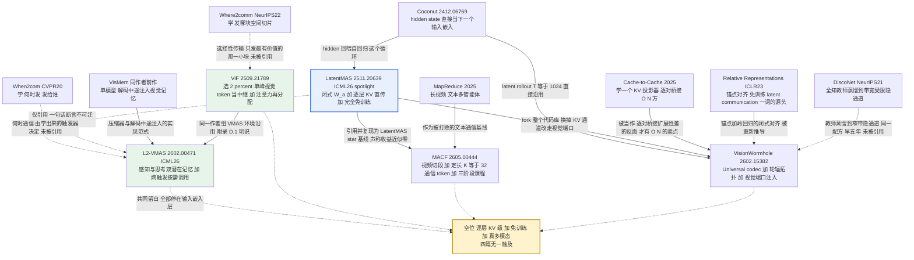

# 四篇「多模态 latent MAS」交叉对比

> **本文口径**：全部结论来自你已完成的四份精读 + 本机 `/home/yilin/LatentMAS/exp-docs/code-to-paper-mapping.md` 与 `/home/yilin/LatentMAS/exp-docs/multimodal-latent-mas-survey.md`（v2）。凡是我做的推断我会写「我的推断」；凡是论文没写的我写「论文未给」。
>
> **⚠️ 先纠正一条你本机文档里的错误**：`multimodal-latent-mas-survey.md` §2.2 与 §1 的象限表把 **ViF 记成「免训练」**，并据此认为「多模态 + 非文本通信 + 免训练」这一格已被占。**这条已被本轮精读推翻**——ViF 是两阶段训练，Stage 2 连 base LLM 都解冻（论文冻结表逐字：Large Language Model — Frozen / **Trainable**）；"plug-and-play" 只形容对 MAS 拓扑即插即用。**结论：那一格现在是空的。** 这不是措辞问题，它直接改变了你的落点判断（详见 §3）。

---

## 1. 总对比表

### 1.1 主表

| 维度 | **L²-VMAS** | **ViF** | **MACF** | **VisionWormhole** | *（参照）LatentMAS* |
|---|---|---|---|---|---|
| **arXiv / venue** | 2602.00471 · **ICML 2026 已接收** | 2509.21789 · v3 2026-01 · 未标接收 | 2605.00444 · ICML 2026 投稿格式，接收未声明 | 2602.15382 · "Preprint, work in progress" | 2511.20639 · ICML 2026 spotlight |
| **通信介质是什么张量** | 记忆单元 `(K, V)`：`K ∈ R^{d_model}` 单个**检索键**，`V ∈ R^{l×d_model}` **单层 hidden state 序列**；注入时当 **L=8 个伪 token embedding** 插进解码序列 | **~1–2% 的视觉 token 的 hidden state**（relay token `R̂ ∈ R^{n×d}`），经训好的轻量 Transformer `f` 上下文化后插入下一 agent 的**输入序列**（vision 段与 instruction 段之间） | 每 agent **定长 K=32 个连续向量** `c ∈ R^{K×d}`，由 2 层 MLP adapter 从最后层 hidden 投出；拼接 + 分隔 token 喂协调者**输入嵌入层** | universal token `U ∈ R^{1026×512}` → 解码为 `Δ ∈ R^{256×d_i}`，**门控残差覆写到 dummy 图的 image-token 段嵌入** | 逐层 `past_key_values` **原样往下传**；agent 内 `h → W_a → 输入嵌入` |
| **是否 KV 级** | ❌ 否（embedding 层）**注**：论文写 "key-value pairs" 但那是检索键/值，**不是 KV cache**，写 related work 千万别说它传 KV | ❌ 否（输入嵌入，要从第 0 层重跑全部层） | ❌ 否（协调者输入嵌入层） | ❌ 否（输入嵌入层的 image span） | ✅ **是** |
| **是否 training-free** | ❌ 三阶段 PPO（100k+80k+50k steps，8×H200，训 3 个压缩器 + Gumbel 门控，backbone 冻结） | ❌ 两阶段（Stage1 训 projector+`f`；**Stage2 解冻 LLM**） | ❌ 三阶段课程 CE + **双侧 LoRA** + 每 backbone 一个 MLP adapter，4×A100-80G | ❌ 每模型训一个 ~41M codec（400 步）+ 闭式岭回归对齐 | ✅ **是** |
| **是否处理真实图像输入** | ✅ 图像 + 视频 | ✅ 图像 | ✅ **视频**（长视频，唯一做视频的） | ❌ **否——9 个基准全是纯文本**，唯一的"图"是 224×224 纯白图，推理期还丢掉 `pixel_values`，ViT 只在 init 跑一次 | ❌ 纯文本 |
| **backbone 覆盖** | 5 backbone（Qwen3-VL 2/4/8/32B Instruct+Thinking、GLM、InternVL、LLaVA-OV-1.5-8B）× 4 尺寸 × **6 拓扑** | **10 base model × 4 种 MAS 结构** | Qwen3-VL-8B 为主（+ Qwen2.5-VL-7B 做异构） | **跨家族异构**：Qwen3-VL-2B / Gemma-3-4B / SmolVLM2 / LFM2.5-VL | 同骨干 |
| **benchmark** | 8 个：MMBench, MMStar, RealWorldQA, SimpleVQA, MuirBench, BLINK, MVBench, LVBench | 8 个（幻觉导向 + 通用） | 4 个视频：Video-MME, LongVideoBench, LVBench, MLVU-Test | 9 个**纯文本**：GSM8K, ARC-E/C, GPQA, MedQA, MBPP+, HumanEval+, AIME24/25 | 文本推理/代码/数学 |
| **有无代码** | ❌ **无**（网上流传的 `github.com/YU-deep/L2-VMAS` 经 curl 实测 **404，是幻觉链接**）。旁证代码：同作者 VisMem / ViF | ⚠️ **stub-only**：repo 在，但**核心视觉流一行未实现**，`import vif` 直接崩，4 种 MAS 拓扑实现了 0 种 | ❌ **无**（穷尽检索确认；且论文两次写"详见 Appendix"而 12 页 PDF 无 Appendix） | ✅ **有**（LatentMAS 的直接 fork，但开箱即崩、无 checkpoint） | ✅ 有（本机 `/home/yilin/LatentMAS`） |
| **核心增益数字** | +2.7–5.4%（**相对**提升；绝对仅 **+1.8–4.0 点**），token 相对文本 VMAS −21.3–44.8%（**但相对单 agent 仍贵 ~5.4×**） | HS score 下降；关键消融：中层丢 unimodal token 掉 **40.7**（vs random 19.1 / inactive 2.3）；视觉注意力占比 turn1 0.165 → turn20 0.063 | vs MapReduce **+9.7–18.6 绝对点**；vs LatentMAS\* **+4.7–8.3**（**论文 §4.2 写的 9.3/14.1/10.5/10.3 与 Table 1 对不上，别引**）；Video-MME 60.4 | 宏平均 Δacc 为正但**很小**：vs 单 agent 仅 **+3.7pp / +1.3pp**；AIME 上 +13.4pp = **只多做对 4 题（n=30）** | — |
| **是否引用 LatentMAS** | ✅ 引了，**零实验对比**，仅附录 A.1 一句话断言"不可迁移" | ❌ 未引 | ✅ 引了 **并做了 LatentMAS\* 基线**（称收益≈0） | ✅ 引了 **并做了 Appendix F 压力测试**（称异构下崩溃） |
| **有无墙钟/延迟数字** | ❌ 全无（只有 token 数） | ❌ **零效率数字**，"lightweight" 是形容词 | ✅ 有（0.537s vs 0.649s vs MapReduce；但未说是否含 M=6 次局部前向） | ✅ 有，**且含负加速**：0.57×/0.58×/0.64×/0.79× | — |
| **有无方差/seed** | ❌ 单次 | ❌ 未报 | ❌ 单次无误差棒 | ❌ 未报 |

### 1.2 一眼看懂的四条横向结论

1. **没有一篇是 KV 级的。** 四篇全部落在「输入嵌入层塞伪 token」这一层。LatentMAS 最独特的那条腿（逐层 `past_key_values` 直传）在多模态上**一次都没有被搬过去**。
2. **没有一篇是 training-free 的。** 包括你本机文档以为免训练的 ViF。四篇全部用「学一个投影」替代 LatentMAS 的闭式 `W_a`。
3. **唯一有能跑代码的那篇（VW），做的不是多模态任务；做多模态任务的三篇，代码都不可用。** 这是这个方向当前最尴尬的结构性事实——**你没有任何一个可直接复现的多模态 latent MAS 基线**，所有对照组都得自己造。
4. **净增益普遍很薄。** L²-VMAS 绝对 +1.8~4.0 点、VW 相对单 agent +1.3~3.7pp、MACF 上限 60.4 还输给无约束的 VideoLLaMA3-7B（66.2）。「latent 通信」目前赢的是**文本 MAS 基线**，不是**加了预算的单智能体**。

### 1.3 专项对比：四篇各自怎么绕开 `W_a` 断点（你最关心的那条）

| 论文 | 怎么把「思维」搬进接收方的输入空间 | 是否闭式 | 代价 |
|---|---|---|---|
| LatentMAS | `W_a=(W_out^T W_out+λI)^{-1}W_out^T W_in`，最小二乘反解 LM head | ✅ 闭式 | **只对文本词表成立**；且本机实测 tied embedding 上退化成 ≈I（`code-to-paper-mapping.md` §4.2） |
| **L²-VMAS** | **复用 VLM 自己的冻结 projector**（附录 C.2 Eq.13/14）把多粒度视觉特征投进语言空间，再训压缩器 | ❌ | 视觉编码器要跑 3 遍（g=3），不计入其 token 指标 |
| **ViF** | 训一个 Transformer 块 `f` 做上下文化；**但传的本来就是视觉 token 的表示**，天然在语言空间附近 | ❌ | `f` 有 2519 万参数 |
| **MACF** | 训 2 层 MLP adapter；**Stage1 用字幕 CE 显式把 latent 拽进协调者嵌入空间** | ❌ | Stage1 是最关键一步（缺了平均 −13.9） |
| **VW** | 不做「对齐」，做「**落在流形附近**」：以 dummy 图的嵌入为基点做门控残差 | ❌ | 门控初始 σ(−4)≈0.018，有塌缩风险 |

**这张表的读法（我的推断，也是我认为你论文最该写的一句话）**：
四篇一致地用「学一个投影」替代闭式解，**没有任何一篇给出多模态下的闭式/免训练对齐**——但同时，**ViF 的存在暗示了一条它自己没走完的免训练捷径**：视觉 token 经 projector 之后**本来就活在输入嵌入空间里**。也就是说，`h → 输入嵌入` 的断点只对「最后一层 hidden state」存在，对「第 0 层视觉表示」**根本不存在**。谁去传视觉侧的第 0 层/浅层表示，谁就不需要 `W_a`。这条路 ViF 走了一半（它选对了张量，却又训了个 `f` 把免训练性丢掉了）。

---

## 2. 谱系图

**读图三个要点**：

- **实线 = 论文自己承认的继承**；**虚线 = 我判定为技术同构但被引方未被引用**（DiscoNet→VW、Where2comm→ViF、When2com→L²-VMAS）。这三条虚线是**你写 related work 的杠杆**：四篇里没有一篇引协同感知，而 When2com/Where2comm/DiscoNet 分别提前 4–6 年做完了「何时通信」「传哪一块」「怎么蒸馏进窄带隐通道」。CVPR 背景的审稿人一定会问。
- **LatentMAS 出去的三条线各不相同**：VW 是**代码级 fork**，MACF 是**实验级复现并声称证伪**，L²-VMAS 是**引用级断言且零证据**。同一个被引对象拿到三种强度的处理，而**三者互不引用、互不核对**——这是全场最大的证据真空。
- **VisionWormhole 是唯一同时接上「隐式推理」和「跨模型对齐」两条血脉的**，但它把这两条血脉用在了纯文本任务上。

---

## 3. 地盘划分：设计空间怎么切、谁占了、空格为什么空

**三个维度**：通信介质（张量放在哪一层）× 是否需要训练 × 任务是否真多模态。

### 3.1 象限 A：真多模态任务

| 通信介质 ＼ 训练 | **免训练** | **需训练** |
|---|---|---|
| **① 离散文本** | 现有 VMAS 默认；VipAct（AAAI26）；Training-Free MLLM Orchestration（ICML26，**刻意选文本记忆而非嵌入——你要反驳的 honest control**） | MMedAgent-RL（+23.6%）、MACT |
| **② 输入嵌入层伪 token（源自最后层 hidden）** | 🟡 **空 · 没人做，且成本极低** —— 这就是「把 LatentMAS 原样搬到 VLM」的那个数字。L²-VMAS 引了却没测，MACF 测了但配置疑似错配。**这是文献里缺的一个 baseline 格子，不是新方法** | ✅ **L²-VMAS**（L=8 伪 token + 熵触发）· ✅ **MACF**（K=32 定长通信 token） |
| **③ 视觉 token 段 / 视觉端口** | 🟢 **空 · 曾被误认为被 ViF 占了，实际没有** —— 且**技术上明确做得到**：projector 输出天然在输入嵌入空间，不需要 `W_a`。ViF 选对了张量却又训了个 `f`，把免训练性丢了 | ✅ **ViF**（选 ~2% unimodal relay token + 训 `f` + 注意力再分配） |
| **④ 逐层 KV cache** | 🔴 **空 · 目标格 · 可行性未验证** —— 没人做。三个已知障碍：(a) 分段/多 agent 下各自从 0 起的 RoPE 位置拼接会乱（我基于本机 LatentMAS 代码的推断：`past_key_values` 在 agent 循环中从不清空、是拼接式堆叠）；(b) KV 长度随 agent 数线性爆炸；(c) ViF 已证视觉证据集中在 ~2% token，**传全部视觉 KV = 97% 带宽浪费**，20 轮 circular 下必爆。**→ 必须先做可行性验证，不要先许诺方法** | 🔴 **空 · 没人做** —— 即「Cache-to-Cache 的多模态版」。C2C 是纯文本；VLM 的 KV 复用文献（Kamera/VLCache/MPIC 等）做的是**单模型 prefix reuse**，不是 agent 间通信。技术上最直接，居然无人做 |

### 3.2 象限 B：纯文本任务（但用多模态机制）

| 通信介质 ＼ 训练 | **免训练** | **需训练** |
|---|---|---|
| ② 输入嵌入伪 token | ✅ **LatentMAS 本体**（`W_a`，同骨干） | — |
| ③ 视觉端口 | ⛔ **做不到（已被证伪一次，但证伪层级有限）** —— VW Appendix F：用词表配对的闭式算子跨 tokenizer 直传，Qwen+Gemma GSM8K 准确率**全程 ≤0.5%**，PPL 8.1e5→8.6e7。**但**：该实现自带最小二乘 bug（`methods/latent_mas_hybird.py:63/76/81` 两处 X 不是同一个矩阵）+ 按下标硬截断两个无关词表。**它证伪的是「词表配对闭式算子」这个具体做法，不是「LatentMAS 思想不能上异构」** | ✅ **VisionWormhole** |
| ④ 逐层 KV | ✅ LatentMAS（同骨干，异构不行） | ✅ Cache-to-Cache（异构，但 O(N²) 逐对桥） |

### 3.3 空格子分类总结

| 空格 | 是「没人做」还是「做不到」 | 判据 |
|---|---|---|
| A-②-免训练（LatentMAS 原样上 VLM 的数字） | **没人做**，且低成本 | 三篇分别引用/复现/压测，无一给出干净数字；本机已有 LatentMAS 可跑代码 |
| A-③-免训练（视觉 token 段免训练中继） | **没人做**，且**理论上不需要 `W_a`** | ViF 证明了该张量承载视觉证据（丢它掉 40.7），却用训练的 `f` 去处理它；免训练版本从未被试 |
| A-④-免训练（KV 级 + 免训练 + 多模态） | **没人做，可行性未验证** —— 不能默认「做得到」 | 三条具体障碍（RoPE 拼接 / 长度爆炸 / 97% 低价值 token）都是结构性的；MACF 明确**用输入嵌入层通信绕过了 KV 位置冲突** |
| A-④-需训练（多模态 C2C） | **没人做** | 无检索命中；技术路径清晰 |
| B-③-免训练 | **做不到（已有一次证伪，但实现带 bug）** | VW App.F；重做一遍并修 bug 本身就是可发表的更正 |
| 跨切面：**异构 backbone 的真多模态 latent 通信** | **没人做** | VW 异构但纯文本；MACF 异构掉 3/4 项；L²-VMAS 要求共享 `d_model`，异构从未测试 |
| 跨切面：**消息内容可复原性的度量** | **没人做** | 四篇零度量。VW 的蒸馏只匹配单个位置的 hidden + logits，续写还只是 "Acknowledge" |
| 跨切面：**多步多模态 latent 思考** | **没人做** | L²-VMAS 只注入 8 个 token 就回文本解码；MACF 的局部 agent 只做一次 prefill、**不解码任何 token**。无一有 m 步隐空间自回归 |

---

## 4. 同一作者组的谱系：Xinlei Yu / Chengming Xu / Jiangning Zhang / Xiaobin Hu / Shuicheng Yan

### 4.1 三步演进（时间轴）

| 时间 | 工作 | 层级 | 机制 | 训练 | 关键新增 |
|---|---|---|---|---|---|
| ~2025 | **VisMem**（前作，有代码） | **单模型** | 解码循环中途插入视觉记忆的伪 token embedding；`memory_former` 压缩器 | 分阶段 RL（GRPO），奖励只有 exact-match/substring 两个 0/1 | 「解码中途注入」的实现范式 |
| 2025-09 | **ViF**（2509.21789） | **多智能体** | 选中层单峰的 ~2% 视觉 token 当中继 + 注意力再分配 | 两阶段，Stage2 解冻 LLM | 把问题从「单模型记忆」升级为「**MAS 幻觉雪球**」；三维注意力实证 |
| 2026-01 | **L²-VMAS**（2602.00471，**ICML26**） | **多智能体 + 记忆库** | 感知/思考**双潜在记忆库** + 熵驱动主动触发 + 五分位淘汰合并 | 三阶段 PPO，8×H200 | 从「被动传一次」升级为「**按需检索的持久记忆库**」；提出 **scaling wall** |

### 4.2 这条路线的内在逻辑（我的归纳）

三步是同一条主线的三次抬升，每一步都在换**同一个问题的抽象层级**：

1. **载体不变**：三篇的注入位置**始终是 embedding 层伪 token**，从没碰过 KV cache。这是这一组的**技术舒适区，也是他们的盲区**。
2. **控制维度在升级**：ViF 控制「**传什么**」（选 2% token）→ L²-VMAS 增加「**何时传**」（熵触发）+「**存多久**」（容量 50 + 淘汰合并）。下一步的自然目标是「**传给谁**」（路由/拓扑）与「**传多久有效**」（跨任务持久化）。
3. **实证风格是固定资产**：他们最强的不是方法，是**注意力/熵的大规模实证刻画**（turn-wise 衰减曲线、scaling wall、五 backbone×8 benchmark×6 拓扑）。这套实验矩阵已经把审稿门槛抬高了，也说明他们下一篇大概率还会先出一组新的实证观察再提方法。
4. **训练方式在加重**：SFT/GRPO → 两阶段解冻 LLM → 三阶段 PPO 230k steps。**他们在往"更多训练"走，不是往"免训练"走。**

### 4.3 他们下一步大概率会做什么（按我判断的概率排序）

| 概率 | 预测 | 依据 |
|---|---|---|
| **高** | **视频 / 长时序 VMAS 的潜在记忆**（专门做，而不是像 L²-VMAS 那样只把 MVBench/LVBench 当两列） | 记忆库 + 容量淘汰 + 按需检索这套机制天然是为长时序设计的；他们已经在这两个 benchmark 上有数 |
| **高** | **补效率论文 / 加墙钟时延与显存**（或被审稿逼着补） | ViF 零效率数字、L²-VMAS 只报 token 数无墙钟；而多粒度 g=3 让视觉编码器跑 3 遍是隐性开销，reviewer 一定会打 |
| **中高** | **跨任务/终身的持久记忆库**（记忆不随 episode 清空） | L²-VMAS 已有容量上限 + 五分位淘汰 + 合并压缩器，这套东西做成 lifelong memory 只差一步 |
| **中** | **具身 / GUI / 视频 agent 的落地版** | 作者组（Shuicheng Yan 线）一贯往应用扩 |
| **中** | **把 latent 记忆做成 benchmark / 分析论文**（"什么信息该走 latent、什么该走文本"） | 他们最擅长实证；且 L²-VMAS 的四种传输内容消融已经是这类论文的半成品 |
| **中低** | **轻训练化 / 免训练版本** | 与他们的路线惯性相反，但 PPO 230k steps 的复现门槛会招致压力 |
| **低但对你最致命** | **上 KV 级** | 这是他们三篇都没碰的方向，且与他们的 embedding 层惯性冲突。**但若他们做了，你的目标格就没了** |

### 4.4 对你的直接含义

- **时间压力真实存在**：该组 2025-09 → 2026-01 出两篇（约 4–5 个月一篇），且 ICLR/ICML 双线投。**任何停留在「embedding 层 + 多模态 latent 通信」的想法，都有较高概率在一个投稿周期内被他们的下一篇覆盖。**
- **该押的三条他们不擅长/没碰**：① **逐层 KV 级**（他们的舒适区之外）；② **training-free**（他们在反方向加码）；③ **真实墙钟/显存效率实测**（他们的公开短板）。三条同时押中，才是安全的差异化。
- **该主动引用而非回避**：他们的 scaling wall、注意力衰减曲线、四种传输内容消融，**直接引用能省你一整轮 preliminary 实验**；抢着重做只会显得你在追。

---

## 5. 矛盾点清单：四篇之间打架的地方

> 这一节的用途：每一条都是你论文里可以**正面处理**的空间，也是审稿时会被拿来打你的点。

### 5.1 「LatentMAS 能不能上多模态」——三篇给了三种强度、互不核对的答案 ★最重要★

| 谁 | 结论 | 证据强度 | 硬伤 |
|---|---|---|---|
| **L²-VMAS** | "not directly transferable to VMAS"（高维视觉输入 + 感知-认知信息混淆） | **附录 A.1 一句话，零实验零分析** | 纯断言 |
| **MACF** | 移植收益 ≈ 0（LatentMAS\* 55.7/48.5/33.2/42.3 vs 单模型 55.9/50.7/33.2/41.5，一胜两负一平） | 有表，但**基线实现细节在"不存在的 Appendix"里** | 配置疑似错配：把串行角色 KV 拼接硬套到分段并行；且**可能跑在 `--latent_space_realign` 默认关闭（即 `W_a=I`）的配置下**（本机 `code-to-paper-mapping.md` §4.1 实测该开关默认关） |
| **VisionWormhole** | 异构下不稳定（Qwen+Gemma GSM8K ≤0.5%；Qwen+LFM2.5 在 256 步阶跃崩溃） | **12 个 latent-step 设定的系统扫描 + 外部裁判 PPL**，是三者中最硬的 | 但它测的是**纯文本 + 词表配对闭式算子**，且该实现有最小二乘 bug；**证伪层级 ≠「LatentMAS 上不了 VLM」** |

**矛盾本身**：三篇都在说「不行」，但**一篇没证据、一篇配置可疑、一篇测的是另一件事**。三者互不引用、互不核对。
**你的机会**：这个格子的干净数字**至今无人报告**（本机 survey §8.3 已判定，本轮四篇精读全部确认）。做一个配置正确、消融完整（`W_a` 开/关、tied/untied、同骨干/异构）的移植实验，本身就是一篇论文的实验核心。

### 5.2 「文本通信到底有多差」——四篇的答案差了一个数量级，且不可横比

| 谁 | 文本基线掉多少 | 但是 |
|---|---|---|
| L²-VMAS | full-content 第 10 轮 **净损 3.8%**（四种传输里最差） | **同一篇里 conclusion-only 稳定 +0.5~1.1%**——即「文本有害」只对**传全文**成立 |
| MACF | MapReduce 落后 **9.7~18.6 绝对点** | 视频长上下文场景，文本基线本来就弱 |
| VW | TextMAS 比**单智能体**还差（Gemma −7.7pp、Qwen −1.4pp） | 纯文本任务，且强骨干被弱骨干队友拖累 |
| ViF | 未量化文本通信本身的损失 | 只量了注意力衰减 |

**矛盾**：L²-VMAS 自己的数据表明**「传什么」比「传文本还是传 latent」影响更大**。你若打「文本瓶颈」这张牌，审稿人会用 L²-VMAS 的 conclusion-only 那一列（**+1.1%，稳定正增益**）反问你："那我只传结论不就行了？"
**必须做的对照**：你的 latent 方案要打赢的不是 full-content，而是 **conclusion-only 这个最强文本基线**。

### 5.3 「多智能体本身还有没有用」——三篇的数据都在往「没什么用」上指

- L²-VMAS Table 2：**Qwen3-VL-32B-Thinking 的文本 VMAS（75.1）跑输单智能体（75.6）**；且相对单 agent 的增益随规模坍缩（2B +7.1 → 32B +2.5，我核算）。
- VW：VW vs 单智能体只有 **+3.7pp / +1.3pp**；Figure 3 强骨干上甚至 **−2.8pp**。
- MACF：**缺"单模型直接吃 96 帧"的上界基线**；且推理 M=6 意味着总像素是单模型的 6 倍。

**矛盾**：三篇都在证明「latent MAS > 文本 MAS」，但没有一篇干净地证明「latent MAS > 花同样算力的单智能体」。
**含义**：主表必须放 single-agent 列 **和一条等算力单智能体上界**，否则这一整个方向的净收益都可能是幻觉。

### 5.4 「效率」——三篇的口径互相打架，其中一篇甚至是负加速

- L²-VMAS：只报 token 数，**无墙钟无显存**；且多粒度 g=3 让视觉编码器跑 3 遍、三个压缩器、全词表 softmax，**全都不计入它的 token 指标**。
- MACF：0.537s vs 0.649s，**但未说是否含 M=6 次局部 VLM 前向**（我判断不含）；且 "192 tokens" 与 "784 KV-Cache" **单位不可比**。
- VW：Table 1 里有 **0.57×/0.58×/0.64×/0.79×/0.85×/0.93×/0.96× 七个负加速**（固定 T=1024 rollout 打在短消息任务上）。
- ViF：**零效率数字**。

**矛盾**：latent 通信「更快更省」这个共同卖点，**唯一一篇认真测了墙钟的（VW）报出了大面积负加速**。
**含义**：若你的论证靠效率，必须自己测墙钟 + 显存，且 rollout 长度必须自适应。

### 5.5 「视觉证据要多少个 token 才装得下」——三个互不相容的答案

| 谁 | 答案 | 依据 |
|---|---|---|
| ViF | **~2%**（n/m ≈ 1%~2.3%），且丢 inactive token 只掉 2.3 分 | 丢弃消融 |
| L²-VMAS | **21 个**（多粒度 16+4+1），注入 L=8 | 无选择，全局压缩 |
| MACF | **32 个**（K=16 就崩，K=48 反而微跌） | K 的消融曲线 |

**矛盾**：ViF 说「少数 token 承载几乎全部证据」，L²-VMAS/MACF 却用**不做选择的全局压缩**。三者从未互相验证。
**机会**：把 ViF 的选择性（Where2comm 血脉）接到 MACF/L²-VMAS 的定长压缩上，是显然但没人做的组合；对 KV 级方案更是刚需（否则 97% 带宽浪费）。

### 5.6 「注入到哪个位置」——四种互斥约定，无一做过对比

- ViF：插在**原 vision token 与 instruction token 之间**，沿用上一 agent 的位置编码；
- VW：**覆写 image span**（残差加在 dummy 图嵌入上），推理期丢弃 `pixel_values`；
- L²-VMAS：**解码中途**按熵触发插入；
- MACF：拼在**协调者输入序列前部** + 分隔 token。

四种位置各自被声称有效，**没有一篇做过位置消融的交叉对比**。这是个便宜且干净的实验坑位。

### 5.7 「异构可行吗」——正反两面

- VW：**核心卖点就是异构**（hub-and-spoke，O(N)）；
- MACF Table 5：异构（Qwen2.5-VL-7B agent + Qwen3-VL-8B 协调者）**四项中三项更低**，论文只字未提；
- L²-VMAS："model-agnostic" 实为「换 backbone 重训一遍也行」，**所有 agent 必须共享 `d_model`**，异构从未测试。

**且 VW 的异构本身有结构性隐患**（我判定为该文最深的坑）：hub-and-spoke 对齐隐含「第 k 号 universal token 在不同模型里语义相同」的**槽位对应假设**，而 `q_sem` 是各模型**独立 `randn*0.02` 初始化、独立训练**的，没有任何机制强制这一对应。单个 D×D 矩阵在随机置换下最优线性解会退化成「预测均值」。**照抄这块大概率复现不出有意义的信息传递。**

### 5.8 论文自身的自相矛盾（可直接当引用前的核对清单）

| 论文 | 矛盾 |
|---|---|
| **ViF** | ① 自称 "plug-and-play"，冻结表却写 LLM **Trainable**（Stage2）；② repo config `alpha_mid: 0.2 / alpha_deep: 0.1`，论文逐字是 **0.1 和 0.3**——数值不同且**中层/深层大小关系反了**；③ 论文核心「视觉流」在 repo 里**一行未实现**，`agent.py:23-24` 做的恰恰是论文批判的文本 majority vote；④ 「单峰判据」代码里不存在，`selection.py` 的 omega 是数学 no-op（z-score + sigmoid 都是单调变换，top-k 不变） |
| **L²-VMAS** | ① Stage II 正文说"冻结合成端"但 Table 4 里 `C` 打勾解锁，而 `C` 同时造键与造 query；② **有两个 Equation (6)**，λ 在 Eq.8 与 Eq.20 符号冲突；③ Table 1 InternVL 行 token 461 被写成 3461、2245 被写成 3011；Table 9 有 `72.9z` 错字；④ 摘要的 "%" 是**相对**提升，绝对只有 1.8–4.0 点；⑤ **Eq.2 的 `S_n` 仍含"累积的 agent 间文本上下文"，全篇未说 latent 模式下还传不传文本**——这是最大的未说明点 |
| **MACF** | ① §4.2 写"vs LatentMAS 领先 9.3/14.1/10.5/10.3"，**与 Table 1 全部对不上**（真值 +4.7/+8.3/+7.0/+6.9）；"vs MapReduce 领先 20.3" 也错（真值 13.7）；② 两次写"详见 Appendix"，**12 页 PDF 中不存在 Appendix**；③ LoRA 一事**只见于 Figure 2 图内文字**，正文未提；④ K=48 在两个 benchmark 上微跌却被写成 "marginal gains" |
| **VW** | ① 论文说 "vision encoder as a universal port"，代码 `:1622` 推理期**丢弃 `pixel_values`**，视觉编码器只在 init 跑一次算常量——**说法比代码强**；② 定位为多模态工作但 9 个基准全文本；③ 主表最亮的 +13.4pp 在 **n=30 的 AIME** 上（标准误约 ±8pp）；④ 训练数值守卫（非有限 loss 跳步、梯度 NaN 置零、连续 5 步坏梯度熔断、logits ±80/latent ±50/injection ±20 三重 clip）论文完全没写，**强烈暗示训练不稳定** |

### 5.9 与你本机文档的矛盾（必须回改）

| 本机 `multimodal-latent-mas-survey.md` v2 的说法 | 本轮精读的结论 | 影响 |
|---|---|---|
| §2.2 / §1 象限表：**ViF 免训练**，占据「多模态 + 非文本通信 + 免训练」格 | **错**。ViF 两阶段训练，Stage2 解冻 LLM | **该格现在是空的**；你的落点选择要重算 |
| §2.2：ViF「**有可跑代码**，做对照实验从这个 repo 起步最省事」 | **错**。repo 是 stub：`import vif` 崩、视觉流未实现、4 种拓扑实现 0 种、训练脚本训不到 ViF 模块（24 个参数 `grad is None`） | 不要把它当起点，当伪代码看 |
| §8.2：「L²-VMAS：KV 形状 ✅」 | **错**。它的 `(K,V)` 是检索键/值，不是 KV cache；注入是 embedding 层伪 token | 直接影响你 related work 的措辞，写错会被作者本人抓 |
| §1：「至少 4 篇已经在做」 | 成立，但**其中 VW 不做多模态任务**，真正做多模态任务的只有 3 篇，且**全部无可用代码** | 「没有可复现基线」是这个方向当前最硬的事实 |

---

## 6. 一页纸的落点建议（基于以上）

**安全区（三条同时押）**：**逐层 KV 级 × training-free × 真多模态**，且**自带墙钟/显存实测**。
理由：这是四篇的共同留白（§2 图中的黄色 GAP 格），也正好落在同一作者组的舒适区之外（§4.4），还避开了他们最强的实证武器。

**但必须按这个顺序做，不要跳步**：

1. **先补文献缺的那个 baseline 数字**（A-②-免训练格）：LatentMAS 原样上 VLM，`W_a` 开/关 × tied/untied × 同骨干/异构的完整消融。**这是低门槛、价值确定、且能同时回应 §5.1 三篇互相打架的说法**——本身就能当论文的实验第一节。
2. **再做 KV 级可行性验证，而不是先许诺方法**：先测三个障碍是否致命（RoPE 拼接、长度随 M 爆炸、97% 低价值 token）。MACF 明确是**用输入嵌入层绕过了 KV 位置冲突**——它绕过的那个点，就是你要正面解决的技术贡献。
3. **把选择性接上来**（ViF 的 ~2% 发现 + Where2comm 的血脉）：KV 级方案没有选择性一定爆带宽。ViF 的 **Key-Norm 显著性代理**（`vif/utils/selection.py:9-11`，`torch.norm(K, dim=-1)`）是这里最值钱的可复用件——FlashAttention/vLLM 下拿不到 attention 矩阵时它照样能用，且与你手上的 LMCache/blend 基础设施天然兼容。
4. **对照组必须包含**：单智能体、**等算力单智能体上界**、conclusion-only 文本 MAS（最强文本基线）、L²-VMAS 风格的 embedding 层伪 token（自己实现）。前两条能挡住 §5.3，第三条能挡住 §5.2。
5. **理论那一段就写 §1.3 那张表的结论**：四篇一致用「学一个投影」替代闭式 `W_a`，无一给出多模态下的免训练对齐；而**视觉 token 经 projector 后本就活在输入嵌入空间**，断点只对「最后层 hidden」存在。这是你相对四篇的清晰理论增量。

**引用纪律三条**：
- 引 L²-VMAS 时**不要说它传 KV cache**（会被作者本人抓）；引它的 token 数字要**同时给相对单 agent 的 5.4×**。
- 引 MACF 的领先幅度**只引 Table 1 原始格子**，别引 §4.2 的文字。
- 引 VW 的 App.F **必须说清失败层级**是「词表配对的闭式算子跨 tokenizer 传输」，不是「LatentMAS 思想不能上异构」。
- 必引协同感知三篇（When2com / Where2comm / DiscoNet），四篇里没有一篇引，这是你能低成本拿到的完备性分数。
