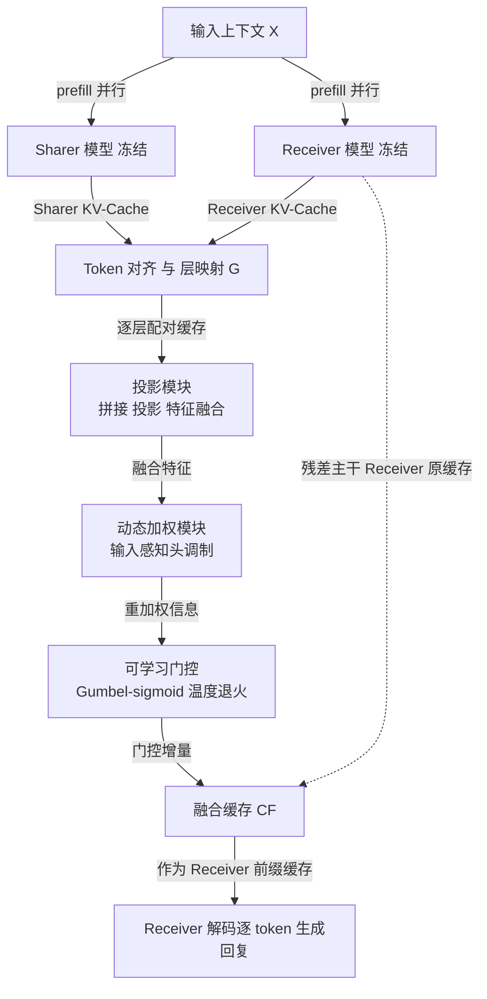

# Cache-to-Cache：大语言模型之间的直接语义通信

> 论文：*Cache-to-Cache: Direct Semantic Communication Between Large Language Models*（ICLR 2026）
> 作者：Tianyu Fu, Zihan Min, Hanling Zhang, Jichao Yan, Guohao Dai, Wanli Ouyang, Yu Wang 等（清华大学 / Infinigence AI / 港中文 / 上交 / 上海 AI Lab）
> 代码：https://github.com/thu-nics/C2C

---

## 0. 摘要翻译

多 LLM 系统能够整合多个各具专长的大语言模型的互补优势，取得单个模型无法达到的性能与效率增益。在现有设计中，LLM 之间通过**文本**进行通信，这迫使模型的内部表示被转换成输出的 token 序列。这一过程既丢失了丰富的语义信息，又带来了逐 token 生成的延迟。受这些局限的驱动，我们提出一个问题：**LLM 能否超越文本进行通信？** Oracle（先验）实验表明，在不增加缓存规模的前提下丰富 KV-Cache 的语义可以提升回复质量，这支持了将 KV-Cache 作为模型间通信的有效媒介。因此，我们提出 **Cache-to-Cache（C2C）**，一种在 LLM 之间进行直接语义通信的新范式。C2C 用一个神经网络将源模型的 KV-Cache 投影并与目标模型的 KV-Cache 融合，从而实现直接的语义迁移；一个可学习的门控机制则负责挑选出真正能从缓存通信中获益的目标层。与文本通信相比，C2C 同时利用了两个模型深层、专门化的语义，又避免了显式的中间文本生成。实验表明，C2C 相比单模型取得了 6.4%–14.2% 的平均准确率提升；相比文本通信范式进一步高出约 3.1%–5.4%，同时在延迟上带来平均 2.5× 的加速。

---

## 1. 方法动机

### a) 作者为什么提出这个方法？

现实中人们越来越多地把多个 LLM 组合成系统来互补长短（有的擅长代码、有的擅长数学、有的擅长视觉理解），无论是**协作式**多智能体系统（多个模型扮演不同角色、互相交换消息）还是**路由式**推理系统（下游模型继承上游模型的上下文再作答）。但所有这些系统当前都建立在同一个底座上——**模型之间用自然语言文本互相沟通**。作者想追问：把内部表示压成一串文字，是不是通信的最优媒介？他们的答案是否定的，于是提出用 KV-Cache 作为更"厚"的通信媒介。

### b) 现有方法（文本通信 T2T）的痛点是什么？

作者明确指出 Text-to-Text（T2T）通信存在三个固有缺陷：

1. **低带宽、信息瓶颈**：文本是低维线性符号串，高维的内部表示必须被反复"压缩成字符串再解压"，过程中一些信号不可恢复。论文用一个 Coder→Writer 协作的例子说明：Coder 想表达 `
` 是"段落分隔符"这一结构语义，但用文字很难无歧义地传达，导致 Writer 把内容放错了位置。
2. **自然语言天生有歧义**：习语、指代不清、含糊表达都会让接收方误解；即便有 MCP、A2A 这类协议试图标准化消息，刚性模板对开放域协作仍然不够灵活。
3. **逐 token 解码的延迟**：每一次交换都要求发送方把上下文解释**逐 token**地串行解码出来，带来显著的时间开销。

作者进一步用两个 Oracle 实验坐实"KV-Cache 值得作为媒介"这一判断（详见 §2 的动机验证）：现有专注于**缓存复用**（如 DroidSpeak、CacheBlend 等）的工作只关心计算效率，且大多限制在**同一模型或结构尺寸完全相同的模型**之间；而本文首次把 KV-Cache 当作**跨模型族、跨尺寸**的语义传输媒介。

### c) 论文的核心假设 / 直觉

一句话概括：**不同 LLM 对同一输入编码出的 KV-Cache 携带了各自专门化、且相互可转换的语义；若能把源模型的 KV-Cache 投影进目标模型的表示空间并融合进去，就能在不生成任何中间文本、几乎无额外解码延迟的情况下，直接把"理解"从一个模型注入另一个模型。**

---

## 2. 方法设计 ★本节最详尽★

### 2.0 端到端 Pipeline 总览

整体流程只在 **prefill 阶段**做一次融合：Sharer 与 Receiver 各自并行地对同一段上下文 $X$ 做 prefill，得到各自的 KV-Cache；经过 token 与层的对齐后，逐层送入 Cache Fuser 融合；融合结果以**残差**方式加回 Receiver 的缓存；此后 Receiver 就像平常一样用这份"被增强过的"缓存去解码作答。注意：Sharer 全程**不解码、不产生一个字**，这正是相比 T2T 省时的根源。

### 2.1 符号表

| 符号 | 含义 | 维度 / 范围 |
|---|---|---|
| $X_{[0:n]}=[x_0,\dots,x_{n-1}]$ | 输入 token 序列 | 长度 $n$ |
| $\mathcal{C}(\cdot)$ | KV-Cache 函数（prefill 后每 token 的键值状态） | — |
| $d$ | 把**所有层**展平成单 token 一个向量后的 KV 维度 | 标量 |
| $\mathcal{C}(X_{[0:n]})=[c_0,\dots,c_{n-1}]$ | 上下文的逐 token KV-Cache | $\in\mathbb{R}^{n\times d}$ |
| $\oplus$ | 序列维度上的拼接 | — |
| $y_i$ | 第 $i$ 步生成的 token | — |
| $\mathcal{P}(\cdot)$ | LLM 的下一 token 预测（概率）函数 | — |
| $E$ | few-shot 示例段；$\lvert E\rvert$ 为其长度 | — |
| $\mathcal{S}$ / Receiver | Sharer（提供理解/知识者）/ Receiver（利用者） | — |
| $\mathcal{F}=\{\mathcal{F}_n\}$ | 一组逐层的 KV-Cache 融合器 | $n=1,\dots,N$ |
| $\mathcal{G}$ | 层映射策略；$\mathcal{G}(n)$ 为 Receiver 第 $n$ 层对应的 Sharer 层 | — |
| $N$ | Receiver 的层数 | 标量 |
| $\mathcal{C}_n(X)$ | Receiver 第 $n$ 层的缓存 | — |
| $\mathcal{C}^{\mathcal{S}}_{\mathcal{G}(n)}(X)$ | Sharer 第 $\mathcal{G}(n)$ 层的缓存 | — |
| $\mathcal{C}^{\mathcal{F}}$ | 融合后的缓存 | — |
| $L_{\min},L_{\max}$ | 较浅 / 较深模型的层数 | 标量 |

### 2.2 前置定义（Preliminaries）

**LLM 推理**分 prefill 与 decode 两阶段。prefill 把整段输入编码出第一个输出 token，并缓存逐 token 的键值状态；decode 则用当前 token 与已缓存的前缀迭代地生成后续 token。基线的解码过程为：

$$y_{i+1}=\mathcal{P}\big(y_i \mid \mathcal{C}(X)\oplus\mathcal{C}(Y_{[0:i]})\big) \tag{1}$$

**通俗解释**：预测下一个词 $y_{i+1}$ 时，模型看的是"输入的缓存 $\mathcal{C}(X)$"拼上"到目前为止已生成部分的缓存 $\mathcal{C}(Y_{[0:i]})$"。C2C 要动的，正是式 (1) 里的 $\mathcal{C}(X)$。

论文把提供上下文理解/知识的模型定义为 **Sharer**，把使用它的模型定义为 **Receiver**。

### 2.3 动机验证：两个 Oracle 实验

在提出方法前，作者先用两个"作弊版"（Oracle）实验证明这条路走得通。

**(1) 缓存增强 Oracle（Cache Enrichment）——回答"能否在不加长序列的情况下提升缓存语义？"**
设置三组对照：Direct（只对问题 $X$ 做 prefill）、Few-shot（对"示例 $E$ + 问题 $X$"做 prefill，缓存更长）、Oracle（同样对 $E\oplus X$ 做 prefill，但**丢弃示例段**、只保留与问题对齐的那一段缓存切片）：

$$\mathcal{C}^{*}(X)=\mathcal{C}_{[\lvert E\rvert:\lvert E\rvert+\lvert X\rvert]}(E\oplus X) \tag{2}$$

**通俗解释**：Oracle 让解码时用的缓存长度与 Direct 完全相同（都只有问题那么长），唯一区别是这段缓存"见过"示例、被 $E$ 熏陶过。结果 Direct 58.42% → Oracle 62.34%，证明**缓存的语义质量可以在不增加缓存长度的前提下被提升**。作者还发现这种增强是**分层异质**的：有的层受益、有的层反而变差；只增强表现最好的 top-5 层，效果甚至略优于增强全部层，而增强最差的层会掉点——这一发现**直接启发了后面 Fuser 里的门控机制**。

**(2) 缓存转换 Oracle（Cache Transformation）——回答"一个模型的缓存能否被另一个模型使用？"**
训练一个 3 层 MLP，把源模型（Qwen3-4B）的 KV-Cache 映射到目标模型（Qwen3-0.6B）的空间（用 MSE 损失对齐，而非下一 token 损失）。T-SNE 可视化显示：两模型的**原始** KV-Cache 在表示空间里相距很远，但经过转换后，映射得到的缓存**落入了目标模型的表示空间之内**，说明不同模型的 KV-Cache **总体上是可转换的**。一个值得注意的现象是：转换后的缓存只覆盖了目标空间的**一个较小子集**，暗示源模型的语义无法完全覆盖目标模型——这也解释了为什么不同模型对同一输入的"答对题集合"只有有限重叠，反映了它们互补的专长。

### 2.4 C2C 范式的形式化

C2C 由一组逐层融合器 $\mathcal{F}$ 与一个层映射策略 $\mathcal{G}$ 构成。prefill 时，第 $n$ 个融合器 $\mathcal{F}_n$ 接收 Receiver 第 $n$ 层缓存 $\mathcal{C}_n(X)$ 与 Sharer 对应的第 $\mathcal{G}(n)$ 层缓存 $\mathcal{C}^{\mathcal{S}}_{\mathcal{G}(n)}(X)$，产出融合缓存：

$$\mathcal{C}^{\mathcal{F}}=\Big\{\,\mathcal{C}_n(X)+\mathcal{F}_n\big(\mathcal{C}_n(X),\,\mathcal{C}^{\mathcal{S}}_{\mathcal{G}(n)}(X)\big)\,\Big\}_{n=1}^{N} \tag{3}$$

**通俗解释**：式 (3) 的关键是那个"$\mathcal{C}_n(X)+$"——融合器输出的是一个**增量**，加回到 Receiver 自己的缓存上（残差式集成），而不是把 Receiver 的缓存替换掉。这样即使融合器一开始没学好，也不会破坏 Receiver 原有的信息。随后解码时把式 (1) 里的 $\mathcal{C}(X)$ 换成 $\mathcal{C}^{\mathcal{F}}(X)$：

$$y_{i+1}=\mathcal{P}\big(y_i \mid \mathcal{C}^{\mathcal{F}}(X)\oplus\mathcal{C}(Y_{[0:i]})\big) \tag{4}$$

### 2.5 Fuser 结构：三个模块（残差集成原则）

为了在**不破坏性覆盖** Receiver 信息的前提下增强它，融合器按"残差集成"设计，含三个关键模块（对应流程图中 PROJ→DW→GATE）：

1. **投影模块（Projection）**：把 Receiver 的 KV-Cache 与 Sharer 的 KV-Cache 沿特征维**拼接**，先过一个投影层，再过一个特征融合层。作用是把两路缓存对齐并混合到同一表示里。
2. **动态加权模块（Dynamic weighting）**：用一个**输入感知的注意力头调制层**，对投影后的信息按输入内容**动态地逐头重加权**。作用是让"注入多少、注入哪些头"随具体样本自适应。
3. **可学习门控（Learnable gate）**：引入**逐层**可训练的门控值，决定该层**要不要**注入 Sharer 的上下文。门控用 **Gumbel-sigmoid + 温度退火**：训练早期温度高、门是可微的软门以便梯度回传，训练后期温度退火使其平滑过渡到推理时的**二值**硬门。作用正是把 §2.3 的发现落地——只在真正受益的层开门。

> 这三层恰好也构成消融的三级阶梯（见 §4）：Project（直接替换）→ +Fuse（残差融合）→ +Gate（加门控）。附录还探索了一个更复杂的变体 **C2C-C**：Sharer 缓存先经一个 3 层 MLP 投影到 Receiver 的维度，再走特征融合与动态加权两条路，性能更强，但正文默认用更简单的 C2C。

### 2.6 模型对齐（跨模型族/尺寸的关键工程）

跨模型融合必须在两个层面对齐：

- **Token 对齐**：不同 tokenizer 对同一输入可能切出不同的 token 序列。做法是把 Receiver 的每个 token 解码成字符串、再用 Sharer 的 tokenizer 重新编码；特殊 token 尽量直接映射；若出现"一对多"（一个 Receiver token 对应多个 Sharer token），采用 **Maximal-coverage（最大覆盖）选择**——挑字符串覆盖最长的那个 Sharer token，以尽量不丢信息。作者观察到"首次出现"与"最大覆盖"两种策略在 80%+ 的序列上结果一致，最终选后者更稳。
- **层对齐**：采用 **Terminal alignment（末端对齐）**——两模型的**最后一层**先对齐，然后倒数第二层对倒数第二层，如此逆序直到较浅模型的第一层。另一备选是 **Depth-normalized（深度归一化）对齐**，把层号归一化到 $[0,1]$ 后取最近邻：

$$j^{\star}=\arg\min_j\left|\frac{i}{L_{\min}-1}-\frac{j}{L_{\max}-1}\right| \tag{5}$$

其中 $i$ 为较浅模型的层号、$j$ 为较深模型的层号。**通俗解释**：末端对齐优先保证深层（通常编码更高级语义）之间的对应；实验里末端对齐更简单且略好，故为默认。

### 2.7 训练方案

- **冻结两个大模型，只训练 C2C 模块**。损失就是标准的**下一 token 预测损失**（类似 SFT），唯一区别是 Receiver 是在**融合后的缓存**、而非自己原本的缓存上去预测回复。
- 三步流程：**(1) Forward**——两模型各自对输入上下文编码出各自 KV-Cache；**(2) Fusion**——C2C 模块融合两路缓存并替换 Receiver 的缓存；**(3) Supervision**——Receiver 用融合缓存对"回复"做 prefill，梯度经 C2C 回传以最小化预测损失。
- 训练成本低：正文用 OpenHermes-2.5 前 50 万条样本训一个 epoch；消融显示**约 300 步（不到 9 GPU 小时）就能达到接近最终 checkpoint 的效果**，且跨模型族训练不引入额外计算开销。

---

## 3. 与其他方法对比

### a) 本质不同在哪里？

现有多 LLM 协作/路由方法的通信都发生在**文本层**：一个模型生成 token、另一个模型把这些 token 当输入吃进去。C2C 的本质区别是把通信搬到了**内部表示层（KV-Cache）**——用神经网络做投影+融合，直接在缓存空间完成语义迁移，全程**不生成中间文本**。

### b) 创新点与贡献度

1. **提出问题并给出肯定回答**："LLM 能否超越文本通信"，并用两个 Oracle 实验论证 KV-Cache 作媒介的可行性（可增强、可转换）。
2. **C2C 范式本身**：残差式的逐层 Cache Fuser（投影/动态加权/可学习门控）+ 跨 tokenizer 的 token 对齐 + 末端层对齐，使得**跨模型族、跨尺寸**的缓存融合首次成为可能。
3. **同时拿下效果与效率**：既比单模型和 T2T 更准，又因为省掉 Sharer 的串行解码而更快（平均 2.5×）。

### c) 什么场景下更适用？

- **弱 Receiver 借强 Sharer**：尤其当 Receiver 是不擅长指令跟随的基座模型时，C2C 能绕开"它读不懂文本指令"的问题（Qwen3-4B-Base 作 Sharer 时 T2T 因啰嗦而极慢，C2C 反而受益）。
- **跨专长互补**：Sharer 与 Receiver 各有所长（代码/数学/通用）时，C2C 能把互补理解注入进来。
- **长上下文 / 低延迟需求**：省掉逐 token 通信，序列越长、Sharer 输出越啰嗦时优势越明显。
- **隐私敏感协作（未来方向）**：只传 KV-Cache 段而不暴露显式文本。

### d) 方法对比总结表

| 方法 | 通信媒介 | 优点 | 缺点 / 局限 | C2C 的改进点 |
|---|---|---|---|---|
| **T2T 文本通信**（Chain-of-Agents、MetaGPT、辩论等） | 显式文本 | 通用、可解释、即插即用 | 低带宽丢语义、有歧义、逐 token 串行慢 | 改到缓存层通信，保语义且并行 |
| **Query-level 路由**（RouteLLM 等） | 不通信，只选模型 | 实现简单、省算力 | 上限被"两模型中较好的那个"卡死，无法融合 | 融合而非二选一，可超越单模型上限 |
| **同模型缓存复用/共享**（DroidSpeak、CacheBlend、YOCO、跨层共享等） | KV-Cache（同模型/同结构） | 加速推理、省重复计算 | 仅限单模型或结构尺寸相同的模型，非为"语义传输"设计 | 支持跨模型族、跨尺寸的**语义**融合 |
| **Cache-to-Cache（本文）** | KV-Cache（跨模型） | 保留双方深层语义、无中间文本、低延迟、准确率更高 | 弱 Sharer 会引入噪声；扩展到 $N$ 模型成本仍是开放问题 | —— |

---

## 4. 实验表现与优势

### a) 如何验证有效性（实验设计）

- **模型**：横跨 Qwen2.5、Qwen3、Llama3.2、Gemma3，覆盖不同代际、不同族、不同尺寸（0.6B–14B）、不同专长（通用/代码/数学）、不同训练阶段（基座/指令微调）。消融与诊断分析中固定 Receiver 与 Sharer 均为 Qwen3 系列以隔离混杂因素。
- **基线**：T2T（"先分析要点再作答"的交接式协作）、Query-level 路由、以及单模型（Sharer / Receiver 各自单独，作为下界）。
- **基准**：OpenBookQA、MMLU-Redux、ARC-Challenge、C-Eval，覆盖推理/知识/科学/中文四类域。零样本、贪心解码以保证可复现；效率用单张 A100、batch=1 的平均推理时间衡量。

### b) 关键数据与结论

**主结果（Receiver 固定 Qwen3-0.6B，Table 4）**：C2C 在所有设置上一致提升 Receiver。以 Qwen2.5-0.5B 作 Sharer 为例，四个基准上 C2C vs T2T vs 单 Receiver 分别为——MMLU-Redux 42.92 / 41.03 / 35.53，OpenBookQA 52.60 / 44.00 / 39.20，ARC-C 54.52 / 49.48 / 41.04，C-Eval 41.77 / 35.88 / 32.04。

- 相比单 Receiver，三个 Sharer 上的**平均准确率提升 11.00% / 9.64% / 11.88%**。
- 相比 T2T，**平均再高 5.36% / 4.15% / 3.06%**。
- **效率**：相比 T2T 加速 **3.46× / 1.51× / 14.41×**。

**效率拆解（Table 3）**：T2T 需要 Sharer 串行解码 80 个输出 token、单是解码就 1312ms；C2C 用一次**并行缓存融合仅 90ms** 取而代之。总时延 T2T 1596ms vs C2C 445ms。

**消融——性能增益来自哪（Table 6）**：Single（不用 Sharer、直接全量微调 Receiver）、Identical（Sharer=Receiver 同一个模型）、C2C（用不同模型）三者对比中，C2C 一致更高，说明增益**不是**单纯来自"多了可训练参数/过拟合训练集"，而是来自异质 Sharer 带来的互补理解；有趣的是 Identical 仍优于 Single，说明**缓存级的"自我通信"本身也能提供有用的辅助理解**（呼应 latent reasoning / looped transformer 的观察）。

**消融——Fuser 结构（Table 8）**：Project（直接用投影后的 Sharer 缓存替换 Receiver 缓存）平均仅 20.70% → **+Fuse**（残差融合双方缓存）跃升到 44.88%（**+24.18%**）→ **+Gate**（加逐层可学习门控，即完整 C2C）再到 47.95%（**+3.07%**）。这条阶梯定量证明了"残差 + 门控"两处设计各自的价值。

**语义确实变丰富了（Table 2，有效秩分析）**：融合后 Key 缓存的平均有效秩从 388 升到 395、Value 从 532 升到 560，说明 C2C 把 Sharer 的表示成功注入、扩展了 Receiver 缓存的语义空间。

### c) 优势最明显的场景（具体证据）

- **强 Sharer 带弱 Receiver（Table 11）**：Qwen3-4B 作 Sharer、Qwen3-0.6B 作 Receiver，在 LongBenchV1 各长度段 C2C 全面优于 T2T 与单 Receiver，平均对"弱→强差距"恢复了 **51.01% 的 PGR**。
- **能力差距大时更能吸收强模型理解**：在 Sharer 能答对的题里，disparate 情形下 C2C 也答对 **72.11%**，明显高于 comparable 情形的 50.97%。
- **不同模型组合 / 角色互换（Table 7）**：五种异质组合上 C2C 平均比 T2T 高 **8.59%**（MMLU-Redux）；互换 Sharer/Receiver 角色后，C2C 仍带来 **+5.05%**，而 T2T 反而 **−6.30%**，显示 C2C 更鲁棒。
- **扩展到多 Sharer（Table 13）**：两个 Sharer（Qwen3-4B-Base 与 Qwen2.5-1.5B-Math）同时向一个 Receiver 传缓存，准确率从单 Receiver 的 35.53 提升到 **64.60**，且无需额外训练。
- **融入 Agentic 工作流（Table 15，GSM8K）**：单模型 41.17 → 多智能体 T2T 流 61.18 → C2C 62.55 → **T-C2C 78.01**（让"数学解释器"生成解释、并对问题与解释都用 C2C）。

### d) 局限性（论文明确或隐含承认）

1. **弱 Sharer 会拖累强 Receiver**：当 Sharer 明显更弱、传入噪声信息时会导致掉点——这是 T2T 与 C2C **共有**的问题，因为 Sharer 的语义质量直接决定 Receiver 表现。论文给了一个会计题的失败案例：Qwen3-0.6B 本可答对，但融入 Qwen2.5-0.5B 的错误理解后反而答错。
2. **多模型扩展的训练成本**：成对（pairwise）通信已被证明可行且有效，但要扩展到 $N$ 个模型互通、把训练成本控制在 $O(N)$ 仍是开放问题。论文给了初步方案（附录 A.5.2）：用 $M$ 个投影器把各 Sharer 缓存投到统一潜空间、再用 $N$ 个融合器分别注入各 Receiver，从而把 $O(N^2)$ 的通信路降到 $O(N)$，但仍是初步探索。
3. **源缓存无法完全覆盖目标空间**：转换 Oracle 显示映射后的缓存只占目标表示空间的一个子集，意味着 Sharer 的语义无法 100% 覆盖 Receiver（既是局限，也正是互补性的来源）。

---

## 5. 在项目框架中的坐标（"多模态 LatentMAS 探索"）

> 本项目当前尚无其他论文总结可供横向对比，以下定位为基于本篇内容与项目主题的**推断**，非原文结论。

- **维度归属**：本文属于"**潜空间多智能体通信（Latent-space MAS communication）**"这一维度——把多智能体系统里原本的"文本消息总线"替换成"KV-Cache 语义总线"。它是该方向目前少有的、能**跨模型族/跨尺寸**落地的 pairwise 基础件。
- **与"多模态"的接口**：本文只做了**文本模态**的缓存通信，但其论文的 Future Work 明确点名了**跨模态协作**（在 VLM、VLA 之间融合缓存）。若项目要走"多模态 LatentMAS"，C2C 的 Fuser + 对齐机制正是可被复用/扩展的骨架，而其"源缓存只覆盖目标子空间""弱 Sharer 引噪"两条结论会是跨模态时需要重点验证的边界。
- **与相邻工作的边界**：与 DroidSpeak / CacheBlend 等**同模型缓存复用**工作机制不同——那些赌的是"计算冗余可省"，本文赌的是"**跨模型的专门化语义可转换、可注入**"，核心假设与误差性质都不一样。

---

*备注：文中所有 41.77、52.60、8.59%、2.5× 等数值均取自原文表格/正文；凡属"实证观察"（如各层受益异质、有效秩上升、门控在通用 vs 任务专用训练下的稀疏度差异）已与"数学可推导"结论区分表述，未将实验现象写成定理。*
