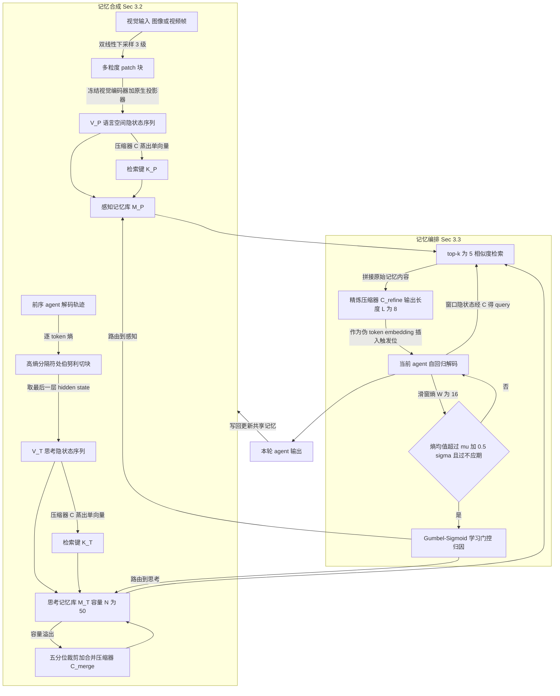

# L²-VMAS《Dual Latent Memory for Visual Multi-agent System》方法深度分析

> **元信息**（来源：[arXiv:2602.00471](https://arxiv.org/abs/2602.00471) abs 页 + [HTML v2](https://arxiv.org/html/2602.00471v2) 正文 + 作者主页 <https://xlyu0106.github.io/>）
> - 作者：Xinlei Yu, Chengming Xu, Zhangquan Chen, Bo Yin, Cheng Yang, Yongbo He, Yihao Hu, Jiangning Zhang, Cheng Tan, Xiaobin Hu, Shuicheng Yan
> - 版本：v1 2026-01-31 / v2 2026-06-05（LaTeXML 生成时间戳 2026-06-05）
> - venue：**ICML 2026 已接收**（正文页脚标记 "Machine Learning, ICML"；作者主页标注 "Accepted 04/2026"）
> - 一作单位：NUS@LV-Lab 研究助理，即将入学 CUHK@MMLab（来源：作者主页）
> - 致谢基金：NSFC 62320106007 + NUS A-0010106-00-00 等（论文致谢节）
> - **代码：无公开实现**（详见 §5）

---

## 0. 摘要翻译

> 尽管视觉多智能体系统（Visual Multi-Agent Systems, VMAS）承诺通过智能体间协作来增强综合能力，实证证据却揭示了一堵反直觉的「扩展墙」（scaling wall）：增加智能体轮次往往会**降低**性能，同时使 token 开销指数级膨胀。我们把这一失败归因于以文本为中心的通信范式所固有的信息瓶颈——将感知轨迹与思考轨迹转换为离散自然语言的过程不可避免地引入语义损失。为此，我们提出 L²-VMAS，一个新颖的、模型无关（model-agnostic）的框架，它以双潜在记忆（dual latent memories）实现智能体间协作。此外，我们在动态合成双潜在记忆的同时，将感知与思考解耦。另外，我们引入了一种熵驱动的主动触发机制（entropy-driven proactive triggering），以高效的按需记忆访问取代被动的信息传递。跨骨干网络、模型尺寸与多智能体结构的大量实验表明，我们的方法有效突破了「扩展墙」，具备卓越的可扩展性，在平均准确率上提升 2.7–5.4%，同时将 token 用量降低 21.3–44.8%。

**⚠️ 读者必须先知道的一点（我的核算，非论文原话）**：摘要里的「2.7–5.4%」是**相对提升百分比**，不是绝对准确率点数。核对主表：GLM 66.6→69.5（+2.9 点，2.9/66.6 = 4.35% → 报 +4.3%），InternVL 68.0→69.8（+1.8 点 → 报 +2.7%），Qwen3-VL-8B-Thinking 72.5→76.5（+4.0 点 → 报 +5.4%）。**绝对增益只有 1.8–4.0 个点。** 同理 token 的「−21.3~−44.8%」只相对文本 VMAS，相对**单智能体**其实仍贵约 5 倍（Qwen3-VL-8B-Thinking：单 agent 645 tokens → L²-VMAS 3473 tokens）。

---

## 1. 方法动机

### a) 作者为什么提出

论文的出发点是一个可量化的负面现象，而不是「latent 更优雅」这类审美论证。作者在 MMBench + Qwen3-VL-8B-Thinking 上把智能体轮次 $N_A$ 从 1 扫到 10（§2.1），观察到：

- 准确率在**第 3 轮**达到峰值 84.8 → 86.6（相对提升仅 2.1%），随后持续衰减，**第 6 轮起跌破单智能体基线**，第 10 轮低于单智能体 2.6%。（论文原文 §2.1）
- token 总用量从单智能体的 557 涨到第 5 轮 5,241、第 10 轮 16,840，分别是 9 倍和 **30 倍**。（论文原文 §2.1）

作者把这个 accuracy-cost 联合恶化命名为 VMAS 的「scaling wall」，并以此作为全文的立论根基。

### b) 现有方法的具体痛点（论文自己拆成三条）

论文 §3.1 "Motivation" 明确列了三条，每条对应一个设计模块：

1. **Efficiency（效率）**：智能体间用自然语言传信息本身既低效又有损，且会把感知与思考**非结构化地混在一起**。→ 对应设计「双潜在记忆解耦」。
2. **Proactivity（主动性）**：现有传输是**刚性触发**的——下游智能体在开始工作前被动接收前驱的全部输出，无法在推理中途按需调取。→ 对应设计「熵触发主动调用」。
3. **Scalability（可扩展性）**：通信开销随轮次指数上涨。→ 对应设计「动态记忆合成 + 容量上限 + 淘汰合并」。

第二个更硬的证据是 §2.1 的「传输内容消融」：作者用 GPT-5.1 把每个 agent 的原始输出结构化切成 PERCEPTION / THINKING / CONCLUSION 三段（prompt 全文见附录 B.1），构造四种传输变体：

| 变体 | 传什么 | 结果（论文 §2.1） |
|---|---|---|
| Conclusion-only | 只传最终结论 | 各轮稳定提升 0.5%–1.1% |
| Perception | 感知观察 + 结论 | 优于 Full-content |
| Thinking | 思考轨迹 + 结论 | 优于 Full-content |
| **Full-content** | 完整无过滤输出（现有 VMAS 默认） | 第 2 轮仅 +0.7%，**第 10 轮净损 3.8%**，四者中最差 |

结论：**传得越全越差**。这直接证伪了「多传信息 = 更好协作」的朴素假设，也是「感知/思考必须解耦」这一设计的实证依据。

### c) 研究假设 / 直觉

一句话：**把智能体间通信从「离散文本」换成「连续潜在向量」，并且把感知记忆与思考记忆物理分开、只在模型自己觉得不确定的时候才去取**，就能同时打破准确率天花板和 token 爆炸。

---

## 2. 方法设计 ★

### 2.0 总流程图

### 2.1 符号表

| 符号 | 含义 | 形状 / 取值 |
|---|---|---|
| $\mathcal{S_A}=\{\mathcal{A}_1,\dots,\mathcal{A}_{N_A}\}$ | 智能体集合 | $N_A$ = 智能体轮次数 |
| $\mathcal{G}=(\mathcal{S_A},\mathcal{S_E})$ | 有向拓扑图，$\mathcal{S_E}$ 为有向边集 | 6 种结构 |
| $\mathcal{S}_i$ | 第 $i$ 个 agent 的**操作状态**：系统提示 + 前驱累积的**文本传输上下文** + 自身历史状态 | 文本 |
| $\mathcal{O}_i$ / $\mathcal{T}_n$ | agent 输出 / 分配的任务（文本 query + 视觉输入） | — |
| $\mathcal{M}=\{\mathcal{M}^P,\mathcal{M}^T\}$ | 双潜在记忆系统 | 全局共享 |
| $\mathbf{u}^{P/T}=(\mathbf{K},\mathbf{V}^{P/T})$ | 一个记忆单元 | — |
| $\mathbf{K}$ | **检索键**（信息摘要向量） | $\mathbb{R}^{d_{model}}$ |
| $\mathbf{V}^{P}$ / $\mathbf{V}^{T}$ | 感知 / 思考记忆**值** | $\mathbb{R}^{l\times d_{model}}$，$l$ 动态长度 |
| $d_{model}$ / $d_v$ / $d_l$ | 语言模型隐维 / 视觉特征维 / 语言嵌入维 | — |
| $\mathcal{C},\mathcal{C}_{merge},\mathcal{C}_{refine}$ | 压缩器 / 合并压缩器 / 精炼压缩器 | 同构轻量 transformer |
| $g$ | 视觉粒度层级数 | 3（局部/区域/全局） |
| $down_i(\cdot)$ | 双线性下采样到原空间尺寸的 $1/2^i$ | — |
| $\phi(\cdot)$ | 视觉编码 + 对齐 | — |
| $\mathbf{W}_p,\mathbf{b}_p$ | VLM **原生冻结投影器** | $\mathbb{R}^{d_l\times d_v}$, $\mathbb{R}^{d_l}$ |
| $l_i$ | 第 $i$ 粒度的 token 数，$l_i=2^{g-2i+1}$ | $g{=}3$ 时为 16, 4, 1 |
| $\mathbf{H}_i$ | 第 $i$ 步生成熵 | 标量 |
| $\mathcal{V}$ / $\iota$ | 词表 / 解码温度 | — |
| $S_d$ | 分隔符 token 集合 | 论文未给具体集合 |
| $\pi_i$ / $\operatorname{B}(\cdot)$ | 切块伯努利参数 / 伯努利采样 | $\pi_i\in[0,1]$ |
| $\mathbf{r}$ / $\mathbf{s}$ | 记忆单元触发率 / 全局语义相似度 | 标量 |
| $N$ | 思考记忆库最大容量 | 50 |
| $W$ / $\lambda$ | 熵滑窗长度 / 阈值缩放因子 | 16 / 0.5 |
| $\mu_i,\sigma_i$ | 第 $i{-}W{+}1$ 到 $i$ 步熵的均值与标准差 | 标量 |
| $\bar H_i$ | 第 $i{-}2W{+}1$ 到 $i$ 步的**平均熵**（更平滑） | 标量 |
| $i_{\text{last}}$ | 上次触发步 | — |
| $L$ | 注入的最终记忆序列长度 | 8 |
| top-$k$ | 检索单元数 | 5 |
| $a_t,p_t,\gamma_t,\tilde z_t,\tau$ | 门控 logit / 概率 / logistic 噪声 / 松弛门值 / 温度 | — |
| $S_{compress},S_{target},M_c$ | 待压缩序列 / 可学习目标 token / 压缩器注意力掩码 | $\mathbb{R}^{x\times d_{model}}$, $\mathbb{R}^{y\times d_{model}}$ |

> **符号冲突（论文自身缺陷）**：$\lambda$ 被用了两次——Eq.8 的熵阈值缩放因子（=0.5）与 Eq.20 温度退火的衰减底数（$0<\lambda<1$）。另外**论文里有两个 Equation (6)**（切块伯努利式与全局相似度式编号重复）；Eq.16 的下标 $i$ 与 $t$ 混用。这些是排版错误，不影响方法本身，但复现时要注意别读串。

### 2.2 顶层建模（§3.1）

L²-VMAS 是挂在既有 VMAS 上的**外接系统**，所有 base agent **全程冻结**：

$$\left\{\mathcal{S}_{1},\mathcal{O}_{1},\dots,\mathcal{S}_{n-1},\mathcal{O}_{n-1}\right\}\rightarrow\mathcal{M} \tag{1}$$

$$\left\{\mathcal{A}_{n},\mathcal{M},\mathcal{S}_{n},\mathcal{T}_{n}\right\}\rightarrow\mathcal{O}_{n} \tag{2}$$

**通俗解释**：Eq.1 是「写」——前面所有 agent 的状态和输出都往共享记忆里写。Eq.2 是「读」——当前 agent 拿着任务、自己的状态、以及全局记忆去生成输出。

> **⚠️ 关键歧义（我的推断，论文未明说）**：Eq.2 里 $\mathcal{S}_n$ 的定义**仍然包含**「accumulated inter-agent transmissive contexts from predecessor agents」，也就是说**文本传输并没有被完全取消**。论文全篇没有一处说明 L²-VMAS 下 agent 之间到底还传不传文本、传多少。这与「token 只降 21–45%（而不是 90%+）」是自洽的——如果文本通道被完全切断，token 应该会降到接近单智能体水平。我的推断是：文本通道被压缩成 conclusion-only 或类似的短摘要，细粒度信息走 latent 记忆。**这是全文最大的未说明点，任何试图复现的人第一件事就得把这个补上。**

### 2.3 记忆合成（§3.2）—— 核心问题：value 到底存什么张量？

**先给结论（这是读者最关心的第 1 个问题）：存的是「hidden state 序列 + 一个当检索键用的压缩向量」，不是 attention 的 key/value 张量。** 论文用 "key-value pairs" 这个词指的是**字典意义上的键值对**，与 KV cache 毫无关系。证据链如下：

1. **形状证据**：Eq.3 之后明确写 $\mathbf{K}\in\mathbb{R}^{d_{model}}$（**单个**向量），$\mathbf{V}^{P/T}\in\mathbb{R}^{l\times d_{model}}$（**一层**、$l$ 个位置的序列）。真正的逐层 KV 应该是 $\mathbb{R}^{n_{layer}\times 2\times n_{head}\times l\times d_{head}}$ 量级。论文里既没有层维度，也没有 head 维度。
2. **来源证据**：$\mathbf{V}^T$ 明写是「extract the hidden state sequence $\{\mathbf{h}_i^T,\dots,\mathbf{h}_j^T\}$」（§3.2）；$\mathbf{V}^P$ 明写是视觉编码器输出经**原生投影器**映射后的语言空间特征（附录 C.2 Eq.13-14）。两者都是 hidden state。
3. **消费证据**：Eq.9 输出 $\mathbf{M}^{P/T}\in\mathbb{R}^{L\times d_{model}}$，然后「seamlessly inserted at the triggering position, and the autoregressive decoding process resumes」——即当作 $L$ 个伪 token 的 embedding 插进解码序列，**走一次完整前向自己产生 KV**。
4. **同作者代码旁证**（推断性佐证，见 §5.3）：同一作者的 VisMem 公开实现里，记忆就是 `self.base_model(inputs_embeds=M, past_key_values=past, ...)` 注入的（`/home/yilin/tmp/mm-latent-repos/VisMem/main/model/model.py:261-267`）。

**这与 LatentMAS 是完全不同的机制**：LatentMAS 是逐层 `past_key_values` 直接前置拼接（不清空 cache），L²-VMAS 是 **embedding 层伪 token 注入**。前者跳过了整个前向、直接改注意力上下文；后者要重新走一遍 $n_{layer}$ 层前向。

#### 2.3.1 检索键的生成

$$\mathbf{K}=\mathcal{C}\left(\mathbf{V}^{P/T}\right) \tag{3}$$

**通俗解释**：把一整段记忆内容（长度 $l$ 的向量序列）压成一个向量，专门用来做相似度检索。

压缩器 $\mathcal{C}$ 的具体结构（附录 C.1）：把待压缩序列 $S_{compress}\in\mathbb{R}^{x\times d_{model}}$ 与一段**可学习 token** $S_{target}\in\mathbb{R}^{y\times d_{model}}$ 拼成 $z=[S_{compress};S_{target}]$，喂进多层 transformer：

$$\begin{aligned}
\operatorname{SA}_{\mathcal{C}}(z^{\ell-1})&=\operatorname{SM}\!\Bigg(\frac{(z^{\ell-1}W_{q})(z^{\ell-1}W_{k})^{\top}}{\sqrt{d_{k}}}+M_{c}\Bigg)(z^{\ell-1}W_{v}) \\
z^{\ell}&=\operatorname{FF}\Big(\operatorname{LN}\big(z^{\ell-1}+\operatorname{SA}_{\mathcal{C}}(\operatorname{LN}(z^{\ell-1}))\big)\Big)+z^{\ell-1}
\end{aligned} \tag{10,11}$$

$$(M_{c})_{ij}=\begin{cases}-C,&i\in\{1,\dots,x\},\ j\in\{x+1,\dots,x+y\}\\0,&\text{otherwise}\end{cases} \tag{12}$$

**通俗解释**：这是一个「可学习 query token 吸信息」的经典设计（Perceiver / Q-Former 家族）。掩码 $M_c$ 保证**内容 token 看不见 query token，但 query token 能看见全部内容**，从而防止信息从 query 反流进内容表示。最后取 $S_{target}$ 位置的输出作为压缩结果。三个压缩器 $\mathcal{C},\mathcal{C}_{merge},\mathcal{C}_{refine}$ **结构完全相同，只是权重不同**。

#### 2.3.2 感知记忆 $\mathcal{M}^P$：多粒度视觉

$$\left[\mathbf{X}_{0},\dots,\mathbf{X}_{g-1}\right]=\left\{down_{i}\left(\mathbf{X}_{0}\right)\right\}_{i=0}^{g-1} \tag{4}$$

$$\left\{\mathbf{h}^{\mathbf{X}_{i}}_{1},\dots,\mathbf{h}^{\mathbf{X}_{i}}_{l_{i}}\right\}_{i=0}^{g-1}=\left\{\phi\left(\mathbf{X}_{i}\right)\right\}_{i=0}^{g-1} \tag{5}$$

$$\tilde{\mathbf{h}}^{X_{i}}_{t}=\mathbf{W}_{p}\,\mathbf{h}^{X_{i}}_{t}+\mathbf{b}_{p} \tag{13}$$

$$\mathbf{V}^{P}=\operatorname{concat}\Big(\tilde{\mathbf{h}}^{X_{0}},\tilde{\mathbf{h}}^{X_{1}},\dots,\tilde{\mathbf{h}}^{X_{g-1}}\Big) \tag{14}$$

**通俗解释**：把原图切成 patch block（每块是 VLM 原生 patch 尺寸的 $2^g$ 倍），每块做 $g=3$ 级双线性下采样得到「局部→区域→全局」三份视图，**用 VLM 自带的视觉编码器**逐份编码，再**用 VLM 自带的、冻结的投影器** $\mathbf{W}_p$ 打进语言空间，最后按粒度拼起来。$g=3$ 时每块产生 $16+4+1=21$ 个向量。

**⚠️ 这一步是整篇论文对多模态 latent MAS 最重要的技术贡献，也正好回答了读者最关心的理论断点**：LatentMAS 的 $W_a=(W_{out}^\top W_{out}+\lambda I)^{-1}W_{out}^\top W_{in}$ 只对文本词表成立，因为 $W_{in}$ 是 token 嵌入表。L²-VMAS **根本不需要 $W_a$**——视觉内容走 VLM 原生的 `vision_encoder → projector` 通路，天生就落在语言嵌入空间里；文本思考内容则靠**训练出来的** $\mathcal{C}_{refine}$ 隐式学对齐。代价是：**丧失了 training-free 属性**。

感知记忆在**第一个 agent 之前就初始化**，只在有新视觉内容输入时扩展（论文明说「visual encoding is computationally intensive」）。

#### 2.3.3 思考记忆 $\mathcal{M}^T$：熵切块

$$\operatorname{B}(\pi_{i}),\quad \pi_{i}=\begin{cases}0,&t_{i}\notin S_{d},\\[4pt]\operatorname{clip}\!\left(\dfrac{\mathbf{H}_{i}}{\log|\mathcal{V}|},\,0,\,1\right),&t_{i}\in S_{d},\end{cases} \tag{6a}$$

其中熵定义为：

$$\mathbf{H}_{i}=-\sum_{j=1}^{|\mathcal{V}|}\mathbf{p}_{i,j}\log \mathbf{p}_{i,j},\qquad \mathbf{p}_{i}=\pi\!\left(\cdot\mid\mathbf{z}_{<t},\mathcal{T}\right)=\mathrm{Softmax}\!\left(\frac{\mathbf{z}_{t}}{\iota}\right) \tag{15,16}$$

**通俗解释**：只在生成到**分隔符 token**（如句号、换行等，具体集合论文未给）时才考虑切块；切不切是**随机的**——把该位置的生成熵除以 $\log|\mathcal{V}|$ 归一到 $[0,1]$ 当伯努利概率去掷一次硬币。熵越高（模型越犹豫 → 越可能是语义边界）越容易切。两次切点之间的 hidden state 序列就是一个 $\mathbf{V}^T$。

> 数学上可推导的部分：$\mathbf{H}_i\in[0,\log|\mathcal{V}|]$ 所以归一化后必落在 $[0,1]$，clip 只是数值保险。
> **实证观察**（论文引 Yu et al. 2026 / Hu et al. 2026 / Yin et al. 2025 / Dong et al. 2025）：语言模型在语义边界处熵升高。这是**引用的实证结论，不是定理**。

#### 2.3.4 容量管理：五分位裁剪 + 合并

思考记忆有硬容量 $N=50$。溢出时：

$$\mathbf{s}=\frac{1}{m-1}\sum_{t=1,t\neq i}^{m}\operatorname{sim}\left(\mathbf{K}_{i}^{T},\mathbf{K}_{t}^{T}\right) \tag{6b}$$

$$\mathbf{V}^{T}_{new}=\mathcal{C}_{merge}\!\left(\operatorname{concat}\left(\left[\mathbf{V}^{T}_{base};\left\{\mathbf{V}^{T}_{i}\right\}_{i=1}^{n}\right]\right)\right) \tag{7}$$

流程（论文 §3.2）：
1. 定义**触发率** $\mathbf{r}$ = 该单元被检索命中次数 / 入库以来全系统总触发次数；**全局语义相似度** $\mathbf{s}$ = 该单元的键与库内其余所有键的平均相似度。
2. 按 $\mathbf{r}$ 把全库等分为 5 个分位集合 Set1（最低触发率）～ Set5（最高）。
3. **删**：Set5 中 $\mathbf{s}$ 低于全库均值者被删除。
4. **并**：Set1 作为合并基底 $\mathbf{V}^T_{base}$；Set4 中 $\mathbf{s}$ 低于均值者，找到基底集里最相似的伙伴，用 $\mathcal{C}_{merge}$ 融成一条（长度不膨胀），更新其 $\mathbf{K}$ 后重新入库。

> **⚠️ 逻辑可疑之处（我的判断）**：第 3 步删的是**触发率最高**（Set5）且语义独特（$\mathbf{s}$ 低）的单元——这与直觉相反：高频命中的独特记忆恰恰应该保留。第 4 步又把**触发率最低**的 Set1 当作合并基底保留下来。除非「Set 1 到 Set 5」的排序是降序（论文写的是 "ordered by their triggering rate r, denoted sequentially as Set 1 to Set 5"，字面读是升序），否则这个策略在语义上说不通。论文没有对此做任何解释或消融。复现时这是必须向作者确认的点。

### 2.4 记忆编排（§3.3）—— 熵驱动主动触发

四阶段工作流：**触发（triggering）→ 归因（attribution）→ 生成（generation）→ 注入（injection）**。

#### 2.4.1 触发：在什么上算熵、阈值怎么定（读者关心的第 2 个问题）

$$\operatorname{Trigger}(i)\Longleftrightarrow\left(\bar{H}_{i}>\mu_{i}+\lambda\sigma_{i}\right)\wedge\left(i-i_{\text{last}}\geq W\right) \tag{8}$$

**逐项拆解**：
- **熵算在什么上**：仍是 Eq.15/16，即**当前 agent 自己解码时、每一步 next-token 在全词表上的 softmax 分布的香农熵**。不是视觉上的熵，不是注意力熵，不是记忆的熵。这意味着**必须能拿到完整 logits**（推断：闭源 API 后端做不了；vLLM 需要自定义 logits processor）。
- **阈值怎么定**：**不是固定常数，而是自适应 z-score**。$\mu_i,\sigma_i$ 取最近 $W=16$ 步熵序列的均值与标准差，$\bar H_i$ 取最近 $2W=32$ 步的平均熵（更平滑）。当短窗平均熵超出「局部均值 + $\lambda$ 倍局部标准差」时触发。$\lambda=0.5$ 是**人工超参**，通过 Table 8 扫参选出（0.3/0.4/0.5/0.6/0.7 → 平均 72.6/74.0/**74.1**/73.4/71.6），**不是学出来的**。
- **不应期**：$i-i_{\text{last}}\geq W$ 强制两次触发间隔至少 16 步，防止高熵区连续狂调记忆。

**通俗解释**：模型自己「犹豫得比它最近的平均水平还明显」时，就停下来去查记忆。因为阈值是相对于局部分布定的，所以它对不同任务、不同 backbone 的绝对熵水平自动免疫。

与 Eq.6a 的切块相比：**切块只能发生在分隔符处（句子边界），触发可以发生在生成的任意位置**——论文把这解释为「人类式认知范式：记忆检索在思考过程中随时发生」。

#### 2.4.2 归因：门控怎么学（读者关心的第 2 个问题下半）

触发后取滑窗内的 hidden state $\{\mathbf{h}^T_{i-W+1},\dots,\mathbf{h}^T_i\}$，同时充当「归因线索」与「查询」。路由用 Gumbel-Sigmoid：

$$a_{t}=g_{\phi}(\mathbf{H}_{t}),\qquad p_{t}=\mathrm{Sigmoid}(a_{t}) \tag{17}$$
$$u_{t}\sim\mathrm{Uniform}(0,1),\qquad \gamma_{t}=\log u_{t}-\log(1-u_{t}) \tag{18}$$
$$\tilde z_{t}=\mathrm{Sigmoid}\!\left(\frac{a_{t}+\gamma_{t}}{\tau}\right)\in(0,1) \tag{19}$$
$$\tau(e)=\max\big(\tau_{\min},\ \tau_{0}\cdot\lambda^{\,e}\big),\qquad 0<\lambda<1 \tag{20}$$

**通俗解释**：一个小网络看着最近 16 步的隐状态，输出一个标量 logit 决定「这次该查感知记忆还是思考记忆」。因为硬二值选择不可导，训练时加 logistic 噪声 + 温度 $\tau$ 做连续松弛（Gumbel-Sigmoid）；温度随训练步 $e$ 指数退火，前期软（利于探索、梯度稳），后期硬（逼近真二值）。推理时直接对 $\tilde z_t$ 卡阈值得到确定性决策。

**门控由 Stage II / III 的 PPO 训练**，奖励信号就是任务准确率（见 §2.5）。$\tau_0,\tau_{\min}$ 的具体数值论文**没给**。

> **⚠️ 一个说不通的细节**：Eq.17 写 $a_t = g_\phi(\mathbf{H}_t)$，但 $\mathbf{H}$ 在 Eq.15 里被定义为**熵**（标量）。而正文说门控网络「aggregates this window」（隐状态窗口）。两处符号打架。我的推断是 $\mathbf{H}_t$ 这里指隐状态窗口矩阵，是符号复用错误。

#### 2.4.3 生成与注入

$$\mathbf{M}^{P/T}=\mathcal{C}_{refine}\!\left(\operatorname{concat}\left(\left\{\mathbf{V}^{P/T}_{i}\right\}_{i=1}^{k}\right)\right) \tag{9}$$

流程：复用压缩器 $\mathcal{C}$ 把滑窗隐状态蒸成一个 query 向量 → 在目标记忆库里做 top-$k$（$k=5$）相似度检索 → 把 5 个单元的 $\mathbf{V}$ 全部拼起来 → 过 $\mathcal{C}_{refine}$ 压成定长 $L=8$ 的序列 → **插到触发位置，继续自回归解码**。

**通俗解释**：检索到的 5 段记忆可能长短不一、语义不一致，$\mathcal{C}_{refine}$ 的作用是把它们熔成 8 个「记忆 token」，既保证长度可控（不炸 context），又保证注入的向量和模型当前的表示空间兼容。

### 2.5 训练配方（§3.4 + 附录 C.5）—— 读者关心的第 3 个问题

**backbone 全程冻结**（三个阶段的 Table 4 里 VLM 那行全是 `-`）。视觉投影器 $\mathbf{W}_p$ 也冻结（附录 C.2 明说 "kept frozen during our training", "without adding any new trainable alignment parameters"）。**只训 4 个外挂模块**：$\mathcal{C}$、$\mathcal{C}_{merge}$、$\mathcal{C}_{refine}$、门控 $\sigma$。

算法：**PPO**（Schulman et al. 2017）。奖励：论文只有一句「the reward signal is primarily tied to the accuracy」——**没有给奖励函数公式，没有说是否有 KL 惩罚项之外的形状项**。这是复现的一大缺口。

| 阶段 | 解锁模块 | 触发方式 | 目的 | steps | lr | clip $\epsilon$ | gae_$\lambda$ |
|---|---|---|---|---|---|---|---|
| **Stage I** | $\mathcal{C}$, $\mathcal{C}_{merge}$ | **随机触发**（不用熵） | 学「怎么把轨迹编码成可检索的记忆」，强制高频读写以增强编码鲁棒性 | 100k | 1e-4 | 0.2 | 0.95 |
| **Stage II** | $\mathcal{C}$, $\mathcal{C}_{refine}$, $\sigma$（合成端**冻结**） | 熵触发 | 学「什么时候、取哪种记忆」，稳住记忆库分布防训练发散 | 80k | 5e-5 | 0.2 | 0.95 |
| **Stage III** | 全部四个 | 熵触发 | 端到端联合微调 | 50k | 2e-5 | 0.1 | 0.98 |

其余共享超参：max_grad_norm 0.5，target_kl 0.02，gamma 0.995，Adam + 线性衰减，n_steps 2048，num_envs 8，mini_batch 128/256。

**训练数据**：仅 **GQA**（Hudson & Manning 2019），论文强调「with no exposure to the test benchmarks」。硬件：8× NVIDIA H200 141G。

> **⚠️ Stage II 的表述矛盾**：正文 §3.4 说「memory synthesis components are frozen」，但 Table 4 里 Stage II 的 $\mathcal{C}$ 打了 $\surd$（解锁）。$\mathcal{C}$ 既用于合成（造键）也用于编排（造 query），论文自己说「we reuse the compression module $\mathcal{C}$ to distill a compact query」。所以字面上 Stage II 并没有真正冻结合成端——训 $\mathcal{C}$ 就会改动所有已入库单元的键分布。这与「ensure the distribution of the memory repository remains stable」的说明直接冲突。**这是我发现的方法描述内部不一致，复现时必须先厘清。**

---

## 3. 与其他方法对比

### a) 本质不同

| 维度 | **LatentMAS** | **Cache-to-Cache** (Fu et al. 2025) | **L²-VMAS** |
|---|---|---|---|
| 通信载体 | 逐层 KV cache 直接前置（HF 里就是 `past_key_values` 不清空） | LLM 之间的 KV cache 语义投影 | **embedding 层伪 token 注入**（$L=8$ 个向量） |
| 潜在思考 | 最后层 hidden state 经 $W_a$ 变回输入嵌入，自回归 $m$ 步不解码 | — | **不做多步 latent 思考**；只注入 8 个记忆 token 后继续解码文本 |
| 对齐机制 | **闭式** $W_a=(W_{out}^\top W_{out}+\lambda I)^{-1}W_{out}^\top W_{in}$ | 学习式投影 | **视觉走 VLM 原生冻结 projector；文本走训练出来的 $\mathcal{C}_{refine}$** |
| 训练 | **完全 training-free** | 需训练投影器 | **必须训**（三阶段 PPO，230k steps，8×H200） |
| 触发时机 | agent 交接处（被动、固定） | 固定 | **解码中途、熵自适应触发**（主动、按需） |
| 感知/思考 | 不区分 | 不区分 | **物理分库、门控路由** |
| 模态 | 纯文本 | 纯文本 | **VLM** |

**一句话总结本质不同**：LatentMAS 是「**改上下文**」（把别人的 KV 摆到我的注意力前缀里，我一次前向就能看到），L²-VMAS 是「**插伪 token**」（把压缩后的向量当成 8 个新 token 喂进来，我要重新走完整前向）。前者零训练但受限于同架构同层数；后者要训练但天然容纳视觉特征，且能在生成中途随时插入。

### b) 创新点与贡献度

按我的评估排序（推断）：

1. **⭐⭐⭐ 熵自适应触发 + 不应期（Eq.8）**：这是最干净、最可移植的贡献。用局部 z-score 而非全局固定阈值，自动适配不同 backbone/任务的熵尺度。消融里 w/o Triggering 只掉 0.3–1.7 点，但它主要贡献的是**效率**而非准确率。
2. **⭐⭐⭐ 感知/思考解耦 + 门控归因**：ablation 里 w/o Attribution 掉最多（−1.1～−2.8 点），w/o Thinking 次之（−1.5～−3.2）。而且 §4.3 有强证据：感知记忆在 perception 子集上 +5.5%（vs 1.4%），思考记忆在 thinking 子集上 +8.2%（vs 1.8%）——**这是「解耦有效」的最硬证据**，也是 §2.1 传输内容消融的自然延续。
3. **⭐⭐ 用 VLM 原生冻结 projector 把视觉特征打进语言空间**：技术上不新（VisMem/Q-Former 家族早就这么干），但在 latent MAS 语境下是**绕开 $W_a$ 理论断点的正确工程答案**。
4. **⭐⭐ 「scaling wall」的定量刻画（§2）**：10 轮扫描 + 四种传输内容对照，做得扎实，是全文最有说服力的部分。
5. **⭐ 多粒度视觉记忆（Eq.4-5）**：多尺度是老方法，$g=3$ 无消融支撑（论文只说 "Empirical results confirm that g is set to 3"，但**附录里没有 $g$ 的敏感性表**——Table 7/8/9 只扫了 $W,\lambda,L$）。
6. **⭐ 五分位记忆淘汰**：策略可疑（见 §2.3.4），无独立消融。

### c) 适用场景

**适合**：同构 backbone、开放权重（能拿 logits 和 hidden state）、深轮次（≥5 轮）、任务未饱和、模型规模 ≤8B、视觉信息密集且需要跨轮传递细节的场景（RealWorldQA / SimpleVQA 上增益最大）。

**不适合**：闭源 API 后端；异构 backbone（论文完全没测）；已饱和的简单 benchmark（MMBench 上多处出现负增益）；32B 以上（增益从 +7.1 点坍缩到 +2.5 点，见 §4.d）；单轮/双轮场景（不如直接单 agent，token 便宜 5 倍）。

### d) 优缺点总结表

| 方面 | 内容 |
|---|---|
| **优点** | ① 熵触发是自适应 z-score，无需按任务调绝对阈值；② 感知/思考解耦有强子任务证据支撑（+5.5% / +8.2%）；③ backbone 全冻结，外挂模块参数量小，宣称 model-agnostic 并在 5 个 backbone / 4 个尺寸 / 6 种拓扑上验证；④ 完全绕开了 $W_a$ 的文本词表假设，视觉侧用原生 projector 天然对齐；⑤ 有硬容量上限 + 淘汰合并，轮次深了记忆不会无界膨胀；⑥ 训练只用 GQA，跨 benchmark 泛化（Table 10 最高 +6.4%）。 |
| **缺点** | ① **完全没有 latent 类基线**：baseline 只有 Single 和文本 VMAS，对 LatentMAS / Cache-to-Cache / Thought Communication 一个实验都没做；② 「not directly transferable to VMAS」是附录 A.1 的**一句断言**，无任何实验或分析支撑；③ 不再 training-free，230k PPO steps + 8×H200，奖励函数无公式；④ 论文自身有多处不一致（两个 Eq.6、$\lambda$ 符号冲突、Stage II 冻结描述与 Table 4 矛盾、Eq.17 符号错、Table 1 两处均值数字错、Table 9 有 `72.9z` 错字）；⑤ L²-VMAS 下 agent 之间还传不传文本、传什么，全篇未交代；⑥ 32B 上增益明显坍缩；⑦ 多粒度视觉带来 $g$ 倍额外视觉编码器前向，但 token 指标不计这部分算力（推断）；⑧ 无墙钟时延 / 显存 / 吞吐数据，「efficiency」全靠 token 数代理。 |
| **改进点** | ① 补 latent baseline 的正面对比（这是最大的空白）；② 给出奖励函数与 $\tau_0,\tau_{\min}$、$S_d$ 分隔符集合；③ 澄清文本通道；④ 补 $g$ 的消融、补墙钟时延；⑤ 重新审视五分位淘汰策略的方向性；⑥ 测异构 backbone（真正的 model-agnostic 应该跨模型通信）；⑦ 报告 latent 注入 token 是否计入 token 预算。 |

---

## 4. 实验表现与优势

### a) 实验设计与设置（读者关心的第 6 个问题：逐条核实）

**Backbone（5 个，全部核实自 §4.1）**：
1. GLM-4.1V-9B-Thinking
2. InternVL-3.5-8B
3. LLaVA-OV-1.5-8B
4. Qwen3-VL-8B-Instruct
5. Qwen3-VL-8B-Thinking

**Benchmark（8 个，核实自 §4.1）**：
- 单图 4 个：**MMBench, MMStar, RealWorldQA, SimpleVQA**
- 多图/视频 4 个：**MuirBench, BLINK, MVBench, LVBench**

**尺寸**：Qwen3-VL 家族 2B / 4B / 8B / 32B（Instruct 与 Thinking 双版）。
**拓扑（6 种）**：linear, layered, centralized, random, complete, **dynamic**（G-Designer，Zhang et al. 2024）。主表 Table 1/2 全部基于 dynamic。
**训练集**：GQA。**硬件**：8×H200 141G。
**超参**：$W{=}16$, $\lambda{=}0.5$, $L{=}8$, $g{=}3$, $N{=}50$, top-$k{=}5$。

**基线（读者关心的第 5 个问题）**：**只有两个** —— (1) Single：单个 VLM 标准自回归；(2) VMAS：常规文本传输多智能体（附录 D.1 明确：每个 agent 独立产出，输出整体塞进下一个 agent 的 instruction）。

> **🔴 没有任何 latent 通信方法作为基线。** LatentMAS 在参考文献中作为 "J. Zou, X. Yang, R. Qiu, ... (2025) Latent collaboration in multi-agent systems. arXiv preprint arXiv:2511.20639" 出现，`Cited by: §A.1, §2.1` —— 两处都只是「动机性引用」。Cache-to-Cache（Fu et al. 2025, arXiv:2510.03215）与 Thought Communication（Zheng et al. 2025, NeurIPS）同理。**该论文与任何 latent 方法都没有做过一次实验对比。**

**主表轮次数（我的推断，有证据）**：Table 1 未标注 $N_A$，但 §2.1 报告「Qwen3-VL-8B-Thinking 在第 5 轮达 5,241 tokens」，与 Table 1 中该 backbone VMAS 在 MMBench 的 5241 完全一致 → **Table 1 用的是 5 个 agent 轮次**。

### b) 关键数据

**Table 1（dynamic 拓扑，5 backbone × 4 单图 benchmark，格式 Acc / Token）**

| Backbone | Method | MMBench | MMStar | RealWorldQA | SimpleVQA | Average |
|---|---|---|---|---|---|---|
| GLM-4.1V-9B-Thinking | Single | 80.4 / 482 | 71.5 / 649 | 69.0 / 708 | 46.3 / 546 | 66.7 / 596 |
| | VMAS | 80.2 / 4416 | 71.8 / 6744 | 67.2 / 7446 | 47.5 / 5639 | 66.6 / 6061 |
| | **L²-VMAS** | **82.4** ↑2.2 / 2487 ↓1929 | **74.1** ↑2.3 / 3451 ↓3293 | **70.3** ↑3.1 / 4314 ↓3132 | **51.3** ↑3.8 / 3125 ↓2514 | **69.5 (+4.3%) / 3344 (−44.8%)** |
| InternVL-3.5-8B | Single | 79.5 / 416 | 69.0 / 454 | 67.4 / 523 | 41.1 / 452 | 64.3 / **3461**⚠ |
| | VMAS | 81.7 / 2732 | 72.5 / 2958 | 72.7 / 3360 | 45.0 / 2993 | 68.0 / 3011 |
| | **L²-VMAS** | 82.2 ↑0.5 / 2024 ↓708 | 74.7 ↑2.2 / 2189 ↓769 | 74.8 ↑2.1 / 2534 ↓826 | 47.6 ↑2.6 / 2233 ↓760 | **69.8 (+2.7%) / 3011**⚠ **(−25.4%)** |
| LLaVA-OV-1.5-8B | Single | 82.6 / 340 | 67.0 / 388 | 68.3 / 445 | 44.6 / 389 | 65.6 / 391 |
| | VMAS | **84.7** / 2278 | 73.1 / 2552 | 72.8 / 2891 | 46.8 / 2567 | 69.4 / 2572 |
| | **L²-VMAS** | 84.4 **↓0.3** / 1824 ↓454 | 75.1 ↑2.0 / 2067 ↓485 | 76.2 ↑3.4 / 2135 ↓756 | 50.7 ↑3.9 / 2069 ↓498 | **71.6 (+3.2%) / 2024 (−21.3%)** |
| Qwen3-VL-8B-Instruct | Single | 84.0 / 318 | 70.4 / 363 | 71.0 / 402 | 50.1 / 358 | 68.9 / 360 |
| | VMAS | 84.9 / 2190 | 74.8 / 2467 | 74.7 / 2769 | 51.4 / 2492 | 71.4 / 2480 |
| | **L²-VMAS** | 87.4 ↑2.5 / 1682 ↓508 | 77.5 ↑2.7 / 1907 ↓560 | 77.6 ↑2.9 / 2101 ↓668 | 53.8 ↑2.4 / 1865 ↓627 | **74.1 (+3.7%) / 1889 (−23.8%)** |
| Qwen3-VL-8B-Thinking | Single | 84.8 / 557 | 75.5 / 687 | 72.9 / 730 | 49.4 / 604 | 70.9 / 645 |
| | VMAS | 85.3 / 5241 | 78.1 / 6670 | 76.2 / 7026 | 50.5 / 5679 | 72.5 / 6154 |
| | **L²-VMAS** | **88.8** ↑3.5 / 2983 ↓2258 | **81.4** ↑3.3 / 3677 ↓2993 | **80.2** ↑4.0 / 3976 ↓3050 | **55.3** ↑4.8 / 3256 ↓2423 | **76.5 (+5.4%) / 3473 (−43.6%)** |

> ⚠ **我核算出的两处表格错误**：InternVL 行 Single 的 Average Token 记为 3461，但 416/454/523/452 的均值应是 **461**；L²-VMAS 行 Average Token 记为 3011（与上方 VMAS 行同值），但 2024/2189/2534/2233 的均值应是 **2245**，且 2245/3011 恰好 = −25.4%，与其自报的百分比一致 → 确认是排版把 2245 写成了 3011。**引用这张表时别照抄这两个数。** 其余 backbone 的均值我逐一验算全部正确。

**Table 2（Qwen3-VL 家族尺寸扫描，仅 Accuracy，4 benchmark 平均）**

| Size | | Instruct | Thinking |
|---|---|---|---|
| 2B | Single / VMAS / **L²** | 60.3 / 66.6 / **67.4 (+1.3%)** | 64.9 / 69.2 / **70.7 (+2.2%)** |
| 4B | Single / VMAS / **L²** | 67.9 / 71.5 / **73.7 (+3.1%)** | 69.7 / 71.4 / **74.0 (+3.7%)** |
| 8B | Single / VMAS / **L²** | 68.9 / 71.4 / **74.1 (+3.7%)** | 70.9 / 72.5 / **76.5 (+5.4%)** |
| 32B | Single / VMAS / **L²** | 75.0 / 75.4 / **77.5 (+2.7%)** | 75.6 / **75.1** / **77.8 (+3.6%)** |

**Table 3（6 种拓扑，Qwen3-VL-8B）**：全部 6 种拓扑上 L²-VMAS 均超过对应 VMAS，平均增益 2.7–6.3%（相对）。例：Linear 拓扑 Instruct 69.3→71.2（+2.7%）、Thinking 69.9→72.5（+3.7%）；Layered Instruct 70.1→…、Thinking 71.0→…。

**Table 5（多图/视频，Qwen3-VL-8B）**

| Method | MuirBench I/T | BLINK I/T | MVBench I/T | LVBench I/T | Avg I/T |
|---|---|---|---|---|---|
| Single | 64.1 / 75.5 | 68.7 / 64.3 | 68.6 / 68.9 | 55.4 / 58.1 | 64.2 / 66.7 |
| VMAS | 64.5 / 73.0 | 70.3 / 68.4 | 70.2 / 70.8 | 57.5 / 58.4 | 65.6 / 67.6 |
| **L²-VMAS** | 67.4↑2.9 / 77.2↑4.2 | 72.7↑2.4 / 71.0↑2.6 | 72.9↑2.7 / 73.1↑2.3 | 60.0↑2.5 / 61.5↑3.1 | **68.2 (+4.0%) / 70.7 (+4.6%)** |

**Table 6（消融，Qwen3-VL-8B-Instruct）**

| 去掉的组件 | MMBench | MMStar | RealWorldQA | SimpleVQA |
|---|---|---|---|---|
| w/o Triggering | 86.8 (−0.6) | 76.7 (−0.8) | 75.9 (−1.7) | 53.5 (−0.3) |
| **w/o Attribution** | **85.1 (−2.3)** | **75.0 (−2.5)** | **74.8 (−2.8)** | 52.7 (−1.1) |
| w/o Perception | 86.6 (−0.8) | 76.2 (−1.3) | 75.1 (−2.5) | 51.9 (−1.9) |
| **w/o Thinking** | 85.3 (−2.1) | 75.2 (−2.3) | **74.4 (−3.2)** | 52.3 (−1.5) |
| **完整 L²-VMAS** | **87.4** | **77.5** | **77.6** | **53.8** |

**Table 7/8/9（超参敏感性，平均 Acc / Token）**

- $W$：4→71.3/2099，8→71.8/1938，**16→74.1/1889**，32→71.5/1831 → **非单调，16 是明显尖峰，32 直接掉回基线水平**。
- $\lambda$：0.3→72.6/2434，0.4→**74.0**/2137，**0.5→74.1/1889**，0.6→73.4/1807，0.7→71.6/1748 → 0.4 与 0.5 几乎并列，0.4 准确率略低但更稳，0.7 崩。
- $L$：2→71.1/1798，4→71.9/1848，**8→74.1/1889**，16→73.1/1932，32→72.9(原文误写 `72.9z`)/2032 → **不是越长越好**。

**Table 10（泛化：只在一个数据集上训、在未见 benchmark 上评，Qwen3-VL-8B）**：例如在 MMBench 上训后评 MMStar/RealWorldQA/SimpleVQA，Thinking 版平均 65.7→**69.0（+5.0%）**；论文称最高一处 +6.4%。

**§4.3 双记忆有效性（MMStar 三子集）**：感知记忆在 perception 子集 +5.5%（对照 1.4%），思考记忆在 thinking 子集 +8.2%（对照 1.8%），混合子集双记忆合用 +7.9%。

**§4.3 可扩展性**：随轮次增加，L²-VMAS 相对 VMAS 稳定提升 13.9%（Instruct）/ 19.2%（Thinking）；第 10 轮相对第 1 轮提升 13.6% / 15.1%。附录 D.2 补充：四个 benchmark 上第 10 轮增益 6.0–13.9%（Instruct）/ 9.2–19.2%（Thinking）。

### c) 优势最明显的场景

1. **Thinking 型 backbone**（Qwen3-VL-8B-Thinking +5.4% vs Instruct +3.7%；GLM-4.1V-Thinking +4.3%）。作者解释是「更能放大深度持续推理的收益」。我的推断：Thinking 模型生成更长、熵波动更丰富，触发机会更多，思考记忆库也更充实。
2. **深轮次**（第 10 轮增益最大，VMAS 此时已跌破单智能体）。
3. **未饱和 / 硬 benchmark**：RealWorldQA、SimpleVQA 增益最明显（SimpleVQA 上 Thinking +4.8 点）。
4. **中等规模模型（4B–8B）**：绝对增益最大。
5. **token 节省最猛的地方恰好是 Thinking 模型**（−43.6% / −44.8%），因为文本 VMAS 在这些模型上传输的思维链最冗长。

### d) 局限性

**论文明说的**：
- 附录 D.2 承认 Table 1/2 中有 3 处负增益（LLaVA-OV-1.5-8B@MMBench，Qwen3-VL-2B-Thinking@MMBench 与 RealWorldQA），解释为「baseline 已接近性能天花板时额外协作信息变冗余」。

**论文没明说、我从其数据推断出的**：
1. **相对增益随模型规模坍缩**：相对单智能体，L²-VMAS 的绝对增益 2B +7.1 点 → 4B +5.8 → 8B +5.2 → **32B 仅 +2.5**（Instruct）；Thinking 版 +5.8 / +4.3 / +5.6 / **+2.2**。更要命的是 **32B Thinking 上文本 VMAS（75.1）已经跑输单智能体（75.6）**——说明「多智能体协作」这件事本身在大模型上就快失效了，L²-VMAS 只是把它救回来一点。
2. **token 口径只对文本 VMAS**：相对单智能体，L²-VMAS 仍贵 5.4×（Qwen3-VL-8B-Thinking 645→3473）。而单智能体 70.9 vs L²-VMAS 76.5，即多花 5.4 倍 token 换 5.6 个点。这个 trade-off 论文从未正面呈现。
3. **算力没被计入**：多粒度感知记忆需要 $g=3$ 次视觉编码器前向；三个压缩器每次触发都要跑；熵计算要全词表 softmax。这些都是实打实的算力，但「token usage」指标一概不计。**全文没有一个墙钟时延、显存或吞吐数字。**
4. **必须能拿完整 logits + hidden state**：熵触发（Eq.15-16）与记忆值（hidden state）都要求白盒访问。闭源 API / 标准 vLLM 服务端都做不了。
5. **同构假设**：所有 agent 共享 $d_{model}$ 才能共用一个记忆库和一套压缩器。异构 backbone 从未测试，「model-agnostic」只意味着「换 backbone 重训一遍也行」，不是「跨 backbone 通信」。
6. **超参敏感且非单调**：$W$ 从 16 改到 32 直接掉 2.6 点回基线水平；$L$ 从 8 改到 32 掉 1.2 点。说明 74.1 这个峰值有一定调参痕迹（Table 7/8/9 都在 MMBench/MMStar/RealWorldQA/SimpleVQA 这四个**主评测集**上扫的，而不是留出验证集）。
7. **无方差 / 无 seed 信息**：全部数字都是单次结果，无 std、无多 seed。1.8–4.0 点的增益在 MMBench 这类数据集上并非全部超出噪声范围。
8. **文本通道未定义**（见 §2.2 的歧义说明）。

---

## 5. 论文 ↔ 源码对照

### 5.1 结论：**无公开代码**

我的搜索路径与结果（全部为实际执行，非推测）：

| 检索位置 | 方法 | 结果 |
|---|---|---|
| 论文正文全文 | 下载 HTML 后 `grep -i "github\|code will\|available at\|open-source\|project page\|huggingface"` | **零命中**（唯一的 huggingface 链接是 RealWorldQA 数据集，唯一的 github 字样是 arXiv 页面自带的「Report GitHub Issue」按钮） |
| arXiv abs 页 | WebFetch | 无 comments 字段，无 code 链接 |
| WebSearch | `L2-VMAS "Dual Latent Memory..." code github` | 搜索引擎摘要**声称**代码在 `https://github.com/YU-deep/L2-VMAS` |
| **验证该链接** | `curl -o /dev/null -w "%{http_code}" -L https://github.com/YU-deep/L2-VMAS` | **HTTP 404 —— 该链接不存在，是搜索引擎的幻觉。** 同时试了 `YU-deep/L2VMAS`、`YU-deep/LLVMAS` 均 404 |
| GitHub 仓库搜索 API | `q=L2-VMAS` | `total_count: 1`，唯一命中是一个无关的密码字典仓库 |
| GitHub 仓库搜索 API | `q="dual latent memory"` | `total_count: 0` |
| 作者 GitHub（`YU-deep` 已改名为 `xlyu0106`） | `api.github.com/users/xlyu0106/repos?per_page=100` | 9 个仓库：`Awesome-Latent-Space`(954★)、`VisMem`(92★)、`ViF`(44★)、`MACT`(19★)、`CRISP_SAM2`(39★)、`4DThinker`、`hermes-agent`、`Agent-Memory-Paper-List`、个人主页。**没有 L2-VMAS** |
| 作者主页 xlyu0106.github.io | WebFetch | 列出 L²-VMAS (ICML 2026, Accepted 04/2026)，**GitHub link: Not provided**；其它论文同样没挂代码链接 |
| OpenReview | WebSearch | 未找到公开的 OpenReview 页面（ICML 不公开 rejected/accepted 评审全文的默认设置） |

**判定：截至检索时点（2026-08-01），L²-VMAS 没有任何公开代码、checkpoint 或项目主页。** 我不会编造链接。

### 5.2 因此 §2 各模块无法落到 file:line

论文本身的可复现性信息量：
- **有的**：Table 4 给了完整的 PPO 超参（clip、target_kl、gamma、gae_lambda、lr、steps、n_steps、num_envs、batch）与全部方法超参（$W,\lambda,L,g,N,k$）；附录 C.1/C.2/C.4 给了压缩器、投影、门控的完整公式。
- **缺的（复现阻塞项）**：
  1. **奖励函数**只有一句「primarily tied to the accuracy」，无公式、无 shaping、无 KL 项说明。
  2. **分隔符集合 $S_d$** 完全未定义。
  3. **门控网络 $g_\phi$ 的结构**未给（几层？如何 aggregate 16 步窗口？）。
  4. **压缩器的层数、头数、$y$（目标 token 数）** 未给。
  5. **PPO 的 environment 定义**：什么是一个 episode？一次 agent 轮次还是一整个多智能体 rollout？advantage 怎么归因到具体的触发决策？`num_envs=8` 是什么？
  6. **$\tau_0,\tau_{\min}$**、退火底数未给。
  7. **L²-VMAS 下 agent 之间的文本传输协议**未给。
  8. **每个 backbone 是否单独训一套外挂模块**未明说（推断：是，因为 $d_{model}$ 不同）。
  9. **注入的 8 个 latent token 是否计入 token 统计**未说明。

**能不能跑通？—— 不能。** 没有代码、没有 checkpoint，靠论文从零实现的话，上述 9 项里至少 1/2/5/7 必须靠猜，而 PPO 训练本身需要 8×H200 跑 230k steps。**这不是一个可以「照着论文复现」的工作。**

### 5.3 唯一可用的代码旁证：同一作者的 VisMem（已 clone 到本地）

L²-VMAS 的一作 Xinlei Yu 的前作 **VisMem**（CVPR 2026，arXiv:2511.11007）有公开实现，且方法论血缘极近（单模型版的「双潜在视觉记忆」：short-term 感知保持 + long-term 语义巩固）。我已 clone 到 `/home/yilin/tmp/mm-latent-repos/VisMem`。以下对照**是我的推断性佐证，不是 L²-VMAS 的代码**，但对判断作者的实现风格极有价值：

| L²-VMAS 论文描述 | VisMem 对应实现 | 一致性 |
|---|---|---|
| 压缩器 $\mathcal{C}$：拼接可学习 token → transformer → 取尾部输出（附录 C.1） | `/home/yilin/tmp/mm-latent-repos/VisMem/main/model/memory_former.py:26-31`（`m_init` 拼在 X,Q 之后，`out[:, -self.mem_len:, :]`） | **完全一致** |
| 掩码 $M_c$：内容不可看 query（Eq.12） | `/home/yilin/tmp/mm-latent-repos/VisMem/main/model/query_builder.py:40-41`：`attn_mask[:L, L:] = float("-inf")` | **完全一致**（`memory_former.py` 那版反而**没加**这个掩码，是 `nn.TransformerEncoder` 全双向） |
| 记忆注入 = 插伪 token embedding，非 KV | `/home/yilin/tmp/mm-latent-repos/VisMem/main/model/model.py:261-267`：`self.base_model(inputs_embeds=M, use_cache=True, past_key_values=past, ...)` | **完全一致**，强力佐证 §2.3 的判断 |
| 复用 VLM 原生视觉投影器（Eq.13） | `/home/yilin/tmp/mm-latent-repos/VisMem/main/model/model.py:113-124` `_maybe_project_short_memory()` 直接抓 `visual_projector / vision_projector / multi_modal_projector` | **完全一致** |
| **熵触发** | ❌ VisMem 用的是**特殊 token 触发**：`model.py:234` 检测 `short_invoke_id / long_invoke_id` | **不同 —— 这正是 L²-VMAS 相对 VisMem 的核心增量** |
| **PPO 三阶段** | ❌ VisMem 是 **GRPO 两阶段**：`main/trainer/grpo.py`、`stage1_memory_formation.py`、`stage2_invocation.py` | 不同（阶段划分逻辑同构：先 formation 后 invocation） |
| 奖励 | VisMem 的奖励极其简单：`main/trainer/rewards.py:5-25` 只有 exact-match 与 substring 两个 0/1 奖励 | **推断**：L²-VMAS 的「primarily tied to accuracy」大概率也是同类 0/1 结果奖励 |

**这份代码的价值**：VisMem 是目前唯一能真正跑起来的、与 L²-VMAS 同源的实现（`scripts/train_stage1.sh`、`train_stage2.sh`、`eval.sh` 齐全，配置 `configs/vismem_qwen25vl7b.yaml` 基于 Qwen2.5-VL-7B，README 建议 ≥8×H200）。但它**没有 checkpoint 发布**（仓库只有 49 个文件、无权重），且只覆盖单模型场景，不含任何多智能体逻辑。

另外，本地 `/home/yilin/tmp/mm-latent-repos/ViF` 就是同一作者的 **ViF**（ICLR 2026, arXiv:2509.21789），而 L²-VMAS 附录 D.1 明说「To construct the base environments of VMAS, we largely follow the multi-agent settings in (Yu et al., 2025c; Qian et al., 2025)」，其中 **Yu et al. 2025c 正是 ViF**。也就是说：**L²-VMAS 的 VMAS 基座环境，其代码在本地已经有了。**

---

## 6. 对「多模态 LatentMAS」项目的可复用性

### 6.1 它占了哪块地（做多模态 LatentMAS 时不能再声称是新的）

按「不能再声称新」的强度排序：

1. **「把 latent 通信搬到 VLM 多智能体」这个 framing 本身。** ICML 2026 已接收，第一个把 latent inter-agent communication 做进 VMAS 的工作。**这块地已经被占死了**，任何多模态 latent MAS 论文的 related work 里必须有它，而且不能把「首个多模态 latent MAS」当卖点。
2. **「感知记忆 / 思考记忆解耦」这个 idea。** 而且有子任务级证据（+5.5% vs 1.4%、+8.2% vs 1.8%）。再提「视觉 latent 通信要把感知和推理分开」只能算 follow。
3. **「熵驱动、解码中途、按需触发 latent 记忆注入」。** 公式 Eq.8 的形式（局部均值+λ标准差+不应期）已经写死了。
4. **「多粒度视觉 latent 记忆 + 复用 VLM 原生冻结 projector」。** 这条对读者最痛——它正是绕开 $W_a$ 断点的工程解法，已经被人先写出来了。
5. **「VMAS scaling wall」的实证刻画**：准确率第 3 轮见顶、第 6 轮跌破单 agent、token 30 倍、full-content 传输第 10 轮净损 3.8%。这些数字已经是可引用的既有结论，不用重做（也不该当成自己的发现）。
6. **实验矩阵的规模基线**：5 backbone × 8 benchmark × 4 尺寸 × 6 拓扑。以后做同方向，审稿人会拿这个当最低标准。

### 6.2 还能声称是新的（它没占的地）

1. **training-free 的多模态 latent MAS。** L²-VMAS 必须训 230k PPO steps。「不训练就能做视觉 latent 通信」这块地**完全空着**，而这恰恰是 LatentMAS 的核心卖点。
2. **真正的逐层 KV cache 传递。** L²-VMAS 是 embedding 层伪 token 注入（§2.3 已证），**全篇没碰过 KV cache**。把 LatentMAS 的 `past_key_values` 不清空机制搬到 VLM 上，是完全不同的机制，且工程上比 L²-VMAS 便宜得多（省掉重新前向）。
3. **对齐算子 $W_a$ 在视觉模态上的推广/替代的理论讨论。** L²-VMAS 从头到尾**没有讨论过对齐算子**——它靠原生 projector（视觉侧）+ 训练出来的 $\mathcal{C}_{refine}$（文本侧）绕过去了，属于「用训练换理论」。「视觉 token 不过 $W_{in}$，闭式对齐怎么定义」这个问题**没有任何人回答**。
4. **多步 latent 视觉思考。** LatentMAS 的核心之一是「$m$ 步自回归不解码」。L²-VMAS 只注入 8 个记忆 token 然后**立刻回到文本解码**，没有多步 latent 推演。
5. **异构 backbone 之间的 latent 通信。** 双方都没做。
6. **与 latent 基线的正面实验对比。** 这是最大的一块空地：L²-VMAS vs LatentMAS-VLM vs Cache-to-Cache-VLM 的三方对比，**目前一篇论文都没有**。谁先做谁占。
7. **算力/时延层面的真实效率对比。** L²-VMAS 只报 token 数。「latent 通信真的省算力吗」还是开放问题。

### 6.3 可直接复用的组件

**A. 论文层面（有公式可抄）**
- **熵自适应触发 Eq.8**：$\bar H_i > \mu_i + \lambda\sigma_i \wedge i - i_{last} \geq W$，$W{=}16$、$\lambda{=}0.5$，且有完整敏感性曲线（Table 7/8）。这套「局部 z-score + 不应期」是全文最干净、最可移植的一块，直接搬。
- **熵×分隔符伯努利切块 Eq.6a**：$\pi_i = \operatorname{clip}(\mathbf{H}_i/\log|\mathcal{V}|, 0, 1)$，只在 $t_i\in S_d$ 时生效。作为「把连续思维轨迹切成语义块」的通用工具。
- **多粒度视觉 + 原生冻结 projector Eq.4/5/13/14**：$g{=}3$、$l_i = 2^{g-2i+1}$（16/4/1）。**这是绕开 $W_a$ 视觉断点的现成答案，直接用。**
- **压缩器架构 + 掩码 Eq.10-12**：可学习 query token + 单向掩码，三处（造键/合并/精炼）复用同构。
- **Gumbel-Sigmoid + 温度退火路由 Eq.17-20**。
- **实验协议**：训练集 GQA（不碰测试集）、8 benchmark 清单、6 种拓扑（G-Designer 的 dynamic）、Table 1/2/3/5 全部数字可作为**免费的 VMAS 基线**（不用自己再跑一遍文本 VMAS）。

**B. 代码层面（可直接跑的现成实现）**
- `/home/yilin/tmp/mm-latent-repos/VisMem/main/model/memory_former.py:6-31` —— 压缩器 $\mathcal{C}$ 的可跑实现（`TinyMemoryFormer`），2 层 8 头，30 行。
- `/home/yilin/tmp/mm-latent-repos/VisMem/main/model/query_builder.py:29-50` —— 带正确掩码（第 40-41 行 `attn_mask[:L, L:] = -inf`）的版本，比 `memory_former.py` 更贴合论文 Eq.12。
- `/home/yilin/tmp/mm-latent-repos/VisMem/main/model/model.py:226-298` —— 「解码循环中途插 latent 记忆」的完整可跑逻辑（触发检测 → `form_memory` → `inputs_embeds` 注入 → 续解码），把第 234 行的特殊 token 判断换成 Eq.8 的熵判断，就是 L²-VMAS 的编排骨架。
- `/home/yilin/tmp/mm-latent-repos/VisMem/main/model/model.py:113-124` —— 抓 VLM 原生 projector 的兼容写法（覆盖 `visual_projector / vision_projector / multi_modal_projector` 三种命名）。
- `/home/yilin/tmp/mm-latent-repos/VisMem/main/trainer/{grpo.py,rewards.py,stage1_memory_formation.py,stage2_invocation.py}` —— 分阶段 RL 训练骨架（GRPO 版）。
- `/home/yilin/tmp/mm-latent-repos/ViF` —— **L²-VMAS 明说沿用的 VMAS 基座环境**（附录 D.1 引 Yu et al. 2025c），本地已有。搭多智能体环境直接从这里起步，不用重造。

### 6.4 必须重写的部分

- **整套记忆合成/编排**：无公开实现，只能照公式重写。
- **PPO 三阶段训练**：奖励函数无公式、environment 定义缺失、$\tau$ 参数缺失，本质上得自己重新设计。若目标是 **training-free**，则 $\mathcal{C},\mathcal{C}_{merge},\mathcal{C}_{refine},\sigma$ **四个模块全部要换掉**——这正是与 LatentMAS 路线的分岔点：
  - $\mathcal{C}$（造检索键）→ 可用 mean-pooling 或最后一个 token 的 hidden state 免训练替代；
  - $\mathcal{C}_{refine}$（把 top-5 记忆熔成 8 个 token）→ 这个最难免训练替代。**如果走 KV 直传路线（LatentMAS 式），这一步根本不需要**——KV 直接拼接就行，长度问题用 KV 压缩/淘汰解决。**这是把 L²-VMAS 变成 training-free 的关键突破口。**
  - $\sigma$（感知/思考路由）→ 可用「查询向量与两个库的平均键的相似度谁高选谁」免训练替代（推断，需验）。
- **五分位淘汰策略**：方向性存疑（§2.3.4），建议不要照抄，自己设计或直接用 LRU / 相似度去重。

### 6.5 必须绕开的坑 / 它踩过的负面结果

1. **不要拿「传更多文本」当强基线的上限**：论文 §2.1 已证 full-content 传输在第 10 轮净损 3.8%，是四种传输方式里**最差**的。用它当 baseline 会显得赢得很轻松，审稿人会质疑。用 **Conclusion-only** 当强基线更诚实（它是四者中唯一稳定正增益的）。
2. **32B 上多智能体本身就失效**：Table 2 显示 Qwen3-VL-32B-Thinking 上文本 VMAS（75.1）**跑输**单智能体（75.6）。选 backbone 规模时避开 32B+，或者必须正面处理「大模型上多智能体还有没有意义」这个问题。
3. **饱和 benchmark 上没增益甚至负增益**：MMBench 上出现 3 次负增益（LLaVA-OV-1.5-8B −0.3，Qwen3-VL-2B-Thinking，以及 2B 上的 RealWorldQA −0.2）。MMBench 已接近天花板，别把它当主评测集。
4. **token 口径陷阱**：只跟文本 VMAS 比会显得省，跟单智能体比仍贵 5×。汇报时必须同时给两个对照，否则审稿人一算就穿帮。
5. **超参非单调**：$W{=}32$ 掉回基线、$L{=}32$ 掉 1.2 点、$\lambda{=}0.7$ 崩。而且这些扫参是在**主评测集上做的**（没有留出验证集）。做自己的版本时要留 dev set，否则会被指调参过拟合。
6. **「%」的口径**：论文全篇的百分比是**相对提升**。如果你在自己论文里用绝对点数报告，跟它对比时必须换算，否则会低报自己或高报它。
7. **论文自身的数字错误**：Table 1 InternVL 行 Average Token 有两处错（461 写成 3461、2245 写成 3011），Table 9 有 `72.9z`。**引用前先自己算一遍列均值。**
8. **熵触发需要白盒 logits**：如果你的 pipeline 跑在 vLLM/SGLang 服务端或闭源 API 上，Eq.8 直接不可用。需要提前设计好 logits 采集通路（推断：本地 vLLM 需要自定义 logits processor 或 hook）。
9. **多粒度视觉是隐性算力开销**：$g=3$ 意味着视觉编码器要跑 3 遍。如果你的效率论证靠「省算力」，这条会反噬。
10. **别把 "key-value pair" 读成 KV cache**：论文措辞极易误导。如果你在 related work 里写「L²-VMAS 也传 KV cache」，那是错的，会被作者/审稿人抓。
11. **Stage II 的冻结描述与 Table 4 自相矛盾**（正文说冻结合成端，表里 $\mathcal{C}$ 却解锁）。复现时若照正文实现，可能永远达不到它的数字。
12. **它对 LatentMAS 的批评是「无证据断言」**：「not directly transferable to VMAS」只有附录 A.1 的一句话，没有任何实验。**这既是坑也是机会**——你可以直接用一个实验把这句话证真或证伪，那本身就是一篇论文的实验核心。如果你能把 LatentMAS 的 KV 直传在 VLM 上跑通并达到可比性能，就直接推翻了它的立论前提之一。

### 6.6 给读者方向判断的一句话总结（我的推断）

**这篇论文把「多模态 latent MAS」这个方向的「工程化解法」占掉了，但把「理论解法」完整地留在了桌上。** 它用「训一个压缩器」这个笨办法绕过了 $W_a$ 的视觉断点，代价是丢掉了 LatentMAS 全部的 training-free 优雅性，而且它连 KV 层面都没碰。所以读者的项目如果坚持 **training-free + 逐层 KV 直传 + 与 L²-VMAS 正面对比**，仍然有完整的、清晰的、可发表的空间——而且 L²-VMAS 恰好为你提供了免费的文本 VMAS 基线数字和一份现成的实验协议。

---

## 附：结构化速查

| 项 | 值 |
|---|---|
| 公开代码 | no |
| 需要训练 | yes — 必须训：backbone 全冻结，但外挂的三个压缩器（C 造检索键、C_merge 合并、C_refine 精炼注入）与 Gumbel-Sigmoid 路由门控 σ 必须用三阶段 PPO 训练（Stage I 100k + Stage II 80k + Stage III 50k steps，8×H200，训练集 GQA，奖励只说"primarily tied to the accuracy"、无公式）。完全不是 training-free。 |
| 引用 LatentMAS | yes-no-comparison |

### 占了哪块地
- **「把 latent 通信搬到 VLM 多智能体系统」这个 framing 本身**：ICML 2026 已接收，不能再声称"首个多模态 latent MAS"。
- **「感知记忆 / 思考记忆解耦」**：而且有子任务级硬证据（MMStar 上感知记忆在 perception 子集 +5.5% vs 1.4%，思考记忆在 thinking 子集 +8.2% vs 1.8%）。再提"视觉 latent 通信要把感知和推理分开"只能算 follow。
- **「熵驱动、解码中途、按需触发 latent 记忆注入」**：Eq.8 的具体形式（局部滑窗均值 μ + λσ + 不应期 i−i_last ≥ W，W=16, λ=0.5）已写死。
- **「多粒度视觉 latent 记忆 + 复用 VLM 原生冻结 projector 做对齐」**：这条对读者最痛——它正是绕开 W_a 视觉断点的工程解法（附录 C.2 Eq.13-14），已被先写出来。
- **「VMAS scaling wall」的实证刻画**：准确率第 3 轮见顶 84.8→86.6、第 6 轮跌破单 agent、第 10 轮低 2.6%、token 30 倍；以及 full-content 文本传输第 10 轮净损 3.8%、四种传输内容中最差。这些已是可引用的既有结论。
- **实验矩阵的规模门槛**：5 backbone × 8 benchmark × 4 尺寸 × 6 拓扑，以后同方向审稿会拿这个当最低标准。

**仍能声称新的（它没占的地）**：① training-free 的多模态 latent MAS（它必须训）；② 真正的逐层 KV cache 直传（它是 embedding 层伪 token 注入，全篇没碰 KV）；③ 对齐算子 W_a 在视觉模态的推广/替代的理论讨论（它完全没讨论过对齐算子）；④ 多步 latent 视觉思考（它只注入 8 个 token 就回到文本解码，无 m 步自回归 latent 推演）；⑤ 异构 backbone 间的 latent 通信；⑥ **与任何 latent 基线的正面实验对比（完全空白，谁先做谁占）**；⑦ 真实算力/时延层面的效率对比（它只报 token 数，无墙钟时延）。

### 可复用组件
**论文层面（有完整公式可直接抄）**
- 熵自适应触发 §3.3 Eq.8：`Trigger(i) ⟺ (H̄_i > μ_i + λσ_i) ∧ (i − i_last ≥ W)`，W=16、λ=0.5，附 Table 7/8 完整敏感性曲线。全文最干净最可移植的一块。
- 熵×分隔符伯努利切块 §3.2 Eq.6a：`π_i = clip(H_i / log|V|, 0, 1)`，仅在 t_i ∈ S_d 时生效。通用的"把连续思维轨迹切成语义块"工具。
- 多粒度视觉 + 原生冻结 projector §3.2 Eq.4/5 + 附录 C.2 Eq.13/14：g=3、l_i = 2^(g−2i+1) → 16/4/1。**绕开 W_a 视觉断点的现成答案。**
- 压缩器架构与掩码 附录 C.1 Eq.10-12：可学习 query token + 单向掩码（内容不可看 query），三处同构复用。
- Gumbel-Sigmoid 路由 + 温度退火 附录 C.4 Eq.17-20。
- 实验协议：训练集 GQA（不碰测试集）、8 benchmark 清单、6 拓扑、Table 1/2/3/5 全部数字可当**免费的文本 VMAS 基线**（不用自己重跑）。
- Table 4：完整 PPO 超参与所有方法超参。

**代码层面（本地已 clone / 已有，可直接跑）**
- `/home/yilin/tmp/mm-latent-repos/VisMem/main/model/memory_former.py:6-31` — 压缩器 C 的可跑实现 TinyMemoryFormer（2 层 8 头，30 行）。
- `/home/yilin/tmp/mm-latent-repos/VisMem/main/model/query_builder.py:29-50`（关键在 `:40-41` 的 `attn_mask[:L, L:] = -inf`）— 带正确掩码的版本，比 memory_former 更贴合论文 Eq.12。
- `/home/yilin/tmp/mm-latent-repos/VisMem/main/model/model.py:226-298` — "解码循环中途插 latent 记忆"的完整可跑逻辑；把 `:234` 的特殊 token 判断换成 Eq.8 的熵判断就是 L²-VMAS 的编排骨架。
- `/home/yilin/tmp/mm-latent-repos/VisMem/main/model/model.py:261-267` — `base_model(inputs_embeds=M, past_key_values=past)` 注入范式（同时是"记忆不是 KV 而是伪 token embedding"的代码级佐证）。
- `/home/yilin/tmp/mm-latent-repos/VisMem/main/model/model.py:113-124` — 抓 VLM 原生 projector 的兼容写法（覆盖 visual_projector / vision_projector / multi_modal_projector 三种命名）。
- `/home/yilin/tmp/mm-latent-repos/VisMem/main/trainer/{grpo.py,rewards.py,stage1_memory_formation.py,stage2_invocation.py}` — 分阶段 RL 骨架；`rewards.py:5-25` 只有 exact-match / substring 两个 0/1 奖励（推断 L²-VMAS 的"tied to accuracy"同类）。
- `/home/yilin/tmp/mm-latent-repos/ViF` — 同作者 ICLR26 工作，**L²-VMAS 附录 D.1 明说 VMAS 基座环境沿用它**（Yu et al. 2025c），本地已有，搭多智能体环境直接从这里起步。

注：VisMem/ViF 是同一作者的**其他论文**的代码，作为实现风格与机制的旁证，不是 L²-VMAS 本身的代码。

### 坑 / 负面结果
1. **别拿"传更多文本"当强基线上限**：论文 §2.1 已证 full-content 传输第 10 轮净损 3.8%，是四种传输方式里最差的；Conclusion-only 才是唯一稳定正增益（+0.5%~1.1%）的强基线。
2. **32B 上多智能体本身就失效**：Table 2 显示 Qwen3-VL-32B-Thinking 文本 VMAS（75.1）**跑输**单智能体（75.6）。选 backbone 规模避开 32B+，或必须正面处理"大模型上多智能体还有没有意义"。
3. **相对单智能体的增益随规模坍缩**（我核算）：Instruct 2B +7.1 点 → 4B +5.8 → 8B +5.2 → 32B 仅 +2.5；Thinking 同趋势。
4. **饱和 benchmark 上负增益**：MMBench 上出现 3 处负增益（LLaVA-OV-1.5-8B −0.3、Qwen3-VL-2B 的 MMBench 与 RealWorldQA）。别把 MMBench 当主评测集。
5. **token 口径陷阱**：−21.3~−44.8% 只相对文本 VMAS；相对单智能体仍贵 ~5.4×（Qwen3-VL-8B-Thinking 645 → 3473）。必须同时给两个对照。
6. **"%" 是相对提升不是绝对点数**：abstract 的 2.7–5.4% 对应的绝对增益只有 1.8–4.0 点。换算错了会低报自己或高报它。
7. **超参非单调且在主评测集上扫的**：W=32 掉回基线（71.5）、L=32 掉 1.2 点、λ=0.7 崩到 71.6。Table 7/8/9 没有留出验证集。自己做时必须留 dev set。
8. **论文自身数字有错**（我逐列验算发现）：Table 1 InternVL 行 Single 的 Average Token 461 被写成 3461、L²-VMAS 行 2245 被写成 3011（与 VMAS 行同值）；Table 9 有 `72.9z` 错字。引用前先自己算列均值。
9. **熵触发要求白盒完整 logits + hidden state**：闭源 API 直接不可用；vLLM/SGLang 服务端需自定义 logits processor 或 hook（推断）。
10. **多粒度视觉是隐性算力开销**：g=3 → 视觉编码器跑 3 遍，加上三个压缩器与全词表 softmax，全都不计入它的 "token usage" 指标。全文无墙钟时延/显存/吞吐数据。若你的效率论证靠"省算力"，这条会反噬。
11. **别把论文的 "key-value pairs" 读成 KV cache**：K ∈ R^{d_model} 是**单个检索键向量**，V ∈ R^{l×d_model} 是**单层 hidden state 序列**，注入方式是当作 L=8 个伪 token 的 embedding 插进解码序列。与 LatentMAS 的逐层 past_key_values 前置是**完全不同的机制**。写 related work 说它"也传 KV cache"是错的。
12. **方法描述内部矛盾（复现阻塞）**：① Stage II 正文说"冻结合成端"但 Table 4 里 C 打勾解锁，而 C 同时造键与造 query，训它必改全库键分布；② 五分位淘汰策略方向可疑——删的是触发率最高的 Set5、留的是触发率最低的 Set1 当合并基底；③ 论文有**两个 Equation (6)**、λ 在 Eq.8 与 Eq.20 符号冲突、Eq.17 把熵 H_t 当隐状态窗口用。
13. **文本通道未定义**：Eq.2 的 S_n 仍含"accumulated inter-agent transmissive contexts"，全篇未说 L²-VMAS 下 agent 间还传不传文本、传什么。这是最大的未说明点，复现第一件事就得补。
14. **它对 LatentMAS 的批评是无证据断言**：「not directly transferable to VMAS ... high-dimensional visual inputs and perceptual-cognitive information conflation」只有附录 A.1 **一句话**，零实验零分析。这既是坑也是机会——用一个实验证真/证伪这句话，本身就能当一篇论文的实验核心。
15. **同构假设**："model-agnostic" 只意味着"换 backbone 重训一遍也行"，不是"跨 backbone 通信"。所有 agent 必须共享 d_model 才能共用记忆库与压缩器；异构从未测试。
16. **无方差无 seed**：全部数字单次结果，1.8–4.0 点的增益未必全部超出噪声。
