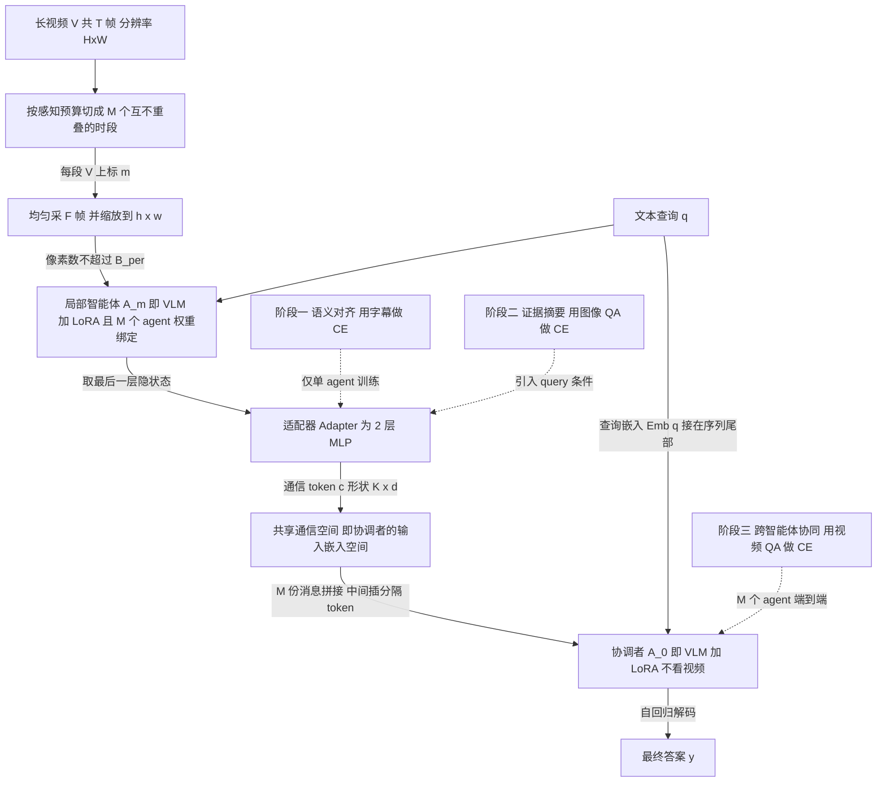

# MACF 深度精读：《Scaling Video Understanding via Compact Latent Multi-Agent Collaboration》

> **元信息**（来源：arXiv API + abs 页 + PDF 首页）
> - arXiv:2605.00444v1 [cs.CV]，提交 2026-05-01，arXiv comment 仅写 "12 pages"，**只有 v1，无 v2/v3**
> - 作者：Kerui Chen, Jinglu Wang, Jianrong Zhang, Ming Li, Yan Lu, Hehe Fan
> - PDF 页眉是 "Submission and Formatting Instructions for ICML 2026"，正文末尾有 `Machine Learning, ICML` 标签 → **ICML 2026 投稿格式**（是否中稿论文未声明）
> - **无公开代码**（见 §5 的搜索记录）
>
> **本文证据口径**：每条事实标注 `论文原文` / `论文图内文字` / `我的核算` / `我的推断` 四级。凡是论文没写的，我一律写"论文未给"，不猜数字。

---

## 0. 摘要翻译

> **来源：论文原文摘要，全文直译**

多模态大语言模型（MLLMs）推进了视觉—语言理解，但由于感知上下文预算有界，在长视频任务上存在固有局限。已有的智能体式（agentic）方法通过基于规则的预处理来缓解这一问题，却往往受制于信息丢失、成本高昂，以及对文本中间表示的依赖。我们提出 MACF——一个端到端的多智能体协作框架（Multi-Agent Collaboration Framework），它把**单个智能体的感知预算与全局视频复杂度解耦**，在保持视觉保真度的同时实现可扩展的视频理解。MACF 将视频切分为若干片段交给受本地预算约束的智能体，并通过一种**智能体原生（agent-native）的潜在通信协议**实现整体性推理。每个智能体把自己的局部观测编码成**共享嵌入空间中紧凑的、任务充分的（task-sufficient）token**，从而让中央协调者（central coordinator）能够进行高效且信息保全的协作。我们引入一种**课程式训练策略**，逐级施加语义对齐（semantic alignment）、证据摘要（evidence summarization）与跨智能体协同（cross-agent coordination）。在多样化视频理解基准上的大量实验表明，在**相同预算约束**下，MACF 一致地超越了当前最优的 MLLMs 和多智能体系统，证明了我们的潜在协作对可扩展视频理解的有效性。

---

## 1. 方法动机

### a) 作者为什么提出

> 来源：论文原文 §1

单个 MLLM 的输入上下文预算是硬约束，无法随视频时长/分辨率线性扩张。视频尤其吃亏，因为原始视觉流"**高度冗余、信息密度低于语言、且与任务弱对齐**"（论文原文），导致感知输入把预算吃光却对推理贡献很低。作者的目标是：**在不放宽单次前向的预算的前提下，让系统整体能吃下更长的视频**。

### b) 现有方法的具体痛点（论文点名的三类）

> 来源：论文原文 §1、§2

1. **感知采样类**（perceptual sampling，引 Han et al. 2024 / Liang et al. 2024）：时间+空间同时降采样以塞进预算。代价是**时间连续性与空间保真度被牺牲**。论文 Figure 1(a) 举的例子是"漏掉了德国国旗（German flag）"——即被采样丢掉的关键帧上的细粒度视觉证据。
2. **检索类**（VideoAgent、coarse-to-fine，引 Fan et al. 2024 / Wang et al. 2024）：靠 caption 匹配挑"信息量大"的帧。痛点是**成本高**（要先给全片生成 caption）、**强依赖中间文本质量**、**视觉细节仍然丢**。
3. **文本通信的多智能体类**（MapReduce，Pang & Wang 2025）：智能体之间用自然语言互通。论文的批评非常具体——文本"**难以传达运动、空间关系、纹理这类细粒度视觉线索**"，而且会引入**指代绑定错误**（reference binding error）。论文 §4.2 + Figure 3 给了实例：问"白狗身上绳子什么颜色"，Agent 6 段里有只黄白相间的狗，它把 query 里的"white dog"误绑到自己段内的狗，报告绳子是红色；这条错误文本一旦进入共享上下文，协调者就照抄了错答案。

论文对这三类的总判词是一句话（原文）："these pipelines remain **rule-driven and text-centric**, limiting end-to-end alignment with native visual representations."（这些流水线仍然是规则驱动、以文本为中心的，限制了与原生视觉表征的端到端对齐。）

### c) 研究假设 / 直觉

> 来源：论文原文 §1，一句话概括

**假设**：如果把"多个智能体各看一段视频"这件事保留下来，但把智能体之间的消息从**离散文本**换成**连续的、定长的、与协调者输入嵌入空间同构的潜在向量**，那么（i）通信带宽可以精确控量（$K\times M$ 个 token），（ii）视觉证据不必先被压成语言就不会被语言的表达力上限截断，（iii）整条链路可微，可以端到端训。

论文 §1 把随之而来的三个必须解决的问题也写死了（原文，逐条）：
1. **信息碎片化**（Information fragmentation）——每个 agent 只有部分观测，必须跨 agent 聚合；
2. **通信带宽约束**（Communication bandwidth constraints）——交换的消息必须紧凑；
3. **任务相关信息保全**（Task-relevant information preservation）——通信过程中语义损失要最小。

---

## 2. 方法设计 ★核心节★

### 2.0 总览流程图

**读图要点**：整条链路里**只有协调者做自回归解码**；$M$ 个局部智能体只做一次 prefill 前向，取最后一层隐状态就走人，**不解码任何 token**。这是它相对文本通信（MapReduce）延迟低一个数量级的根因（论文 §4.3 明说 MapReduce 的高延迟"primarily stemming from the autoregressive decoding process required for each agent interaction"）。

### 2.1 符号表

> 来源：符号定义全部来自论文原文 §3.1–§3.3；标"论文未给数值"的是论文确实没写

| 符号 | 含义 | 形状 / 取值 |
|---|---|---|
| $V=\{I_i\}_{i=1}^{T}$ | 输入视频，$T$ 帧 | 每帧 $I_i\in\mathbb{R}^{H\times W\times 3}$（原文只写 $H\times W$） |
| $q$ | 文本查询 | token 序列 |
| $y$ / $\hat y$ | 真值答案 / 预测答案；可为类别标签、自由文本或结构化输出 | — |
| $B^{per}$ | **感知预算**：单次前向可摄入的最大像素数 | 主实验 $=16\times224\times224$ |
| $B^{com}$ | **通信预算**：协调者单次前向可摄入的最大信息量（以 token 计） | 主实验 $=M\times K+\text{token}(q)$ |
| $\mathcal{P}(\cdot),\ \mathcal{P}_m(\cdot)$ | 预处理函数（时/空降采样） | 本文实例化为"均匀采 $F$ 帧 + resize" |
| $\mathrm{pix}(\cdot)$ | 数像素个数的函数 | 标量 |
| $M$ | 局部智能体数量 | **训练 $M=4$，推理 $M=6$** |
| $\mathcal{A}=\{A_1,\dots,A_M\}$ | 局部智能体集合 | 权重绑定，共享一套参数 $\theta_A$ |
| $A_0$ | 中央协调者 | 参数 $\theta_0$ |
| $V^{(m)}$ | 分给 $A_m$ 的视频时段 | $\{V^{(m)}\}$ 互不重叠且并起来等于 $V$ |
| $X^{(m)}=\mathcal{P}_m(V^{(m)})$ | $A_m$ 的实际视觉输入 | $F$ 帧 $\times\,h\times w$ |
| $F$ | 每 agent 采样帧数 | $F=16$ |
| $(h,w)$ | 统一缩放后分辨率 | $224\times224$ |
| $\mathbf{c}^{(m)}$ | $A_m$ 产出的**通信 token** | $\mathbb{R}^{K\times d}$ |
| $K$ | 每 agent 通信 token 数 | 消融 $K\in\{16,32,48\}$，**主实验 $K=32$** |
| $d$ | 共享通信空间的维度 | **论文未给数值**；由 $[\mathbf{c};\mathrm{Emb}(q)]$ 可拼接推出必须等于协调者输入嵌入维度（**我的推断**） |
| $\mathcal{C}$ | 协调者实际消费的消息子集，$\mathcal{C}\subseteq\{\mathbf{c}^{(1)},\dots,\mathbf{c}^{(M)}\}$ | 主实验取全集 |
| $C$ | 阶段一的真值字幕 | token 序列 |
| $\mathrm{Emb}(\cdot)$ | 协调者的输入嵌入查表 | $\mathbb{R}^{|q|\times d}$ |
| $\ell(\cdot)$ / $\mathrm{CE}$ | 损失，实例化为自回归交叉熵 | 标量 |
| $\mathcal{D}$ | 训练数据分布，三元组 $(V,q,y)$ | — |

### 2.2 问题形式化（§3.1）：把"预算"写成两个硬约束

**(1) 感知预算。** 论文把"单次前向能看多少视觉"统一抽象成**像素数**（原文理由：pixel-based budget 是跨系统/模型/编解码算法的"simple and unified proxy"）：

$$\mathrm{pix}(X)\le B^{per},\qquad X=\mathcal{P}(V)\tag{1}$$

**通俗解释**：不管你是抽 8 帧高分辨率还是抽 64 帧低分辨率，只要总像素超了就塞不进去；$\mathcal{P}$ 就是你在"时间覆盖"和"空间保真"之间做的那次取舍。

分布式之后，约束下沉到每个 agent：

$$X^{(m)}=\mathcal{P}_m(V^{(m)}),\qquad \mathrm{pix}(X^{(m)})\le B^{per}$$

**这一步就是标题里的"decouple"**（论文原文）：全局视频长度 $T$ 不再出现在单 agent 的约束里，$T$ 变长只需要加 agent。本文的具体实例化（Eq. 3）：

$$F\times h\times w\le B^{per}\tag{3}$$

**(2) 通信预算。** 没有任何 agent 看过全片，所以必须通信；协调者上下文有限，形式化为：

$$\sum_{\mathbf{c}^{(m)}\in\mathcal{C}}\big|\mathbf{c}^{(m)}\big|+|q|\ \le\ B^{com}\tag{2}$$

在本文的定长设定下退化成一个极干净的式子（Eq. 6）：

$$M\times K+\mathrm{token}(q)\ \le\ B^{com}\tag{6}$$

**通俗解释**：通信开销**只由"几个 agent"乘"每个 agent 说几个 token"决定**，和视频多长、内容多复杂完全无关。这是全篇最漂亮的一点——它把一个内容相关的量变成了一个可以在系统设计时钉死的常数。

### 2.3 局部智能体：perception budget 怎么解耦于全局复杂度（回答任务要求 (3)）

> 来源：论文原文 §3.2 "Local agents with budgeted perception" + §4.3 "Perception bottleneck"

机制其实非常朴素，**朴素是刻意的**——论文原文写明 "Focusing on multi-agent collaboration rather than sampling or compression strategies, we adopt a simple and consistent preprocessing scheme"（我们聚焦的是协作机制而非采样/压缩策略，所以用最简单一致的预处理）。具体：

1. 视频**按时间均匀切成 $M$ 段**，互不重叠（"disjoint temporal segments"），没有任何内容自适应的切分、没有关键帧检测、没有场景边界检测。
2. 每个 agent 在自己那段里**均匀采 $F=16$ 帧**，resize 到 $224\times224$。
3. 每个 agent 的输入恒等于 $16\times224\times224$，**与 $T$ 无关**。

**解耦的数学表述**（论文 §4.3 原文给出）：系统总感知量为

$$\text{总感知像素} = (M\times F)\times(h\times w)$$

其中 $(M\times F)$ 是**时间容量**，$(h\times w)$ 是**空间容量**。当 $F,h,w$ 固定，时间容量**随 $M$ 线性增长**；单 agent 约束不变。

**这里必须说破的一件事（我的核算 + 我的推断）**：所谓"identical budget constraints"（摘要原话）是**每 agent 相同**，不是**系统总量相同**。推理期 $M=6$，MACF 系统实际吃掉 $6\times16=96$ 帧，是 Table 1 里那些"with perception budget constraint"的单模型基线（16 帧）的 **6 倍总像素、约 6 倍视觉 FLOPs**。论文 §4.3 自己把 $(M\times F)\times(h\times w)$ 写出来了，所以它不算隐瞒；但 Table 1 的"Perc. budget"列对 MACF 是**每 agent 值**、对单模型是**全部值**，两者不同义。读者若要复用这套 protocol，必须自己补一条"单模型直接吃 96 帧"的对照（论文**没有**这条基线）。

**实证观察（非定理）**：论文 Figure 4 报告在 MLVU-Test 上随 $M$ 增大性能单调改善（论文只给了折线图，**正文未给任何具体数值**，我无法引用数字）。注意训练时 $M=4$、推理时 $M=6$，即**测试时 agent 数外推超出训练配置仍然涨点**——这是个不平凡的泛化性质，但论文没有对它做任何分析（我的推断：因为局部 agent 权重绑定且各自独立编码，协调者看到的只是"更多同分布的消息"，所以外推相对安全）。

### 2.4 通信 token：到底是什么（回答任务要求 (1)）

**这是全篇信息最不足的地方，必须精确区分论文写了什么和没写什么。**

**论文写了的（原文 + 图内文字）：**

$$\mathbf{c}^{(m)}=A_m(X^{(m)},q)\in\mathbb{R}^{K\times d}\tag{4}$$

- **数量**：$K$ 个，主实验 $K=32$；消融 $K\in\{16,32,48\}$。**推理期 $M=6$，总通信量 $=6\times32=192$ 个 token**——这与 Table 3 报告的 "Ours … 192 tokens" 严丝合缝（**我的核算**，可作为 $K=32,M=6$ 的交叉验证）。
- **维度**：$d$，**论文自始至终没给数值**。
- **由谁编码**（关键，来自 **Figure 2 图注原文**）："Each agent compresses its observation into communication tokens **extracted from the last-layer hidden states** and projects them into a shared latent communication space **via an adaptor module**."（每个 agent 把观测压成从**最后一层隐状态**抽取的通信 token，再经**适配器模块**投影进共享潜在通信空间。）
- **适配器是什么**（来自 §4.3 "Model agnostic" 段原文）："the adapter module (**2-layer MLP**), which projects any backbone's hidden states into a shared latent space with fixed dimensionality $c^{(m)}\in\mathbb{R}^{K\times d}$, absorbing architectural differences across backbones."
- **query 条件化**：Eq. 4 里 $\mathbf{c}^{(m)}$ 显式依赖 $q$——即局部 agent 在编码时**已经看到了问题**，产出的是"query-aware evidence summary"（§3.3 原文）。这和"先无条件压缩再检索"是本质不同的。
- **有分隔符**：Figure 2 的 Legend 里明确列了 "**Delimiter token**"（图内文字）——协调者输入序列里 $M$ 份消息之间有分隔 token。

**论文完全没写的（重大缺口）：**

- **$K$ 个隐状态到底取哪 $K$ 个位置？** 是取序列最后 $K$ 个位置？是在输入尾部追加 $K$ 个占位/可学习 query token 然后取它们的隐状态？还是对全部视觉 token 做池化到 $K$？——**正文、图注、图内文字全都没有说**。我对全文做过全局检索：`learnable` 出现 **0 次**、`query token` **0 次**、`pooling` **0 次**、`hidden` 仅出现在 Figure 2 图注那一次（我的核算，基于 PDF 全文文本检索）。
- **我的推断（明确标为推断，未经论文证实）**：结合 Legend 里有 "Delimiter token"、以及 "extracted from the last-layer hidden states" 这个措辞（"extracted"暗示是从既有序列里"取"，而不是"生成"），最可能的实现是：**在局部 agent 的输入序列尾部追加 $K$ 个特殊占位 token，一次前向后取这 $K$ 个位置的最后一层隐状态**。这是 Gist tokens / ICAE / memory-slot 类工作的标准做法，也与 §2 Related Work 里自认属于 "memory-slot based compression" 谱系一致。但这**是我的推断，论文没写，复现时必须自行做消融**。
- 适配器的隐层宽度、激活函数、是否有 LayerNorm——全无。
- 适配器是每个 backbone 一份还是全局一份——§3.3 说"each agent is equipped with an adaptor module"，异构时显然每 backbone 一份；同构权重绑定时应为同一份（**我的推断**）。

### 2.5 "共享嵌入空间"到底是什么（回答任务要求 (1) 的后半）

**论文的显式定义：没有。** 论文只反复用 "shared embedding space" / "shared continuous space" / "shared latent communication space" 这些词，从未给出形式化定义或维度。

**但可以从公式硬推出来（我的推断，推理链如下）：**

阶段二/三的损失里出现了

$$A_0\big([\mathbf{c};\mathrm{Emb}(q)]\big),\qquad A_0\big([\mathbf{c}^{(1)};\dots;\mathbf{c}^{(M)};\mathrm{Emb}(q)]\big)$$

$[\cdot;\cdot]$ 是沿序列维的拼接。**能和 $\mathrm{Emb}(q)$ 拼在一起、并一起喂进 $A_0$ 的第一层，就只有一种可能：$\mathbf{c}$ 活在协调者 $A_0$ 的输入嵌入空间里**，故 $d=\dim(\text{$A_0$ 的 input embedding})$。

所以"共享空间"的准确含义是：**协调者的输入嵌入空间**。所谓"共享"不是靠某个显式的对齐正则或对比损失定义的，而是**靠训练阶段一（字幕监督）把 adapter 的输出硬拽到这个空间里**——论文 §3.3 原话："we initialize the communication space with caption supervision, which provides dense, low-variance language targets and stabilizes the grounding of visual evidence."

**这一点对读者的多模态 LatentMAS 项目极端重要**：MACF 走的是**输入嵌入层**通信（和 LatentMAS 的 $W_a$ 落点相同），而**不是**逐层 KV。区别在于 LatentMAS 用闭式解析矩阵 $W_a$ 免训练地做这个映射，MACF 用一个 2 层 MLP **学**这个映射。MACF 等于是在说："在多模态上，这个映射学不出来就别指望算出来。"

### 2.6 协调者：cross-attention 还是拼接（回答任务要求 (4)）

**答案：拼接（concatenation），不是 cross-attention。** 证据是 Eq. 10 的形式（论文原文）：

$$\mathcal{L}_{\text{col}}=\mathrm{CE}\Big(y,\ A_0\big([\mathbf{c}^{(1)};\dots;\mathbf{c}^{(M)};\mathrm{Emb}(q)]\big)\Big)\tag{10}$$

即协调者是一个**标准的、未改结构的 VLM/LLM**，输入序列 = 消息$_1$ ⧺ 分隔 ⧺ 消息$_2$ ⧺ … ⧺ 消息$_M$ ⧺ 分隔 ⧺ 查询嵌入。融合完全交给协调者原生的 **self-attention**。论文全文**没有出现任何 cross-attention、Q-Former、Perceiver Resampler 之类的结构**（我的核算，全文检索无命中）。

抽象的预测式（Eq. 5）：

$$\hat y=A_0\big(q,\mathbf{c}^{(1)},\dots,\mathbf{c}^{(M)}\big)\tag{5}$$

**另一个必须点明的架构事实（来自 Eq. 5/10 与 Figure 2(a) 的输入标注）：协调者不接收任何视觉输入。** 它只吃 $M\times K$ 个通信 token 和查询。也就是说协调者对视频是"盲"的，全部视觉证据必须经过 $192$ 个向量这个瓶颈。这是一个非常激进的设计（**我的推断**：这既是它效率高的原因，也是它上限被压低的原因——见 §4 局限性）。

**拓扑**：star topology（星型），论文原文明说。**没有 agent 之间的横向通信，没有多轮迭代，一次性单向汇聚。**

### 2.7 优化目标与课程训练（回答任务要求 (2)）

**总目标**（Eq. 7）：

$$\min_{\theta_A,\theta_0}\ \mathbb{E}_{(V,q,y)\sim\mathcal{D}}\big[\ell(\hat y,y)\big]\tag{7}$$

其中 $\theta_A$ 是**所有局部 agent 共享**的参数（论文 §3.3 原文："we **tie their parameters** and learn a single set of shared weights"），$\theta_0$ 是协调者参数，$\ell$ 实例化为自回归 CE。

**为什么不能直接端到端训**（论文 §3.3 原文的诊断，这段写得很好）：MACF 虽然全程可微，但存在"a **two-stage bottleneck** that induces an effective **min-cut** in the information flow"以及"the **asymmetric roles** of local agents and the coordinator"。局部 agent 要把高维视频压成极少数 token，协调者要把这些 token 融合成全局理解——两边同时从零开始训"often leads to unstable representations and ineffective collaboration"。

> **注意区分**：这是**作者给的直觉性诊断**（min-cut 是个比喻），**不是定理**。论文没有对此给任何理论证明，支撑它的是 §4.3 Table 4 的消融（实证观察）。

#### 阶段一：语义对齐（Semantic alignment）

$$\mathcal{L}_{\text{cap}}=\mathrm{CE}\big(C,\ A_0(\mathbf{c})\big)\tag{8}$$

- **做什么**：**单个**局部 agent 看图/短视频 $X$ → 产出 $\mathbf{c}=A_m(X)$（**注意 Eq. 8 里没有 $q$**，此阶段无 query 条件化）→ 协调者**只凭这些 token 把字幕解码出来**。
- **数据**：LLaVA-Video-178K 的 **0–30s 子集的 caption 数据**（论文 §4.1）。
- **意图**（原文）：字幕是"dense, low-variance language targets"，能稳定地把视觉证据 grounding 住，从而"anchor communication tokens in a unified semantic space"。没有这一步，"communication tokens can **drift** across agents and lack semantic consistency"。
- **本质是什么（我的推断）**：这就是**用 caption 做的自编码/重构预训练**——强迫 $K$ 个 token 必须携带足够信息让协调者复述出整段描述。它是唯一一个**不依赖下游任务标签**、能给潜在通道注入"信息量"的阶段。

#### 阶段二：证据摘要（Evidence summarization）

$$\mathcal{L}_{\text{evi}}=\mathrm{CE}\big(y,\ A_0([\mathbf{c};\mathrm{Emb}(q)])\big)\tag{9}$$

- **做什么**：仍然是**单** agent，但现在 $\mathbf{c}=A_m(X,q)$ **看到 query 了**。任务从"复述全部"变成"在定长预算下挑并压缩**与问题相关**的证据"。
- **数据**：**Video-R1 的 image 数据**（图像 QA），论文原文称之为 "a high-quality Image-QA dataset"。
- **关键设计取舍（论文没解释，我的推断）**：这一阶段**故意用图像而不是视频**。好处是把"query 条件化压缩"这个能力和"跨段聚合"这个能力解耦开来单独学，符合课程学习的逐级加难；副作用是 agent 在这一阶段没学过时序压缩。

#### 阶段三：跨智能体协同（Cross-agent collaboration）

$$\mathcal{L}_{\text{col}}=\mathrm{CE}\big(y,\ A_0([\mathbf{c}^{(1)};\dots;\mathbf{c}^{(M)};\mathrm{Emb}(q)])\big)\tag{10}$$

- **做什么**：首次上 $M=4$ 个 agent，视频真正切段，端到端反传（梯度穿过 $\mathbf{c}^{(m)}$ 回到所有局部 agent，因权重绑定所以是同一套参数收 $M$ 份梯度）。
- **数据**：**Video-R1 的 video 数据 + Molmo2 的一个子集**（论文 §4.1；Molmo2 引 Clark et al. 2026）。
- **意图**：协调者不仅要读懂单份消息，还要"fuse evidence across agents and perform global coordination"。

#### 训练配置（能查到的全部）

| 项 | 值 | 来源 |
|---|---|---|
| 局部 agent & 协调者 backbone（主表） | Qwen3-VL-8B | 论文 §4.1 |
| 每 agent 帧数 $F$ | 16 | §4.1 |
| 分辨率 | $224\times224$（"maximum resolution"） | §4.1 |
| 训练 $M$ / 推理 $M$ | 4 / 6 | §4.1 |
| $K$（主实验） | 32 | §4.3 + Table 3 交叉验证 |
| 硬件 | **4 × NVIDIA A100 80GB** | §4.1 |
| 微调方式 | **LoRA**（局部 agent 与协调者**都挂 LoRA**） | **仅见于 Figure 2 图内文字**，正文一字未提 |
| 可训练模块 | Adapter + 两侧 LoRA（Legend 有 "Trainable" 图例） | Figure 2 图内文字 |
| 学习率 / batch size / epoch / LoRA rank / 训练步数 / 各阶段数据量 | **全部未给** | — |

> **重大缺陷提示**：论文两处写 "More details are provided in the appendix." 和 "The implementation details of these three baselines are provided in the Appendix."，但**arXiv v1 的 12 页 PDF 里根本没有 Appendix**（我的核算：PDF 共 12 页，正文 §5 Conclusion → Impact Statement → References 直接结束；全文 "appendix" 只出现 2 次，都是这两处前向引用）。**即所有超参、以及 LatentMAS/MapReduce 两个关键基线的实现细节，全部不可获得。**

### 2.8 异构扩展

论文 §3.3 + §4.3 给出的机制：每个 agent 配一个自己的 adapter（2 层 MLP），把各自 backbone 的隐状态投到**固定维度 $d$** 的共享空间，"absorbing architectural differences across backbones"。Table 5 用"Qwen2.5-VL-7B & LLaVA-OV1.5-8B 混合做局部 agent + Qwen3-VL-8B 固定做协调者"验证了可行性。

---

## 3. 与其他方法对比

### a) 本质不同

| 对比对象 | 它怎么做 | MACF 的本质差别 |
|---|---|---|
| **感知采样类**（uniform sampling / frame selection） | 单模型，在预算内挑帧 | MACF 不挑帧，**加 agent**；总感知量随 $M$ 线性扩，单 agent 预算不动 |
| **检索类**（VideoAgent、coarse-to-fine） | 先 caption 全片 → 检索关键帧 → 再看 | MACF **无检索、无 caption 中间件、无多轮**；一次并行 prefill 后单向汇聚 |
| **MapReduce（文本通信 MAS）** | agent 解码出文本摘要 → 协调者读文本 | MACF **消息是连续向量**，agent **完全不解码**；消息长度是设计常数而非内容函数 |
| **LatentMAS（KV 通信 MAS）** | 传**逐层 KV cache**；且有 agent 内部的隐空间自回归"潜在思维"；**免训练** | MACF **只取最后一层隐状态**（1 层 vs $L$ 层）；**必须训练**（3 阶段课程 + LoRA + adapter）；**没有 agent 内部的隐空间推理**，agent 只做一次前向 |
| **上下文压缩类**（ICAE / gist / memory slot） | 单模型自己压自己的长上下文 | MACF 把同一个机制**当作多智能体之间的通信信道**用，压的是"我这一段视频"而不是"我的历史上下文"；且压缩是 query 条件化的 |

**一句话本质**（我的判断）：MACF 严格说是一个**"并行视觉编码 + 定长瓶颈 + 单点融合"的架构**，披着多智能体的外衣。它的 agent 之间没有角色分工、没有互相看、没有多轮辩论——$M$ 个 agent 是**权重完全相同、只是输入的视频段不同**的同一个模型。把它叫作"分段视觉压缩 + 学习式聚合"在技术上更准确。这不贬低它的效果，但对读者判断"这块地被占了多少"很关键。

### b) 创新点与贡献度

论文自述三条贡献（§1 原文）：预算约束下的多智能体视频理解问题形式化；agent-native 潜在通信机制；课程学习策略。

**我的分贡献度评估：**

1. **预算形式化（Eq. 1–3, 6）——高价值、低技术门槛。** 把"感知预算=像素数""通信预算=$M\times K$"钉死，让整篇文章的实验有了一个可复现的公平比较协议。这是本文最容易被后续工作直接引用/继承的部分。
2. **潜在通信 token——中等原创度。** 机制本身（隐状态 → MLP → 塞进另一个模型的输入嵌入序列）在单模型上下文压缩、多模态 connector（LLaVA 的 projector 本质就是这个）里都是熟面孔。**新的是把它定位成"多智能体通信信道"并配上带宽预算的分析**，以及在视频多智能体上跑通。
3. **三阶段课程——中等原创度、高实用价值。** 阶段划分（无条件字幕 → query 条件图像 QA → 多 agent 视频 QA）本身不新奇，但 **Table 4 的消融数字非常有说服力地证明了它不可省**（见 §4）——这是本文实证上最硬的部分。
4. **信息瓶颈/率失真的分析框架（§4.3）——叙事价值 > 技术价值。** 论文说"a hallmark of information bottleneck regimes"，但**全文没有任何信息论量的实际计算**（没算互信息、没算率失真曲线），这是一个**比喻性框架而非定量分析**。读者引用时不要当成理论结果。

### c) 适用场景

- **强适用**：长视频 QA / 长视频检索式问答，且部署侧**单次前向的上下文或显存是硬墙**（比如必须跑在固定 KV 预算的推理服务上），但**可以横向并行多份模型**。
- **强适用**：需要**低通信开销**的分布式部署（边端多路摄像头各自跑一个 agent，只回传 32 个向量给中心）。这是我认为 MACF 最自然的落地形态（**我的推断**，论文未提）。
- **弱适用/不适用**：需要 agent 间多轮协商、角色分工、自我批评的任务（MACF 是一次性星型）；需要精确时间定位/grounding 输出的任务（$192$ 个向量里能不能编码帧级时间戳，论文完全没验）；短视频（分段收益消失，纯亏 $M$ 倍算力）。

### d) 总结表

| 维度 | 优点 | 缺点 | 可改进点 |
|---|---|---|---|
| **通信机制** | 定长 $K\times M$，与视频长度/内容无关；无解码，延迟低（0.537s vs MapReduce 5.156s）；避开文本的指代绑定错误 | 只用**最后一层**隐状态，丢掉全部中间层结构；协调者对视频完全"盲"，$192$ 向量是唯一通路 | 加多层/多尺度消息；给协调者留一路低分辨率全局视图作 anchor；让消息带显式时间戳 |
| **拓扑** | 星型最简单，$O(M)$ 通信，易并行 | 无 agent 间横向通信、无多轮、无角色分工；单点协调者是瓶颈也是单点故障 | 分层聚合（tree）；两轮 star（协调者回问）；异构角色 |
| **训练** | 课程分级清晰，消融证明三阶段都必要；LoRA + 4×A100 可负担 | **必须训练**，training-free 完全不成立；超参全无；无 appendix | 探索"只训 adapter 不动 backbone"的极简版；探索是否有免训练的初始化 |
| **预算论证** | 形式化干净，$M$/$K$/分辨率三个旋钮的消融都做了 | "identical budget" 是**每 agent** 同，系统总像素是基线的 $M$ 倍；**缺"单模型直接吃 $M\times F$ 帧"这条上界基线** | 补等总像素基线；补 FLOPs / 端到端墙钟时间的完整对照 |
| **可复现性** | benchmark 与 backbone 都是公开的 | **无代码、无 checkpoint、无 appendix、无超参**；两个关键基线（LatentMAS/MapReduce）是作者自己改的、细节全在缺失的 appendix 里 | — |
| **数字一致性** | 主表与"vs Qwen3-VL-8B"的增益完全自洽 | **§4.2 里 vs LatentMAS 的 4 个增益数字与 Table 1 全部对不上**（见 §4b） | — |

---

## 4. 实验表现与优势

### a) 实验设计与设置

> 来源：论文 §4.1，全部核实过

- **Backbone**：主表用 **Qwen3-VL-8B** 同时做局部 agent 和协调者；另做 **Qwen2.5-VL-7B**、**LLaVA-OneVision-1.5-8B** 两组泛化验证。
- **Benchmark（4 个长视频理解基准）**：**Video-MME**、**LongVideoBench**、**LVBench**、**MLVU-Test**（MLVU 只用其多选题子集，理由是"for stability and consistency"）。
- **预算协议**：所有"budget-constrained"行统一 $16\times224\times224$。
- **基线**：13 个开源/闭源 MLLM（GPT-4o、LLaVA-Next-Video-34B、ShareGPT4Video-8B、Kangaroo-8B、VideoLLaMA2.1-7B、VideoLLaMA3-7B、Qwen2.5-VL-72B/7B、Qwen3-VL-30B/8B、LLaVA-OneVision1.5-8B、Keye1.5-VL-8B、InternVL2.5-VL-8B）+ **2 个多智能体系统**：
  - **MapReduce\***：把原实现里的闭源模型换成 Qwen3-VL-8B；
  - **LatentMAS\***："we **adapt and modify the official LatentMAS code to support multimodal understanding**"（论文原文）——**这一条对读者的项目至关重要，见 §6**。
- 解码配置沿用各模型官方 demo。

### b) 关键数据

**Table 1 主表**（论文原文数值，我逐格核对过 HTML 与 PDF 两个来源，一致）：

| Model | Video-MME | LongVideoBench | LVBench | MLVU-Test | Perc. budget |
|---|---|---|---|---|---|
| *无预算约束* GPT-4o | 71.9 | 66.7 | 30.8 | 54.9 | – |
| *无预算约束* VideoLLaMA3-7B | 66.2 | 59.8 | **45.3** | 47.7 | – |
| *无预算约束* Kangaroo-8B | 56.0 | 54.8 | 39.4 | 46.5 | – |
| Qwen2.5-VL-72B | 59.5 | 51.0 | 35.7 | 44.2 | 16\*224\*224 |
| Qwen3-VL-30B | 58.3 | 55.9 | 38.0 | 44.0 | 16\*224\*224 |
| Qwen2.5-VL-7B | 53.7 | 48.1 | 32.2 | 38.7 | 16\*224\*224 |
| LLaVA-OneVision1.5-8B | 56.1 | 54.4 | 36.4 | 41.8 | 16\*224\*224 |
| Keye1.5-VL-8B | 55.6 | 56.4 | 37.6 | 41.6 | 16\*224\*224 |
| InternVL2.5-VL-8B | 47.7 | 43.4 | 32.3 | 39.1 | 16\*224\*224 |
| **Qwen3-VL-8B（主 backbone 基线）** | 55.9 | 50.7 | 33.2 | 41.5 | 16\*224\*224 |
| **MapReduce\***（文本通信） | 46.7 | 38.2 | 30.5 | 33.3 | 16\*224\*224 |
| **LatentMAS\***（KV 通信） | 55.7 | 48.5 | 33.2 | 42.3 | 16\*224\*224 |
| **Ours (Qwen2.5-VL-7B)** | 58.2 | 52.5 | 37.7 | 47.6 | 16\*224\*224 |
| **Ours (Qwen3-VL-8B)** | **60.4** | 56.8 | 40.2 | 49.2 | 16\*224\*224 |
| **Ours (LLaVA-OV1.5-8B)** | 59.9 | **57.6** | 41.1 | **49.4** | 16\*224\*224 |

**核心数字（论文原文声称，我已逐条核算，全部对得上）：**
- vs 同 backbone Qwen3-VL-8B：**+4.5 / +6.1 / +7.0 / +7.7**（绝对百分点），四项平均 **+6.3**。
- 三个 backbone 总平均增益 **+5.6**（我的核算：Qwen3 +6.33、Qwen2.5 +5.83、LLaVA-OV +4.83，均值 5.66 ✓）。
- MLVU-Test 上 **49.2 > 所有开源基线（含无预算约束的 VideoLLaMA3-7B 47.7）**——这条论文声称成立，我核实**成立**。但注意：**Video-MME 上 60.4 仍显著低于无约束的 VideoLLaMA3-7B 66.2 和 GPT-4o 71.9；LVBench 上 40.2 也低于 VideoLLaMA3-7B 45.3。**

**Table 2（通信瓶颈 $K$ 消融）**：

| $K$ | MLVU | LVBench | LongVideoBench |
|---|---|---|---|
| 16 | 46.0 | 38.7 | 54.1 |
| **32** | **49.2** | **40.2** | 56.8 |
| 48 | 49.0 | 40.1 | **57.2** |

> **我的核算 + 措辞校正**：论文说 $K{=}48$ "provides only **marginal gains**"。实际上 $K{=}48$ 在 MLVU（49.0 < 49.2）和 LVBench（40.1 < 40.2）上是**微跌**，只在 LongVideoBench 上 +0.4。准确说法应是"$K{=}32$ 之后饱和，$K{=}48$ 无稳定收益"。$K{=}16$ 的崩塌是真的（MLVU −3.2）。

**Table 3（通信开销）**：

| Method | Inference Time | Throughput |
|---|---|---|
| MapReduce | 5.156 s | 387 tokens |
| LatentMAS | 0.649 s | 784 KV-Cache |
| **Ours** | **0.537 s** | **192 tokens** |

> **三点说明**：(i) 192 = $K{=}32\times M{=}6$，与主实验配置自洽（**我的核算**）。(ii) **单位不可比**：MACF 的 192 是 $192\times d$ 个浮点数；LatentMAS 的 "784 KV-Cache" 若指 784 个 token 的 KV，实际是 $784\times2\times L\times d_{kv}$ 个浮点数（$L$ 为层数），量级差两个数量级以上（**我的推断**）。所以 MACF 的通信优势方向正确、甚至**被低估**了，但这张表的单位混用是不严谨的。(iii) "Inference Time" 是否包含 $M{=}6$ 次局部 VLM 前向，**论文没说**；0.537s 对 6 次 16 帧 VLM prefill 而言过快，**我推断它只计了协调者/通信环节**，不是端到端墙钟。读者不可把它当作系统级延迟引用。

**Table 4（课程训练消融，Video-MME / MLVU）**：

| Stage1 | Stage2 | Stage3 | Video-MME | MLVU |
|---|---|---|---|---|
| ✗ | ✓ | ✓ | 45.5 | 36.3 |
| ✓ | ✗ | ✓ | 56.9 | 46.7 |
| ✓ | ✓ | ✗ | 48.2 | 36.5 |
| ✓ | ✓ | ✓ | **60.4** | **49.2** |

平均降幅 **13.9 / 3.0 / 12.5**（论文原文，我核算全部对得上）。

> **这张表是全文对读者最有价值的一张。** 关键读法（**我的核算 + 推断**）：去掉阶段一（45.5 / 36.3）或去掉阶段三（48.2 / 36.5），**性能都跌到远低于什么都不做的单模型 Qwen3-VL-8B（55.9 / 41.5）**。也就是说：**一个没被正确训练过的潜在通信信道，不是"收益变小"，而是"主动有害"——比根本不搞多智能体还差 8~10 个点。**

**Table 5（模型无关性，协调者固定 Qwen3-VL-8B）**：

| Local Agent | Video-MME | LongVideoBench | LVBench | MLVU-Test |
|---|---|---|---|---|
| Qwen3-VL-8B | 60.4 | 56.8 | 40.2 | 49.2 |
| Qwen2.5-VL-7B | 56.4 | 51.1 | 36.5 | 47.8 |
| Qwen2.5-VL-7B & LLaVA-OV1.5-8B（异构混合） | 56.6 | 52.0 | 37.0 | 48.1 |

> **我的核算发现一处论文没讨论的现象**：Table 1 里"Ours (Qwen2.5-VL-7B)"（推断为 agent 与协调者**同为** Qwen2.5-VL-7B）拿到 58.2/52.5/37.7/47.6；而 Table 5 里 Qwen2.5-VL-7B agent + **Qwen3-VL-8B 协调者**只有 56.4/51.1/36.5/47.8——**四项中三项反而更低**。说明"adapter 完全吸收架构差异"的说法是**打折的**：局部 agent 与协调者不同族时有 1–2 点的实打实损失。论文对此只字未提。

**Figure 4 / Figure 5**：分别是"$M$ 增大→MLVU-Test 单调涨"和"分辨率增大→LongVideoBench 单调涨，$K{=}32$ 会饱和、$K{=}48$ 抬高天花板"。**两图都只有折线，正文未给任何具体数值，我无法引用数字。**

**⚠️ 一处必须提醒读者的内部不一致（我的核算）：**
论文 §4.2 "Effective communication representation" 段声称：
- 相对文本通信（MapReduce）领先 **20.3 / 18.6 / 9.7 / 15.9**。按 Table 1 实算是 **13.7 / 18.6 / 9.7 / 15.9** —— **后三项完全吻合（绝对百分点），第一项 Video-MME 对不上（13.7 vs 声称的 20.3）**。
- 相对 LatentMAS 领先 **9.3 / 14.1 / 10.5 / 10.3**。按 Table 1 实算是 **4.7 / 8.3 / 7.0 / 6.9**（绝对），或 **8.4 / 17.1 / 21.1 / 16.3**（相对 %）——**绝对和相对两种口径都对不上，四项全错**。

**结论：正文中"vs LatentMAS 的增益"这组数字不可引用。** 真实差距是 **+4.7 / +8.3 / +7.0 / +6.9**（绝对百分点），比论文声称的小约一半。

### c) 优势最明显的场景

1. **MLVU-Test**：+7.7（同 backbone），且是唯一一个 MACF 超过所有无预算约束开源模型的基准。MLVU 是多任务长视频基准，正好吃"多段独立证据 + 融合"这套。
2. **相对文本通信的碾压**：MapReduce 在四个基准上**全面低于**单模型 Qwen3-VL-8B（46.7 vs 55.9 等），MACF 领先它 9.7~18.6 点。这条结论很硬：**在这个 protocol 下，把视觉证据先压成文本再传，是净亏损。**
3. **低带宽 + 低延迟**：192 token、0.537s，两项都最优。

### d) 局限性

**论文明说的（几乎没有）：** 论文**没有 Limitations 节**。唯一近似的自我限定是 §4.3 承认存在饱和（$K{=}48$ 收益递减，分辨率提升会被通信瓶颈卡住）。

**隐含的（以下均为我的分析，逐条标注依据）：**

1. **"相同预算"是每 agent 相同，不是系统相同。** MACF 推理期总像素是单模型基线的 6 倍，且缺少"单模型直接吃 96 帧"的对照。依据：§4.3 自己写的 $(M\times F)\times(h\times w)$ + Table 1 缺该行。
2. **上限并不高。** Video-MME 60.4 < VideoLLaMA3-7B 无约束的 66.2 < GPT-4o 71.9；LVBench 40.2 < VideoLLaMA3-7B 45.3。说明 $192$ 个向量的瓶颈仍然显著低于"直接看更多帧"的天花板。依据：Table 1 核算。
3. **通信 token 的生成机制未定义。** 全文没说 $K$ 个隐状态怎么来。这是复现的最大障碍。依据：全文检索 `learnable`/`query token`/`pooling` 零命中。
4. **Appendix 承诺了但不存在**，超参全无，两个关键基线的实现细节不可查。依据：12 页 PDF 全文核对。
5. **无代码、无 checkpoint。** 依据：§5 的完整搜索记录。
6. **无误差棒、无多次运行、无显著性检验。** 所有表都是单个数字。多个关键差距（$K{=}32$ vs $48$ 的 0.1~0.2 分、Table 5 的 0.2~0.9 分）落在噪声量级内却被当作结论解读。
7. **正文数字与主表不一致**（vs LatentMAS 的四个增益全错，vs MapReduce 的第一个错）。依据：§4b 核算。
8. **多智能体的"智能体性"很弱**：无角色分工、无横向通信、无多轮、权重完全绑定。称其为多智能体系统偏营销。依据：§3.2/§3.3 原文。
9. **协调者对视频完全盲**，没有任何 fallback 通路；一旦某段的关键证据没被 $K$ 个 token 编码进去，系统无法回头重看。依据：Eq. 5/10。
10. **异构 backbone 的代价被淡化**（Table 5 vs Table 1 有 1–2 点损失，论文未讨论）。
11. **训练/推理 $M$ 不一致**（4 vs 6）被当作纯收益，但没有做 $M$ 外推的失效边界测试（$M{=}10$、$M{=}20$ 会怎样？Figure 4 的横轴范围论文未在正文交代）。

---

## 5. 论文 ↔ 源码对照

### 结论：**无公开代码**。以下是我的完整搜索记录（不编造任何链接）

| 检索位置 | 方法 | 结果 |
|---|---|---|
| arXiv abs 页 `arxiv.org/abs/2605.00444` | WebFetch，明确问"有无 code/project page 链接" | **无任何代码或主页链接**；页面只列 PDF / HTML / TeX Source |
| arXiv HTML 全文 `arxiv.org/html/2605.00444v1` | curl 下载 216 KB HTML → 转纯文本 → 全文检索 | 全文 **`github` 仅 1 次命中**，是参考文献里的 `https://llava-vl.github.io/blog/...`（LLaVA-Next 的引用），与本文代码无关 |
| PDF `arxiv.org/pdf/2605.00444v1` | curl 下载 → pypdf 提取（12 页，52,372 字符）→ 全文检索 | 同上，`github` 仅 1 次命中且为他人引用；**无 footnote 形式的 code URL**（这类论文常见的首页脚注也没有） |
| GitHub 仓库搜索 | GitHub REST API `search/repositories`，两条 query：`MACF+video+understanding+latent+communication`、`Scaling+Video+Understanding+Compact+Latent+Multi-Agent` | **两次 `total_count` 均为 0** |
| Web 搜索 | WebSearch 共 3 轮（含作者名 Kerui Chen、arXiv ID、标题精确匹配） | 只返回 arXiv 本身；无项目主页、无 GitHub、无 Papers-with-Code 条目 |
| HuggingFace Papers `huggingface.co/papers/2605.00444` | WebFetch | **HTTP 404**（该论文未被收录，也就没有关联的 model/dataset/space） |
| arXiv API 版本历史 | `export.arxiv.org/api/query?id_list=2605.00444` | **只有 v1**（published 2026-05-01），arXiv comment 仅 `12 pages`，**无 code 字段** |
| OpenReview | 论文用 ICML 2026 模板，但 arXiv 版署了真实作者名（非匿名） | 我未能通过公开搜索定位到对应的 OpenReview 条目；**不确认其是否已被接收**，也不编造链接 |
| 本机 `/home/yilin/tmp/mm-latent-repos/` | `ls` + `git remote -v` | 该目录下**只有两个别的仓库**：`xz-liu/heterogeneous-latent-mas`（commit f55e921）与 `YU-deep/ViF`（commit 205ebb9），**都不是 MACF**。本任务未获得任何 MACF 源码 |

### 代码与论文的对不上之处 → 改为「论文自身的对不上之处」

既然无代码，我把这一节的审计对象换成论文内部的一致性（全部为我的核算，可复核）：

1. **Appendix 不存在但被引用 2 次**（§4.1 末、§4.1 Baselines 末）。后果：训练超参、以及 **LatentMAS\* 与 MapReduce\* 两个基线的实现细节完全不可获得**。
2. **LoRA 只出现在 Figure 2 的图内文字里**（"LoRA Local Agent $A_m$"、"LoRA Coordinator Agent $A_0$"），**正文一次都没提微调方式**。读者若只读正文会误以为是全参微调。
3. **通信 token 的抽取机制在正文、图注、图内文字里全部缺失**（见 §2.4）。
4. **§4.2 的增益数字与 Table 1 冲突**：vs LatentMAS 的 4 个数字全错，vs MapReduce 的第 1 个错（详见 §4b）。
5. **$K{=}48$ 被描述为 "marginal gains"，实际在 2/3 基准上微跌**（Table 2）。
6. **参考文献里 LatentMAS 被重复登记为 Zou et al. 2025a 和 2025b 两条同一 arXiv 号（2511.20639）的条目**（PDF 参考文献页可见），并且 §4.3 引 2025b、§2/§4.1 引 2025a——bib 重复的低级错误。
7. **Table 3 单位混用**：MACF 报 "192 tokens"，LatentMAS 报 "784 KV-Cache"，两者不是同一物理量，不能直接比大小（虽然结论方向不受影响）。
8. **Table 5 与 Table 1 的 Qwen2.5-VL-7B 配置结果冲突未被讨论**（见 §4b）。

### 能不能直接跑通？

**不能，且距离"能跑"很远。** 缺口清单：

- ❌ 无任何代码（无 repo、无 gist、无 supplementary）
- ❌ 无 checkpoint、无 adapter 权重、无 LoRA 权重
- ❌ 无通信 token 抽取模块的定义（最核心的那一块）
- ❌ 无学习率 / batch / epoch / LoRA rank / warmup / 各阶段步数与数据量
- ❌ 无 $d$ 的数值
- ❌ 无 LatentMAS\* / MapReduce\* 的适配细节
- ✅ 依赖是清楚的：Qwen3-VL-8B / Qwen2.5-VL-7B / LLaVA-OneVision-1.5-8B（均公开）；LLaVA-Video-178K（公开）、Video-R1（公开）、Molmo2（Clark et al. 2026，需确认发布状态）；4×A100-80G 的规模是可承受的
- ✅ 评测端可完全复现：Video-MME / LongVideoBench / LVBench / MLVU-Test 全部公开，预算协议 $16\times224\times224$ 定义明确

**从零复现的工作量估计（我的推断）**：架构与训练脚本约 1–2 人周（关键不确定性在 token 抽取模块，需要做 2–3 个变体的消融）；三阶段训练在 4×A100 上按论文规模跑通，含调参估计 2–4 周。**主要风险不是工程量，而是 token 抽取机制猜错导致复现不出 Table 1。**

---

## 6. 对「多模态 LatentMAS」项目的可复用性

### 6.1 先说最要紧的一句话

**这篇论文是你这个方向最直接的先行工作 + 竞争者，而且它已经替你做了一次"把 LatentMAS 搬到多模态"的实验，并报告了负面结果。** 论文 §4.1 原文："We also **adapt and modify the official LatentMAS code to support multimodal understanding**."

它报的 LatentMAS\*（Qwen3-VL-8B 引擎，同预算）成绩，对比同 backbone 的单模型基线（我的核算）：

| | Video-MME | LongVideoBench | LVBench | MLVU-Test |
|---|---|---|---|---|
| Qwen3-VL-8B 单模型 | 55.9 | 50.7 | 33.2 | 41.5 |
| **LatentMAS\***（多模态移植） | 55.7 | 48.5 | 33.2 | 42.3 |
| **差值** | **−0.2** | **−2.2** | **0.0** | **+0.8** |

**即：免训练的 LatentMAS 直接移植到 VLM 上，在四个长视频基准上净收益约等于零（一胜两负一平）。**

**但这个负面结果是可以被攻击的，而且攻击面很大**（以下为我的分析）：

1. **实现不可查**：细节全在**不存在的 Appendix** 里，无代码，无法复核。
2. **拓扑本身就错配**：LatentMAS 原生是 4 个**角色分化**的 agent（Planner→Critic→Refiner→Judger，见本机 `/home/yilin/LatentMAS/methods/__init__.py:11-17`）**串行**处理**同一个**输入，KV 一路往下拼；MACF 的场景是 $M$ 个 agent **各看不同视频段**。把"角色串行"的 KV 拼接机制硬套到"分段并行"上，会直接撞两个已知的坑：**(a)** 不同段的视觉 token 在 RoPE 上位置冲突（把 6 段各自从 0 开始的位置编码拼成一条序列，语义就乱了）；**(b)** KV 拼接是**加法式堆上下文**，长度随 $M$ 线性爆炸，正好违反 MACF 自己定义的 $B^{com}$。**它们很可能是在一个对 LatentMAS 不利的配置下测的。**
3. **$W_a$ 的已知退化没被考虑**：本机解析文档 `/home/yilin/LatentMAS/exp-docs/code-to-paper-mapping.md` §4.1 记录 `--latent_space_realign` **默认关闭**，关闭时 `realign_matrix` 被换成单位阵；§4.2 记录 tied-embedding 模型上 $W_a\approx I$。如果他们直接跑默认参数，那这个"LatentMAS 基线"里根本没有 $W_a$。
4. **LatentMAS 的"潜在思维"（agent 内部隐空间自回归 $m$ 步）在视频任务里该怎么用，论文完全没提**。MACF 的 agent 只做一次前向。

**给读者的行动建议**：把这条负面结果当成**必须先复现并推翻/确认的第一个实验**，而不是当成既成事实接受。这既是风险，也是你论文的第一个卖点——"我们发现先前工作报告的多模态 LatentMAS 失效，源于 X 配置错配，修正后 …"。

### 6.2 它占了哪块地（这些主张你不能再声称是新的）

以下每条都已被 MACF 明确声称并给了实验：

1. **把长视频按时间切成 $M$ 段、每段交给一个受本地感知预算约束的 VLM agent、由中央协调者汇总** —— 已占（§3.2）。
2. **多模态 agent 之间用紧凑连续潜在 token 通信，而非文本** —— 已占（§3.2，"agent-native latent communication protocol"）。
3. **"潜在通信优于文本通信、因为文本会丢细粒度视觉线索并造成指代绑定错误"** —— 已占，且有定量（+9.7~18.6）和定性（Figure 3 白狗绳子案例）双重证据。
4. **"潜在通信比 LatentMAS 式的 KV cache 共享更省带宽/更低延迟"** —— 已占（Table 3）。
5. **"把感知预算形式化为像素数、把通信预算形式化为 $M\times K$ token，并证明二者解耦"** —— 已占（Eq. 1–3, 6）。
6. **三阶段课程"字幕对齐 → query 条件图像 QA → 多 agent 视频 QA"** —— 已占（§3.3 + Table 4）。
7. **定长 $K$ token 瓶颈的率失真/信息瓶颈叙事 + $K$ 的饱和曲线** —— 已占（§4.3 + Table 2）。
8. **星型拓扑 + 权重绑定的同构 agent + 2 层 MLP adapter 实现 backbone 无关的异构协作** —— 已占（§3.3 + Table 5）。
9. **"朴素移植 LatentMAS 到多模态收益≈0"这个经验判断** —— 已被**声称**（证据薄弱，可攻，但你必须引用并回应它）。

### 6.3 还留给你的地（MACF 明确没碰的）

这是你项目真正的空间，按我判断的价值排序：

1. **★最大一块：agent 内部的多模态"潜在思维"（latent thinking）。** MACF 的 agent 只做**一次 prefill 前向**，没有任何隐空间自回归。LatentMAS 的核心机制之一——把最后一层 hidden 经 $W_a$ 变回输入嵌入、喂回去自回归 $m$ 步、全程不解码——**MACF 完全没有多模态版本**。"VLM 内部的免解码潜在推理"这块地是空的。
2. **逐层 KV 级的多模态工作记忆。** MACF 只用**最后一层**隐状态。LatentMAS 传的是**逐层 KV**（本机 `/home/yilin/LatentMAS/methods/latent_mas.py` 里 `past_key_values` 在 agent 循环中从不清空）。MACF 只证明了 KV 更贵，**没有证明在同等训练/配置下 KV 更差**（它那个基线不可信）。"多模态逐层 KV 通信如何做位置编码对齐与带宽压缩"是完全敞开的问题。
3. **真正 training-free 的多模态潜在协作。** MACF 需要三阶段课程 + LoRA + adapter。**没有人证明过多模态潜在协作可以免训练做成**——MACF 的 LatentMAS\* 基线暗示不行，但证据不足。**"证明它能免训练"或"给出它为什么不能免训练的机制解释"都是有分量的贡献。**
4. **$W_a$ 在多模态下的理论断点（你最关心的那个）。** 你的判断是对的：$W_a=(W_{out}^\top W_{out}+\lambda I)^{-1}W_{out}^\top W_{in}$ 的闭式解只对文本词表成立，视觉 token 不过 $W_{in}$。**MACF 的做法等于用脚投票：它绕开了这个问题，直接学一个 2 层 MLP。** 所以"给出一个对视觉 token 也成立的闭式/半闭式对齐算子"这块地**完全没被占**——MACF 既没解决也没讨论。这是纯理论增量的位置。
5. **非星型拓扑 / 多轮 / 角色分工。** MACF 是一次性单向星型，agent 之间零通信、无角色差异。LatentMAS 原生就有角色（Planner/Critic/Refiner/Judger）。**"多模态 + 角色分化 + 潜在空间辩论/批评"是空的。**
6. **空间切分、流式、多模态（音频/3D/文档）。** MACF 只做时间切分、只做视频、只做离线。
7. **协调者的视觉回路 / 反向询问。** MACF 的协调者是"盲"的且不能回头重看。"协调者发现证据不足时向某个 agent 发起第二轮定向查询"这个机制没人做。

### 6.4 可以直接拿来用的组件

> 全部有论文小节号可查；无代码所以无 file:line

1. **预算形式化（§3.1，Eq. 1/2/3/6）** —— 直接抄。$\mathrm{pix}(X)\le B^{per}$ 和 $M\times K+\mathrm{token}(q)\le B^{com}$ 这两个式子给你的论文提供了一个干净的问题设定和公平比较协议。
2. **实验 protocol（§4.1）** —— **强烈建议原样沿用**：4 个基准（Video-MME / LongVideoBench / LVBench / MLVU-Test 多选子集）+ 统一预算 $16\times224\times224$ + backbone Qwen3-VL-8B。这样你的表可以和 MACF 的 Table 1 直接并列，省掉一大堆重跑基线的工作（当然 MACF 那几行你只能标"论文报告值"）。
3. **三阶段课程的数据配方（§4.1）** —— 可直接照搬：Stage1 = LLaVA-Video-178K 的 **0–30s caption 子集**；Stage2 = **Video-R1 的 image 部分**；Stage3 = **Video-R1 的 video 部分 + Molmo2 子集**。这个配方省你至少一周的数据选型。
4. **2 层 MLP adapter 做 backbone 无关投影（§4.3 Model agnostic）** —— 若你要支持异构 VLM，这是最省事的方案；但记住 Table 5 显示它有 1–2 点残余损失。
5. **LoRA 挂在局部 agent + 协调者两侧、4×A100-80G 的训练规模（Figure 2 图内文字 + §4.1）** —— 直接告诉你这条路的算力门槛，是可承受的。
6. **拼接 + 分隔 token 的最简聚合（Eq. 10 + Figure 2 Legend）** —— 作为你的 baseline 实现，不要一上来就上 cross-attention/Q-Former；先证明最简的不行再加复杂度。
7. **信息瓶颈 / 率失真的叙事框架（§4.3）** —— 好用的写作骨架（"感知瓶颈 × 通信瓶颈的耦合"），但记住它是**比喻不是定量分析**，你若真算了互信息或率失真曲线，反而是相对 MACF 的一个实打实的增量。
8. **Figure 3 那个"白狗绳子"的失败案例** —— 文本通信为什么不行的经典教学例子，可以引用（务必标注出处，不要重画成自己的发现）。

### 6.5 必须重写 / 绕不开的坑

**必须重写的：**
- 通信 token 抽取模块（论文没定义，你只能自己设计并做消融）
- 全部训练超参（论文没给）
- LatentMAS 多模态基线（论文的版本不可查、疑似配置错配，**必须自己重做**）

**必须绕开的坑（landmines）：**

1. **【最大坑】没训好的潜在通道是负收益，不是零收益。** Table 4：缺阶段一 → Video-MME 45.5；缺阶段三 → 48.2；而什么都不做的单模型是 55.9。**掉 8~10 个点。** 如果你的路线是 training-free 多模态 LatentMAS，你的默认预期应该是"跑出来比单模型差"，实验设计上必须一开始就带着这个对照，别等到最后才发现。
2. **阶段一（字幕对齐）是最关键的一步（−13.9），而 training-free 方案没有它的等价物。** LatentMAS 的 $W_a$ 想扮演的正是这个"把 hidden 拽回输入嵌入空间"的角色，但它是解析的、只对文本词表成立、且在 tied-embedding 上退化成单位阵。**这条对应关系是你论文里最该讲清楚的一段。**
3. **$K$ 有很窄的甜点区且与分辨率耦合。** $K{=}16$ 崩（MLVU −3.2），$K{=}32$ 好，$K{=}48$ 在低分辨率下无收益、只有在分辨率提高后才抬天花板（Figure 5）。别随手定 $K$。
4. **"相同预算"的定义会被审稿人追打。** MACF 用的是每 agent 预算，系统总像素是 $M$ 倍。你必须补上"单模型直接吃 $M\times F$ 帧"这条对照，否则同样的攻击会落在你头上。
5. **异构 backbone 不是免费的**（Table 5 vs Table 1，1–2 点损失，论文未讨论）。
6. **KV 级通信在分段并行下的位置编码冲突**（我的推断，但基于本机 LatentMAS 代码事实：KV 是拼接式堆叠、`past_key_values` 从不清空）。如果你要做多模态 KV 通信，RoPE 位置怎么给、要不要重排、要不要 salt 隔离，是必须先解决的工程前提——这也正是 MACF 用"输入嵌入层通信"绕过去的东西。**这是个可以直接变成你论文一节的技术点。**
7. **别引用论文 §4.2 里"vs LatentMAS 领先 9.3/14.1/10.5/10.3"这组数字**，它们和 Table 1 对不上（真值 4.7/8.3/7.0/6.9）。引 Table 1 的原始格子。
8. **别把 Table 3 的 0.537s 当端到端延迟**（论文没说是否含 6 次局部前向，我判断不含）。
9. **所有数字都是单次运行、无误差棒**；0.1~0.9 分量级的差异不要当结论用。
10. **论文承诺的 Appendix 不存在**——凡是"细节见附录"的地方，都当作"没有细节"。

---

## 附：一句话总结

MACF 用**最朴素的时间均分 + 一次前向 + 32 个隐状态经 2 层 MLP 投进协调者输入嵌入空间 + 拼接融合**，配上**三阶段课程 + 双侧 LoRA**，在四个长视频基准上比同 backbone 单模型稳定高 4.5~7.7 个百分点。它的真正贡献是**预算形式化 + 课程配方 + 一组干净的对照实验**；它的最大问题是**无代码、无附录、核心模块未定义、正文数字与主表冲突**。对读者的多模态 LatentMAS 项目而言，它**占掉了"分段多 VLM agent + 潜在 token 通信 + 课程训练"这块地**，但**完全没有碰 agent 内部的多模态潜在思维、逐层 KV 工作记忆、$W_a$ 的多模态理论断点、以及角色分化的多轮潜在协作**——后面这几块才是你该去的地方。而它顺手报的那条"多模态 LatentMAS ≈ 无收益"的负面结果，证据薄弱、配置可疑、不可复核，**既是你必须回应的风险，也可能是你的第一个卖点**。

---

## 附：结构化速查

| 项 | 值 |
|---|---|
| 公开代码 | no |
| 需要训练 | yes — 必须训练：局部 agent 与协调者两侧各挂 LoRA（LoRA 一事仅见于 Figure 2 图内文字，正文未提）+ 每 backbone 一个 2 层 MLP adapter，走三阶段课程（Stage1 字幕 CE 对齐潜在空间 / Stage2 图像 QA CE 学 query 条件化压缩 / Stage3 视频 QA CE 学 M=4 跨 agent 聚合），4×A100-80G；Table 4 显示缺任一阶段性能会跌到远低于什么都不做的单模型基线，即"没训好的潜在通道是负收益"。 |
| 引用 LatentMAS | yes-with-comparison |

### 占了哪块地
- **长视频时间均分给 M 个受本地感知预算约束的 VLM agent，中央协调者汇总**（§3.2）——这个系统骨架已被占。
- **多模态 agent 之间用紧凑连续潜在 token 通信而非文本**（"agent-native latent communication protocol"，§3.2 + Eq.4）——核心卖点已被占。
- **"潜在通信优于文本通信，因为文本丢细粒度视觉线索并造成指代绑定错误"**——已占，且有定量（相对 MapReduce +9.7~18.6 绝对百分点）与定性（Figure 3 白狗绳子案例）双重证据。
- **"潜在 token 通信比 LatentMAS 式 KV cache 共享更省带宽、更低延迟"**——已占（Table 3：192 tokens / 0.537s vs 784 KV-Cache / 0.649s）。
- **把感知预算形式化为像素数 pix(X)≤B_per、通信预算形式化为 M×K+token(q)≤B_com，并论证二者与全局视频长度 T 解耦**（Eq.1/2/3/6）——已占。
- **三阶段课程"字幕语义对齐 → query 条件图像 QA 证据摘要 → 多 agent 视频 QA 协同"**（§3.3 + Table 4 消融）——配方已占。
- **定长 K token 瓶颈的信息瓶颈/率失真叙事 + K 的饱和曲线**（§4.3 + Table 2，K∈{16,32,48}）——已占。
- **星型拓扑 + 权重绑定同构 agent + 2 层 MLP adapter 实现 backbone 无关的异构协作**（§3.3 + Table 5）——已占。
- **"朴素把 LatentMAS 移植到多模态收益≈0"这一经验判断**——已被声称（LatentMAS* 55.7/48.5/33.2/42.3 vs 单模型 Qwen3-VL-8B 55.9/50.7/33.2/41.5，一胜两负一平）。证据薄弱可攻，但你**必须引用并正面回应**。

**仍留空的地（MACF 完全没碰）**：agent 内部的多模态潜在思维（隐空间自回归 m 步，MACF 的 agent 只做一次 prefill）；逐层 KV 级多模态工作记忆；真正 training-free 的多模态潜在协作；W_a 闭式解在视觉 token 上的理论断点（MACF 直接用学出来的 MLP 绕过，既没解决也没讨论）；非星型/多轮/角色分化拓扑；空间切分与流式；协调者的反向定向询问。

### 可复用组件
- **预算形式化（§3.1，Eq.1/2/3/6）**：pix(X)≤B_per 与 M×K+token(q)≤B_com。直接抄作问题设定与公平比较协议。
- **实验 protocol（§4.1）**：Video-MME / LongVideoBench / LVBench / MLVU-Test（多选子集）+ 统一预算 F×h×w = 16×224×224 + backbone Qwen3-VL-8B。沿用后你的表可与 MACF Table 1 直接并列。
- **三阶段课程的数据配方（§4.1）**：Stage1 = LLaVA-Video-178K 的 0–30s caption 子集；Stage2 = Video-R1 的 image 部分；Stage3 = Video-R1 的 video 部分 + Molmo2 子集。省一周数据选型。
- **2 层 MLP adapter 做 backbone 无关投影（§4.3 "Model agnostic" 段原文）**：把任意 backbone 的隐状态投到固定维 d。注意 Table 5 vs Table 1 显示残余损失 1–2 点。
- **双侧 LoRA + 4×A100-80G 的训练规模（Figure 2 图内文字 "LoRA Local Agent A_m" / "LoRA Coordinator Agent A_0" + §4.1）**：算力门槛明确，可承受。
- **最简聚合方式（Eq.10 + Figure 2 Legend "Delimiter token"）**：拼接 + 分隔 token 喂进协调者输入嵌入层，融合交给原生 self-attention。作为你的 baseline，别一上来就上 cross-attention / Q-Former。
- **信息瓶颈 × 率失真的叙事骨架（§4.3）**：写作可用；但它是比喻非定量（全文无互信息/率失真的实际计算），你若真算了就是相对 MACF 的硬增量。
- **Figure 3 "白狗绳子"失败案例（§4.2）**：文本通信为何不行的教学例子，可引用（标注出处）。
- **Table 1 全部基线数字**：13 个 MLLM + MapReduce* + LatentMAS* 在统一预算下的成绩，可作参考点（注明为原文报告值，非自测）。

**必须重写、不可复用**：通信 token 的抽取机制（论文全文未定义，`learnable`/`query token`/`pooling` 零命中）；全部训练超参（lr/batch/epoch/LoRA rank/步数/数据量全无）；d 的数值；LatentMAS* 与 MapReduce* 基线实现（细节在不存在的 Appendix 里，必须自己重做）。

### 坑 / 负面结果
1. **【最大坑】没训好的潜在通道是负收益不是零收益。** Table 4：缺 Stage1 → Video-MME 45.5 / MLVU 36.3；缺 Stage3 → 48.2 / 36.5；而什么都不做的单模型 Qwen3-VL-8B 是 55.9 / 41.5。**掉 8~10 个点**。若你走 training-free 路线，默认预期应是"比单模型差"，实验设计从第一天就要带这条对照。
2. **Stage1（字幕对齐）是最关键一步（平均 −13.9），而 training-free 方案没有它的等价物。** LatentMAS 的 W_a 想扮演的正是"把 hidden 拽回输入嵌入空间"这个角色，但它是解析的、只对文本词表成立、tied-embedding 上退化成单位阵（本机 /home/yilin/LatentMAS/exp-docs/code-to-paper-mapping.md §4.1/§4.2）。这条对应关系是你论文最该讲清楚的一段。
3. **K 的甜点区很窄且与分辨率耦合。** K=16 崩（MLVU 46.0，−3.2）；K=32 最佳；K=48 在 MLVU/LVBench 上反而**微跌**（49.0/40.1 vs 49.2/40.2），只有分辨率提高后才抬天花板（Figure 5）。论文把 K=48 说成 "marginal gains" 是措辞美化。
4. **"相同预算"是每 agent 相同、不是系统相同。** 推理 M=6 → 总像素是单模型基线的 6 倍、约 6 倍视觉 FLOPs，且论文**缺"单模型直接吃 96 帧"这条上界基线**。审稿人一定会打这一点，你必须自己补上。
5. **上限并不高**：MACF Video-MME 60.4 < 无约束 VideoLLaMA3-7B 66.2 < GPT-4o 71.9；LVBench 40.2 < VideoLLaMA3-7B 45.3。192 个向量的瓶颈明显低于"直接多看帧"的天花板。
6. **异构 backbone 不是免费的**：Table 5（Qwen2.5-VL-7B agent + Qwen3-VL-8B 协调者）56.4/51.1/36.5/47.8，对比 Table 1 同族配置 58.2/52.5/37.7/47.6，**四项中三项更低**。论文只字未提。别信"adapter 完全吸收架构差异"。
7. **KV 级通信在分段并行下的位置编码冲突**（我的推断，基于本机 LatentMAS 代码：past_key_values 在 agent 循环中从不清空、KV 是拼接式堆叠）：6 段各自从 0 起的 RoPE 位置拼成一条序列会乱，且长度随 M 线性爆炸、违反 B_com。MACF 用"输入嵌入层通信"绕过了它——这正是你可以做成一节的技术点。
8. **别引用论文 §4.2 "vs LatentMAS 领先 9.3/14.1/10.5/10.3"这组数字**——与 Table 1 全部对不上，真值是 +4.7/+8.3/+7.0/+6.9（绝对百分点）。同段 "vs MapReduce 领先 20.3" 也错（真值 13.7），另三项 18.6/9.7/15.9 才是对的。引 Table 1 原始格子。
9. **别把 Table 3 的 0.537s 当端到端延迟**——论文未说是否含 M=6 次局部 VLM 前向，我判断不含。且 "192 tokens" 与 "784 KV-Cache" 单位不可比。
10. **所有数字单次运行、无误差棒、无显著性检验**；0.1~0.9 分量级差异（K=32 vs 48、Table 5 各行）不要当结论。
11. **论文承诺的 Appendix 不存在**（12 页 PDF 内 "appendix" 仅 2 次前向引用）——凡"细节见附录"处一律当作"没有细节"，尤其是 LatentMAS*/MapReduce* 两个基线。
12. **它报的"多模态 LatentMAS ≈ 无收益"负面结果，配置疑似错配**（角色串行 KV 拼接硬套分段并行；可能跑在 --latent_space_realign 默认关闭即 W_a=I 的配置下）。当成"必须先复现并推翻/确认的第一个实验"，不要当既成事实接受。
