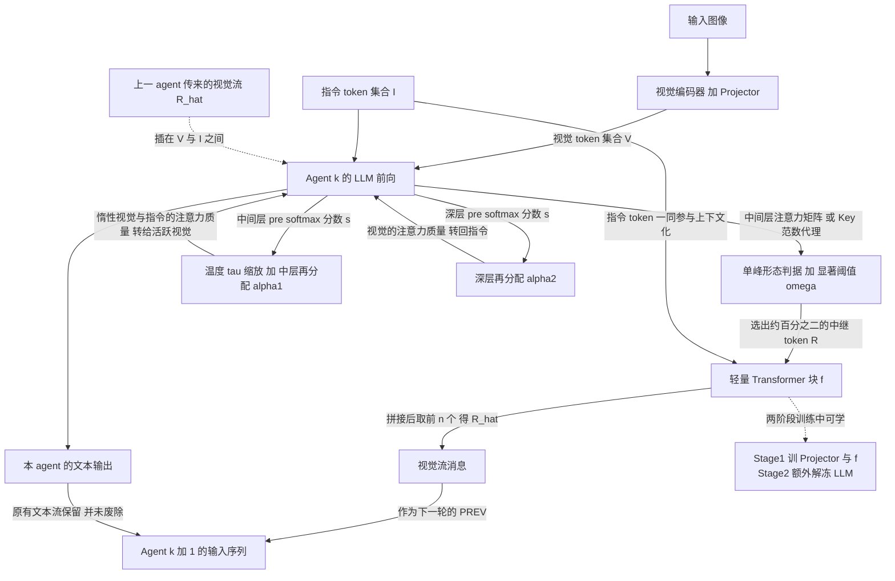

# ViF：Visual Multi-Agent System — Mitigating Hallucination Snowballing via Visual Flow

> **元信息**（来源：arXiv abs 页 / 论文原文）
> - arXiv: 2509.21789，cs.MA + cs.CV
> - 作者：Xinlei Yu, Chengming Xu, Guibin Zhang, Yongbo He, Zhangquan Chen, Zhucun Xue, Jiangning Zhang, Yue Liao, Xiaobin Hu, Yu-Gang Jiang, Shuicheng Yan
> - 版本：v1 = 2025-09-26，v2 = 2025-10-22，v3 = 2026-01-28
> - 代码：https://github.com/YU-deep/ViF.git （论文摘要末句自报；当前 GitHub 已重定向到 `xlyu0106/ViF`）
> - 本地 clone：`/home/yilin/tmp/mm-latent-repos/ViF`，HEAD = `205ebb9`（2025-10-03，**shallow clone，depth=1**；`git ls-remote origin` 确认远端 `refs/heads/main` 与本地 HEAD 同一 SHA，即我们读到的就是当前发布内容）
>
> **数字可靠性声明**：论文正文/表格内容通过 `WebFetch` 抓取 arXiv HTML 后由摘要模型转述获得。**结构性陈述（公式形式、超参取值、训练冻结表、方法描述）我做了逐字引用交叉验证**；但 §4 的大表逐格数字属于二手转录，引用进你自己的论文前必须回原 PDF 核对。**代码结论全部是我在本机实跑/实读得到的一手结果**，可复现。

---

## §0. 摘要翻译

> 由视觉语言模型（VLM）驱动的多智能体系统（MAS）能够胜任具挑战性的任务，但存在一种新的失效项——**多智能体视觉幻觉雪球效应（multi-agent visual hallucination snowballing）**：幻觉在单个智能体处被播下种子，并因系统过度依赖**文本流**来中继视觉信息，而被后续智能体不断放大。我们通过**轮次维（turn-wise）、层维（layer-wise）与 token 维（token-wise）**的注意力分析，就"视觉注意力分配的减少"这一角度，给出了幻觉雪球效应本质的细致洞察。这些分析引导我们识别出一个视觉 token 的子集——它们在**中间层具有单峰（unimodal）注意力峰值**，最好地保留了视觉证据，但随着智能体轮次加深而逐渐消退，从而导致了 MAS 中的视觉幻觉雪球效应。据此，我们提出 **ViF**，一个轻量、即插即用的缓解范式：它以选出的**视觉中继 token（visual relay tokens）**为载体、用**视觉流（Visual Flow）**来中继智能体间的消息，并施加**注意力再分配（attention reallocation）**来放大这一模式。实验结果表明，我们的方法显著减少了幻觉雪球效应，在**四种常见 MAS 结构 × 十个基座模型**上的**八个 benchmark** 中一致地提升了性能。源码公开于：https://github.com/YU-deep/ViF.git 。

---

## §1. 方法动机

### a) 作者为什么提出

（来源：论文原文 Introduction + Requisite Analyses）

现有 VLM-based MAS 沿用了纯文本 LLM MAS 的编排范式：每个 agent 看到图像、生成一段**自然语言**描述/结论，下一个 agent 读这段文字继续推理。作者观察到一个此前未被命名的失效模式：**幻觉不是独立发生的，而是会沿 agent 链被放大**。第 1 个 agent 说"图里有两只猫"（错的），第 5 个 agent 会把它当成既定事实继续推理，第 20 轮时整条链已经建立在一个虚构的视觉前提上。

作者明确把它拆成两个相互作用的机制（论文原文）：

1. **Intrinsic hallucination**：单个 VLM agent 对视觉内容产生错误的文字描述或断言；
2. **Hallucination propagation**：对文本信息流的过度依赖"**压缩并选择性强调**视觉特征，使得幸存下来的幻觉断言被下游 agent 当作权威"。

关键论断：**只降低单 agent 的幻觉率，无法解决传播问题**（论文原文明确这么说）。这是他们要另起炉灶的理由——不是做更好的单模型去幻觉，而是改**通信介质**。

### b) 现有方法的具体痛点（不是泛泛而谈）

作者用三组量化观察把痛点钉死（来源：论文原文 Requisite Analyses；数字为 HTML 转录，建议核对）：

- **轮次维**：视觉 token 获得的平均注意力随 agent 轮次单调衰减。Turn 1 = 0.165 → Turn 10 = 0.099（↓40%）→ Turn 20 = 0.063（↓62%）。与此同时**指令 token 的注意力相应上升**，system token 与 output token 的注意力基本稳定。也就是说：随着轮次推进，模型越来越"读上文"、越来越不"看图"。
- **层维**：中间层原本存在的视觉注意力峰**随轮次变平**。作者认为中间层正是"文本与视觉信息主要融合与交互"的地方（论文原文），峰变平 = 融合失效。
- **token 维（关键）**：作者做了**视觉 token 丢弃消融**——在中间层丢掉 50% 的某类视觉 token，看性能掉多少：

  | 丢弃对象 | 中间层丢 50% 后的分数 | 相对下降 |
  |---|---|---|
  | Random tokens | 66.1 | ↓19.1 |
  | Inactive tokens | 82.9 | ↓2.3 |
  | **Unimodal tokens** | **44.5** | **↓40.7** |

  论文原文的结论句：中间层丢弃 unimodal token 造成的性能退化"在丢四分之一时**几乎是其他子集的三倍**"。

- **压死骆驼的那根稻草**：这批 unimodal token 的占比本身在衰减——**Turn 1 占视觉 token 的 1.22%，Turn 20 只剩 0.10%**（约 −91%）。即：**最承载视觉证据的那一小撮 token，恰恰是随轮次消失得最快的**。

这就是痛点的精确形态：不是"视觉信息不够"，而是"视觉信息集中在极少数 token 上，而这极少数 token 在多智能体传递中被系统性地饿死了"。

### c) 研究假设 / 直觉（一两句话）

**假设**：agent 间只要还用文本当唯一介质，视觉证据就必然被压缩掉；如果把那 ~2% 承载视觉证据的 unimodal 视觉 token 本身（而不是它们的文字描述）直接接力给下一个 agent，并在注意力层面主动把资源掰回给这些 token，雪球就能被掐断。

---

## §2. 方法设计 ★本节最详★

### 2.0 总览流程图



### 2.1 符号表

| 符号 | 含义 | 形状 / 取值 |
|---|---|---|
| $\mathcal{V}=\{v_1,\dots,v_m\}$ | 完整视觉 token 集合 | $m$ 个 token，每个 $v_i\in\mathbb{R}^{d}$，$d$ = LLM 隐层维度 |
| $\mathcal{I}$ | 指令 token 集合 | $\vert\mathcal{I}\vert$ 个，每个 $\in\mathbb{R}^{d}$ |
| $\mathcal{T}$ | 该 agent 输入序列的全部 token 集合（system + vision + instruction + output） | $\vert\mathcal{T}\vert = T$ |
| $\mathcal{R}=\{r_1,\dots,r_n\}\subset\mathcal{V}$ | 选出的**视觉中继 token** | $n\ll m$，实测 $n/m\approx 1\%\sim2.3\%$ |
| $\hat{\mathcal{R}}$ | 上下文化后的中继 token | $\in\mathbb{R}^{n\times d}$ |
| $f(\cdot)$ | 轻量 Transformer 块（**可学参数**） | 见 §2.4 |
| $\oplus$ | 序列维拼接 | — |
| $\mathcal{A}_l$ | 第 $l$ 层**跨所有注意力头平均**后的注意力矩阵 | $\in\mathbb{R}^{T\times T}$ |
| $M_{\text{token\_type}}$ | 选取某类 token 的指示 mask | $\in\{0,1\}^{T\times T}$ |
| $s,\ s_i$ | softmax 之前的注意力分数（logit） | $s\in\mathbb{R}^{T\times T}$ |
| $\omega$ | 单峰形态的**显著性阈值** | 论文取 $0.3$ |
| $\tau$ | 温度缩放系数 | 论文取 $0.8$ |
| $\alpha_1$ | **中间层**再分配系数 | 论文取 $\mathbf{0.1}$ |
| $\alpha_2$ | **深层**再分配系数 | 论文取 $\mathbf{0.3}$ |
| $\mathcal{V}_\oslash$ | **惰性（inactive）**视觉 token 集合 | 定义见 §2.2 |
| $\mathcal{V}_\circ=\mathcal{V}-\mathcal{V}_\oslash$ | **活跃（active）**视觉 token 集合 | — |
| $\mathcal{C}$ | 被"收集"起来待再分配的注意力质量 | 标量（每个 query 行一个） |
| $M_c,\ M_r$ | 收集 mask / 再分配 mask | $\in\{0,1\}^{T\times T}$ |
| $d_i, D, N, h_i$ | HS 分数中的传播距离 / 总距离 / agent 数 / 幻觉严重度 | 见 §4 |

> **关键的 $\alpha$ 归属**（论文 v1 逐字引用，我做了三次独立抓取交叉确认）：
> *"the salience of unimodal morphology ω is 0.3, the temperature scaling τ is 0.8, the reallocation coefficient α1,α2 **in the middle and deep layers are set to 0.1 and 0.3**"*
> ⇒ **中间层 $\alpha_1=0.1$，深层 $\alpha_2=0.3$**。记住这个，§5 会用它揭一个 repo 的坑。

### 2.2 步骤一：注意力分配的度量与 token 分型（输入 → 处理）

**输入**：某个 agent 一次前向中，第 $l$ 层的多头平均注意力矩阵 $\mathcal{A}_l\in\mathbb{R}^{T\times T}$。

**某一类 token 拿到的注意力总量**（论文 Eq. 5-6）：

$$
\text{Allocation}_{\text{token\_type}}=\sum_{i\in\mathcal{T}}\sum_{j\in\mathcal{T}}\mathcal{A}_l(i,j)\circ M_{\text{token\_type}}
$$

> **通俗解释**：把注意力矩阵按"列属于哪类 token"打上 mask，再把留下来的格子全加起来，就得到"这一层里，这一类 token 一共被看了多少"。$\circ$ 是逐元素乘。作者就是用这个量画出 §1 里那些随层、随轮次的曲线。

**token 分型**（论文 Appendix B.1，转述）：对每个视觉 token，考察它的注意力分配**沿层号变化的曲线**（横轴是层，纵轴是该 token 在该层拿到的注意力）。按曲线形态分：

- **惰性 inactive（$\mathcal{V}_\oslash$）**：原文——"attention values are **below the lower quartile** and whose **fluctuation does not exceed 20%**"，即注意力值低于下四分位数、且全程波动不超过 20%。**通俗讲就是"全程躺平、哪层都没人看"的 token**。
- **活跃 active（$\mathcal{V}_\circ$）**：其余的，形态上分为**单调上升 / 单调下降 / 单峰（unimodal）**三种。
- **单峰 unimodal**：曲线是**单峰的**，且**峰值超过显著阈值 $\omega$**（原文："we select tokens with attention allocation of a unimodal distribution, whose peak surpasses the salience threshold ω"）。峰出现在中间层。

> ⚠️ **忠于原文的一个坦白**：论文对"unimodal"的**算法化判据**（怎么判一条离散曲线是不是单峰、峰宽怎么算、$\omega$ 是绝对阈值还是归一化后的阈值）**在正文和 Appendix B.1 中都没有给出可执行的定义**。这是本文方法描述上最薄的一环，而它恰恰是全篇的立论基础。**这一点在 §5 会被代码进一步坐实——代码里根本没有任何单峰性检验。**

**输出**：$\mathcal{R}=\{r_1,\dots,r_n\}\subset\mathcal{V}$，$n\ll m$。

**Flash-Attention 下的退路（论文原文明确写了）**：很多现代 VLM 用 Flash-Attention，**拿不到显式的注意力矩阵**。作者给了一个代理量——**Key-Norm**，即 key 矩阵的 $L_2$ 范数：

$$
\text{prom}(v_i)=\lVert K_i\rVert_2,\qquad K_i\in\mathbb{R}^{d}
$$

> **通俗解释**：注意力分数是 $q\cdot k$，在 $q$ 分布大致各向同性时，$\lVert k\rVert$ 大的 token 天然更容易吃到高注意力。所以拿 key 的模长当"这个 token 有多显眼"的廉价代理。**这条对做 vLLM / FlashAttention 工程的人非常实用**（§6 会讲）。

### 2.3 步骤二：视觉流的构造（Visual Information Relay）

$$
\hat{\mathcal{R}}=f\big(\mathcal{R}\oplus\mathcal{I}\big)[:n]
$$

- $\mathcal{R}\oplus\mathcal{I}$：把 $n$ 个中继 token 和指令 token 在序列维**拼起来**，得到长度 $n+\vert\mathcal{I}\vert$ 的序列；
- $f(\cdot)$：一个**轻量 Transformer 块**，双向自注意力；
- $[:n]$：只取输出的前 $n$ 个位置，保持长度不变。

> **通俗解释**：光把"图里最关键的那 2% 视觉 token"原样丢给下一个 agent 是不够的——下一个 agent 不知道当前任务在问什么。所以先让这批视觉 token 和**当前指令**在一个小 Transformer 里对一遍话，让它们"带上任务上下文"，再丢过去。可以理解成一次**任务条件化的视觉摘要**，只不过摘要的载体是向量而不是文字。
>
> **这是全篇唯一带可学参数的模块。它的存在就是"training-free"这个说法站不住的直接原因。**

### 2.4 步骤三：消息注入下一个 agent（位置与位置编码）

**论文逐字原文**：

> *"the visual relay tokens will be transmitted to the subsequent agent, which will be **inserted between the original vision tokens and instruction tokens**, and be fed to the final LLM together with other tokens. To retain the spatial information of visual relay tokens, we **apply the same positional encoding strategy as the previous agent**."*

拆解：

1. **插入位置**：下一个 agent 的输入序列排布为
   $$[\text{system}]\ \Vert\ \underbrace{\mathcal{V}^{(k+1)}}_{\text{它自己的视觉 token}}\ \Vert\ \underbrace{\hat{\mathcal{R}}^{(k)}}_{\text{上一个 agent 的视觉流}}\ \Vert\ \underbrace{\mathcal{I}}_{\text{指令}}\ \Vert\ \dots$$
   注意：**下一个 agent 仍然有自己完整的视觉输入**，视觉流是**增补**而不是替代。
2. **位置编码**：沿用上一个 agent 给这些 token 的位置编码策略，目的是保住**空间信息**（图像 patch 的相对位置）。
3. **走的是输入嵌入通路，不是 KV 通路**：$\hat{\mathcal{R}}$ 被当作**输入序列上的 token**塞进去，会**从第 0 层重新过一遍全部 LLM 层**。这跟"把第 $l$ 层的 KV 接到下一个模型的第 $l$ 层"是**完全不同的机制**。⚠️ 这一条对你们至关重要，§6 会重点讲。
4. **文本流并未被废除**：论文全程说的是"optimizes inter-agent visual messages"——视觉流是**加在文本流之上**的增强，不是替代品。

> ⚠️ **论文未交代的部分（我的判断）**：$\hat{\mathcal{R}}$ 是否跨多轮累积（第 20 轮时序列里有 19 份视觉流？还是只保留上一轮？）、多个上游 agent 汇聚时怎么合并——论文**没有说**。在 circular 结构（20 turns）下这直接决定序列长度是 $O(1)$ 还是 $O(\text{turns})$ 增长。**标注为：论文缺失，非我推断结论。**

### 2.5 步骤四：注意力再分配（Attention Reallocation）

这一步跟视觉流**正交**：视觉流负责"把证据送过去"，再分配负责"逼模型去看它"。

#### (a) 中间层：温度缩放

$$
\mathcal{A}=\text{Softmax}_\tau(\mathcal{S})=\frac{\exp(s/\tau)}{\sum_{i=1}^{m}\exp(s_i/\tau)},\qquad \tau=0.8
$$

> **通俗解释**：$\tau<1$ 让 softmax 变**更尖**。既然中间层本来就有一个视觉注意力峰、而它随轮次变平，那就人为把这个峰**重新压尖**。这是最省事的一招——不改任何 mask，只改一个除数。

#### (b) 中间层：从"惰性视觉 + 指令"收集，转给"活跃视觉"

收集：
$$
\mathcal{C}=\alpha\sum_{i=1}^{m}s_i\circ M_c,\qquad
M_c(i,j)=\mathbb{I}\big((i\in\mathcal{T},\,j\in\mathcal{V}_\oslash)\ \vee\ (i\in\mathcal{T},\,j\in\mathcal{I})\big)
$$

再分配：
$$
\hat{s}=s+\frac{s}{\sum_{i=1}^{l}s_i}\,\mathcal{C}\circ M_r,\qquad
M_r(i,j)=\mathbb{I}\big(i\in\mathcal{T},\,j\in\mathcal{V}_\circ\big)
$$

其中 $\alpha=\alpha_1=0.1$。论文注明：**总注意力和保持为 1**。

> **通俗解释**：把"投给全程躺平的视觉 token"和"投给指令 token"的注意力，抽走 $\alpha_1=10\%$，全部转移给"活跃视觉 token"。转移的分法是**按各自现有的 $s$ 正比分配**（$\frac{s}{\sum s}$ 这一项就是这个意思）——本来被看得多的活跃 token，分到的增量也多，是"富者愈富"式的放大，不是平均分。
>
> **为什么中间层要削指令 token？** 因为 §1 的观察就是：轮次越深，注意力越往指令跑、越不看图。中间层是视觉-文本融合的关键层，这里就要**强行把预算掰回视觉侧**。

#### (c) 深层：方向反过来

论文原文："Deep Layers: Reallocation reverses: **from vision tokens to instruction tokens**, with the same process"，$\alpha_2=0.3$。

$$
\hat{s}=s+\frac{s}{\sum_i s_i}\Big(\alpha_2\sum_i s_i\circ M_c'\Big)\circ M_r',\quad
M_c'(i,j)=\mathbb{I}(j\in\mathcal{V}),\quad M_r'(i,j)=\mathbb{I}(j\in\mathcal{I})
$$

> **通俗解释**：深层是"组织语言输出答案"的地方，视觉证据在这里应该已经被读完了。此时再死盯着图像 patch 反而干扰生成。所以在深层**反向操作**：把视觉 token 的注意力抽 $\alpha_2=30\%$ 还给指令 token。
>
> **这个"中层给视觉、深层还给指令"的两段式设计，是 ViF 在方法层面最漂亮的一笔**：它不是简单地"提高视觉注意力"，而是承认了不同深度的层有不同分工。它也**与 §1 的实证观察严格对应**——§1 发现的是"中间层的峰变平"，所以补的就是中间层。

> ⚠️ **数学 vs 实证的边界**：$\hat s$ 保持归一化、总和为 1，这是**可推导的**。但"中层加视觉、深层加指令能降幻觉"是**纯实证**，论文没有、也无法给出理论保证。不要把 §1 的注意力衰减曲线读成因果——作者建立的是**相关性 + 干预有效**，不是"注意力衰减导致幻觉"的因果证明。

### 2.6 两阶段训练（论文原文，且这是本篇最容易被误读的地方）

论文原文："Following the typical training paradigm, we employ a **two-stage training process including a pre-training stage and instruction tuning stage**"，并给出如下冻结表（**逐字引用**，两列分别是 Stage 1 / Stage 2）：

| 模块 | Stage 1（Pre-Training） | Stage 2（Instruction Tuning） |
|---|---|---|
| Vision Encoder | **Frozen** | **Frozen** |
| Projector | **Trainable** | **Trainable** |
| Large Language Model | **Frozen** | **Trainable** |
| Transformer Block (Ours) | **Trainable** | **Trainable** |

其他训练设定（论文）：batch size = 256，lr = 5e-4（pre-training）/ 1e-5（instruction tuning），1–2 epochs。

> **结论（这是任务点 (1) 的正面回答）：ViF 绝对不是 training-free。**
> - 摘要里的 "lightweight, plug-and-play" 指的是 **"可以挂到不同 MAS 拓扑上、不需要重写编排逻辑，只多一个模块"**，**不是** "不用训练"。
> - 更严重的是：**Stage 2 把 LLM 也解冻了**。这已经越过了"不改 base model 权重"的界线。论文另一处说 ViF "can be integrated with other base VLMs in MAS... requiring only one additional module for visual relay selection"，这句话和冻结表**是自相矛盾的**——如果 LLM 会被 instruction tuning 改写，那它就不是往现成 checkpoint 上一挂就能用的模块。
> - 论文**没有说清楚**这套两阶段训练是**每个基座模型各训一遍**（10 个模型 = 10 次两阶段训练？）还是只训一次。我专门去查过，**论文对此保持沉默**。同样，**stage 1 / stage 2 用的具体训练数据集名称和规模，论文没给**。这是可复现性上的硬伤。**标注为：论文缺失。**

---

## §3. 与其他方法对比

### a) 本质不同

| 维度 | 单模型去幻觉（DeCo / VISTA / MemVR / FarSight / TAME） | 一般 VLM-MAS | **ViF** |
|---|---|---|---|
| 干预对象 | 单次前向的解码/注意力 | agent 编排拓扑 | **agent 之间的通信介质** |
| 视觉信息载体 | —（不涉及跨 agent） | 自然语言文本 | **文本 + 视觉 token 的隐状态** |
| 失效模式假设 | 单模型 attention sink / 语言先验过强 | — | **传播性放大** |

**本质差异一句话**：既有去幻觉方法在治"一个 agent 说错"，ViF 在治"错话被下一个 agent 当真"。作者用一句话把这两者切开：**降低单 agent 幻觉率并不能阻止雪球**（论文原文）。这是它能立住的核心论证。

**与"latent 通信"类工作的关系**：⚠️ 值得你们注意的是——我专门查过，**ViF 的 Related Work 完全没有讨论 latent / hidden-state / KV-cache 形式的 agent 间通信**，也没引 LatentMAS 一类工作。它是从"视觉幻觉 + VLM 注意力机制"这条线走过来的，不是从"MAS 通信带宽"这条线。**这对你们是好消息也是坏消息**（§6 详述）。

### b) 创新点与贡献度

论文自报的四条贡献（逐字）：

1. 形式化 multi-agent visual hallucination snowballing 现象，并系统性地把它和视觉注意力退化关联起来；
2. 提供大量分析，识别出中继视觉信息流的关键视觉 token；
3. 提出 ViF，用视觉流优化 agent 间视觉消息；
4. 在 8 个 benchmark × 4 种 MAS 结构上验证。

**我对贡献度的分级判断（推断）**：

- **贡献度最高的是 (1) 和 (2)，不是 (3)。** 那套"turn × layer × token"三维注意力剖析 + 三类 token 丢弃消融（unimodal 掉 40.7 vs inactive 掉 2.3）是**扎实、可复现、可被后人直接引用**的实证发现。这是本文真正的资产。
- **(3) ViF 本身的方法创新度中等**。"选一小撮 token 传给下游 + 温度缩放 + 注意力质量搬家"三招都不新，新在**组合**和**应用场景**（跨 agent）。而且它需要训练，还需要解冻 LLM，把"轻量"这个卖点大幅稀释了。
- **HS score 是一个被低估的副产品**：MAS 幻觉传播此前没有标准度量，作者定义了一个（§4）。

### c) 适用场景

- **最适合**：agent 轮次多（≥10）、拓扑稠密（circular）、视觉证据必须贯穿全链的任务——论文自己也承认 circular 结构雪球最严重、ViF 收益最大。
- **不适合**：单 agent、或 2–3 轮的浅链（雪球还没滚起来，收益被训练成本吃掉）；以及**任何不允许改 base model 权重的部署场景**（因为 Stage 2 要动 LLM）。
- **工程约束**：用 Flash-Attention 的模型必须走 Key-Norm 代理路径，此时"单峰"判据实际上退化成"key 模长大"，**与论文正文描述的机制已不完全是一回事**（我的判断）。

### d) 优缺点总结表

| 维度 | 优点 | 缺点 | 可改进点 |
|---|---|---|---|
| **问题定义** | 命名并量化了一个真实、此前无名的失效模式；三维注意力剖析扎实 | "注意力衰减 → 幻觉"只有相关性，无因果实验（如干预注意力后单独看幻觉率） | 做反事实干预实验隔离因果 |
| **方法机制** | 中层给视觉 / 深层还给指令的两段式设计有洞察；Key-Norm 退路有工程价值 | **单峰的算法化判据全文未给**——这是立论基础却没有可执行定义 | 给出峰检测算法与 $\omega$ 的归一化口径 |
| **训练成本** | 只多一个轻量 Transformer 块 | **不是 training-free**；Stage 2 解冻 LLM；训练数据未公开；是否每个基座各训一遍未说明 | 出一个真正冻结 LLM 的变体做对照 |
| **通用性** | 10 个基座 × 4 种 MAS 结构 × 8 个 benchmark，覆盖面确实广 | 若每个基座都要两阶段训练，"plug-and-play" 名不副实 | 报告跨基座迁移（在 A 上训的 $f$ 直接用到 B）的结果 |
| **效率** | 只传 ~2% 的视觉 token，序列增量小 | **论文零效率数字**：无 token 开销、无延迟、无显存对比。"lightweight" 是形容词不是测量 | 补 latency / 序列长度增长 / 显存表 |
| **可复现性** | 有 arXiv v3、有 repo 链接 | **repo 是不可运行的骨架**（§5）；无 checkpoint；无训练数据 | — |

---

## §4. 实验表现与优势

### a) 实验设计与设置（论文原文）

- **基座 VLM（10 个）**：LLaVA-v1.5 (7B/13B)、LLaVA-v1.6 (7B)、LLaVA-NeXT (7B/13B/34B)、LLaVA-OneVision (7B)、Qwen2-VL (7B)、Qwen2.5-VL (7B/32B)。
- **Benchmark（8 个）**：综合能力 = MME、MMBench、MM-Vet；幻觉 = CHAIR、POPE、AMBER、MMHal-Bench、HallBench。
- **四种 MAS 结构**（这是任务点 (6) 的论文侧答案）：
  1. **Linear**：顺序 agent 链，逐级依赖；
  2. **Layered**：分层/层级化组织；
  3. **Random**：随机连接拓扑；
  4. **Circular**：闭环，论文原文称其"densest collaborations and interactions"，**雪球效应最严重**。
  典型配置：**20 个 agent turn**。
- **指标**：各 benchmark 原指标 + 自定义的 **HS（Hallucination Snowballing）score**。

**HS score**（HTML 抓取，符号定义为论文给出）：

$$
\text{HS}=\frac{1}{N}\sum_{i}\frac{1}{1+\exp\!\big(D/2-d_i\big)}\cdot h_i
$$

- $d_i$ = 该幻觉的传播距离（传了几跳），$D$ = 总距离（链长），$N$ = agent 数，$h_i$ = 由裁判模型给出的幻觉严重度（0–100）。

> **通俗解释**：一个幻觉传得越远，前面那个 sigmoid 权重越接近 1，惩罚越重；刚出生就死掉的幻觉几乎不计分。所以 HS 度量的是**"传播性"而不是"发生率"**——这正好切中论文的立论。⚠️ 这条公式是 HTML 转录，符号顺序与 $D/2$ 的中心点建议回 PDF 核实。

### b) 关键数据

> ⚠️ 以下所有数字均为 HTML 二次转录，**引用前必须回原 PDF 逐格核对**。

**Table 2（主表，示例行：LLaVA-v1.5-7B，Linear 结构，baseline → +Ours）**

| Benchmark | Baseline | +ViF | Δ |
|---|---|---|---|
| MME | 1516.2 | 1531.8 | ↑15.6 |
| MMBench | 66.1 | 67.8 | ↑1.7 |
| MM-Vet | 32.4 | 34.6 | ↑2.2 |
| CHAIR ↓ | 52.4 | 51.7 | ↓0.7 |
| POPE | 86.7 | 88.6 | ↑1.9 |
| AMBER | 85.2 | 87.8 | ↑2.6 |
| MMHal-Bench | 40.5 | 42.8 | ↑2.3 |
| HallBench | 48.0 | 50.6 | ↑2.6 |

四种结构上的平均提升约 **2.4–3.8%**；Table 3（13B–32B 大模型，circular 结构）平均提升 **3.6–4.4%**，且论文声称**参数量更大的 baseline 收益更大**。

**Table 4（HS 分数，circular + LLaVA-NeXT-7B，越低越好）**

| Benchmark | Baseline HS | +ViF HS | Δ |
|---|---|---|---|
| CHAIR | 18.9 | 12.8 | ↓6.1 |
| POPE | 29.1 | 17.0 | ↓12.1 |
| AMBER | 31.1 | 17.7 | ↓13.4 |
| MMHal-Bench | 40.8 | 24.1 | ↓16.7 |
| HallBench | 47.4 | 27.8 | ↓19.6 |
| **平均** | — | — | **↓39.8%** |

**Table 5（与专门去幻觉方法比，circular + LLaVA-NeXT-7B）**

| Method | CHAIR ↓ | POPE | AMBER | MMHal-B | HallB | HS 降幅 |
|---|---|---|---|---|---|---|
| Baseline | 43.0 | 91.0 | 89.4 | 47.9 | 53.1 | — |
| MemVR | 43.8 | 90.5 | 88.9 | 44.8 | 49.2 | 18.4% |
| VISTA | 43.4 | 91.2 | 90.5 | 46.3 | 50.7 | 3.1% |
| DeCo | — | — | — | — | — | −1.0% |
| FarSight | — | — | — | — | — | −5.4% |
| TAME | — | — | — | — | — | −3.7% |
| **ViF** | **41.2** | **93.3** | **92.7** | **51.1** | **55.7** | **39.8%** |

论文自报：在原指标上"at least 4.2% enhancements"，HS 分数平均改善 **34.4%**。

> **这张表是全篇最有说服力的一张**：DeCo / FarSight / TAME 的 HS 降幅是**负的**——单模型去幻觉方法在 MAS 里**不但没用，还可能让雪球更糟**。这直接坐实了 §1 的核心论断"降低单 agent 幻觉率解决不了传播"。**这一条对你们做多模态 MAS 的 motivation 段落极其好用，可以直接引。**

**消融（Table 6，circular + LLaVA-NeXT-7B）**

- 移除 25–75% 的 relay token：掉 0.4–2.0 分（**说明 relay token 的边际价值随数量递减很快，2% 那一档已接近饱和**——我的解读）；
- 只去掉中间层再分配：掉 1.2 分；
- 只去掉深层再分配：掉 0.2–0.7 分 ⇒ **中间层再分配是两者中更重要的那一半**。

**超参最优点（Table 9–11）**：$\omega=0.3$（对应约 2.3% 的 token 比例）、$\tau=0.8$、$\alpha_1=0.1$（中层）、$\alpha_2=0.3$（深层）。

### c) 优势最明显的场景

1. **circular 结构 + 20 turns**：雪球最严重的地方收益最大（HS ↓39.8%），符合方法的作用机理，是**内部一致性很强的证据**。
2. **纯幻觉 benchmark（MMHal-Bench / HallBench）比综合 benchmark（MME / MMBench）收益更大**：MME 从 1516.2 涨到 1531.8 只有 ~1%，而 HallBench 涨 2.6 分（~5%）。说明 ViF 是**定向治幻觉**，不是无差别涨点。
3. **大模型上收益更大**（3.6–4.4% vs 2.4–3.8%）。作者没解释为什么，我的推断：大模型层数更多，中间层的视觉注意力峰更明显，unimodal token 的信号更干净，选择更准。**标注为推断。**

### d) 局限性

**论文明说的**（Limitations，逐字）：

> "Although we conduct experiments on a total of ten models with different sizes, which verifies the robustness of compatibility of our proposed method, more experiments are still recommended. For example, the results on smaller size VLMs, e.g., 3B, and also larger baselines, e.g., 72B, could provide further evidence."

以及："the inclusion of more series of baselines, such as InternVL series... is also beneficial."

> 说白了作者自陈的局限只有一条："模型覆盖还能更多"。**这是一个非常轻的 limitation 段落**。

**论文没说但真实存在的（我的判断，逐条标注）**：

1. **"plug-and-play" 与两阶段训练 + 解冻 LLM 直接冲突**。（**依据：论文冻结表逐字引用，非推断**）
2. **训练数据集完全未公开**，stage 1 / stage 2 用了什么、多大规模，正文和附录都没有。（**依据：多次定向抓取未找到，属论文缺失**）
3. **是否每个基座模型各训一遍未说明**。若是，10 个模型的实验成本与"轻量"的叙事严重不符；若不是（一个 $f$ 通吃），那应该报告跨基座迁移实验，但论文没有。（**推断**）
4. **零效率数字**。全文无 token 开销、延迟、显存对比。一个标榜 "lightweight" 的方法不报开销，是明显的空白。（**依据：定向抓取确认无该内容**）
5. **单峰判据无可执行定义**，导致方法无法被独立复现。（**依据：Appendix B.1 抓取确认**）
6. **Flash-Attention 下走 Key-Norm 后，"单峰"这个机制叙事实际上已不成立**——Key-Norm 是个静态的、与层无关的标量，根本无法表达"沿层的单峰形态"。论文把它当作等价替代，但两者在机制上不是一回事。（**推断，但这是很强的推断**）
7. **视觉流跨多轮是否累积、序列长度是否随 turn 增长，未交代**。circular 20 turns 下这是个实质问题。（**论文缺失**）
8. **HS score 是作者自定义 + 用裁判模型打 $h_i$**，裁判模型未指明，存在自定义指标自证的风险。（**推断**）

---

## §5. 论文 ↔ 源码对照

> 本节所有结论均为我在 `/home/yilin/tmp/mm-latent-repos/ViF` 上**实读 + 实跑**得到，可复现。

### 5.0 一句话结论

**这个 repo 是一份不可运行的骨架（skeleton），不是论文方法的实现。** 全仓 42 个文件、Python 代码合计约 500 行，**没有任何真实 VLM**，`hidden_states` 是 `torch.randn` 生成的随机数，**训练脚本对 ViF 模块产生零梯度**，而论文全篇的核心——"agent 间的视觉流"——**一行都没有实现**。

### 5.1 逐文件判定（真实现 vs stub）——任务点 (2)

| 文件:行 | 对应论文 | 判定 |
|---|---|---|
| `vif/models/vif_block.py:1-11` | §2.3 式 $\hat{\mathcal{R}}=f(\mathcal{R}\oplus\mathcal{I})[:n]$ | ✅ **唯一忠实的真实现**。`torch.cat([R,I],dim=1)` → `TransformerEncoder` → `x[:, :R.size(1), :]`，与公式逐项对应 |
| `vif/utils/selection.py:9-11` `aggregate_keynorm` | Key-Norm 代理 | ✅ 形式正确（`torch.norm(K, dim=-1)`），但见 5.3 |
| `vif/utils/reallocation.py:2-3` | 温度缩放 $\text{Softmax}_\tau$ | ⚠️ 形式对，但见 5.4 |
| `vif/utils/reallocation.py:4-16` | 中层/深层再分配 | ⚠️ 大方向对，**公式细节与论文不符**，见 5.4 |
| `vif/models/wrapper.py:9-27` | 整体串联 | ⚠️ 骨架逻辑在，但接的是假模型 |
| `vif/utils/selection.py:2-8` `select_relay_tokens` | §2.2 单峰选择 | ❌ **不是论文的判据**，见 5.3 |
| `vif/models/base_stub.py:10-21` | 真 VLM | ❌ **纯 stub**：`base_stub.py:12` = `hidden = torch.randn(B,T,D)` |
| `vif/models/vlm_iface.py:9-10` | 真 VLM 后端 | ❌ 作者自己写了 `raise NotImplementedError('Implement your real VLM backend here.')` |
| `vif/multiagent/messaging.py:4-7` | §2.4 消息注入 | ❌ **只有一个 3 字段 dataclass，全仓无人 import**（实测 grep：唯一出现处就是它自己的定义行）——**死代码** |
| `vif/multiagent/memory.py:2-10` | 工作记忆 | ❌ 一个存 dict 的环形 list，与视觉流毫无关系 |
| `vif/multiagent/agent.py:19-26` | MAS 主循环 | ❌ **单轮**、收集各 worker 的**文本** answer 做 majority vote——**恰恰就是论文要批判的 textual flow** |
| `vif/multiagent/router.py:4-5` | 四种 MAS 结构 | ❌ 只 `return [VisionWorker(...) for ...]`，**扁平列表，无任何拓扑** |
| `vif/multiagent/allocation.py:10-12` | — | ❌ 按难度给 1/3/5 个 agent，**论文里没有这个机制** |
| `vif/multiagent/consensus.py:4-13` | — | ❌ 置信度加权多数投票，**论文里没有这个机制** |
| `vif/multiagent/difficulty.py:9-24` | — | ❌ 论文无此机制，**且正则写坏了**，见 5.7 |
| `scripts/train_stage1.py` / `train_stage2.py` | §2.6 两阶段训练 | ❌ 冻结策略与论文表一致，但**loss 与 ViF block 无梯度连接**，见 5.2 |

**最致命的一条（实测 grep）**：`vif/multiagent/` 目录下**没有任何一行**引用 `wrapper` / `selection` / `reallocation`。也就是说，**ViF 侧（models/utils）和 MAS 侧（multiagent）是两个完全断开的子系统**。论文的全部立意——"用视觉流替代文本流做 agent 间通信"——在代码里**不存在连接点**。

### 5.2 ★ 训练脚本训不到 ViF 模块（实测，任务点 (1) 的代码侧答案）

我实跑了梯度检查：

```
vif block param count: 25192448
params with NONZERO grad: 2 / 92
vif.* params: 24  of which grad is None: 24
```

**ViF block 有 2519 万参数，反向传播后 24 个参数全部 `grad is None`。整个模型 92 个参数里只有 2 个拿到非零梯度**——就是 `base_stub.loss_head` 的 weight 和 bias。

**根因**（源码级）：`vif/models/base_stub.py:18` 在 `base.forward()` **内部**就把 loss 算完了：

```
logits = self.loss_head(hidden.mean(dim=1)); loss = F.cross_entropy(logits, torch.zeros(B, ...))
```

用的是 ViF **修改之前**的 `hidden`；而 `vif/models/wrapper.py:19,27` 修改 `hidden` 之后**没有重算 loss**，只是把新 hidden 塞回 dict。**梯度图在 ViF block 那一支上是断的。**

而且这个 loss 本身也是假的：对常数标签 `torch.zeros(B)` 做 10 类交叉熵，输入还是 `torch.randn` 的随机 hidden。

> **任务点 (1) 的完整结论**：
> - **论文层面：ViF 明确需要训练**，两阶段，Stage 2 连 LLM 都解冻（论文冻结表逐字引用）。摘要的 "plug-and-play" 指的是"对 MAS 拓扑即插即用、只多一个模块"，**不是 training-free**。这是本文的口径问题，读者不能被摘要误导。
> - **代码层面：`train_stage1.py` / `train_stage2.py` 训的是"什么都不是"**——在随机噪声上训一个 10 类分类头，ViF block 拿不到任何梯度。它们**不是**论文那套训练的实现，只是一个训练循环的形状。
> - **两者互相印证的一点**：`configs/stage1.yaml:22-25`（`freeze_llm: true`）与 `configs/stage2.yaml:23`（`freeze_llm: false`）**精确复现了论文冻结表**。这反过来**加固**了"论文确实要训、且 Stage 2 确实动 LLM"这个结论——作者写 config 时是照着自己的表写的。

### 5.3 ★ 单峰选择规则的代码实现（任务点 (3)）

`vif/utils/selection.py:2-8` 全文：

```
def select_relay_tokens(sig, relay_ratio, omega=0.3):
    B, N = sig.shape; k = max(1, int(N*relay_ratio))
    x = (sig - sig.mean(dim=1,keepdim=True)) / (sig.std(dim=1,keepdim=True)+1e-6)
    x = torch.sigmoid(x / max(1e-6, omega))
    vals, idx = torch.topk(x, k, dim=1)
    ...
```

**三个独立问题**：

**(i) 完全没有单峰性检验。** 没有跨层曲线、没有峰值检测、没有"峰值超过 $\omega$"的判断，也没有 active/inactive 的"下四分位数 + 波动 ≤20%"判据。输入 `sig` 是一个 **(B,N) 的一维显著性向量**，压根不含层维度——**结构上就不可能表达"沿层单峰"**。论文里最核心的那个概念，代码里不存在。

**(ii) `omega` 在正常取值下是彻底的 no-op（实测）。** z-score 标准化和 sigmoid **都是单调变换**，top-k 对单调变换不变，所以结果恒等于对原始 `sig` 直接 top-k。实测：

```
omega=0.3    idx = [[59,69,89,45,23],[34,22,82,27,97]]
omega=1.0    idx = [[59,69,89,45,23],[34,22,82,27,97]]
omega=100.0  idx = [[59,69,89,45,23],[34,22,82,27,97]]
raw topk     = [[59,69,89,45,23],[34,22,82,27,97]]   ← 完全一致
```

**(iii) `omega` 取小值时反而变有害。** `omega=0.01` 时 sigmoid 饱和到 1.0，top-k 退化成按索引顺序取：

```
omega=0.01   idx = [[58,49,54,57,62],[49,46,47,48,55]]   ← 连号，明显是饱和后的任意序
```

也就是说，论文里被消融出"最优 $\omega=0.3$"的那个超参，在代码里**要么无效、要么有害**，没有第三种可能。

**(iv) Key-Norm 从"备选"变成"唯一路径"。** `vif/models/wrapper.py:15`：

```
prom = aggregate_keynorm(mid_keys) if (mid_signal is None or self.use_keynorm) else mid_signal
```

三个 config 全部写 `use_keynorm: true`，所以 `mid_attn_scores` **永远不会被使用**。论文里 Key-Norm 只是 Flash-Attention 场景下的**退路**，代码里它是**唯一实现**。

### 5.4 ★ attention reallocation 的代码实现（任务点 (4)）

`vif/utils/reallocation.py:4-10`（中层）与 `:11-16`（深层）。**大方向对得上**（从 inactive+instruction 收集、按 alpha 比例、转给 active vision；深层反向），但有三处实质不符：

| # | 论文 | 代码 | 严重度 |
|---|---|---|---|
| 1 | $M_c(i,j)$、$M_r(i,j)$ 是 **$T\times T$ 二维 mask**，作用在注意力矩阵上 | 作用在 **(B,T) 一维向量**上（实测 `mid_probs.shape = (2,64)`），不是 (B,H,Q,K) | **高**——这不是真的在改注意力 |
| 2 | 再分配**按 $s$ 正比**：$\hat s = s + \frac{s}{\sum_i s_i}\mathcal{C}\circ M_r$ | **均匀分配**：`reallocation.py:7-8` 的 `give = ones/count`，与 $s$ 无关 | **高**——公式实打实不一致 |
| 3 | 温度缩放**只用于中间层** | `wrapper.py:22,25` 中层深层**共用同一个 `tau`** | 中 |

唯一对的部分：两个函数末尾都做了 `new / new.sum(-1)` 归一化，实测行和 = 0.999999，符合论文"总注意力和保持为 1"。

### 5.5 ★ 消息注入下一个 agent（任务点 (5)）

**代码里不存在。** 逐条：

- `vif/multiagent/messaging.py`：**8 行，只有一个 `Message` dataclass（role / content / meta），全仓库无任何 import**。实测 grep 唯一命中就是它自己的 `class Message:` 定义行。**纯死代码。**
- `vif/multiagent/memory.py:2-10`：`EpisodicMemory` 是个 capacity=200 的 list，`add` / `last` 两个方法，存的是 `{'image': 路径字符串, 'instruction': 文本, 'final': dict, 'all': list}`——**全是文本和路径，没有任何张量**。
- `vif/multiagent/agent.py:23-24`：
  ```
  outputs = [a.act(image_path=..., instruction=..., tools=tools) for a in agents]
  final = majority_vote(outputs)
  ```
  各 worker **独立**跑一次，把**文本 answer** 收集起来投票。**没有 agent 间传递、没有多轮、没有任何视觉信息流。**

**所以论文里"插在原视觉 token 与指令 token 之间 + 沿用上一 agent 的位置编码"这条关键设计，在代码里连接口都没有。** 位置编码相关代码全仓零行。

### 5.6 ★ 四种 MAS 结构（任务点 (6)）

- **论文**：Linear（顺序链）、Layered（层级）、Random（随机连接）、Circular（闭环，最稠密、雪球最严重），典型 20 turns。
- **代码**：`vif/multiagent/router.py` 全文 5 行：
  ```
  def build_agents(role_list): return [VisionWorker(name=f'agent_{i+1}', role=r) for i,r in enumerate(role_list)]
  ```
  **一个扁平列表，零拓扑，零 turn 循环。** `allocation.py:10-12` 按难度桶给 1/3/5 个 agent，`consensus.py` 做置信度加权多数投票——**这两个机制论文里根本没有**，是 repo 自己加的、与论文无关的东西。

**结论：四种 MAS 结构，代码实现了 0 种。**

### 5.7 附带发现：`difficulty.py` 的正则写坏了（实测）

`vif/multiagent/difficulty.py:9-15` 在 raw string 里写了 `\\b`：

```
'why': re.compile(r'\\bwhy\\b', re.I)      # 实际 pattern = '\\\\bwhy\\\\b'
```

raw string 中的 `\\` 是"转义的字面反斜杠"，所以正则匹配的是**字面反斜杠 + bwhy + 字面反斜杠 + b**，永远匹配不到自然语言。实测：

```
'why is the man running'    → DifficultyScore(score=0.2, buckets='easy')
'How many cats are there?'  → DifficultyScore(score=0.2, buckets='easy')
```

`why` / `how` / `count` **三个 pattern 100% 失效**；只有 alternation 中间那些裸词分支（`sum`/`minus`/`difference`/`text`/`word`/`character`）能命中。后果：一个数数题被判为 easy → 只分配 1 个 agent。**这个机制论文里本来就没有，所以不影响论文结论，但它是"这份代码没有被认真跑过"的又一个铁证。**

### 5.8 ★ 超参与论文不一致

| 超参 | 论文（逐字引用） | `configs/*.yaml` | 判定 |
|---|---|---|---|
| $\omega$ | 0.3 | `omega: 0.3` | ✅ |
| $\tau$ | 0.8 | `tau: 0.8` | ✅ |
| $\alpha_1$（**中层**） | **0.1** | `alpha_mid: 0.2` | ❌ **差 2 倍** |
| $\alpha_2$（**深层**） | **0.3** | `alpha_deep: 0.1` | ❌ **差 3 倍** |
| batch size | 256 | `batch_size: 8`（`grad_accum: 1`） | ❌ 差 32 倍 |
| mm_lr stage1 | 5e-4 | `mm_lr: 5.0e-4` | ✅ |
| mm_lr stage2 | 1e-5 | `mm_lr: 1.0e-5` | ✅ |
| relay 比例 | ~1.22%–2.3% | `relay_ratio: 0.02` | ✅ 大致相符 |

**$\alpha$ 那两格尤其扎眼**：不只是数值不同，**中层和深层的相对大小关系是反的**（论文中层 < 深层，config 中层 > 深层）。**任何人照着 config 复现都不可能得到论文的数**。

### 5.9 能不能直接跑通？——**不能，开箱即崩**

实测（一手结果）：

```
$ python3 scripts/run_multi_agent.py --image ... --question ...
ModuleNotFoundError: No module named 'vif'

$ python3 scripts/train_stage1.py --config configs/stage1.yaml
ModuleNotFoundError: No module named 'vif'
```

**原因**：仓库**没有 `setup.py` / `pyproject.toml`**，也**没有 `vif/__init__.py`、`vif/models/__init__.py`、`vif/utils/__init__.py`、`vif/data/__init__.py`**（实测 `find -name __init__.py` 只有 `vif/multiagent/__init__.py` 一个，还是空文件），README 的 Quick Start 里也**没有 `pip install -e .` 或 `PYTHONPATH=.`**。README 上写的命令，逐字复制粘贴，第一条就崩。

加上 `PYTHONPATH=.` 之后：
- `ViFWrapper` 前向**能跑通**（我实跑成功，`hidden torch.Size([2,64,1024])`，`mid_probs`/`deep_probs` 行和 = 1.0）——但跑的是随机噪声。
- 训练脚本仍会崩，因为 `examples/data/images/` 目录**不存在**（三个 jsonl 里的 `sample1.jpg` / `sample2.jpg` 全是空指向）。
- 顺带一提：三个 `.jsonl` 文件其实是**单行 JSON 数组**（不是 JSON Lines），`dataset.py:7` 用 `json.load` 读它反而是对的——命名误导但功能一致。每个文件只有 1–2 条玩具样本。

**缺什么才能真正跑起来**：真实 VLM 加载与推理、attention hook 抽 $\mathcal{A}_l$、vision/instruction token 的边界切分、沿层单峰检测、active/inactive 判据、真正作用在 (B,H,Q,K) 上的 reallocation、agent 间视觉流的传递与注入、位置编码处理、四种 MAS 拓扑、多轮循环、真实训练数据与真实 loss、checkpoint。**也就是说，论文里的每一个模块都要重写。**

### 5.10 仓库状态

- 最后一次 commit：**2025-10-03**（`205ebb9`，"modify README.md"），距今（2026-08）已近 10 个月无更新，而**论文本身已更新到 v3（2026-01-28）**。
- **无 checkpoint 发布**。Issue #1 是 HuggingFace 的 NielsRogge 在 2025-09-29 提的 "Release ViF implementation on Hugging Face"，**至今 open**。
- README 里所有"结果"都是 `static/*.png` 截图，不是可复现的产物。

---

## §6. 对「多模态 LatentMAS」项目的可复用性

### 6.1 可以直接拿来用的

1. **`ViFBlock`（`vif/models/vif_block.py:1-11`）** —— 全仓唯一忠实实现，11 行：`cat([R,I]) → TransformerEncoder → [:n]`。做"任务条件化的视觉 latent 摘要"时可以直接抄。**代价：它有参数，要训。**

2. **Key-Norm 显著性代理（论文 §3 + `vif/utils/selection.py:9-11`）** —— 这一条对你们价值最高。你们的技术栈重心在 vLLM / LMCache / KV cache，而 vLLM 全线走 FlashAttention，**拿不到显式 attention 矩阵**。`prom(v_i)=‖K_i‖_2` 让你们**不用改 attention kernel** 就能拿到 per-token 显著性，而且它算的就是 KV cache 里已有的 K —— 和你们的 blend / KV 复用那套基础设施天然兼容。**这是这篇论文给你们的最实用的一件工具。**

3. **消息注入的位置约定（论文原文）** —— "插在原视觉 token 与指令 token 之间，沿用上一 agent 的位置编码"。这是一个**已经被实验验证过**的注入点，你们做 latent 消息注入时可以直接采用而不必重新做消融。

4. **两段式注意力再分配的设计思想** —— "中层把预算掰给视觉、深层还给指令"。它与 latent 传递**正交**，可以叠加。消融显示中层那一半更重要（掉 1.2 vs 掉 0.2–0.7），**如果只做一半，做中层。**

5. **HS score（论文 Eq. 7）** —— 你们做多模态 MAS 必然需要一个"幻觉传播"指标，别自己造轮子，直接引/复现这个（公式先回 PDF 核对）。用现成指标还能顺带让 reviewer 觉得你们跟得上文献。

6. **§1 的三维注意力衰减实证 + Table 5 的负面对照** —— 可以**直接引作 motivation，省掉你们一整轮 preliminary 实验**。尤其 Table 5 里 DeCo/FarSight/TAME 的 HS 降幅是**负的**这一条，是"单模型去幻觉在 MAS 里没用"的现成弹药。

### 6.2 必须重写的

- **全部选择逻辑**：单峰判据（跨层曲线 + 峰检测 + $\omega$ 阈值）、active/inactive 的四分位 + 20% 波动判据 —— repo 里**一行都没有**，论文也没给可执行定义，你们得自己定义并且**明确写清楚**（这反而是你们可以做出贡献的地方）。
- **真 VLM 接入**：LLaVA-NeXT / Qwen2.5-VL 的 attention hook、`vision_mask` / `instruction_mask` 的切分 —— repo 完全是 `torch.randn`。
- **reallocation**：要重写成真正作用在 $(B,H,Q,K)$ 上，且**按 $s$ 正比**分配（论文公式）而非 repo 的均匀分配。
- **四种 MAS 拓扑 + 多 turn 循环**：repo 实现了 0 种。
- **训练管线**：repo 的 loss 与 ViF block 无梯度连接，等于没有。

### 6.3 必须绕开的坑

1. **绝不要相信这个 repo 能跑。** `ModuleNotFoundError` 开箱即崩；ViF block 零梯度；MAS 侧和 ViF 侧完全断开。**把它当成"论文配图仓库 + 伪代码"看待，不要浪费时间试图 debug 它。**
2. **绝不要用 config 里的 $\alpha$**（0.2 / 0.1）。论文是中层 0.1、深层 0.3，**连大小关系都是反的**。
3. **绝不要把 ViF 当 training-free 的公平基线。** 它 Stage 2 解冻了 LLM。如果你们主打 training-free，跟它比就是拿"零成本"跟"全量微调"比 —— 要么明确标注成本差异，要么只跟它的冻结变体比。反过来，**如果 reviewer 拿 ViF 质疑你们，"它需要两阶段训练且解冻 LLM"是你们最有力的回击**（有逐字引用的冻结表撑腰）。
4. **ViF 传的是"输入序列上的 hidden token"，不是 KV。** $\hat{\mathcal{R}}$ 被插进下一个 agent 的输入序列，**要从第 0 层重新过一遍全部层**。这和 LatentMAS 的"第 $l$ 层 KV 前置到第 $l$ 层"是**语义完全不同的两件事**。⚠️ **别把 ViF 的实验结论直接搬来支持 KV 直传。**
5. **负面结果，它替你们踩过了**：丢掉 inactive token 只掉 2.3 分（几乎无害），丢 random 掉 19.1，丢 unimodal 掉 40.7。**视觉信息高度不均匀地集中在 ~2% 的 token 上。** 如果你们打算把**全部** vision token 的全层 KV 往下传，97%+ 的带宽/显存花在了低价值 token 上。LLaVA-NeXT 的 vision token 可达数千个 × 层数 × 2(K,V) —— 这个成本在 20 turns 的 circular 拓扑下会爆。**"只传 unimodal vision token 的 KV" 是一个 ViF 已经间接论证过可行的稀疏化方案。**
6. **论文零效率数字**。别引用它的"lightweight"当作效率证据 —— 那是形容词不是测量。**反过来，这是留给你们的空地。**

### 6.4 它占了哪块地（做多模态 LatentMAS 时不能再声称是新的）

1. ❌ **"VLM 多智能体存在视觉幻觉雪球效应，根因是文本流做视觉中继的信息瓶颈"** —— 问题定义已被占，还起了名字。
2. ❌ **"随 agent turn 增加，视觉 token 注意力占比单调下降、中层注意力峰变平"** —— 实证观察已被占（0.165 → 0.063）。
3. ❌ **"中间层注意力呈单峰的极少数 vision token 承载了主要视觉证据"** —— token 级发现已被占，还有丢弃消融做支撑。
4. ❌ **"用视觉 token 而非文本作为 agent 间消息载体"** —— idea 本身已被占（虽然载体是 hidden state 而非 KV）。
5. ❌ **"把 relay token 插在 vision 与 instruction 之间、沿用原位置编码"** —— 具体注入方案已被占。
6. ❌ **"MAS 幻觉传播的量化指标"** —— HS score 已被占。
7. ❌ **"单模型去幻觉方法在 MAS 里失效"** —— 这个负面结论已被占（Table 5）。
8. ❌❌ **最要命的一条：同一作者组的续作 L²-VMAS**（*Dual Latent Memory for Visual Multi-agent System*，**arXiv 2602.00471**，Xinlei Yu 等，NUS / 腾讯优图 / 浙大 / 清华 / 复旦）。它主打：文本通信的信息瓶颈导致 VMAS 的 **"scaling wall"**（轮次越多性能反降、token 成本爆炸）、**双潜在记忆（dual latent memory）**、**解耦 perception 与 thinking**、**熵驱动的主动触发（proactive triggering）**、声称 model-agnostic，效果 **+2.7–5.4% 准确率 / −21.3–44.8% token**。
   > **这基本就是"多模态版 latent MAS"的第一篇。** ViF 是它的前作，两篇合起来把这个方向的**问题定义、动机叙事、latent 通信框架、token 成本卖点**都占了。**你们的新颖性必须从这两篇的交集之外找，且立项前必须先精读 L²-VMAS。**（来源：WebSearch，arXiv 2602.00471 / [ADS 2026arXiv260200471Y](https://ui.adsabs.harvard.edu/abs/2026arXiv260200471Y/abstract)）

### 6.5 ★ 关于 $W_a$ 理论断点的直接回答

读者最关心的是：LatentMAS 的 $W_a=(W_{out}^\top W_{out}+\lambda I)^{-1}W_{out}^\top W_{in}$ 只对文本词表成立，而 VLM 的视觉输入不过 $W_{in}$。**ViF 对这个问题给出了一个已被验证的旁路，但也顺手把这条路占了。**

**好消息（你们的直觉是对的，且有旁证）**：$W_a$ 存在的理由是"最后一层 hidden 活在输出空间，要喂回去得先搬到输入嵌入空间"。而**视觉 token 的输入嵌入是天然存在的**——图像 → vision encoder → projector → 直接作为 LLM 输入嵌入，**根本不经过 $W_{in}$**。所以在视觉侧，"输入嵌入空间"这个目标空间是现成的、可微的、可缓存的。**视觉侧不需要 $W_a$ 这件事，是结构性的，不是猜测。**

**坏消息（这条路已被占）**：ViF 的做法就是这个旁路的一个实例 —— 它**不取最后一层 hidden 再映射回去**，而是取**中间层 vision token 的 hidden**，经一个**学出来的**轻量 block $f$ 做上下文化，然后**直接当输入嵌入插进下一个 agent**。换句话说：**ViF 用"训一个小 block"替代了"闭式解 $W_a$"**。这条"学一个投影做视觉 latent 消息"的路线，**已经被 ViF 走过并发表了**。

**留给你们的空地（以下为我的推断，标注为推断）**：

- ViF 需要训 $f$，**所以"training-free 的视觉 latent 对齐"仍然是空地**。而这恰恰是 LatentMAS 的灵魂卖点。要保住它，你们不能走"训一个 block"。
- **一条具体的、还没被占的技术路线（推断）**：对 VLM，projector 的输出 $E_v$ 就是视觉 token 在输入嵌入空间的**真值**，且**免费可得**。可以用一批图像采集配对样本 $\{(h_i,\ E_{v,i})\}$（$h_i$ = 该 token 的最后层/中间层 hidden，$E_{v,i}$ = 它自己的 projector 输出），然后解一个**闭式最小二乘**：
  $$
  W_a^{\text{vis}}=\arg\min_W \sum_i \lVert h_i W - E_{v,i}\rVert^2 + \lambda\lVert W\rVert_F^2
  $$
  这在"用数据估一次矩阵、不做梯度训练"的意义上仍算 training-free，且**结构上与 LatentMAS 的 $W_a$ 同源**（都是 ridge 回归闭式解），只是把目标从"词表嵌入 $W_{in}$"换成了"projector 输出的经验分布"。**这条路 ViF 没走（它选择了学 $f$），L²-VMAS 是否走了需要核实。**
- **另一条空地**：ViF 走的是**输入嵌入通路**（要重过全部层），LatentMAS 走的是**逐层 KV 直传**（不重算）。**"多模态下的逐层 KV 直传"目前没人做。** 而这正好是你们（LMCache / blend / KV 复用）的主场。把 §6.3 第 5 条的稀疏化结论叠上去 —— **"只传 unimodal vision token 的逐层 KV"** —— 是一个既避开 ViF 占地、又用上你们既有基础设施、又有 ViF 的丢弃消融背书的组合点。
- **效率维度是明确的空地**：ViF **零效率数字**。L²-VMAS 已经在报 token 节省了，所以这块地正在被占，**要抢要快**。

---

## 附：关键文件绝对路径

- 仓库根：`/home/yilin/tmp/mm-latent-repos/ViF`
- 唯一忠实实现：`/home/yilin/tmp/mm-latent-repos/ViF/vif/models/vif_block.py`
- 假模型（结论关键）：`/home/yilin/tmp/mm-latent-repos/ViF/vif/models/base_stub.py`
- 选择规则：`/home/yilin/tmp/mm-latent-repos/ViF/vif/utils/selection.py`
- 再分配：`/home/yilin/tmp/mm-latent-repos/ViF/vif/utils/reallocation.py`
- 串联逻辑：`/home/yilin/tmp/mm-latent-repos/ViF/vif/models/wrapper.py`
- 死代码消息类：`/home/yilin/tmp/mm-latent-repos/ViF/vif/multiagent/messaging.py`
- 超参不一致：`/home/yilin/tmp/mm-latent-repos/ViF/configs/stage1.yaml`、`stage2.yaml`、`eval.yaml`


---

## 附：结构化速查

| 项 | 值 |
|---|---|
| 公开代码 | stub-only |
| 需要训练 | yes — 论文明确两阶段训练（pre-training + instruction tuning），训 Projector + 自研轻量 Transformer 块 f，且 Stage 2 连 base LLM 也解冻；"plug-and-play" 只指对 MAS 拓扑即插即用，不等于 training-free。 |
| 引用 LatentMAS | no |

### 占了哪块地
- **问题定义已被占**：「VLM 多智能体存在视觉幻觉雪球效应（multi-agent visual hallucination snowballing），根因是文本流做视觉中继的信息瓶颈」——已被命名、形式化。
- **实证观察已被占**：「随 agent turn 增加，视觉 token 注意力占比单调下降（0.165→0.099→0.063），中层注意力峰变平，指令 token 注意力相应上升」。
- **token 级发现已被占**：「中间层注意力呈单峰的极少数 vision token（~1.22%→0.10%）承载主要视觉证据」，并有丢弃消融背书（unimodal 掉 40.7 vs random 掉 19.1 vs inactive 掉 2.3）。
- **核心 idea 已被占**：「用视觉 token（而非文本）作为 agent 间消息载体」——尽管载体是 hidden state 而非 KV。
- **注入方案已被占**：「relay token 插在原 vision token 与 instruction token 之间，沿用上一 agent 的位置编码」。
- **评测指标已被占**：MAS 幻觉传播的 HS（Hallucination Snowballing）score。
- **负面结论已被占**：「单模型去幻觉方法（DeCo/FarSight/TAME）在 MAS 里 HS 降幅为负，即不但没用还可能更糟」。
- **绕开 W_a 的方式已被占（对读者最关键）**：ViF 用「训一个轻量 Transformer 块 f 做上下文化，直接把视觉 hidden 当输入嵌入插入下一个 agent」替代闭式 W_a。「学一个投影做视觉 latent 消息」这条路已发表。
- **⚠️ 占地最狠的是同组续作 L²-VMAS**（Dual Latent Memory for Visual Multi-agent System，arXiv 2602.00471，Xinlei Yu 等）：双潜在记忆、解耦 perception/thinking、熵驱动主动触发、文本通信导致 scaling wall、+2.7–5.4% acc / −21.3–44.8% token。这基本是「多模态版 latent MAS」第一篇，立项前必须精读。
- **仍是空地**：training-free 的视觉 latent 对齐；多模态下的逐层 KV 直传（ViF 走输入嵌入通路要重过全部层，机制不同）；效率维度（ViF 零效率数字，但 L²-VMAS 已在抢）。

### 可复用组件
- **ViFBlock**（`vif/models/vif_block.py:1-11`，全仓唯一忠实实现）：`cat([R,I],dim=1) → TransformerEncoder → x[:, :n, :]`，对应论文式 $\hat{\mathcal{R}}=f(\mathcal{R}\oplus\mathcal{I})[:n]$，11 行可直接抄。代价：有 2519 万参数，要训。
- **Key-Norm 显著性代理**（论文 §3 + `vif/utils/selection.py:9-11`：`torch.norm(K, dim=-1)`）：★对本项目价值最高★。FlashAttention/vLLM 下拿不到 attention 矩阵时，用 KV cache 里现成的 K 的 L2 范数当 per-token 显著性，不用改 kernel，与 LMCache/blend 基础设施天然兼容。
- **消息注入位置约定**（论文 §3 原文）：插在原 vision token 与 instruction token 之间、沿用上一 agent 的位置编码。已被实验验证，可直接采用省一轮消融。
- **两段式注意力再分配设计思想**（论文 §3，公式见分析 §2.5）：中层把注意力预算从 inactive vision + instruction 掰给 active vision（α₁=0.1），深层反向从 vision 还给 instruction（α₂=0.3）。与 latent 传递正交可叠加；消融显示中层那一半更重要（掉 1.2 vs 掉 0.2–0.7），只做一半就做中层。
- **HS score**（论文 Eq. 7，见分析 §4a）：MAS 幻觉传播的现成量化指标，别自造轮子（公式先回 PDF 核对）。
- **§1 三维注意力衰减实证 + Table 5 负面对照**：可直接引作 motivation，省掉一整轮 preliminary 实验。

### 坑 / 负面结果
**代码层面（全部为本机实跑一手结果）**
1. **repo 开箱即崩**：无 setup.py/pyproject.toml，无 `vif/__init__.py` 等 4 个 `__init__.py`，README 也没写 PYTHONPATH。实测 `python3 scripts/train_stage1.py --config configs/stage1.yaml` → `ModuleNotFoundError: No module named 'vif'`。别浪费时间 debug 它，当伪代码看。
2. **训练脚本训不到 ViF 模块**：实测反向后 `vif.*` 的 24 个参数（2519 万）全部 `grad is None`，92 个参数里只有 2 个有非零梯度（loss_head 的 w/b）。根因 `vif/models/base_stub.py:18` 在 base.forward 内部就用 ViF 修改前的 hidden 算完了 loss，`wrapper.py:19,27` 改完 hidden 后不重算 → 梯度图断裂。
3. **没有真 VLM**：`base_stub.py:12` 是 `hidden = torch.randn(B,T,D)`；`vlm_iface.py:10` 非 stub 模式直接 `raise NotImplementedError`。
4. **论文核心「视觉流」一行未实现**：实测 grep，`vif/multiagent/` 对 `wrapper`/`selection`/`reallocation` 零引用，两个子系统完全断开；`messaging.py` 的 `Message` dataclass 全仓无人 import（死代码）；`agent.py:23-24` 做的恰恰是论文批判的文本 majority vote。
5. **四种 MAS 结构实现了 0 种**：`router.py:4-5` 只返回扁平 list，无拓扑无 turn 循环。
6. **单峰判据代码里不存在**，且 `selection.py:2-8` 的 omega 是 no-op：z-score 与 sigmoid 都是单调变换，top-k 不变。实测 omega=0.3/1.0/100 的 idx 与 raw topk 完全一致；omega=0.01 时 sigmoid 饱和，top-k 退化成按索引连号取（[58,49,54,57,62]）→ 小 omega 反而有害。
7. **Key-Norm 从「Flash-Attention 备选」变成唯一路径**：`wrapper.py:15` + 三个 config 全 `use_keynorm: true` ⇒ `mid_attn_scores` 永不使用。且 Key-Norm 是层无关标量，结构上无法表达「沿层单峰」。
8. **reallocation 公式与论文不符**：`reallocation.py:7-8,13-14` 是**均匀**分配，论文是**按 s 正比**（$\frac{s}{\sum s_i}$）；且作用在 (B,T) 一维向量上（实测 mid_probs shape (2,64)），不是 (B,H,Q,K)；`wrapper.py:22,25` 中层深层共用同一个 tau（论文温度缩放只用于中层）。
9. **超参别照抄 config**：`alpha_mid: 0.2 / alpha_deep: 0.1`，论文逐字为「α1,α2 in the middle and deep layers are set to **0.1 and 0.3**」——数值不同且**中层/深层大小关系是反的**；batch_size 8 vs 论文 256。照 config 复现不可能得到论文的数。
10. `difficulty.py:9-15` 正则在 raw string 里写 `\\b`，实测 why/how/count 三个 pattern 100% 失效（'How many cats are there?' → easy）。论文无此机制，但佐证代码没被认真跑过。
11. 仓库最后 commit 2025-10-03（论文已到 v3 2026-01），无 checkpoint，Issue #1（NielsRogge 请求上 HF）至今 open。

**方法/论证层面的坑**
12. **别把 ViF 当 training-free 基线**：Stage 2 解冻 LLM（论文冻结表逐字：Large Language Model — Frozen / **Trainable**）。反过来这也是被质疑时最有力的回击弹药。
13. **别把 ViF 结论搬来支持 KV 直传**：ViF 把 relay token 插进**输入序列**，要从第 0 层重过全部层；LatentMAS 是第 l 层 KV 接第 l 层。**语义完全不同**。
14. **论文零效率数字**（无 token 开销/延迟/显存），"lightweight" 是形容词不是测量，别引作效率证据。
15. **论文缺失项**（不是我的推断，是抓取确认的空白）：单峰的算法化判据、训练数据集名称与规模、是否每个基座各训一遍、视觉流是否跨多轮累积（circular 20 turns 下决定序列长度是 O(1) 还是 O(turns)）。
16. **它替你们踩过的负面结果（有用）**：丢 inactive token 只掉 2.3 分（几乎无害），丢 random 掉 19.1，丢 unimodal 掉 40.7 ⇒ 视觉信息高度集中在 ~2% token 上。若把全部 vision token 的全层 KV 往下传，97%+ 带宽/显存花在低价值 token 上，20 turns circular 下会爆。
17. **论文表格数字均为 HTML 二次转录**，引用进自己论文前必须回原 PDF 逐格核对（结构性陈述我已做逐字交叉验证，逐格数字没有）。
