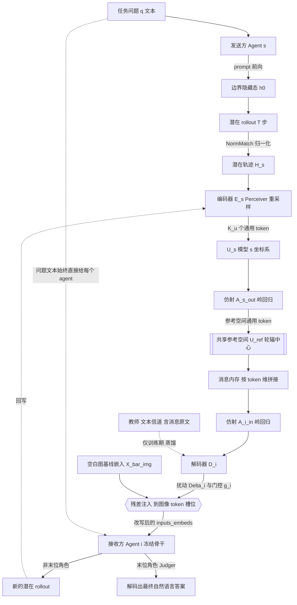

# The Vision Wormhole: Latent-Space Communication in Heterogeneous Multi-Agent Systems —— 方法深度分析

> **元信息**【原文】
> - arXiv: 2602.15382，v1 = 2026-02-17，v2 = 2026-05-28，comments 为 "Preprint. Work in progress"（**未标注任何会议接收**）。
> - 作者：Xiaoze Liu¹\*, Ruowang Zhang^{1,2}\*, Weichen Yu³, Siheng Xiong⁴, Liu He¹, Feijie Wu¹, Hoin Jung¹, Matt Fredrikson³, Xiaoqian Wang¹, Jing Gao¹（¹Purdue，²Contextual AI，³CMU，⁴Georgia Tech，\* 共同一作）。
> - 公开代码：<https://github.com/xz-liu/heterogeneous-latent-mas>（本地副本 `/home/yilin/tmp/mm-latent-repos/heterogeneous-latent-mas`，单 commit `f55e921`，README 明确写 "We build our code based on the LatentMAS codebase"）。
> - **阅读提示**：本篇是 LatentMAS 代码库的直接 fork，与读者项目高度重叠，§5 §6 是本文重点。

---

## 0. 摘要翻译

**原文摘要（v2 abs 页）完整中译：**

> 由大语言模型驱动的多智能体系统（MAS）已经解锁了高级的协作式推理能力，但它们仍然受制于离散文本通信这一瓶颈——文本通信带来了运行时开销和信息量化损失。虽然潜在状态传输提供了一种替代方案，但已有的方法要么假设发送方与接收方架构同构，要么依赖于特定配对的、需要学习的翻译器，这限制了它在具有互不相交流形（disjoint manifolds）的多样化模型家族之间的可扩展性。我们把视觉语言模型（VLM）那个原本为自然图像训练出来的视觉接口，重新概念化为异构智能体之间的一条连续通信信道，并把这个想法实例化为 **Vision Wormhole（视觉虫洞）**：一个 **Universal Visual Codec（通用视觉编解码器）** 把推理轨迹映射进一个共享的连续参考空间，并将其注入接收方的视觉通路，从而在不需要逐对翻译器的前提下实现跨架构的潜在状态传输。该框架采用 **hub-and-spoke（轮辐式）** 拓扑，把对齐复杂度从 $O(N^2)$ 降到 $O(N)$；训练方式是针对文本信道做**无标签的师生蒸馏**，不需要成对的隐藏状态监督。在异构 VLM 家族（Qwen-VL、Gemma、SmolVLM2、LFM2.5-VL）和九个推理基准上的大量实验表明，Vision Wormhole 在大多数被评估的设定下降低了端到端的墙钟时间，并取得了正的宏平均 Δ-准确率。

**一句话概括**：把 VLM 的「图像 token 槽位」当成一根管子，发送方的潜在思维压成固定尺寸的连续向量塞进这根管子，接收方当图像读，从而绕开文本 tokenizer，也绕开异构模型隐藏空间不通用的问题。

---

## 1. 方法动机

### a) 作者为什么提出

【原文 §1 Contributions + §2 Related Work】作者的出发点是：LLM 多智能体系统之间靠自然语言文本通信，这既慢（要真的把 token 解码出来、再让下一个 agent 读进去）又有损（内部连续的推理状态被强行量化成离散 token）。潜在通信（latent communication）能解决这个问题，但现有做法有硬约束，而现实中的 MAS 越来越可能是**不同厂商、不同 tokenizer、不同隐藏维度**的模型拼起来的。

### b) 现有方法的具体痛点（不泛泛）

【原文 §2】作者点了三类，且每类的痛点都很具体：

1. **training-free 的潜在传输（明确点名 Zou et al., 2025 = LatentMAS；Ye et al., 2025）**：原文措辞是 "Training-free variants are effective when agents share a backbone or have compatible internal state formats, but this assumption is restrictive for heterogeneous teams built from independently trained model families."
   —— 即：**LatentMAS 的 KV cache 直传要求收发双方层数/头数/维度/tokenizer 兼容**，换家族就废。
2. **学习式的跨模型桥接（Fu et al., 2025；Zheng et al., 2025）**：放松了同骨干假设，但 "pair-specific bridges scale poorly as the number of model families grows" —— $N$ 个模型要 $O(N^2)$ 个翻译器，加一个新模型要训 $N$ 个新桥。
3. **文本信道本身**：agent 必须 decode 中间消息、存进 context、把内部推理压成离散文本；且通信开销随消息啰嗦程度增长（无界）。

【原文 §1】还有一个更技术性的痛点，是本文方法成立的关键前提：**纯文本 LLM 对任意连续输入是脆的**（原文："sidestepping the off-manifold problem that breaks text-only LLMs under arbitrary continuous inputs"）。你不能随便往一个纯文本 LLM 的 embedding 序列里塞一段连续向量，它没被训练过接受这个。

### c) 研究假设 / 直觉（一两句话）

【原文 §1 + Appendix D.1】**核心直觉**：VLM 的图像 token 段（image span）本来就是一个「已经被训练好、可以接受一串稠密连续向量作为语义上下文」的接口。既然这个接口天然存在且天然容忍连续输入，那就别拿它传图像，改拿它传 agent 之间的消息——即"把视觉编码器当成 agent 间心灵感应的通用端口"。

**辅助假设**（Appendix D.3，原文自称 "A working hypothesis"）：不同模型编出来的 universal token 可以写成「共享语义 $z(m)$ × 模型专属线性基 $R_i$」，因此跨模型对齐只需要一个仿射变换。

---

## 2. 方法设计 ★本节最详尽★

### 2.0 总体流程图



### 2.1 符号表

| 符号 | 含义 | 形状 / 取值 | 来源 |
|---|---|---|---|
| $\mathcal{S}=(\mathcal{A},\pi)$ | 多智能体系统，$\mathcal{A}=\{a_1,\dots,a_N\}$ 为 agent 集合，$\pi$ 为编排策略 | — | 原文 §3.1 |
| $F_i$ | agent $i$ 的**冻结** VLM 骨干 | — | 原文 §3.1 |
| $d_i$ | agent $i$ 的输入嵌入维度（隐藏维） | 标量，如 2048 | 原文 §3.1 |
| $E_{\text{vis}}^{(i)},\ \phi_i$ | agent $i$ 的视觉编码器与投影器 | — | 原文 §3.1 |
| $X_{\mathrm{img}}^{(i)}$ | 注入后的图像 token 嵌入段 | $\mathbb{R}^{L_{\mathrm{img}}^{(i)}\times d_i}$ | 原文 §3.1 |
| $\bar X_{\mathrm{img}}^{(i)}$ | **固定 dummy 图**在冻结 VLM 下诱导出的图像 token 嵌入（注入基线点） | $\mathbb{R}^{L_{\mathrm{img}}^{(i)}\times d_i}$ | 原文 §3.2 |
| $L_{\mathrm{img}}^{(i)}$ | agent $i$ prompt 中图像 token 的个数 | 标量，模型相关 | 原文 §3.1 |
| $h_t^{(i)}$ | rollout 第 $t$ 步的最后一层隐藏态 | $\mathbb{R}^{d_i}$ | 原文 §3.1 |
| $x_t^{(i)}$ | 第 $t$ 步回喂的伪 token 嵌入 | $\mathbb{R}^{d_i}$ | 原文 §3.1 |
| $T$ | 潜在 rollout 长度 | **1024** | 原文 App.B.2 |
| $H_i$ | agent $i$ 的潜在轨迹（消息载体） | $\mathbb{R}^{T\times d_i}$ | 原文 §3.1 |
| $D$ | **通用空间**维度，所有 agent 共享 | **512** | 原文 App.B.2 |
| $K$ | 语义通用 token 数 | **1024** | 原文 App.B.2 |
| $K_{\mathrm{u}}=K+2$ | 通用 token 总数（+global +style） | 1026（见 §5 差异点） | 原文 §3.1 |
| $K_{\text{img}}$ | 解码器输出的图像查询 token 数 | **256** | 原文 App.B.2 |
| $\mathcal{E}_i,\ \mathcal{D}_i$ | agent $i$ 的编码器 / 解码器（**唯一可训练部分**） | ≈41M 参数（推断，见 §5） | 原文 §3.2 |
| $U_i$ | agent $i$ 坐标系下的通用 token | $\mathbb{R}^{K_{\mathrm{u}}\times D}$ | 原文 §3.2 |
| $\Delta_i,\ g_i$ | 视觉段扰动 与 标量门控 | $\mathbb{R}^{K_{\text{img}}\times d_i}$，$g_i\in(0,1)$ | 原文 §3.2 |
| $W_i^{\text{out}},W_i^{\text{in}}$ | 送出/接收的仿射矩阵 | $\mathbb{R}^{D\times D}$ | 原文 §3.3 |
| $b_i^{\text{out}},b_i^{\text{in}}$ | 对应偏置 | $\mathbb{R}^{D}$ | 原文 §3.3 |
| $r$ | 参考（hub）agent 下标 | — | 原文 §3.3 |
| $m_j$，$M$ | 第 $j$ 条锚点文本，锚点总数 | $M=3000$ 或 $90$；merge 时截到 300 | 原文 App.B.2 / README |
| $\tau,\lambda_h,\lambda_{\mathrm{kl}},\lambda_{\mathrm{rms}}$ | 蒸馏温度与三个损失权重 | $1.0,\ 1.0,\ 0.25,\ 0.1$ | 原文 App.B.2 |
| $\alpha_i$ | 模型 $i$ 的典型 token 嵌入范数 | 标量 | 原文 App.C.1 |

### 2.2 输入 → 处理 → 输出，逐步拆解

#### 第 0 步：MAS 骨架（沿用 LatentMAS）

【原文 §3.4 + App.B.1】固定的**串行**四角色工作流：**Planner → Critic → Refiner → Judger**。两骨干配置下四个角色在两个模型间交替（如 Planner/Refiner 用 Gemma-3-4B，Critic/Judger 用 Qwen3-VL-2B）。

**关键结构事实**【原文 App.H.2】：**问题 $q$ 始终以纯文本形式直接给到每一个 agent**（prompt 模板里都有 `Question: <QUESTION>`），虫洞只承载「plan / feedback」这类中间产物；只有 Judger 产出自然语言答案，前三个角色**完全不解码 token**。这一点对后面判断"虫洞到底传了多少信息"至关重要。

#### 第 1 步：发送方产生消息 —— 潜在 rollout

【原文 §3.1、§3.2(1)】发送方吃完 prompt（任务上下文 + 角色指令 + 收到的消息）后，取 prompt 边界处的隐藏态 $h_0^{(i)}$，然后**复用 prompt 的 attention cache**，反复把上一步隐藏态变换成一个伪 token 嵌入回喂：

$$x_t^{(i)}=\mathrm{NormMatch}_i\!\left(h_t^{(i)}\right)$$

其中（原文 Appendix C.1 式 (5)）：

$$\mathrm{NormMatch}_i(h)=\alpha_i\cdot\frac{h}{\|h\|_2+\epsilon},\qquad \alpha_i=\mathbb{E}_{w\sim V_i}\|E_i(w)\|_2$$

> **通俗解释**：隐藏态的模长跟真实词嵌入的模长不在一个量级，直接回喂会让自回归在嵌入空间里跑飞。所以只做一件事——把方向留着，把长度**硬拉到该模型词嵌入的平均长度** $\alpha_i$。

跑 $T$ 步得到消息载体：

$$H_i=\left[x_0^{(i)},\dots,x_{T-1}^{(i)}\right]\in\mathbb{R}^{T\times d_i},\qquad T=1024$$

> ⚠️ **对读者项目最关键的一点**：这里**没有** LatentMAS 的闭式对齐算子 $W_a=(W_{out}^\top W_{out}+\lambda I)^{-1}W_{out}^\top W_{in}$。原文只保留了「归一化」。【源码印证见 §5.3】：代码里确实调了 LatentMAS 的 `_apply_latent_realignment`，但 `--latent_space_realign` 默认关闭，矩阵被**替换成单位阵**，于是该函数退化成纯 NormMatch，与式 (5) 逐字吻合。**也就是说：本文从根上回避了 $W_a$ 只对文本词表成立的理论断点——它干脆不用 $W_a$。**

#### 第 2 步：通用 token 编码器 $\mathcal{E}_i$

【原文 §3.2(2)】用 Perceiver 风格的重采样器（小的可学习 query 对 rollout 做 cross-attention）把变长/高维的 $H_i$ 压成固定尺寸：

$$U_i=\mathcal{E}_i(H_i)\in\mathbb{R}^{K_{\mathrm{u}}\times D}$$

$K$ 个语义 token 承载内容，另外两个特殊 token 分别做**全局聚合**和**风格/统计**线索。原文强调：消息表示的尺寸**不随文本长度增长**（bounded message）。

> **通俗解释**：不管发送方"想"了多久，输出永远是 $K_{\mathrm{u}}\times D$ 这么大的一块。这是它相对文本信道最硬的优势——文本消息越啰嗦，接收方读得越慢；这里是定长的。

#### 第 3 步：通用→视觉解码器 $\mathcal{D}_i$ 与门控残差注入

【原文 §3.2(3)】

$$(\Delta_i,g_i)=\mathcal{D}_i(U_i),\qquad \Delta_i\in\mathbb{R}^{K_{\text{img}}\times d_i},\ g_i\in(0,1)$$

$\Delta_i$ 是用**接收方自己的嵌入空间**表达的一段连续 prompt；$g_i$ 是逐样本的注入强度。为了让注入后的嵌入不飞出 VLM 的视觉流形，采用**相对固定基线的残差写入**（原文式 (1)）：

$$X_{\mathrm{img}}^{(i)}=\bar X_{\mathrm{img}}^{(i)}+g_i\cdot\mathrm{Resample}\!\left(\Delta_i;L_{\mathrm{img}}^{(i)}\right)\tag{1}$$

其中 $\mathrm{Resample}(\cdot;L)$ 把 $K_{\text{img}}=256$ 个 token 重采样到接收方实际需要的图像段长度 $L_{\mathrm{img}}^{(i)}$（不同 VLM 的图像 token 数不同，这一步是异构适配的关键胶水）。

> **通俗解释**：不要凭空造一段图像嵌入，而是先放一张**固定的空白图**当"底座"$\bar X_{\mathrm{img}}$，再在底座上加一个小扰动。这样即使编解码器学得不好，输入也还落在 VLM 见过的分布附近，最坏情况退化成"看了一张白图"。

#### 第 4 步：无标签师生蒸馏（训练目标）

【原文 §3.2(4)】训练语料是**锚点消息** $m$（短文本串）。

- **教师 prompt**：把 $m$ 以**文本**形式显式写进去。
- **学生 prompt**：**删掉** $m$，但带一张 dummy 图，其图像 token 段被式 (1) 覆写；而式 (1) 里的 $\Delta_i$ 是从**教师侧的 rollout** 算出来的。

只优化 $\mathcal{E}_i,\mathcal{D}_i$（骨干全冻结），目标（原文式 (2)）：

$$
\begin{aligned}
\mathcal{L}_{\mathrm{codec}}=\;&\lambda_h\left\|h^{\text{vis}}-\operatorname{stopgrad}(h^{\text{text}})\right\|_2^2\\
+\;&\lambda_{\mathrm{kl}}\,\tau^2\,\mathrm{KL}\!\left(\operatorname{softmax}\!\left(\tfrac{\ell^{\text{text}}}{\tau}\right)\ \Big\|\ \operatorname{softmax}\!\left(\tfrac{\ell^{\text{vis}}}{\tau}\right)\right)\\
+\;&\lambda_{\mathrm{rms}}\left(\operatorname{RMS}(\Delta_{\text{inj}})-\operatorname{RMS}(\bar X_{\mathrm{img}}^{(i)})\right)^2
\end{aligned}\tag{2}
$$

其中 $h^{\text{text}},\ell^{\text{text}}$ 是教师在 **prompt 边界处**的隐藏态与 next-token logits，$h^{\text{vis}},\ell^{\text{vis}}$ 是学生对应量，$\Delta_{\text{inj}}$ 是重采样前的门控扰动。

> **通俗解释**：三项分别是——(1) 表征保真：让"看图的我"和"读到文字的我"在同一个位置的内部状态一样；(2) 输出保真：下一个 token 的概率分布也要一样；(3) 幅度稳定：注入的能量要和真实图像嵌入的能量差不多，别太猛也别为零。
> 「无标签」的含义是：不需要人工标注，也**不需要成对的隐藏状态监督**——教师和学生是**同一个模型**的两种输入方式，标签自动生成。

#### 第 5 步：跨模型对齐 —— hub-and-spoke + 岭回归

【原文 §3.3】各 agent 的 codec 是**独立训练**的，因此 $U_i$ 虽然都在 $\mathbb{R}^{K_u\times D}$，但坐标系不一定一致。为避免 $O(N^2)$ 个逐对翻译器，固定一个参考 agent $r$，每个 agent 学一对仿射映射：

$$A_i^{\text{out}}(U)=UW_i^{\text{out}}+\mathbf{1}(b_i^{\text{out}})^{\top}\qquad(U_i\to U^{\text{ref}})$$
$$A_i^{\text{in}}(U)=UW_i^{\text{in}}+\mathbf{1}(b_i^{\text{in}})^{\top}\qquad(U^{\text{ref}}\to U_i)$$

用少量**共享锚点文本** $\{m_j\}_{j=1}^{M}$ 闭式求解（原文式 (3)）：

$$\min_{W_i^{\text{out}},b_i^{\text{out}}}\ \sum_{j=1}^{M}\left\|U_i(m_j)W_i^{\text{out}}+\mathbf{1}(b_i^{\text{out}})^{\top}-U_r(m_j)\right\|_F^2+\lambda\|W_i^{\text{out}}\|_F^2\tag{3}$$

$A_i^{\text{in}}$ 同理反向求解。

> **通俗解释**：每个模型只需学"我 ↔ 中心"两个矩阵，$N$ 个模型就是 $2N$ 个矩阵，而不是 $N(N-1)$ 个。新模型加入只训自己那一对，别人不用动——这就是 $O(N^2)\to O(N)$ 的全部内容。而且这一步**不用梯度下降**，是岭回归闭式解，很便宜。

【原文 App.D.3】其成立所依赖的假设被显式写成（式 (11)）：

$$U_i(m)\approx\mathrm{reshape}\big(z(m)R_i\big)+\epsilon$$

即存在跨模型近似共享的语义表示 $z(m)\in\mathbb{R}^D$，各模型只差一个近似可逆的线性变换 $R_i\in\mathbb{R}^{D\times D}$。原文诚实地称其为 "A working hypothesis"，并承认 "these results do not prove linear equivalence in general"。

> ⚠️ **【推断】这里有一个原文没有正面处理的漏洞**：式 (11) 的 $\mathrm{reshape}$ 隐含假设了**各模型的 $K_u$ 个 token 槽位语义一一对应**（槽位 $k$ 在模型 A 和模型 B 里表示同一件事）。但 $\mathcal{E}_i$ 的 query 向量 $q_{\text{sem}}$ 是各模型**独立随机初始化、独立训练**的，没有任何机制强制这种槽位对应。详见 §5.4 的源码证据。

#### 第 6 步：推理期的消息传递与记忆聚合

【原文 §3.4】发送方 $s$ → 接收方 $i$ 的虫洞消息（式 (4)）：

$$U_{s\to i}^{\text{ref}}=A_s^{\text{out}}\!\left(\mathcal{E}_s(H_s)\right)$$
$$(\Delta_i,g_i)=\mathcal{D}_i\!\left(A_i^{\text{in}}\!\left(U_{s\to i}^{\text{ref}}\right)\right)$$

随后按式 (1) 写入接收方的图像 token 段。

**记忆聚合**：把收到的多条消息在 token 维直接拼接：

$$U_{\mathrm{mem}}^{\text{ref}}=\mathrm{Concat}\left(\{U_m^{\text{ref}}\}_{m\in\mathcal{M}}\right)\in\mathbb{R}^{(|\mathcal{M}|\cdot K_{\mathrm{u}})\times D}$$

然后从 $U_{\mathrm{mem}}^{\text{ref}}$ 解出**单一**视觉段扰动。

> **通俗解释**：这实现了"定额读取"——不管上游 agent 有多啰嗦，接收方看到的永远是被压回 $K_{\text{img}}=256$ 个 token 的一块连续上下文。这是它相对文本 MAS 的结构性优势：文本 context 会累积膨胀，这里不会。

**角色循环**（每个非末位角色）：
1. **Read**：把当前 $U_{\mathrm{mem}}^{\text{ref}}$ 解码成视觉段注入，跑冻结骨干；
2. **Think（latent）**：抽 rollout $H_i$，编码成 $U_i^{\text{ref}}=A_i^{\text{out}}(\mathcal{E}_i(H_i))$；
3. **Write**：把 $U_i^{\text{ref}}$ 追加进共享内存缓冲。

末位 Judger 才真正 `generate` 出自然语言。

### 2.3 各模块功能与协同（小结）

| 模块 | 功能 | 与谁协同 | 是否可训练 |
|---|---|---|---|
| 潜在 rollout + NormMatch | 把 agent 的"想法"变成 $T\times d_i$ 的连续轨迹 | 冻结骨干；输出喂给 $\mathcal{E}_i$ | 否（无参数） |
| 编码器 $\mathcal{E}_i$ | 变长高维 → 定长 $K_u\times D$，做**跨模型公共货币** | 上接 rollout，下接 $A^{\text{out}}$ | **是** |
| 仿射 $A_i^{\text{out}}/A_i^{\text{in}}$ | 模型坐标系 ↔ 参考坐标系 | 岭回归闭式拟合，连接 hub | **是（闭式，非梯度）** |
| 解码器 $\mathcal{D}_i$ | $K_u\times D$ → $K_{\text{img}}\times d_i$ 扰动 + 门控 | 下接式 (1) 注入 | **是** |
| 残差注入（式 1） | 以空白图嵌入为底座做加性写入 | 直接改写骨干的 `inputs_embeds` | 否 |
| 蒸馏损失（式 2） | 用文本信道监督视觉信道 | 只回传梯度到 $\mathcal{E}_i,\mathcal{D}_i$ | — |

---

## 3. 与其他方法对比

### a) 本质不同

| 对比对象 | 本质差异 |
|---|---|
| **LatentMAS（Zou et al., 2025）** | LatentMAS 传的是**逐层 KV cache**（要求层数/头数/维度/tokenizer 兼容），且**完全 training-free**；本文传的是**压缩后的定长通用 token**，只用**一层输入嵌入槽位**，且**必须训练** per-model codec。LatentMAS 用 $W_a$ 闭式算子把 hidden 打回 embedding；本文**不用 $W_a$**，只用 NormMatch + 学出来的编解码器。 |
| **逐对隐藏态桥接（Fu et al., 2025；Zheng et al., 2025）** | 逐对桥 = $O(N^2)$；本文 = 轮辐式 $O(N)$，且中心空间的对齐是**闭式岭回归**而非训练。 |
| **潜在推理 / Coconut 类（Hao et al., 2024）** | 那是**单模型内部**少解码 token；本文把连续轨迹当作**跨模型通信底物**，问题从"省 token"变成"互操作"。 |
| **Soft prompt / Prefix-tuning** | 技术上本文的 $\Delta_i$ 就是一段 soft prompt（原文 App.D.2 自己承认这个类比），但**soft prompt 是为任务学的固定向量，本文的是逐消息动态生成的**。 |
| **OCR 图像中继（本文自设基线）** | OCR 走**真实视觉编码器**（把文字渲染成图片再看）；虫洞**不走视觉编码器**（详见 §5.2）。 |

### b) 创新点与贡献度

【原文 §1 四点贡献】我的评估（区分"新"与"贡献度"）：

1. **把 VLM 图像槽位当通用通信端口** —— 概念上是本文最有意思的一击。**贡献度：高（概念层）**。它把"异构模型隐藏空间不通用"这个难题，换成"所有 VLM 都有一个被训练成接受连续向量的公共接口"，绕开了 tokenizer/维度不一致。
2. **Universal Codec + hub-and-spoke $O(N)$** —— 轮辐式本身在表示对齐领域不新（原文自己引了 model stitching、Git Re-Basin），**新在把它用到 MAS 通信信道上**。**贡献度：中**。
3. **无标签师生蒸馏（文本信道当教师）** —— 这个设计干净且实用：不需要成对隐藏态，教师学生是同一模型的两种输入。**贡献度：中偏高（工程层）**。
4. **实验规模** —— 4 个 VLM 家族 × 9 基准 × 6 种角色配置，还配了 OCR 基线和 LatentMAS-Hybrid 失败扫描。**贡献度：中**（但结论强度受限，见 §4d）。

### c) 适用场景

- ✅ 参与方**都是 VLM**、且都用「投影视觉特征插进 LM 序列」这种主流融合设计；
- ✅ 模型数量多、需要频繁增删成员（$O(N)$ 才划算）；
- ✅ 中间消息**很长**的任务（AIME 这种长 CoT，加速比 3–7×）；
- ❌ 参与方是纯文本 LLM（没有图像槽位，方法直接不适用——原文 Limitations 明说）；
- ❌ 中间消息本来就很短的任务（定长 $T=1024$ rollout 反而更慢，实测出现 0.57×/0.58×/0.64× 的**负加速**）；
- ❌ 需要人类可审计的 agent 间通信（虫洞消息完全不可读）。

### d) 总结表

| 维度 | 优点 | 缺点 | 可改进点 |
|---|---|---|---|
| **理论** | 绕开 $W_a$ 的词表依赖；用 VLM 天然接口，off-manifold 风险低 | 跨模型对齐仅有 "working hypothesis"（式 11），且隐含**槽位对应**假设未被论证/未被强制 | 加正交 Procrustes 或让各 codec 共享 query 初始化 / 加槽位对应正则 |
| **通信成本** | 定长消息，不随啰嗦度增长；$O(N)$ 扩展 | 定长 $T=1024$ 的 rollout 是**固定开销**，短消息任务上是净亏 | rollout 长度自适应（早停 / 按任务预算） |
| **训练成本** | 只训 ~41M 的 codec，骨干全冻；400 步；90 条锚点也能work | 每加一个模型要重训一个 codec + 重跑 merge；不是 training-free | 共享 codec 主干 + 每模型只训 in/out 投影 |
| **实证** | 6 配置 × 9 基准，加速普遍；有 OCR 与 LatentMAS-Hybrid 对照 | 主表**缺单智能体基线的并列比较**（藏在 Appendix G）；AIME 仅 30 题 | 主表并列 Single-agent 列；加消融（$g_i\equiv0$ 对照） |
| **可用性** | 代码公开、fork 自 LatentMAS 易读 | **仓库 `run.py` 缺 6 个模块，直接 import 失败**；无 checkpoint | 补齐缺失模块 / 发 codec 权重 |

---

## 4. 实验表现与优势

### a) 实验设计与设置【全部来自原文 App.B】

- **骨干**（4 个家族，全部冻结）：`Qwen/Qwen3-VL-2B-Thinking`、`google/gemma-3-4b-it`、`HuggingFaceTB/SmolVLM2-2.2B-Instruct`、`LiquidAI/LFM2.5-VL-1.6B`。
- **基准（9 个，全部是纯文本任务）**：GSM8K、AIME 2024、AIME 2025、GPQA、MedQA、ARC-Easy、ARC-Challenge、MBPP-Plus、HumanEval-Plus。多选/短答报 accuracy，代码报 pass@1。
- **协议**：串行 Planner→Critic→Refiner→Judger；6 种角色配置（5 个双骨干 + 1 个四骨干池）。
- **超参**：$D=512$，$K_u=1024$，$K_{\text{img}}=256$，6 层 8 头 dropout 0.10，$T=1024$；AdamW，lr $2\times10^{-4}$，**400 步，batch size 2**（= 每模型仅 **800 次锚点抽样**）；损失权重 MSE 1.0 / KL 0.25（$\tau=1.0$）/ stats 0.1；grad clip 1.0。
- **锚点语料**：默认 **3000 条**（cos_e / OpenCodeReasoning / PRM800K 各 1000）；弱监督设定 **90 条**（各 30）。原文点明默认设定只覆盖 $800/3000\approx0.27\times$ 数据集，弱监督设定是 $800/90\approx8.9\times$。
- **硬件**：NVIDIA **A6000**；双骨干共置单卡，四骨干用两卡。
- **解码**：greedy；per-dataset token 预算沿用 LatentMAS（GSM8K/ARC 2048，MedQA/MBPP+/HE+ 4096，GPQA 8192，AIME **20000**）；时间口径 = 批墙钟 ÷ 批内样本数（s/query）。

### b) 关键数据【原文，已逐格核对 PDF 原文】

**Table 1（主表，6 配置，节选 3 个代表配置）**

| 数据集 | Gemma→Qwen Text | VW | Δ / 加速 | LFM2.5→Gemma Text | VW | Δ / 加速 | SmolVLM2→Gemma Text | VW | Δ / 加速 |
|---|---|---|---|---|---|---|---|---|---|
| GSM8K | 80.8% (27.3s) | 76.2% (26.7s) | **−4.6pp** / 1.02× | 71.7% (14.3s) | 85.1% (14.9s) | +13.4pp / **0.96×** | 67.8% (22.3s) | 85.4% (11.4s) | +17.6pp / 1.96× |
| ARC-Easy | 93.4% (33.1s) | 92.4% (22.0s) | −1.0pp / 1.50× | 88.6% (14.7s) | 90.8% (9.3s) | +2.2pp / 1.58× | 84.4% (24.5s) | 90.2% (7.3s) | +5.8pp / 3.36× |
| ARC-Challenge | 86.0% (49.0s) | 82.1% (29.5s) | −3.9pp / 1.66× | 77.0% (16.0s) | 81.1% (10.5s) | +4.1pp / 1.52× | 70.6% (26.0s) | 80.7% (8.4s) | +10.1pp / 3.10× |
| GPQA | 29.8% (348.4s) | 39.9% (174.6s) | +10.1pp / 2.00× | 31.3% (65.4s) | 24.2% (47.2s) | **−7.1pp** / 1.39× | 26.3% (101.4s) | 29.3% (42.1s) | +3.0pp / 2.41× |
| MedQA | 53.3% (91.5s) | 48.0% (83.0s) | **−5.3pp** / 1.10× | 47.7% (25.9s) | 52.3% (17.9s) | +4.6pp / 1.45× | 41.0% (34.0s) | 48.3% (13.8s) | +7.3pp / 2.46× |
| MBPP-Plus | 50.5% (108.7s) | 51.3% (69.2s) | +0.8pp / 1.57× | 45.8% (8.9s) | 66.4% (11.3s) | **+20.6pp** / **0.79×** | 44.7% (17.5s) | 67.7% (8.0s) | +23.0pp / 2.19× |
| HumanEval-Plus | 40.9% (121.6s) | 37.2% (80.1s) | −3.7pp / 1.52× | 43.9% (11.3s) | 60.4% (19.8s) | **+16.5pp** / **0.57×** | 32.9% (25.1s) | 59.1% (15.3s) | +26.2pp / 1.64× |
| AIME 2024 | 23.3% (1314.4s) | 36.7% (385.8s) | +13.4pp / **3.41×** | 0.0% (267.5s) | 6.7% (90.9s) | +6.7pp / 2.94× | 3.3% (120.2s) | 6.7% (61.8s) | +3.4pp / 1.94× |
| AIME 2025 | 16.7% (1432.9s) | 26.7% (382.0s) | +10.0pp / **3.75×** | 3.3% (127.7s) | 13.3% (81.8s) | +10.0pp / 1.56× | 3.3% (149.4s) | 10.0% (59.8s) | +6.7pp / 2.50× |

**Table 5（OCR 基线，含宏平均）**

| 配置 | Text 宏平均 | **VW 宏平均** | OCR 宏平均 |
|---|---|---|---|
| P/R Gemma-3-4B, C/J Qwen3-VL-2B | 52.7% / 391.9s | **54.5% / 139.2s** | 39.1% / 225.8s |
| P/R SmolVLM2-2.2B, C/J Qwen3-VL-2B | 45.2% / 649.6s | **52.1% / 179.8s** | 34.2% / 220.9s |

**Table 6（单智能体基线，本文最重要的对照）**

| 模型 | GSM8K | ARC-E | ARC-C | GPQA | MedQA | MBPP+ | HE+ | AIME24 | AIME25 | **宏平均** |
|---|---|---|---|---|---|---|---|---|---|---|
| Qwen3-VL-2B | 74.8 | 90.9 | 80.6 | 34.9 | 43.7 | 51.1 | 37.8 | 23.3 | 20.0 | **50.8** |
| Gemma-3-4B | 83.4 | 92.2 | 83.5 | 35.4 | 49.7 | 71.2 | 65.8 | 3.3 | 16.7 | **55.7** |
| SmolVLM2-2.2B | 40.9 | 43.6 | 32.9 | 27.3 | 29.0 | 33.3 | 25.0 | 0.0 | 0.0 | **25.8** |
| LFM2.5-VL-1.6B | 63.0 | 82.6 | 68.9 | 26.3 | 41.0 | 43.6 | 36.6 | 0.0 | 0.0 | **40.2** |

**Figure 3（相对单智能体的偏离，pp）**

| 模型 | TextMAS − Single | **VW − Single** |
|---|---|---|
| Qwen3-VL-2B | −1.4 | **+1.8** |
| Gemma-3-4B | −7.7 | **−2.8** |
| SmolVLM2-2.2B | +18.5 | **+26.9** |
| LFM2.5-VL-1.6B | +6.6 | **+12.0** |

**Appendix F（LatentMAS-Hybrid 失败扫描）**【原文逐字】
- 设置：GSM8K 固定 200 题子集，latent 步数扫 {16,32,48,64,96,128,192,256,384,512,768,1024}，greedy，256 token 答案预算，batch 4；两个跨厂商 tokenizer 异构对。
- 读数：GSM8K EM + 三个外部裁判（Llama / Qwen / Gemma 家族）给出的答案困惑度。
- **Qwen3-VL-2B + Gemma-3-4B**：准确率**全程不超过 0.5%**；16 步时平均裁判 PPL 已达 $8.1\times10^5$，1024 步升到 $8.6\times10^7$。
- **Qwen3-VL-2B + LFM2.5-VL-1.6B**：**192 步以内**正常（平均 PPL 10–12，准确率 14–27%）；**256 步起**平均 PPL 跳到 $8.1\times10^5$，之后维持在 $10^6$–$10^7$，准确率掉到 12–20%。

### c) 优势最明显的场景

1. **长 CoT 任务的墙钟时间**：AIME 上加速 2.5–5.47×（TextMAS 单题要 1300–2800s，VW 380–540s）。这是最硬的收益。
2. **弱模型参与的异构队伍**：SmolVLM2/LFM2.5 在队里时，TextMAS 会被弱模型的啰嗦文本拖累，VW 因为消息定长且"信息量有限"反而稳。
3. **弱监督数据效率**：仅 90 条锚点，SmolVLM2/Qwen 配置仍取得 +1.0～+23.4pp、加速 1.56–7.20×（Table 2）。这条对读者项目最有借鉴价值——说明这类 codec 不需要大规模数据。

### d) 局限性

**论文明说的：**
- 【Limitations】方法**只适用于 VLM-based agent**（需要视觉接口），纯文本 LLM 不适用。
- 【§4.2】"accuracy gains are configuration-dependent"；Gemma/Qwen 配置在若干任务上"trade accuracy for speed"。
- 【§4.1 + App.F】LatentMAS-Hybrid 适配在跨厂商对上**不稳定**，因此**放弃了与潜在通信基线的匹配对比**，只拿 TextMAS 当基线。
- 【App.D.3/D.4】线性对齐只是 "working hypothesis"，"do not prove linear equivalence in general"；跨家族差异大时需要更多锚点或更丰富的映射。
- 【App.G】原文自己承认："TextMAS frequently drops below the single-agent baseline on stronger backbones, while VW remains closer to parity."

**隐含的（我的分析，标注为【推断】）：**

1. **【推断·强】"提速"的机制是把变长文本换成定长 rollout，因此加速比有上界、且可能为负。** 证据：$T=1024$ 是固定的（App.B.2 + 源码），而 TextMAS 的耗时随生成长度变化。凡是 TextMAS 每个 agent 生成量 < ~1024 token 的场景，VW 就更慢——这精确解释了 Table 1 里 0.57×/0.58×/0.64×/0.79×/0.85×/0.93×/0.96× 这些**负加速格子全部集中在小模型 + 短消息任务（MBPP+/HumanEval+/GSM8K）**。

2. **【推断·强】主表的"VW 大胜 TextMAS"很大程度是"VW 伤害更小"，而不是"虫洞传递了有效信息"。** 交叉证据：
   - Table 5 宏平均：Gemma/Qwen 配置 VW = 54.5%，而该配置的 **Judger 是 Qwen3-VL-2B，单智能体宏平均 = 50.8%**（Table 6），只高 3.7pp；
   - SmolVLM2/Qwen 配置：VW = 52.1%，Judger 单跑 = 50.8%，只高 **1.3pp**；而 TextMAS = 45.2%，**比 Judger 单跑还低 5.6pp**；
   - Figure 3：强骨干上 VW − Single 只有 +1.8 / −2.8。
   - 即：在强骨干上，整套四智能体流水线（无论哪种信道）相对"让 Judger 自己答"几乎没有增量；VW 的相对优势来自它**没有把坏消息传进去**。这与原文 App.G 的措辞完全一致，只是主表没有并列呈现。

3. **【推断】"弱骨干上 MAS 大幅提升"存在角色混淆。** SmolVLM2 的 "Combined MAS" 均值统计的是**包含 SmolVLM2 的所有配置**，而这些配置里 Judger 都是强模型（Gemma/Qwen）。所以 +26.9pp 主要反映"强模型在答题"，不是"弱模型被增强了"。

4. **【推断】AIME 上的大 Δ 不具统计显著性。** AIME 2024/2025 各仅 30 题，+13.4pp = 4 题之差；在 $n=30$ 下标准误约 ±8pp。主表里最亮眼的几个数字恰在最小的数据集上。

5. **【推断·基于源码】门控 $g_i$ 的初始 bias = −4.0（$\sigma(-4)\approx0.018$），若 codec 学不动，注入趋近于零，接收方等价于"看了一张白图 + 读到问题原文"，即退化成单智能体。** 这与观察 2 的"VW ≈ single-agent parity"高度自洽，是一个原文未做的关键消融（应补 $g_i\equiv0$ 对照）。

6. **【推断】训练监督极其单薄。** 蒸馏目标只匹配**单个位置**（prompt 边界）的 hidden + next-token logits，而那个位置的续写只是 "Acknowledge"（见 §5.5 源码）。匹配"下一个词是 Acknowledge 的分布"**不能保证消息内容可被后续推理复原**。

---

## 5. 论文 ↔ 源码对照

> 本地路径：`/home/yilin/tmp/mm-latent-repos/heterogeneous-latent-mas`（下称 `<repo>`）；对照基线 `/home/yilin/LatentMAS`。

### 5.0 fork 事实与规模

| 文件 | LatentMAS | 本仓库 | 增量 |
|---|---|---|---|
| `models.py` | 416 行 | **853 行** | +437 |
| `run.py` | 251 行 | **1127 行** | +876 |
| `prompts.py` | 766 行 | 916 行 | +150 |
| `data.py` | 223 行 | 258 行 | +35 |
| `utils.py` | 81 行 | 163 行 | +82 |

**`methods/` 目录构成完全变了**：LatentMAS 有 `baseline.py / latent_mas.py / text_mas.py`；本仓库只有 `latent_mas_hybird.py`（35KB）、`text_mas.py`、`vision_latent_mas_codec_new.py`（**89KB**）、`vision_latent_mas_ocr.py`（34KB）。

**观察**【源码】：从 LatentMAS 继承或新写的文件里，**docstring 与注释被整体替换成等长空格**（例：`<repo>/methods/vision_latent_mas_codec_new.py:484`、`:501`、`:505-507`、`:511`、`:540`、`:605`；`<repo>/data.py` 里 `# Map choices` → 空格）。唯独 `latent_mas_hybird.py` 的注释完好——因为它来自另一个仓库（README:12 指向 `nhminle/LatentMAS-Hybrid`）。**这使代码可读性显著下降，是 fork 时的自动化处理痕迹。**

### 5.1 §2 各模块 → 源码定位

| §2 模块 | 论文位置 | 源码位置 | 核对结论 |
|---|---|---|---|
| NormMatch（式 5） | App.C.1 | `models.py:520-529` | ✅ 一致（见 5.3） |
| 潜在 rollout $H_i$ | §3.1/§3.2(1) | `methods/vision_latent_mas_codec_new.py:1631-1718` | ✅ 复用 prompt 的 `past_key_values`，逐步回喂 |
| 编码器 $\mathcal{E}_i$ | §3.2(2) | `methods/vision_latent_mas_codec_new.py:539-601` (`LatentToUniversalEncoder`) | ✅ Perceiver 重采样；`q_sem`(K) + `q_global`(1) + `q_style`(1) |
| style 特殊 token | §3.1 | `:582-586, :600` | ✅ 用 rollout 的 mean/std/平均范数三个标量经 MLP 加到最后一个 token |
| 解码器 $\mathcal{D}_i$ + 门控 | §3.2(3) | `:604-660` (`UniversalToVisionDecoder`)；门控 `:628-633, :659` | ✅ `gate_init_bias=-4.0`（`:615`） |
| $\mathrm{Resample}(\cdot;L)$ | §3.2(3) | `:483-497` | ✅ 一维**线性插值**（`F.interpolate(mode="linear")`） |
| **式 (1) 残差注入** | §3.2 | **`:1620`**（通用路径）、`:1540`（InternVL）、`:1584`（MiniCPM） | ✅ `inputs_embeds[b, pos, :] = base_img + g * dlt` |
| $\bar X_{\mathrm{img}}$ | §3.2 | `:857-962`（`_extract_dummy_image_tokens`），取 `hs[0]`（`:953`）= **嵌入层输出** | ✅ 确为"图像 token 嵌入" |
| dummy image | §3.2 | **`:166-167`**：`Image.new("RGB",(size,size),color=(255,255,255))` | ✅ **纯白图**，默认 224×224 |
| 仿射 $A^{\text{out}}/A^{\text{in}}$（式 4） | §3.3/§3.4 | `:500-502`（`_apply_affine`）；应用于 `:1435-1439`（out）、`:1448-1451`（in） | ✅ |
| 岭回归（式 3） | §3.3 | `train_vision_latent_mas_codec_new.py:377-394`；merge 侧 `merge_vision_codec_checkpoints.py:345-354` | ✅ 中心化后闭式解 |
| 记忆聚合（Concat） | §3.4 | `:2056`（`torch.cat(memory, dim=1)`）、`:1364-1383` | ✅ 另有 `mean` 聚合分支（层级模式） |
| 角色循环 | §3.4 | `:1330-1362`（`run_item`） | ✅ planner→critic→refiner 出 latent，judger 出文本 |
| 蒸馏损失（式 2） | §3.2(4) | `train_vision_latent_mas_codec_new.py:1691-1713` | ✅ 三项齐全 |

### 5.2 ★关键核对：它到底跑不跑真实图像？（读者第 7 问）

**结论：完全不跑真实图像；而且 `vision_latent_mas_codec_new` 这条主路线在推理时连视觉编码器都不执行。**

四条独立证据【全部源码】：

1. **数据侧无图**：`<repo>/data.py` 只有 gsm8k / arc / gpqa / medqa / mbppplus / humanevalplus / aime 加载器，`diff` 相对 LatentMAS 的改动**仅限 MedQA 的选项格式化与 split 过滤**，无任何图像字段。全仓库 `grep "Image.open"` 零命中。
2. **唯一的图是纯白图**：`methods/vision_latent_mas_codec_new.py:166-167` 生成 `(255,255,255)` 的白图。
3. **推理时 `pixel_values` 被丢弃**：`:1622`
   ```python
   fwd = {k: v for k, v in mm.items() if k not in ("input_ids", "pixel_values")}
   fwd["inputs_embeds"] = inputs_embeds
   ```
   即通用路径（Qwen3-VL / Gemma3 / SmolVLM2 / LFM2.5 全走这里）把 `pixel_values` 剔除，直接喂改写好的 `inputs_embeds`。ViT + projector **只在初始化时跑一次**（`_init_processors_and_dummy_tokens`，`:1127`）用来算常量 $\bar X_{\mathrm{img}}$。
4. **注入发生在 LM 的输入嵌入层**：`:1600-1601` 取 `get_input_embeddings()(input_ids)`，再在图像 token 位置上做 `base_img + g*dlt`。

> ⚠️ **对读者最重要的一句话**：论文说 "injects them into the receiver's **visual pathway**"、"treating the **vision encoder** as a universal port"（摘要/§1）。**源码层面的准确表述应是**：注入发生在 **LM 输入嵌入序列中被 chat template 保留给图像 token 的那些位置**，基点是一张白图的常量嵌入；**视觉编码器不在推理回路里**。这不是造假（图像 token 段确实是"vision span"），但"vision encoder as a universal port"这个说法比代码实际做的**强**。
>
> **反面对照**：`methods/vision_latent_mas_ocr.py` 才真的走视觉编码器——`:279+` 用 PIL/`ImageDraw` 把发送方文本渲染成图片，`:775` `proc(text=chats, images=images_arg, ...)`，`:799` `wrapper.model.generate(**gen_kwargs)` 带 `pixel_values` 全量多模态前向。

**所以：这篇论文是"用 VLM 做纯文本 MAS"，不是"多模态 MAS"。** 它证明的是"VLM 的图像槽位可以当连续通信管道"，**没有**证明"视觉信息可以在 agent 间潜在传递"。

### 5.3 ★关键核对：$W_a$ 在这里是不是被关掉了？

**是，默认关闭，退化成单位阵。**

- `models.py:475-501` 与 LatentMAS 的 `_build_latent_realign_matrix` **逐字节相同**（`diff` 仅差一行注释）。
- `models.py:496-499`：
  ```python
  if self.args.latent_space_realign:
      pass
  else:
      realign_matrix = torch.eye(realign_matrix.shape[0], ...)
  ```
- `run.py:514`：`parser.add_argument("--latent_space_realign", action="store_true")` → **默认 False**。
- `grep -rn "latent_space_realign" scripts/ README.md` → **零命中**，README 的训练/推理命令、`launch_partition_run.sh` 都没开。

于是 `_apply_latent_realignment`（`models.py:520-529`）实际执行的是 `aligned * (target_norm / aligned_norm)`，即 $\alpha_i h/\|h\|$ —— **精确等于论文 App.C.1 的式 (5) NormMatch**。论文与代码在这里**一致且诚实**。

> 💡 **对读者项目的直接含义**：读者担心的 "$W_a$ 闭式解只对文本词表成立、VLM 视觉输入不过 $W_{in}$" 这个理论断点，**本文根本没踩**——它把 $W_a$ 整个丢掉了，改用「NormMatch + 学出来的 codec」。这既是它的聪明之处，也说明 **$W_a$ 对 LatentMAS 的性能可能并非必需**（与读者已知的"LatentMAS 里 $W_a$ 默认关闭"互相印证）。

### 5.4 ★关键核对：`latent_mas_hybird.py` 是不是那个"不稳定的对照"，根因是什么？（读者第 3 问）

**是。** README:12 写明 2026-03-03 新增基线 `latent_mas_hybrid`，链接 `https://github.com/nhminle/LatentMAS-Hybrid`；论文 App.F 引用为 "(Zou et al., 2025; nhminle, 2026)"。`run.py:22` 以 `HybridLatentMASMethod` 导入。它相对 LatentMAS 原版 `methods/latent_mas.py` 的 diff 是 417 行。

核心函数 `transfer_via_realignment`（`methods/latent_mas_hybird.py:18-99`），把 LatentMAS 的单模型算子推广成跨模型：

$$W_{\text{cross}}=\left(W_{out}^{A\top}W_{out}^{A}+\lambda I\right)^{-1}W_{out}^{A\top}W_{in}^{B},\qquad \text{embed}_B=h_A W_{\text{cross}}$$

**根因分析（三层，从致命到次要）：**

**① 致命——数学前提在跨 tokenizer 时根本不成立（概念错误）**

LatentMAS 的 $W_a$ 之所以有意义，是因为 $W_{out}$ 把 hidden 映到**词表 $V$ 上的 logits**，$W_{in}$ 再把**同一个 $V$** 映回嵌入；整体语义是"软解码到 $V$ 上的分布，再重新嵌入"。跨模型版本要求：$W_{out}^A$ 的第 $v$ 行和 $W_{in}^B$ 的第 $v$ 行**指的是同一个 token**。Qwen 和 Gemma 的 tokenizer 完全不同，token id 5000 在两边毫无关系。

代码自己的注释就暴露了这个假设（`:68`）：
```
# For Qwen models, vocab sizes should be the same (they share tokenizer)
```
而当词表大小不同时（`:73-78`）的处理是**直接按下标截断到 `min_vocab`**：
```python
if vocab_A != vocab_B:
    min_vocab = min(vocab_A, vocab_B)
    W_out_A_f32 = W_out_A_f32[:min_vocab, :]
    W_in_B_f32  = W_in_B_f32[:min_vocab, :]
    print(f"[WARNING] Vocab size mismatch: ...")
```
按位置对齐两个无关词表 = 纯噪声。**这就是 App.F 里 Qwen+Gemma 全程 ≤0.5% 准确率、16 步就 PPL $8.1\times10^5$ 的直接原因。**

**② 实现 bug——正规方程左右两边用了不同的 $X$（可独立复现的错误）**

注意执行顺序：
- `:63` `gram = W_out_A_f32.T @ W_out_A_f32` ← 此时 `W_out_A_f32` 是**完整词表**
- `:76` `W_out_A_f32 = W_out_A_f32[:min_vocab, :]` ← **之后**才截断
- `:81` `rhs = W_out_A_f32.T @ W_in_B_f32` ← 用的是**截断后**的

最小二乘 $(X^\top X)^{-1}X^\top Y$ 要求两处的 $X$ 是同一个矩阵。这里 Gram 用全词表、RHS 用截断词表，解出来的 $W_{\text{cross}}$ **不是任何一个良定义问题的解**。这是一个真实的、与概念问题无关的独立 bug。

**③ 数值——$\lambda$ 相对 Gram 尺度过小**

`:22` `lambda_reg=1e-5`；Gram 是 $150000\times d$ 量级的外积和，对角元可达 $10^3$–$10^5$。$\lambda=10^{-5}$ 实质上等于**没有正则**，`torch.linalg.solve` 在病态矩阵上放大噪声。另外 `:92-94` 把每个输出向量的模长**强行拉到词嵌入平均模长**，抹掉了幅度信息。

**④ 与 App.F 观测的吻合度**【推断】：Qwen+LFM2.5 在 ≤192 步正常、256 步崩溃，符合"每步误差沿自回归复合放大"的图像——单步的 $W_{\text{cross}}$ 误差有限，但 rollout 把它反复迭代，超过某个步数后偏离到分布外，PPL 阶跃式爆炸。

> 💡 **给读者的结论**：App.F 那张"LatentMAS 在异构上崩掉"的图，**证伪的是"用词表配对的闭式算子做跨 tokenizer 传输"这一具体做法（且该实现还有 bug），不是"LatentMAS 思想不能上异构"**。如果你要引用这个负面结果，必须说清是哪一层失败。

### 5.5 训练脚本 `train_vision_latent_mas_codec_new.py`（读者第 4 问）

**怎么训**（`:1475-1713`，每步）：
1. 从锚点池**随机采 batch**（`:1476` `random.sample`，非 epoch 遍历）；
2. **教师 prompt**（`:1482-1487`）：
   ```python
   {"role":"system","content":"You are a helpful assistant."},
   {"role":"user","content": f"Message:\n{t}\n\nAcknowledge."}
   ```
   取末位的 hidden + logits 作为 $h^{\text{text}},\ell^{\text{text}}$（`:1504-1506`）；
3. 在**教师 ids** 上跑 $T=1024$ 步 rollout（`:1521-1526`）；
4. 过 $\mathcal{E},\mathcal{D}$ 得 $\Delta,g$，`inj = (gate*delta).mean(dim=1)`（`:1544-1559`）；
5. **学生 prompt**（`:1562-1571`）：`<image>` + `"Message:\n\nAcknowledge."` ← **锚点文本被抽掉**；
6. 图像段按式 (1) 覆写，前向取末位 hidden/logits，算式 (2) 三项损失（`:1691-1713`），只更新 codec（`:1471`）。

**要多少数据**：默认 3000 条 / 弱监督 90 条；但**实际只抽 400×2 = 800 次**。

**锚点数据是什么**（`data/vision_codec_anchor_text/*.jsonl`）【实测】：
- `mixed_cose_ocr_prm800k.jsonl`：**3000 行**，字段仅 `{"text","dataset"}`；来源 `Salesforce/cos_e` 1000 + `nvidia/OpenCodeReasoning@split_0` 1000 + `tasksource/PRM800K` 1000。
- `mixed_cose_ocr_prm800k_small.jsonl`：**90 行**，各 30。
- 内容形态举例（cos_e）：`"A colorful pebble falls on a goldfish, where is the pebble?\n\naquarium | creek | ... \n\ngoldfish are common fish pets.\n\naquarium"` —— **问题+选项+理由+答案拼成的一段纯文本**。
- **锚点与 9 个评测基准不重叠**（常识/代码/数学过程监督三类），可视为通用"消息语料"。

**数值一致性核对**：README 示例命令（`README.md:30-47`）与论文 App.B.2 **完全吻合**：`--vision_codec_dim 512`、`--vision_codec_tokens 1024`、`--vision_codec_img_tokens 256`、`--vision_codec_heads 8`、`--vision_codec_layers 6`、`--vision_codec_dropout 0.10`、`--vision_codec_train_steps 400`、`--vision_codec_train_batch_size 2`、`--vision_codec_train_lr 2e-4`、`--latent_steps 1024`。损失权重默认 `mse=1.0 / kl=0.25 / stats=0.1`（`:1920-1922`），温度 `kl_temp=1.0`（`:1953`），全部对得上。

**代码里有、论文没写的稳定性措施**（值得读者抄）：logits clip ±80（`:1954`）、latent clip ±50（`:1955`）、injection clip ±20（`:1956`）、非有限 loss 跳步（`:1715-1730`）、非有限梯度置零（`:1735-1746`）、连续 5 步全坏梯度就抛错（`:1760-1765`）、DDP 全局一致性投票（`_ddp_all_true`）。**这些细节强烈暗示训练本身相当不稳定。**

### 5.6 `merge_vision_codec_checkpoints.py`（读者第 5 问）

**干什么**：把多个**独立训练好**的 per-model codec 合成一个多模型 checkpoint，并**闭式拟合** hub-and-spoke 对齐（式 3）。流程（`:302-369`）：
1. 校验各 checkpoint 架构一致（`_assert_compatible_arch`，`:88`）；
2. 对每个模型，用**同一批锚点文本**跑 rollout + 编码，收集 $U_i$（`_collect_anchor_U`，可多卡并行 `:208-300`）；
3. `x_ref = U_r.reshape(-1, D)`（`:345`），`x = U_i.reshape(-1, D)`（`:350`）；
4. **双向各拟合一次**（`:351-352`）：
   ```python
   w_out, b_out = _ridge_fit(x, x_ref, ridge=cfg.vision_codec_ridge)
   w_in,  b_in  = _ridge_fit(x_ref, x, ridge=cfg.vision_codec_ridge)
   ```
5. 打印双向 MSE（`:355-361`），写出合并 checkpoint（含 `ref_idx`）。

**注意**：不做端到端重训（论文 App.B.2 明说 "rather than retraining a new multi-model codec end-to-end"），所以加新模型的边际成本 = 1 次 codec 训练 + 1 次 merge。

> ⚠️ **【推断·重要】§2.2 第 5 步指出的槽位对应漏洞，在这里得到源码确认**：`reshape(-1, D)` 把 $U_i\in\mathbb{R}^{M\times K_u\times D}$ 摊平成 $[M\cdot K_u, D]$，第 $j\cdot K_u+k$ 行与参考模型的**同一行**配对 —— 即隐含要求"模型 $i$ 的第 $k$ 号通用 token 与模型 $r$ 的第 $k$ 号通用 token 语义相同"。但 `q_sem` 是各模型独立 `torch.randn(...)*0.02` 初始化、独立训练的（`methods/vision_latent_mas_codec_new.py:557`），**没有任何机制建立槽位对应**。单个 $D\times D$ 矩阵必须同时解释所有 $k$ 的映射，在槽位随机置换的情况下，最优线性解会向"预测均值"退化。
> 这也许正是"VW ≈ 单智能体 parity"的机制解释（与 §4d 观察 2、5 相互印证）。**这是本文最深的结构性弱点，也是读者做同类工作时最该修的地方**（可行修法：所有模型共享同一份 `q_sem` 初始化并冻结；或加 Procrustes 正交约束；或在 merge 时先做槽位匹配/匈牙利指派）。

### 5.7 有没有 checkpoint？训练成本多少？（读者第 6 问）

**没有。** `find . -name "*.pt" -o -name "*.safetensors"` 零命中；README 里的 `checkpoints/...` 全是**需要你自己产出的输出路径**；`.gitignore` 也没提及（说明作者根本没打算提交）。仓库仅 1 个 commit，无 release、无 HF 链接。

**成本估算【推断，非原文】**：
- **codec 规模**：按 $D=512$、$K=1024$、$K_{\text{img}}=256$、6 层 8 头，逐层数出参数量 ≈ **encoder 20.8M + decoder 20.4M ≈ 41M**（$h=2048$ 时）。相对 2B 骨干约 2%。
- **单模型训练**：400 步 × batch 2，每步含 1 次教师前向 + **1024 步串行 rollout** + 1 次学生前向/反向。主导项是 $400\times1024\approx4.1\times10^5$ 次单 token 前向。A6000 上 2B bf16 模型 batch=2 单步解码约 15–25 ms ⇒ **≈ 1.7–2.8 GPU·小时**，加上其余开销**约 2–4 GPU·小时/模型**。
- **merge 对齐**：README 用 `--vision_codec_align_max_anchors 300`，每模型再跑 $300\times1024\approx3.1\times10^5$ 次前向 ⇒ **再 +1.3–2.1 GPU·小时/模型**。
- **合计**：**每个新模型约 3–6 GPU·小时（A6000）**，$N$ 个模型线性叠加。**这个成本很低**，是本方法的实际优点。

### 5.8 ★这份代码能不能直接跑通？

**不能。`run.py` 连 import 都过不去。**【实测】

```
$ python3 -c "import run"
ModuleNotFoundError: No module named 'methods.baseline'
```

`run.py` 顶层无条件 import 了 **6 个仓库里不存在的模块**：

| `run.py` 行 | 导入 | 文件是否存在 |
|---|---|---|
| 20 | `from methods.baseline import BaselineMethod` | ❌ |
| 21 | `from methods.latent_mas import LatentMASMethod` | ❌ |
| 22 | `from methods.latent_mas_hybird import ...` | ✅ |
| 24 | `from methods.procrustes_latent_mas import ProcrustesLatentMASMethod` | ❌ |
| 25 | `from methods.text_mas import TextMASMethod` | ✅ |
| 26 | `from methods.text_mas_c2c import TextMASC2CMethod` | ❌ |
| 31 | `from methods.vision_latent_mas_codec_new import ...` | ✅ |
| 32 | `from methods.vision_latent_mas_codec_vllm import ...` | ❌ |
| 36 | `from methods.vision_latent_mas_codec_sglang import ...` | ❌ |
| 37 | `from methods.vision_latent_mas_ocr import ...` | ✅ |

`run.py` 的 method 白名单（`:479-492`）还列了 `vision_latent_mas`、`vision_latent_mas_ex`、`vision_latent_mas_proto`、`vision_latent_mas_codec`、`vision_latent_mas_rot` 等**同样缺失**的方法（部分对应的 import 已被注释掉，`:27-30`）。

**修复难度评估**【推断】：核心方法文件（`vision_latent_mas_codec_new.py` 89KB、训练脚本 89KB、merge 23KB）看起来是**完整可跑的实现**，不是 stub。缺的 6 个模块都是**旁支基线**。最小修复路径：
1. 从 LatentMAS 仓库拷回 `methods/baseline.py`、`methods/latent_mas.py`（`latent_mas_hybird.py` 不依赖它们，已验证）；
2. 把 `procrustes_latent_mas` / `text_mas_c2c` / `codec_vllm` / `codec_sglang` 四个 import 改成 try-except 或直接注释；
3. 训练两个 codec + merge，才能跑 `vision_latent_mas_codec_new`。

**其他依赖**：`requirements.txt` 只有 60 字节；README:20 要 `transformers==5.0.0`，LFM2.5 还要装某个 git commit 的 transformers（`README.md:22`）——**两者可能冲突**，这是个现实的环境坑。

### 5.9 论文 ↔ 代码不一致清单

| # | 项目 | 论文 | 代码 | 严重度 |
|---|---|---|---|---|
| 1 | "vision encoder as universal port" | 摘要/§1 称注入进"视觉通路"、视觉编码器作端口 | 推理时 `pixel_values` 被丢弃（`:1622`），ViT 只在 init 跑一次算常量；注入在 LM 输入嵌入层 | **中高**（措辞夸大） |
| 2 | $K_u$ 定义 | §3.1 $K_u=K+2$；App.B.2 "codec tokens $K_u=1024$" | `k_univ=1024` 是 $K$（语义），实际输出 **1026** 个 token（`:588-595`） | 低（口径不一致） |
| 3 | 多模态定位 | 标题/摘要全篇 "Vision"、"VLM"、"multimodal" | 9 个基准**全是纯文本**，唯一的"图"是白底 224×224 | **高**（定位与实证不匹配，但论文未声称做视觉任务） |
| 4 | 消息"压缩" | §3.2(2) "compress ... bounded message" | $T=1024$ rollout → $K_u=1026$ 通用 token，**token 数几乎 1:1**；压缩只发生在维度 $d_i\to D=512$ 与最终 $K_{\text{img}}=256$ | 中（"压缩"名不副实于 token 维） |
| 4b | — | — | 真正的定长收益在 `Resample` 到 $L_{\text{img}}$ 那一步 | — |
| 5 | 数值稳定性措施 | 未写 | 大量 clip / NaN 守卫 / 跳步逻辑（`:1715-1765` 等） | 低（代码更严谨） |
| 6 | 代码可用性 | 未声明 | `run.py` import 即崩，缺 6 模块，无 checkpoint | **高**（复现阻塞） |
| 7 | 注释 | — | 源文件 docstring/注释被替换成空格 | 低（可读性） |

---

## 6. 对「多模态 LatentMAS」项目的可复用性

### 6.1 可以直接拿来用的组件

| 组件 | 位置 | 为什么值得抄 |
|---|---|---|
| **VLM 图像 token 位置定位** | `methods/vision_latent_mas_codec_new.py:747-806` (`_find_image_positions`) + `:669-745` (`_infer_special_token_ids`) | 跨 Qwen-VL / Gemma3 / SmolVLM2 / LFM2.5 / InternVL / MiniCPM-V 六种 VLM 找 image token span 的通用逻辑，含 fallback。**这是做 VLM 潜在注入绕不开的脏活，直接省几天。** |
| **式 (1) 残差注入模式** | `:1591-1624` | 「预算一次白图基线 → 之后只做 `base + g*Δ` → 丢掉 `pixel_values`」这套写法，既省掉每步 ViT 前向，又保证输入在流形附近。**强烈推荐直接采用。** |
| **$\bar X_{\mathrm{img}}$ 预算** | `:857-962`（注意 `hs[0]` 取嵌入层） | 取 `hidden_states[0]` 而非最后一层，这个细节容易搞错。 |
| **门控 + RMS 匹配正则** | `:628-659`；损失 `train_...:1710-1713` | 防止注入幅度炸掉 / 归零的两个实用手段。 |
| **HF meta-init / tied-weight 补丁** | `models.py:162-204` (`_load_model_without_meta_init`) | 绕开 transformers 5.0 meta device 初始化导致权重/buffer 未初始化的坑。**与读者 memory 里「meta 加载 non-persistent buffer → loss=nan」那条教训同源**，可直接复用。 |
| **MiniCPM-V BatchFeature 兼容补丁** | `models.py:206-278` | 冷门但耗时的兼容性坑。 |
| **训练数值守卫全套** | `train_...:1715-1777` | logits/latent/injection 三处 clip + 跳步 + 梯度净化 + 连续坏梯度熔断。 |
| **锚点数据与构造脚本** | `data/vision_codec_anchor_text/*.jsonl`（3000/90 条现成）+ `scripts/preprocess_dataset.py` | 直接可用的通用消息语料，**且已被证明 90 条就够**。 |
| **分区并行实验框架** | `scripts/launch_partition_run.sh` + `scripts/partition_runner.py`（44KB） | 多 GPU 分片跑 9 基准 × 多配置，含 OOM 重试降 batch（`OOM_RETRY_LEVELS=12,8,4,2,1`）。 |
| **OCR 中继基线** | `methods/vision_latent_mas_ocr.py` 全文 | 现成的、**真的走视觉编码器**的对照臂，读者做真多模态时这是必备 baseline。 |

### 6.2 必须重写的部分

1. **跨模型对齐（§3.3 / merge 脚本）** —— 槽位对应假设不成立（§5.6）。必须换成：共享冻结的 `q_sem` 初始化 / 正交 Procrustes / 匈牙利槽位匹配 / 或干脆端到端联合训练多模型 codec。**照抄这一块大概率复现不出有意义的信息传递。**
2. **rollout 长度策略** —— 固定 $T=1024$ 是加速比为负的根源。改成自适应（按发送方 entropy 早停，或按下游任务 token 预算比例设定）。
3. **蒸馏监督位置** —— 只匹配 prompt 边界单点 + "Acknowledge" 续写太弱。读者要做**真视觉消息**，必须把监督换成「接收方在**真实下游任务**上的行为匹配」（例如让 teacher 看真图 + 文本描述，student 只看注入），否则学不到内容。
4. **消息内容评测** —— 论文没有任何"消息内容可复原性"的直接度量。读者必须自建探针（如：注入后让接收方复述消息，算 ROUGE/embedding 相似度；或做 $g_i\equiv0$ 消融）。
5. **视觉信息的传递路径** —— 本文的 $\bar X_{\mathrm{img}}$ 是常量白图。读者要传**真实图像语义**时，基线必须变成真实图的嵌入，且 $\Delta$ 需要能表达"关于这张图的什么"，这是全新的设计问题，本文没碰。

### 6.3 必须绕开的坑 / 它踩过的负面结果

1. **别用词表配对的闭式算子做跨 tokenizer 传输**（App.F 已证伪）。若非要用，注意 `latent_mas_hybird.py:63 vs :76/:81` 的 Gram/RHS 不一致 bug——**不要照抄这个函数**。
2. **别在跨厂商对上跑长 rollout**：Qwen+LFM2.5 在 192 步内正常、256 步 PPL 阶跃到 $10^5$。做类似实验时**必须扫 rollout 长度**并用外部裁判 PPL 当健康度指标（这是个好用的诊断手段，值得抄）。
3. **别只跟 TextMAS 比**：本文主表就吃了这个亏——单智能体基线藏在 Appendix G，一并列就看出强骨干上 VW 只有 +1.8/−2.8pp。**读者的实验设计必须把 single-agent 放进主表。**
4. **别在 AIME（n=30）上讲故事**：主表最亮的数字都在最小数据集上。
5. **门控塌缩风险**：`gate_init_bias=-4.0` 起点 ≈0.018；必须记录训练后 $g_i$ 的实际分布，否则可能在"注入≈0"的情况下报出漂亮结果。
6. **环境冲突**：`transformers==5.0.0` 与 LFM2.5 要求的 git commit 版本可能打架（README:20-22）。
7. **仓库开箱即崩**：`run.py` 缺 6 个模块；预算修复时间。

### 6.4 ★它占了哪块地（做多模态 LatentMAS 时，这些主张已不能再声称是新的）

**已被占掉、不能再声称新颖的：**

1. ❌ **"把 VLM 的图像 token 段当作 agent 间的连续通信信道"** —— 这是本文的核心 claim（摘要 + §1 贡献 1），已被完整占据。
2. ❌ **"用 VLM 视觉接口绕开纯文本 LLM 的 off-manifold 问题"** —— §1 明确写出。
3. ❌ **"Universal codec + hub-and-spoke 把跨模型对齐从 $O(N^2)$ 降到 $O(N)$"（用于 MAS 潜在通信）** —— §1 贡献 2 + §3.3。
4. ❌ **"用文本信道当 teacher、视觉注入当 student 做无标签自蒸馏，不需要成对隐藏态监督"** —— §1 贡献 3 + §3.2(4)。
5. ❌ **"相对固定 dummy 图嵌入做残差/门控写入以保持在视觉流形附近"** —— §3.2 式 (1)，且有源码。
6. ❌ **"少量锚点 + 闭式岭回归即可跨 VLM 家族对齐"** —— §3.3 式 (3)，且 90 锚点结果已发表。
7. ❌ **"LatentMAS 直接适配到跨厂商异构上会不稳定"** —— App.F 已系统性扫描 + 外部裁判 PPL 证据。**读者若想拿这个当动机，必须引用本文，不能当作自己的发现。**
8. ❌ **"在异构 MAS 上，潜在信道比文本信道更接近单智能体 parity（文本会拖累强骨干）"** —— App.G + Figure 3。

**仍然空着、读者可以占的地：**

1. ✅ **真正的多模态**：本文 9 个基准全文本，**从未传递过任何视觉信息**。"agent 间传递*视觉*语义的潜在通信"完全没被做过——这是读者最大的机会。评测应换成 MMMU / MathVista / MMBench / 多图推理等真需要看图的任务。
2. ✅ **保留 LatentMAS 的 KV cache 工作记忆路线**：本文只写**一层输入嵌入**，**完全放弃了逐层 KV 传递**。"在 VLM 上做逐层 KV 工作记忆"仍是空白。
3. ✅ **training-free 的多模态潜在通信**：本文必须训 codec（41M×N）。**LatentMAS 的最大卖点 training-free 在多模态上没人做过。**
4. ✅ **视觉 token 与文本 token 的混合潜在消息**、**视觉证据的可溯源传递**（哪个 agent 看到了图的哪部分）。
5. ✅ **消息内容可复原性的系统度量** —— 本文完全没做，是个干净的贡献点。
6. ✅ **$W_a$ 在 VLM 上的正确推广**：本文是**回避**（退化成 NormMatch），没有解决读者关心的"视觉输入不过 $W_{in}$"这个理论断点。**这块地还完整空着。**

### 6.5 给读者的一句话战略建议

> 本文已经把「用 VLM 图像槽位当异构 agent 通信管道」这个**概念**牢牢占住，并且把「LatentMAS 上异构会崩」写成了可引用的负面结果。但它**从未跑过一张真实图像**，也**放弃了 LatentMAS 的 KV 逐层传递与 training-free 两大特征**。因此读者的差异化定位应该是：**"真视觉语义 + 逐层 KV + training-free"**，而不是再去论证"视觉接口可以当通道"——后者已经被占了。同时，本文的工程件（图像 span 定位、残差注入、meta-init 补丁、OCR 基线、锚点数据、分区实验框架）可以大量复用，能省下可观的时间。

---

## 附：本次分析的证据来源说明

- **论文正文/附录**：通过 WebFetch 取 abs 页与 HTML 页（HTML 被截断，附录取不到），最终从 WebFetch 落盘的 PDF（`webfetch-1785635223430-9mf0sd.pdf`，28 页）用 `pypdf` 提取全文，**Table 1/2/5/6、Figure 3、Appendix B/C/D/E/F/G/H 的数字与措辞均逐条核对过 PDF 原文**。
- **源码**：`/home/yilin/tmp/mm-latent-repos/heterogeneous-latent-mas`，全部 file:line 均为实读；`diff` 对照 `/home/yilin/LatentMAS`；`ModuleNotFoundError` 与锚点 jsonl 统计为**实际执行结果**。
- **未能获取**：论文 HTML 版的附录（被工具截断，已改用 PDF 解决）；作者未发布任何 checkpoint（已确认，非推断）。
- **参数量 41M、训练 3–6 GPU·小时、加速机制、槽位对应漏洞、门控塌缩、单智能体 parity 解读** 等均为**我的推断**，已在正文逐处标注【推断】。


---

## 附：结构化速查

| 项 | 值 |
|---|---|
| 公开代码 | yes |
| 需要训练 | yes — 每个参与模型都要单独训一个 ~41M 参数的 Universal Visual Codec（encoder+decoder，400 步 / batch 2 / lr 2e-4 / AdamW，骨干全冻结），训练目标是「文本信道当 teacher、视觉注入当 student」的无标签自蒸馏；之后再用锚点文本做一次闭式岭回归拟合 hub-and-spoke 仿射对齐（这一步不用梯度）。作者未发布任何 checkpoint，估算每个新模型约 3–6 GPU·小时（A6000）。 |
| 引用 LatentMAS | yes-with-comparison |

### 占了哪块地
- **「把 VLM 的图像 token 段/视觉接口当作异构 agent 之间的连续通信信道」** —— 本文核心 claim（摘要 + §1 贡献 1），已被完整占据，不能再声称新颖。
- **「用 VLM 视觉接口绕开纯文本 LLM 对任意连续输入的 off-manifold 脆性」** —— §1 明确写出。
- **「Universal codec + hub-and-spoke 拓扑把跨模型对齐从 O(N²) 降到 O(N)」（用于 MAS 潜在通信场景）** —— §1 贡献 2 + §3.3。
- **「文本信道当 teacher、视觉注入当 student 的无标签自蒸馏，不需要成对隐藏态监督」** —— §1 贡献 3 + §3.2(4) 式 (2)。
- **「相对固定 dummy 图嵌入做残差 + 门控写入，以保持注入落在视觉流形附近」** —— §3.2 式 (1)，且有可运行源码。
- **「少量锚点（甚至 90 条）+ 闭式岭回归即可跨 VLM 家族对齐 universal token」** —— §3.3 式 (3) + Table 2 弱监督结果。
- **「LatentMAS 直接适配到跨厂商/跨 tokenizer 异构上会不稳定」** —— Appendix F 已做 12 个 latent-step 设定的系统扫描 + 三个外部裁判 PPL 证据（Qwen+Gemma 全程 ≤0.5% 准确率；Qwen+LFM2.5 在 256 步崩溃）。**读者若拿这个当研究动机，必须引用本文，不能当自己的发现。**
- **「异构 MAS 中潜在信道比文本信道更接近单智能体 parity，文本会拖累强骨干」** —— Appendix G + Figure 3（TextMAS−Single: Qwen −1.4pp / Gemma −7.7pp）。

**仍然空着、读者可占的地：** (1) 真正传递视觉语义的多模态潜在通信（本文 9 个基准全文本，从未跑过真实图像）；(2) 在 VLM 上保留 LatentMAS 的逐层 KV cache 工作记忆（本文只写一层输入嵌入，完全放弃 KV 路线）；(3) training-free 的多模态潜在通信（本文必须训 codec）；(4) 消息内容可复原性的系统度量（本文完全没做）；(5) W_a 在 VLM 视觉输入上的正确推广（本文是回避而非解决）。

### 可复用组件
- **跨 6 种 VLM 的 image-token span 定位**：`methods/vision_latent_mas_codec_new.py:747-806` (`_find_image_positions`) + `:669-745` (`_infer_special_token_ids`)，覆盖 Qwen-VL / Gemma3 / SmolVLM2 / LFM2.5 / InternVL / MiniCPM-V，含 fallback。做 VLM 潜在注入绕不开的脏活。
- **残差注入模式（论文式 1 的实现）**：`methods/vision_latent_mas_codec_new.py:1591-1624`，核心一行 `:1620` `inputs_embeds[b, pos, :] = base_img + g * dlt`；同时 `:1622` 丢弃 `pixel_values`，推理期完全跳过 ViT。省算力且保证输入在流形附近，强烈推荐直接采用。
- **基线视觉嵌入 X̄_img 的预计算**：`methods/vision_latent_mas_codec_new.py:857-962`，注意 `:953` 取 `hidden_states[0]`（嵌入层）而非最后一层——这个细节容易搞错。
- **Perceiver 式编码器 / 解码器**：`methods/vision_latent_mas_codec_new.py:539-601` (`LatentToUniversalEncoder`)、`:604-660` (`UniversalToVisionDecoder`)、`:510-536` (`_ResamplerBlock`)；门控初始 bias `-4.0` 在 `:615`。
- **token 数重采样（跨模型图像段长度不一致的胶水）**：`methods/vision_latent_mas_codec_new.py:483-497`，一维线性插值。
- **HF transformers 5.0 meta-init / tied-weight 补丁**：`models.py:162-204` (`_load_model_without_meta_init`)，与读者 memory 里「meta 加载 non-persistent buffer → loss=nan」同源，可直接复用。
- **MiniCPM-V BatchFeature 兼容补丁**：`models.py:206-278`。
- **训练数值守卫全套**：`train_vision_latent_mas_codec_new.py:1715-1777`（非有限 loss 跳步、梯度 NaN 置零、连续 5 步坏梯度熔断）+ clip 参数 `:1954-1956`（logits ±80 / latent ±50 / injection ±20）。论文完全没写这些，但强烈暗示训练不稳定。
- **现成锚点语料**：`data/vision_codec_anchor_text/mixed_cose_ocr_prm800k.jsonl`（3000 行）与 `..._small.jsonl`（90 行），字段 `{"text","dataset"}`，来源 cos_e / OpenCodeReasoning / PRM800K 各 1/3；构造脚本 `scripts/preprocess_dataset.py`。已被论文 Table 2 证明 90 条就够。
- **多 GPU 分区实验框架**：`scripts/launch_partition_run.sh` + `scripts/partition_runner.py`（44KB），含 OOM 自动降 batch（12,8,4,2,1）。
- **OCR 图像中继基线（真走视觉编码器的对照臂）**：`methods/vision_latent_mas_ocr.py` 全文，渲染在 `:279+`，真实多模态前向在 `:775` / `:799`。读者做真多模态时这是必备 baseline。
- **闭式岭回归对齐**：`train_vision_latent_mas_codec_new.py:377-394` (`_ridge_fit`) + `merge_vision_codec_checkpoints.py:302-369`（但对齐的**配对方式**必须重写，见 landmines）。

### 坑 / 负面结果
**A. 它自己踩过并写进论文的负面结果（可直接引用，别重做）**
1. **词表配对的闭式算子做跨 tokenizer 传输 = 已证伪**（Appendix F）：Qwen3-VL-2B + Gemma-3-4B 在 GSM8K 上准确率**全程 ≤0.5%**，16 步时外部裁判 PPL 就到 8.1e5，1024 步到 8.6e7。Qwen3-VL-2B + LFM2.5-VL-1.6B 在 ≤192 步正常（PPL 10–12，准确率 14–27%），**256 步起阶跃到 8.1e5** 并稳定在 1e6–1e7。→ 做异构 rollout 必须扫 latent-step 长度，并用外部裁判 PPL 当健康度指标（这个诊断手段本身值得抄）。
2. **OCR 图像中继比文本还差**（Appendix E / Table 5）：宏平均 39.1% vs Text 52.7% vs VW 54.5%，且比 TextMAS 还慢（225.8s vs …）。因为它既付了发送端全额文本生成成本，又加了渲染+读图。→ 别把「渲染成图」当省钱方案。

**B. 代码里的真 bug，千万别照抄**
3. **`methods/latent_mas_hybird.py:18-99` 的 `transfer_via_realignment` 有独立实现 bug**：`:63` 用**完整词表**算 Gram，`:76` 之后才把 `W_out_A_f32` 截断到 `min_vocab`，`:81` 用**截断后**的算 RHS。最小二乘 (XᵀX)⁻¹XᵀY 两处的 X 必须同一个矩阵，这里不是 → 解出的 W_cross 不是任何良定义问题的解。
4. 同函数 `:73-78` 在词表大小不同时**按下标直接截断**两个无关词表（token id 5000 在 Qwen 和 Gemma 里毫无关系）；`:22` λ=1e-5 相对 Gram 尺度（1e3–1e5）等于没有正则；`:92-94` 强行把每个输出向量拉到词嵌入平均模长，抹掉幅度信息。
5. **引用 App.F 时必须说清失败层级**：它证伪的是「用词表配对的闭式算子做跨 tokenizer 传输」这一具体做法（且该实现还带 bug），**不是**「LatentMAS 思想不能上异构」。

**C. 结构性设计缺陷（本文最深的坑，必须绕开）**
6. **hub-and-spoke 对齐隐含「槽位对应」假设，而没有任何机制强制它**：`merge_vision_codec_checkpoints.py:345,350` 用 `reshape(-1, D)` 把 U_i ∈ R^{M×K_u×D} 摊平，第 j·K_u+k 行与参考模型**同一行**配对，即要求「模型 i 的第 k 号通用 token 与模型 r 的第 k 号语义相同」。但 `q_sem` 是各模型独立 `torch.randn(...)*0.02` 初始化、独立训练的（`methods/vision_latent_mas_codec_new.py:557`）。单个 D×D 矩阵要同时解释所有 k，在槽位随机置换下最优线性解会退化成「预测均值」。→ **照抄这块大概率复现不出有意义的信息传递**。修法：所有模型共享冻结的 q_sem 初始化 / 正交 Procrustes / 匈牙利槽位匹配 / 端到端联合训练。
7. **门控塌缩风险**：`gate_init_bias=-4.0` → σ(-4)≈0.018，若 codec 学不动，注入趋近 0，接收方等价于「看白图 + 读问题原文」= 退化成单智能体。必须记录训练后 g_i 的实际分布，并补 g_i≡0 消融。
8. **蒸馏监督极单薄**：只匹配 prompt 边界**单个位置**的 hidden + next-token logits，而该位置的续写只是 "Acknowledge"（teacher prompt 见 `train_vision_latent_mas_codec_new.py:1482-1487`，student 见 `:1562-1571`）。匹配这个不保证消息内容可被后续推理复原。

**D. 实验设计上必须避免重蹈的坑**
9. **别只跟 TextMAS 比**：单智能体基线藏在 Appendix G/Table 6。一并列就看出——Gemma/Qwen 配置 VW 宏平均 54.5% 而 Judger（Qwen3-VL-2B）单跑就有 50.8%（只 +3.7pp）；SmolVLM2/Qwen 配置 VW 52.1% vs 单跑 50.8%（**只 +1.3pp**）；Figure 3 强骨干上 VW−Single 仅 +1.8/−2.8pp。→ 主表必须放 single-agent 列。
10. **别在 AIME 上讲故事**：AIME 2024/2025 各仅 30 题，+13.4pp 只等于 4 题，n=30 下标准误约 ±8pp。主表最亮的数字恰在最小数据集上。
11. **「弱骨干上 MAS 大涨」有角色混淆**：SmolVLM2 的 +26.9pp 统计的是所有含它的配置，而那些配置里 Judger 都是强模型 → 反映的是「强模型在答题」。
12. **固定 T=1024 rollout 会导致负加速**：Table 1 里 0.57×/0.58×/0.64×/0.79×/0.85×/0.93×/0.96× 全部集中在小模型 + 短消息任务（MBPP+/HumanEval+/GSM8K）。→ rollout 长度必须自适应。

**E. 工程环境坑**
13. **仓库开箱即崩**：`python3 -c "import run"` → `ModuleNotFoundError: No module named 'methods.baseline'`。`run.py` 顶层无条件 import 了 6 个不存在的模块（`:20` baseline、`:21` latent_mas、`:24` procrustes_latent_mas、`:26` text_mas_c2c、`:32` codec_vllm、`:36` codec_sglang）。修法：从 LatentMAS 拷回 baseline.py / latent_mas.py，其余四个改 try-except。
14. **无任何 checkpoint 发布**（`find` 零命中，仓库仅 1 个 commit，无 release/HF 链接），必须自己训。
15. **依赖冲突**：README:20 要 `transformers==5.0.0`，README:22 又要 LFM2.5 装某个 git commit 的 transformers，两者可能打架。
16. **源码注释被整体替换成等长空格**（如 `methods/vision_latent_mas_codec_new.py:484,501,505-507,511,540,605`），可读性差；唯独 `latent_mas_hybird.py` 注释完好（来自另一个仓库 nhminle/LatentMAS-Hybrid）。

**F. 定位陷阱**
17. **这篇不是「多模态」工作**：9 个基准全是纯文本（`data.py` 无任何图像字段，`grep "Image.open"` 零命中），唯一的「图」是 `methods/vision_latent_mas_codec_new.py:166-167` 的纯白 224×224 图。且推理期 `:1622` 丢弃 `pixel_values`，视觉编码器只在 init 跑一次算常量 → **论文「vision encoder as a universal port」的说法比代码实际做的强**。读者若引用它作为「多模态潜在通信已有工作」，会高估其覆盖范围。
