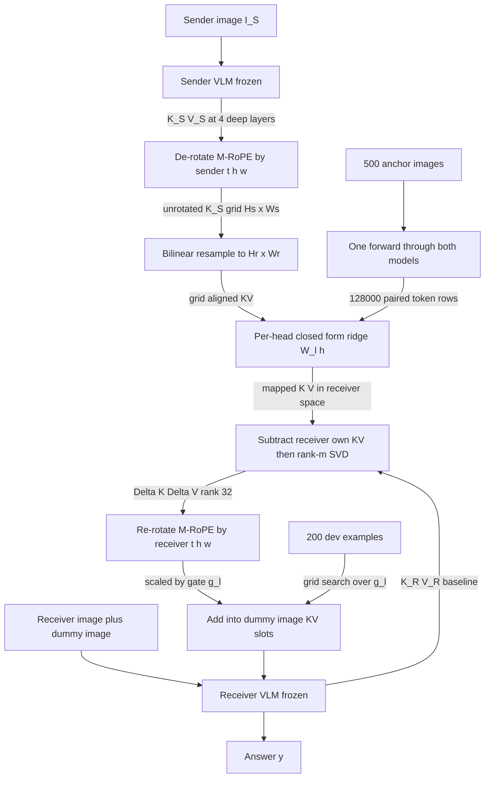
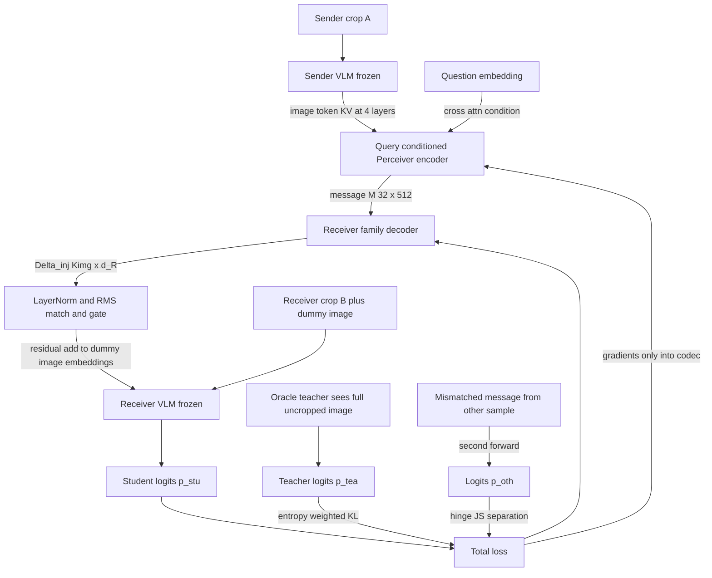
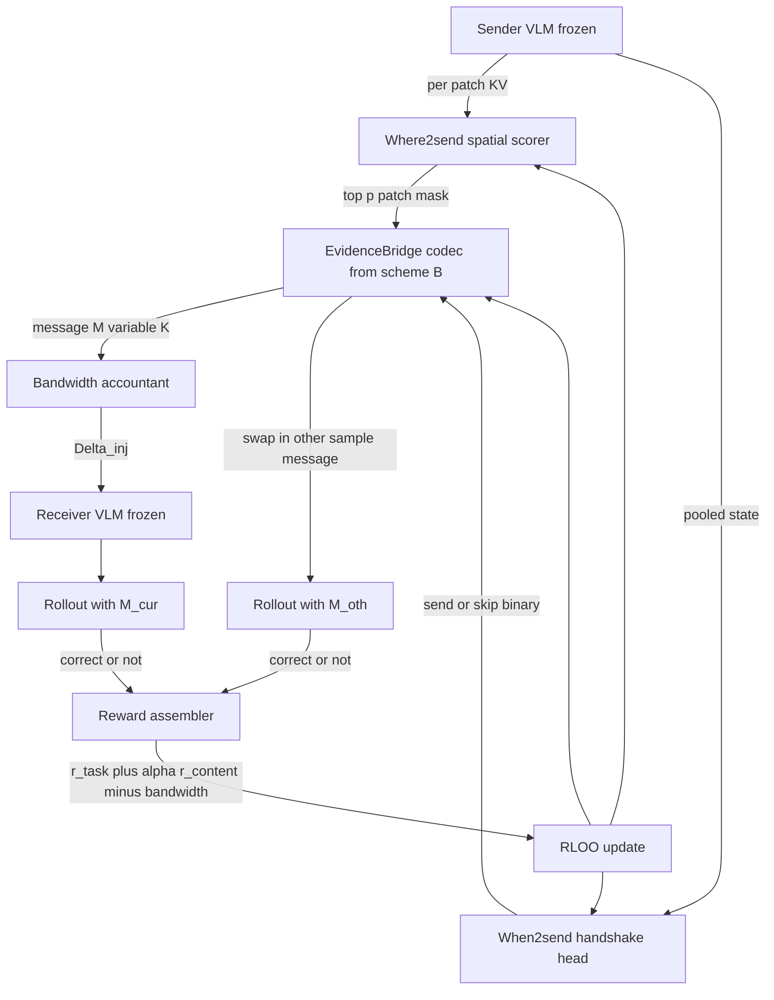

> **标注约定**：`[论文]` = 论文原文明确写的，附 arXiv 号；`[本次核实]` = 我这轮亲自检索/抓取核对过的；`[调研转述]` = 来自上游四路调研、我未二次核对；`[推断]` = 我的设计判断，没有论文背书。三个方案本身**整体都是 `[推断]`**，下面只对其中引用的外部事实逐条标注。

---

# 0. 先说一个别人没利用的结构性优势

在动手设计之前，有一件事必须先讲清楚，因为它决定了三个方案的骨架：

**文本 MAS 里"跨模型对齐"之所以贵，是因为没有稠密的对应关系；而 VLM 给了你一个免费的、模型无关的坐标系——像素网格。**

- 相对表示 (2209.15430) 需要**平行锚点**，主实验用 300–500 个 `[调研转述]`；Semantic Alignment (2311.00664) 的 Procrustes 需要 **≈ d 个（1000–2000）** `[调研转述]`。这些锚点在文本里是稀缺资源：一句平行句 = 一个锚点。
- 但在 VLM 里，**同一张图喂给两个模型，图像 token 就是天然平行的**。Qwen2-VL 的 M-RoPE 对图像 token「temporal ID 保持不变、height/width 按 token 在图中的位置分配不同 ID」`[论文 2409.12191，本次核实原文]`——也就是说每个 image token 都带一个 (h, w) 坐标，两个模型只要看同一张图，就能按 (h, w) 建立对应。
- 数量级差别：**一张 256-token 的图 = 256 个平行锚点**。500 张图 = **128,000 行**锚点（我算的）。Procrustes 需要的 1000–2000 个锚点，**8 张图就够了**。

Vision Wormhole 用了 3000 条文本 anchor、实际只抽了 800 次 `[调研转述]`；它没用图像做锚点，因为它的 sender 允许是纯文本 LLM，图像锚点在它的设定里不存在。**这不是它没想到，是它的问题设定把这条路封死了。** 你如果把设定收窄成「VLM→VLM」，就凭空多出一个数量级的免费监督。

三个方案都建在这个观察上，只是用它的深度不同。

---

# 1. 三方案总览

| | **方案 A：GridAnchor-KV** | **方案 B：EvidenceBridge** | **方案 C：When2Send-CAG** |
|---|---|---|---|
| 训练量 | **零 SGD 步**（闭式解 + ~100 个标量网格搜索） | 中（~4000 步，4 卡 8–12h） | 重（B + RL，8 卡 1–2 天） |
| 可训参数 | **< 100 个标量**（另有 ~8.4M 闭式解系数） | **约 37M** | 约 38M（+ RL 无新参数） |
| 注入端口 | 接收方 **dummy 图像 span 的逐层 KV** | 接收方 **视觉端口输入嵌入** | 同 B，但带宽/时机可变 |
| 消息大小 | 0.66 MB / 条（rank-32） | **32 KB / 条** | 平均带宽由 reward 控制 |
| 监督信号 | 无（配对 KV 直接解回归） | **上界 oracle 蒸馏 + 分离损失** | B 的权重 + **CAG 塑形奖励** |
| 主要风险 | 跨模型 KV 可能根本不线性相关 | 落回 VW 的"学生打不过老师" | 信用分配 + 算力 |
| 先验成功率（我的估计） | 30–40% | 60–70% | 40% 但天花板最高 |

---

# 2. 方案 A：GridAnchor-KV —— 近免训练的 2D-RoPE 感知 KV 搬运

## 2.1 流程图

## 2.2 模块放在哪 / 张量形状

**发送端取哪一层**：SDE (2506.19209) 的结论是「改所有层会显著掉点，只能改 top-1~3 层」`[调研转述]`；Kamera (2606.23581) 独立发现丢失的跨 chunk 条件化「集中在深层」且**低秩，rank≈32 就够**`[调研转述]`。两条独立证据指向同一件事，所以：**只取发送方最后 25% 层里等间距的 4 层**（例如 28 层模型取 21/24/26/28）。

**张量形状**（以 sender = 一个 8 KV-head、head_dim=128 的 VLM 为例）：
- 抽出 `K_S, V_S ∈ R^{4 × N_img × 8 × 128}`，其中 `N_img = Hs × Ws` 是发送方图像 token 数（**固定分辨率**输入，否则 dynamic resolution 会让网格尺寸随图变化）。
- 拍平 head 维 → `R^{4 × N_img × 1024}`。
- 按 (h, w) 网格双线性重采样到接收方网格 `Hr × Wr`。
- 逐层逐接收方 head 解一个 ridge：`W_{ℓ,h} ∈ R^{1024 × 128}`。系数总量 = `1024×128×8(head)×2(K,V)×4(层) = 8.39M`（我算的），**全部闭式解出，零梯度步**。
- 输出 `ΔK, ΔV ∈ R^{4 × N_img^R × 8 × 128}`，rank-32 分解后每条消息 **0.66 MB**（bf16；未压缩是 4.19 MB，6.4×，我算的）。

**怎么注入**：接收方 prompt 里塞一张 **dummy 图**（纯灰图即可，Vision Wormhole 也是这么占位的 `[调研转述]`），prefill 之后把这 4 层里 dummy 图 span 的 KV 槽位做**残差加法**：

$$K^{\text{out}}_{\ell} = K^{\text{self}}_{\ell} + g^K_\ell \cdot \Delta K_\ell, \qquad V^{\text{out}}_{\ell} = V^{\text{self}}_{\ell} + g^V_\ell \cdot \Delta V_\ell$$

**位置编码怎么处理（这是 A 的技术核心）**：

1. **写进已有槽位，不新增 token** —— 所以下游文本的 position id 完全不变。M-RoPE 的规则是「多模态输入时，每个模态的编号从前一个模态的最大 position ID + 1 开始」`[论文 2409.12191，本次核实原文]`，任何"多插 K 个 token"的方案都会把后面所有文本的 (t,h,w) 整体推移，A 从根上避开。
2. **K 必须先去旋转再搬运** —— KVCOMM (2510.12872) 的实测是：去掉位置对齐后 MMLU 掉到 43.1% `[调研转述]`。A 的做法是按 M-RoPE 的三段切分（t / h / w 各占 head_dim 的一段），用**发送方的 (t,h,w)** 逆旋转，在无旋转空间做网格重采样和 ridge 映射，再用**接收方的 (t,h,w)** 正旋转回去。V 不带 RoPE，直接搬。
3. 重采样发生在无旋转空间，才有几何意义 —— 在旋转后的空间做双线性插值等于对相位做插值，是错的。

## 2.3 为什么这样能绕开五个已知失效机制

| 失效机制 | A 的对策 |
|---|---|
| **$W_a$ 在 VLM 无定义** | A **完全不碰** $W_a$。$W_a$ 的作用是把末层 hidden 掰回**输入嵌入空间**，因而必须过 $W_{in}$、必须依赖文本词表。A 是 KV→KV：起点和终点都在各自模型的注意力空间内部，视觉信息**从来不需要经过任何词表投影**。对应关系由像素网格提供，不由 $W_{in}$ 提供。 |
| **SDE：裸 hidden 有害、delta 有用** | 注入量是 $\Delta = W(K_S) - K^{\text{self}}_R$，即"相对接收方自己已经知道的部分"的增量，且只改 4 个深层。这同时吃到 SDE 的 delta 结论和 Kamera 的深层低秩结论。 |
| **视觉/文本 hidden 分布差异** | A **只把图像 token 的 KV 搬到图像 token 的 KV 槽位**，同模态对同模态，天然不跨越 modality gap。「pre-norm MLLM 里高范数的视觉 token 和低范数的文本 token 存在严重范数失配」`[论文 2512.08374，本次核实]`——A 结构上不会踩到，这是它相对所有"往文本流里注入"的方案的免费优势。另外 ridge 解自带尺度校正。 |
| **2D-RoPE** | 见上：去旋转→重采样→再旋转；槽位复用不移位。 |
| **KV 显存爆炸** | 只 4 层 + rank-32 → 0.66 MB/消息。全量 KV 是 GB 级。 |

## 2.4 训练成本

- 锚点采集：500 张图 × 2 个模型各一次 forward ≈ **1 卡 10 分钟**。
- 解 ridge：8.39M 个系数，但每个回归只是 `1024×1024` 的正规方程，CPU 上**秒级**。
- 门控 $g_\ell$：200 条 dev 样本 × 4 层 × 5 档网格 = 4000 次接收方 forward ≈ **1–2 GPU 小时**。
- **总计：1 张 A6000，半天。**

## 2.5 差异化：它们为什么没做

- **C2C (2510.03215)**：文本 LLM 对，用 500k OpenHermes 样本训 478M 的 Fuser `[调研转述]`。它**做不到**用像素网格锚点——文本里不存在模型无关的稠密索引。这不是懒，是底物差异。
- **Vision Wormhole (2602.15382)**：写进**视觉端口的输入嵌入**，不碰 KV；跨模型对齐用的是 anchor 文本上的闭式 ridge，作用在 universal token 矩阵上 `[调研转述]`。**没有任何一篇把闭式对齐做到 per-layer × per-head 的 KV 张量上**——所有 relative-rep / Procrustes / vec2vec 的证据都建立在「一条样本一个向量」的 embedding 上 `[调研转述]`。A 就是去补这个空白。
- **L²-VMAS (2602.00471)**：8×H200 三阶段 RL `[调研转述]`。A 是它的反面极端：零训练。两者放在一张表里就是最强的消融。

**支持性证据（我这轮找到的）**：Align Attention Heads Before Merging Them (2412.20677, EMNLP Findings 2025) 对**同一模型内不同 head** 的 K/V cache 解 Procrustes，结论是「正交对齐后 key 的相似度大幅上升、value 中等上升，说明 key head 大体处在一个共同子空间里、彼此差一个正交变换」`[本次核实，检索摘要]`。**这是"KV 空间存在线性/正交对应"的唯一实证先例，但它是模型内跨 head，不是跨模型。** A 赌的就是这个性质能跨模型延伸——赌错了也是一个有价值的负结果。

## 2.6 判决标准（开工前写死）

1. **保真度地板**：held-out 上 $\|K_R - W K_S\|_F / \|K_R\|_F$ 必须 **< 0.5**。若 > 0.7（≈ 只比预测均值好一点），**立即停，转 B**。
2. **审计**：split-view 诊断集上 CAG > 0 且 paired bootstrap 区间不跨零。
3. **三条硬健全性检查**（抄 2607.26773 `[调研转述]`）：mask 掉消息 → CIC 掉到数值地板；把 $M_{oth}$ 换成 $M_{cur}$ → **CIC 和 CAG 必须恰好为 0**；全量恢复 → NLD = 1。第二条是"本该平凡相等的边界 case"，注入路径任何不对称都会在这里露馅。

---

# 3. 方案 B：EvidenceBridge —— 查询条件化的证据 codec + 上界蒸馏

## 3.1 流程图

## 3.2 模块放在哪 / 张量形状

- **发送端读取点**：同 A，最后 25% 层里的 4 层图像 token KV，`R^{4 × N_img × 1024}`。
- **编码器**：Perceiver 式，**4 层，bottleneck d=512，K=32 个 learned query**。query 先与**问题嵌入**做一次 cross-attention 再去读 KV —— 消息是 (图像, 问题) 的函数，不是图像的通用摘要。
- **消息**：`M ∈ R^{32 × 512}`，bf16 下 **32 KB**（我算的）。跨进程传就是一个小 tensor。
- **解码器**：每个接收方模型族一份，**4 层，d=512**，输出 `Δ_inj ∈ R^{K_img × d_R}`。
- **注入**：残差写进 dummy 图像 span 的**输入嵌入**：
  $$X^{\text{img}} = \bar X^{\text{img}} + g \cdot \mathrm{LN}(\Delta_{\text{inj}})$$
  这与 C2C 源码 `output = target + gate*scale*projected` 和 VW 的 Eq.(1) 是同一形状 `[调研转述]`——残差注入是跨领域收敛的结构，不是可选项。

**位置编码怎么处理**：
1. **注入长度锁死 = dummy 图的 token 数**（例如 16×16=256），`K_img` 固定。因为 M-RoPE 给图像 token 分配的是二维 (h,w) 网格，**32 个消息 token 不能直接当图像 token 用**——它没有合法的二维布局。所以解码器最后一步必须把 32 个 latent **resample 回 16×16 网格**（VW 的 `Resample(Δ; L_img)` 干的正是这件事 `[调研转述]`，只是论文没解释为什么必须有）。
2. span 长度固定 ⇒ 后续文本的 position id 与"真喂一张图"完全一致 ⇒ 冻结接收方不会遇到分布外的位置。
3. 注入发生在 RoPE 之前，接收方用它自己的 M-RoPE 正常处理，**我们一行位置代码都不用写**——这是选视觉端口而不是 KV 端口的最大工程理由。

## 3.3 参数量

| 组件 | 计算 | 参数 |
|---|---|---|
| Perceiver block ×8（编码 4 + 解码 4） | 每块 `4d²+4d²+8d²`，d=512 → 4.19M | 33.55M |
| 输入投影 1024→512 × 4 层 | | 2.10M |
| 输出投影 512→2048 | | 1.05M |
| learned queries 32×512 | | 0.02M |
| **合计** | | **≈ 36.7M** |

（全部我算的。）对照：C2C Fuser **478M**，LCF-128 **19.4M**，LCF 剪枝版 **6.24M** `[调研转述]`。硬红线是「必须 ≤ 接收方参数的 1%」——因为 C2C 自己 Table 6 里"直接微调 receiver"是 596M vs Fuser 478M，两者已经逼近，审稿人必问 `[调研转述]`。37M 对 4B 接收方 = 0.92%，**刚好压线**；接收方若是 2B，请把 d 降到 384、层降到 3，约 15M。

## 3.4 训练目标（完整形式）

$$\mathcal{L} = \underbrace{\mathcal{L}_{\text{task}}}_{\text{任务}} + \beta\,\underbrace{\mathcal{L}_{\text{oracle}}}_{\text{上界蒸馏}} + \lambda_{\text{sep}}\underbrace{\mathcal{L}_{\text{sep}}}_{\text{防触发器}} + \lambda_{\text{rms}}\underbrace{\mathcal{L}_{\text{rms}}}_{\text{幅度}} + \lambda_{g}\underbrace{\mathcal{L}_{g}}_{\text{带宽}}$$

**符号定义**：$e$ = 一个样本；$I$ = 原始完整图像；$I_A, I_B$ = 从 $I$ 切出的两个视角（sender 拿 $I_A$，receiver 拿 $I_B$）；$q$ = 问题；$y = (y_1..y_T)$ = 目标回答 token 序列；$M(e) = \mathrm{Enc}(\mathrm{KV}_S(I_A), q) \in \mathbb{R}^{32\times512}$；$p_{\text{stu}}(\cdot) = p_R(\cdot \mid I_B, q, \Delta_{\text{inj}}(M(e)))$；$p_{\text{tea}}(\cdot) = p_R(\cdot \mid I, q)$ —— **教师和学生是同一个冻结接收方模型，只是教师看到未裁剪的完整图像**；$\bar X^{\text{img}}$ = dummy 图的原生嵌入。

$$\mathcal{L}_{\text{task}} = -\frac{1}{T}\sum_{t=1}^{T}\log p_{\text{stu}}(y_t \mid y_{<t})$$

$$\mathcal{L}_{\text{oracle}} = \frac{1}{T}\sum_{t=1}^{T} w_t \cdot \mathrm{KL}\big(p_{\text{tea}}(\cdot\mid y_{<t}) \,\big\|\, p_{\text{stu}}(\cdot\mid y_{<t})\big), \qquad w_t = \sigma\big(H(p_{\text{base},t}) - H(p_{\text{tea},t})\big)$$

$w_t$ 是**熵减加权**：只在"看到完整图像确实降低了不确定性"的位置施加强监督（$p_{\text{base}}$ = 接收方无消息时的分布）。这是 Interlat 的 $\mathcal{L}_{\text{pref}}$ 思路 `[调研转述]`。**直觉**：图像里绝大多数 token 位置（"the"、标点）不需要跨 agent 信息，对它们施加 KL 只是在浪费带宽学复读。

$$\mathcal{L}_{\text{sep}} = \max\Big(0,\ m - \mathrm{JSD}\big(p_{\text{stu}}(\cdot\mid M(e)),\ p_{\text{stu}}(\cdot\mid M(e'))\big)\Big), \quad e' \neq e$$

**这一项是全方案最重要的一项**，理由后面第 5 节讲。用 hinge 而不是负 JS，是为了避免"把散度推到无穷大"的退化解；margin $m$ 建议先设成"接收方自身采样噪声地板"的 3 倍（地板必须实测：同一条 $M$ 重复跑 K 次量 $\bar D_{cur,cur'}$ —— 2607.26773 提了 receiver-instability 但**没给做法** `[调研转述]`，这是必须自己补的洞）。

$$\mathcal{L}_{\text{rms}} = \Big(\mathrm{RMS}(\Delta_{\text{inj}}) - \mathrm{RMS}(\bar X^{\text{img}})\Big)^2, \qquad \mathcal{L}_{g} = \|g\|_1$$

权重起点直接抄 VW：$\lambda_h{=}1.0,\ \lambda_{kl}{=}0.25,\ \lambda_{rms}{=}0.1$ `[调研转述]`；$\beta{=}1.0$，$\lambda_{\text{sep}}{=}0.5$，$\lambda_g{=}0.0025$（C2C 源码里**被注释掉的**那个门控正则值 `[调研转述]`——他们试过没启用，我建议启用并当作消融）。

**监督信号从哪来 / 要不要平行数据**：
- **不需要任何平行隐状态**，也**不需要人工标注**。
- **split-view 构造**：拿任意单图 VQA 数据集，把图裁成两个互补视角，问题设计成必须两边都看才能答。教师 = 同一个接收方模型看完整原图。**这就是 DiscoNet (2111.00643) 的 holistic-view teacher 在 VLM 上的直译** `[调研转述]`——DiscoNet 的 teacher 看全局视角、student 只有单视角，只在仿真器里可得；而**在 VLM 里"全局视角"就是没裁剪的原图，随手可得**。V2X 那条六年的血脉，第一次不需要仿真器就能用。
- 这条路的天花板严格高于 VW：VW 的教师是**文本通道**，实测 GSM8K 上 text 80.8% vs VW 76.2%，**−4.6pp** `[调研转述]`——学生打不过老师是结构性的。而完整原图严格强于"被文字量化过一遍的描述"。

## 3.5 为什么能绕开五个失效机制

| 机制 | 对策 |
|---|---|
| **$W_a$ 无定义** | 训练直接学 `KV_S → 视觉端口嵌入` 的映射，不需要任何解析逆。$W_a$ 的存在理由是"training-free 时你必须有个闭式的回投影"；一旦允许训练，这个约束消失。**这是"改走训练路线"最正当的理由，也是唯一真正必要的理由。** |
| **SDE delta** | 残差加法 + $\mathcal{L}_g$ 的 L1 让门可以学到 0。 |
| **模态分布差异** | $\mathcal{L}_{\text{rms}}$ + 解码器输出前一层 LayerNorm。后者不是我拍的：2512.08374 的修复方案就是「在视觉投影器后插入一个精心初始化的 LayerNorm 来强制范数对齐」`[本次核实]`。 |
| **2D-RoPE** | 注入长度锁死 = dummy 图 token 数；解码器最后一步 resample 回二维网格；注入在 RoPE 之前，位置逻辑全交给接收方原生代码。 |
| **KV 显存** | 消息 32 KB，接收方 KV 一个 token 都不多。 |

## 3.6 训练成本

- 教师 logits **离线预算一次**：20k 样本 × 256 token × top-64 logits × 4B ≈ **1.3 GB 磁盘**，2–3 GPU 小时。
- 主训练：每步需要接收方 forward 两次（matched + mismatched），约为普通 SFT 步的 3× 成本。4000 步、per-device batch 8、4 卡 → **4×A6000 × 8–12 小时**。
- 数据：20k split-view 样本，**零标注**。
- 参考量级：VW 只用 400 步 batch=2、单张 A6000 `[调研转述]`；C2C 用 500k 样本 8 卡 `[调研转述]`。B 落在两者之间，靠近 VW 一侧。

## 3.7 差异化：它们为什么没做

| 对比对象 | B 做了什么它没做的 | 为什么它没做 |
|---|---|---|
| **Vision Wormhole** | 教师换成**上界 oracle**（看完整图）而非文本通道 | VW 的设定是"任意异构 agent"，sender 可能是纯文本 LLM，所以它**必须**用一个通道无关的教师。oracle 教师要求存在一个能同时吃两个 agent 图像的模型——这在 VLM-only 设定下成立，在 VW 的设定下不成立。**是做不到，不是没想到。** |
| **Vision Wormhole** | 传的是**查询条件化的视觉证据**（从图像 token KV 池化），不是 sender 的推理 rollout hidden | VW 论文根本不讨论 sender 的视觉输入如何处理 `[调研转述]`。「跨模型传输视觉证据」目前**无人正面解决**——这是原设想里 $W_a$ 断点在训练路线下的真正残留形态。 |
| **Vision Wormhole / C2C** | 有 $\mathcal{L}_{\text{sep}}$，且有通道级审计 | VW 的评估**只有下游准确率和 wall-clock**，没有探针、没有随机/置换消息对照 `[调研转述]`；C2C 的门控正则写了但注释掉了 `[调研转述]`。 |
| **C2C** | 视觉端口 + 二维位置；接收方零改动 | C2C 是文本-文本，没有视觉端口这个东西。 |
| **L²-VMAS** | 稠密监督、37M 模块、4 卡 12 小时 | L²-VMAS 走 8×H200 三阶段 PPO，**loss 形式、reward 定义、算法名、每阶段样本量、模块参数量全部未披露** `[调研转述]`。B 的定位可以直接写成"同等或更好的效果，1/50 的算力，且全部超参公开"。 |

## 3.8 判决标准

1. CAG 的 paired bootstrap 区间**不跨零**（这是主指标，不是准确率）。
2. 相对文本 MAS baseline：至少打平（VW 是 −4.6pp，打平就已经证明了 oracle 教师优于文本教师）。
3. SSG 必须报告。**若 CAG > 0 但 SSG 跨零**，老实写成"这是一个 test-time compute 分配器，不是通信模块"——GSM8K/Qwen3-4B 上就出现过 CAG=+5.17pp 而 SSG=−2.00pp 区间跨零的情况 `[调研转述]`。

---

# 4. 方案 C：When2Send-CAG —— 带宽决策 + 用审计指标当奖励

## 4.1 流程图

## 4.2 结构与放置

在 B 的 codec 之上加三个小头（我算的，合计约 1M）：
- **Where2send scorer**：`1024→256→1` 的 MLP，给每个图像 patch 打分，取 top-p 的 patch 参与编码。这是 Where2comm (NeurIPS'22) 的"决定发哪块空间切片" `[调研转述]` 在 VLM 上的直译——而 VLM 的 patch 恰好就是空间切片，比 V2X 的 BEV 特征图还干净。
- **When2send handshake**：`1024→256` 的 query/key 投影 + 相似度阈值，Gumbel-sigmoid 二值输出"这一轮要不要发"。When2com (CVPR'20) 的 handshake `[调研转述]`。
- **自适应 K**：消息 token 数 $K \in \{8,16,32\}$。**注意**：注入 span 长度必须仍然固定（padding 到 256），否则消息长度会通过 position id 泄漏到接收方——这是我在 3.2 里说的同一件事的 RL 版本，很容易写错。

位置编码处理与 B 完全一致（这就是为什么 C 建在 B 上而不是 A 上）。

## 4.3 训练目标

阶段 1–2 = 方案 B 原样（**不能跳**：MACF 的消融里 Stage1+3 = 36.5% ≈ Stage1 单干 36.3%，说明"跳过中间监督直接上跨 agent 端任务 loss，增益接近零" `[调研转述]`；而三个用 RL 的工作 L²-VMAS / LatentMem / Mem-W **没有一个是纯 RL 冷启动** `[调研转述]`）。

阶段 3 = RLOO，奖励：

$$r(e) = \underbrace{\mathbb{1}[\hat y_{\text{cur}} = y]}_{r_{\text{task}}} + \alpha \underbrace{\Big(\mathbb{1}[\hat y_{\text{cur}} = y] - \mathbb{1}[\hat y_{\text{oth}} = y]\Big)}_{r_{\text{content}}\ =\ \text{逐样本 CAG}} - \eta \cdot \frac{K}{K_{\max}} - \gamma \cdot \mathbb{1}[\text{send}]$$

其中 $\hat y_{\text{cur}}$ 是喂当前样本消息的 rollout 结果，$\hat y_{\text{oth}}$ 是喂**同 benchmark、长度匹配的其他样本消息**的 rollout 结果。目标是 RLOO 的 leave-one-out advantage + KL 正则回阶段 2 的参考策略（Mem-W 的配方 `[调研转述]`）。

**$r_{\text{content}}$ 是 C 唯一真正新的东西**：2607.26773 证明了总效应可以由两个方向相反的分量合成——Qwen3-4B/GSM8K 上 OPE −1.00pp = OME −6.17pp + CAG +5.17pp，而 Qwen3-8B/GSM8K 上 OPE +1.67pp = OME +3.96pp + **CAG −2.29pp** `[调研转述]`。后者是"涨分全靠有消息这件事，内容其实有害"，而论文照样会写"我们的方法有效"。

**把 CAG 从事后审计指标搬进奖励函数，就是从结构上禁止模型学成触发器。** 代价是每个 prompt 要多跑一倍 rollout。

## 4.4 成本

RLOO 每 prompt 4 个样本 × 2 个消息条件 = **8 次 rollout**。5k prompt × 2 epoch × 8 = 80k 次 rollout，每次约 256 生成 token（2B 级接收方）。估计 **8×A100 × 1–2 天**。这正是 L²-VMAS 的 8×H200 所在的量级 `[调研转述]`。

## 4.5 差异化

- **L²-VMAS** 的 reward 只有 accuracy `[调研转述]`，它**无法**做 $r_{\text{content}}$，因为它从不构造 $M_{\text{oth}}$——不构造错配消息，就没有反事实对照，就算不出 CAG。这不是想不想的问题，是它的 pipeline 里没有这个对象。
- **When2com / Where2comm** 做了 handshake 和空间切片，但在 V2X 的 BEV 特征上、用端到端检测 loss，没有 latent 通道审计的概念（2019–2022 年也还没有）。C 是把 V2X 六年的带宽决策经验搬到 VLM MAS，并配上 2026 年的审计工具。
- **Mem-W** 用 RLOO + 二值终局奖励 `[调研转述]`，但奖励里没有内容归因项。

## 4.6 判决标准

- 相对 B：在**相同平均带宽**下准确率更高，或在相同准确率下带宽更低。只报准确率不算数。
- When2send 的开关率必须落在 (0.05, 0.95) 之间。若塌到全开或全关，说明 handshake 没学到东西，$\gamma$ 调错了。
- 训练后 OME 必须**下降**、CAG 必须**上升**——这是 $r_{\text{content}}$ 起作用的直接证据。若 OME 反而涨了，说明奖励塑形失败。

---

# 5. 三个方案共用的验收协议（不要省）

**这一节比方案本身更重要。** 理由：你换成训练路线，就多了一个 training-free 的 LatentMAS 结构上没有的自由度——**模型可以学会当触发器而不是信道**。training-free 版本没有可优化的参数去学这件事，你有。所以审计从可选变成必需。

1. **五级阶梯**，每级独立证伪：有容量 → 有反应 → 对**内容**有反应 → 内容带来任务价值 → 价值**必须**来自另一个 agent `[调研转述，2607.26773]`。
2. **两条恒等分解**：$\text{OPE} = \text{OME} + \text{CAG}$，$\text{CAG} = \text{DSC} + \text{SSG}$ `[调研转述]`。这是**恒等式不是经验发现**，代入定义即得，所以多跑三组条件（$M_0, M_{oth}, M_{self}$）就免费得到，审稿成本极低。
3. **三条硬健全性检查进 CI**（见 2.6）。第二条尤其毒：本该平凡相等的边界 case，任何注入路径的不对称都会露馅。
4. **PS 不要当卖点**。Lowe et al. (1903.05168) 证明了：即使消息在被观察前就被打乱、即使通信参数完全没训练，agent 依然表现出高 Speaker Consistency，因为动作头和通信头共享特征 `[调研转述]`。**你要训一个通信模块，sender 侧表征天然和 sender 的答案相关，PS 一定好看，而它什么也不证明。**
5. **样本量与配对**：2607.26773 自己的三个数据集只有 40–100 题，多个置信区间跨零 `[调研转述]`。务必固定随机种子、逐题配对、报 paired bootstrap，不要报两组独立均值之差。
6. **split-view 诊断集是白送的**：因为是你亲手裁的图，你**精确知道**哪条信息只有 sender 看得到。这就是 LatentQA (2412.08686) 那招的视觉版——不是去猜"A 的 hidden 对应 B 该收到什么"，而是反过来控制输入使答案已知 `[调研转述]`。

---

# 6. 推荐：先做 A，理由是信息量不是成功率

**先做 A。** 但我要说清楚，我估 A 的先验成功率只有 30–40%，明显低于 B 的 60–70%。推荐它的理由是**信息量和依赖关系**：

1. **A 用半天时间证伪/证实整条路线的地基假设**。三个方案全都隐含"发送方的视觉表示和接收方的视觉表示之间存在可学的对应"。A 是这个假设最纯粹、最快、最便宜的检验：如果连**闭式线性映射 + 128,000 个完美平行锚点**都做不到重构误差 < 0.5，那"跨模型 KV 几何相容"这个假设就是假的，B 的解码器必须做得更深、更非线性，而且你会**提前两周**知道这件事。反过来，如果 A 就 work，那你手上是一篇 training-free 跨模型 VLM 通信的论文，比 B 好卖得多。

2. **A 的所有产物都是 B 和 C 的必需前置件**：像素网格锚点采集管线、M-RoPE 去旋转/再旋转的搬运代码、dummy-image span 定位、split-view 诊断集、CAG 审计脚本。做 A 不存在沉没成本。

3. **A 是 B 必须打败的 baseline**。审稿人一定会问"你训了 37M 参数，比闭式解好在哪"。如果你没做过 A，这题答不出来；C2C 的 repo 里恰好有一条**没被采用**的表示匹配路线 `oracle_train_kvcache_mse.py`（且它调用的 `oracle_forward` 在发布代码里找不到定义 `[调研转述]`）——说明他们撞过这个问题但没交代。你有 A 就有交代。

4. **风险是不对称的**：A 失败花半天，B 失败花两周。

**具体路线（我的建议节奏）**：

| 周 | 做什么 | 出口条件 |
|---|---|---|
| W1 前半 | A 的锚点采集 + ridge 拟合 + 重构误差 | 误差 < 0.5 → 继续；> 0.7 → 直接跳 B 并把 A 写成负结果消融 |
| W1 后半 | A 的 M-RoPE 搬运 + 三条硬检查 + CAG | 三条检查全过（不过就是有 bug，不是方法问题） |
| W2–W3 | B：split-view 数据构造 + oracle 教师预算 + 4000 步训练 | CAG 区间不跨零；打平文本 MAS |
| W4+ | C：只在 B 的 CAG 显著为正之后才开 | —— |

**不要先做 C。** 三个用 RL 的已发表工作没有一个是纯 RL 冷启动，MACF 的消融也明确显示跳过中间监督直接上端任务 loss 增益接近零 `[调研转述]`。C 的价值全在 $r_{\text{content}}$ 这个想法上，而这个想法只有在你已经有一个能测出正 CAG 的 B 之后才有意义——你不能优化一个你还测不准的量。

---

# 7. 三个我没能消除的风险（写在前面比写在 rebuttal 里好）

1. **跨模型 KV 的线性相容性没有任何直接证据。** 唯一先例 2412.20677 是**同模型跨 head** `[本次核实]`。所有 relative-rep / Procrustes / vec2vec 的实证都建立在"一条样本一个向量"的 embedding 上，**没有一篇验证过 per-token × per-layer × per-head 的 KV 张量满足同样的几何** `[调研转述]`。这既是最大的未验证假设，也是最大的机会——但顺序是"先验证，再宣称"。
2. **split-view 构造可能太简单**。如果裁出的两个视角各自都能独立答对，CAG 会趋近 0，不是因为通道没用，而是因为任务不需要通道。**必须先跑一个 sanity：sender 单独答 / receiver 单独答 / oracle 答的三条准确率必须显著分离**，否则数据集废了。
3. **"图像 token 网格对应"依赖固定分辨率**。Qwen2.5-VL 的 dynamic resolution 会让 token 网格随输入变化 `[本次核实，2502.13923 相关]`，A 必须锁死输入分辨率。这会牺牲一部分原生性能，做 baseline 对比时**两边都要锁**，否则你测到的是分辨率差异。

---

## 附：关键发现速览

1. **VLM 给了文本 MAS 结构上不存在的东西：免费的稠密平行锚点。** M-RoPE 给每个 image token 分配 (h,w) 坐标（[论文 2409.12191，本次核实]），所以同一张图喂给两个模型即得逐 token 对应——一张 256-token 的图 = 256 个平行锚点，500 张图 = 128,000 行（我算的）。而 Procrustes 只需要 ~1000–2000 个锚点（2311.00664），**8 张图就够**。Vision Wormhole 没用这条路是因为它允许 sender 是纯文本 LLM，图像锚点在它的设定里不存在——是做不到，不是没想到。

2. **三方案在训练量轴上拉开：A 零 SGD 步（< 100 个标量 + 8.4M 闭式解系数，1 卡半天）/ B 约 37M 参数 Perceiver codec（4 卡 8–12h，20k 无标注样本）/ C 在 B 之上加 RLOO（8 卡 1–2 天）。** 消息大小 0.66 MB / 32 KB / 自适应，全部远低于全量 KV 的 GB 级。

3. **B 的核心差异化是把教师从"文本通道"换成"看完整未裁剪图像的同一个接收方模型"。** VW 的文本教师是结构性天花板——它实测 GSM8K 上 text 80.8% vs VW 76.2%，−4.6pp，学生打不过老师。而 split-view 构造让"上界 = 没裁剪的原图"随手可得，这是 DiscoNet 的 holistic-view teacher 第一次不需要仿真器。

4. **C 唯一真正新的东西是把 CAG 从事后审计指标搬进 RL 奖励函数**（$r_{\text{content}} = \mathbb{1}[\text{correct}|M_{cur}] - \mathbb{1}[\text{correct}|M_{oth}]$），从结构上禁止模型学成"触发器"而非"信道"。L²-VMAS 做不到这件事不是算力问题——它的 pipeline 里从不构造 $M_{oth}$，没有反事实对照就算不出 CAG。

5. **推荐先做 A，理由是信息量而非成功率**（我估 A 成功率 30–40%，低于 B 的 60–70%）：A 用半天检验"跨模型 KV 是否线性相容"这个三方案共享的地基假设——这个假设**没有任何直接证据**，唯一先例 2412.20677 是同模型跨 head（本次核实）；且 A 的全部产物（网格锚点管线、M-RoPE 去旋转/再旋转搬运、CAG 审计脚本、split-view 诊断集）都是 B/C 的必需前置件，同时 A 本身就是审稿人必问的 baseline。风险不对称：A 失败花半天，B 失败花两周。
